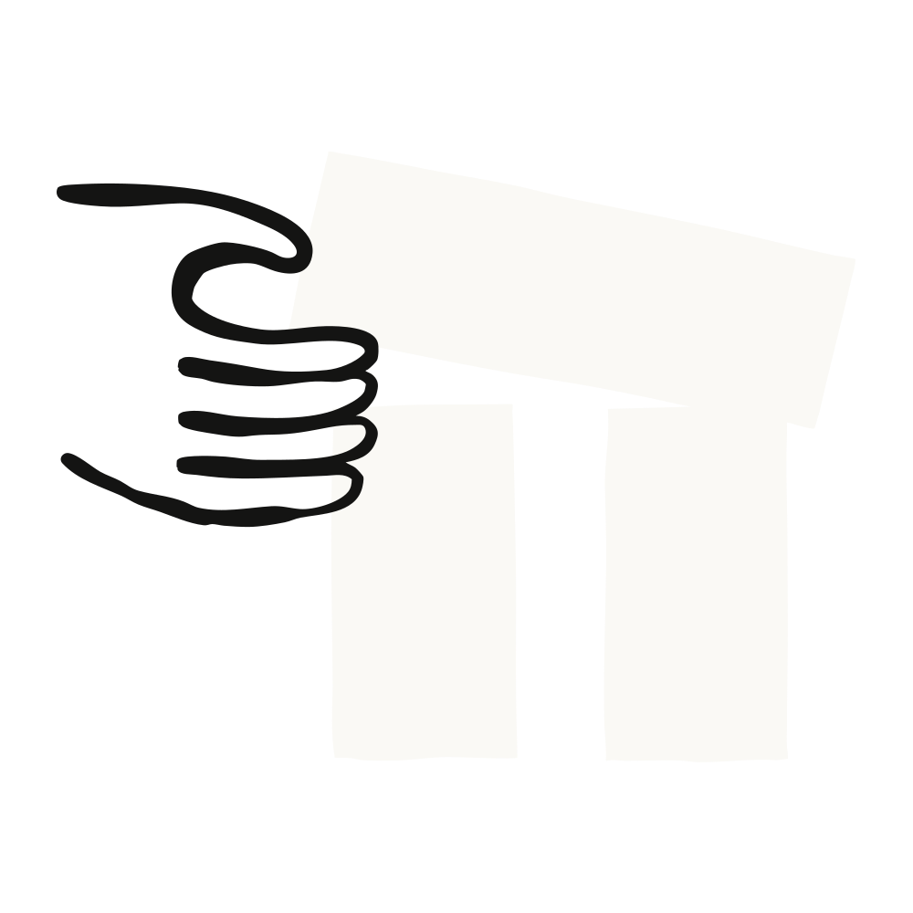

# Claude Code Agent View: From tmux Grids to a Real Control Plane for Parallel Agents

> Source: [Claude on X](https://x.com/claudeai/status/2053940938666279028) / [Anthropic blog: Agent view in Claude Code](https://claude.com/blog/agent-view-in-claude-code) / [Claude Code docs: Agent view](https://code.claude.com/docs/en/agent-view)  
> Date: 2026-05-11  
> Tags: Claude Code / Agent View / Coding Agents / Multi-Agent / Worktrees / Agent Orchestration



Anthropic’s new **Agent view** in Claude Code looks, at first glance, like a session list inside a CLI. Press the left arrow, or run `claude agents`, and you can see all your background Claude Code sessions in one place.

But viewed through the broader arc of agent engineering, this is not just a UI feature. It is a missing **control plane for parallel coding agents**.

Before this, running multiple coding agents usually meant juggling terminal tabs, tmux panes, separate directories, separate worktrees, and a mental ledger of what each agent was doing. Which one is running tests? Which one is blocked on a permission prompt? Which one already opened a PR? Which one failed?

That works for two tasks. It barely works for four. Once you dispatch eight or twelve sessions, plus looping jobs and PR babysitters, the developer becomes a manual scheduler.

Agent view matters because it turns scattered terminals into a scannable, switchable, reply-able, recoverable task board for Claude Code.

---

## Agent View Solves Management, Not Launching

Anthropic’s blog describes the feature as:

> one place to manage all your Claude Code sessions.

That line is more important than the feature checklist. The bottleneck in coding agents is no longer simply “can the model write code?” It is increasingly:

1. **Can I launch several independent tasks at once?**
2. **Can I tell what each one is doing right now?**
3. **Can the system interrupt me only when human judgment is needed?**
4. **Can I reliably collect the output, PRs, failures, and state afterward?**

Claude Code could already be run in parallel through multiple terminals, worktrees, and sessions. Agent view changes the operational cost: instead of asking the user to maintain a mental ledger, it gives the CLI an explicit roster.

The official docs define it this way:

> Dispatch and manage many Claude Code sessions from one screen. Agent view shows what every session is doing and which ones need your input.

That is very close to a local agent control plane.

---

## The Core Entrypoints: `claude agents`, Left Arrow, `/bg`, and `claude --bg`

Agent view revolves around four important entrypoints:

| Scenario | Command / Action | Meaning |
|---|---|---|
| Open the overview | `claude agents` | Show all background sessions |
| Move from a session back to the overview | Press `←` on an empty prompt | Background the current session and open Agent view |
| Background the current conversation | `/bg` or `/background` | Keep the session running without occupying the terminal |
| Start a background task directly | `claude --bg "<prompt>"` | Launch a new background Claude Code session from the shell |

Together they form a complete workflow:

```bash
claude agents
# Type a task at the bottom and press Enter to dispatch it

claude --bg "investigate the flaky SettingsChangeDetector test"
# Launch a background task directly from the shell

/bg run the test suite and fix any failures
# Add one more instruction inside an interactive session and background it
```

Claude Code is no longer just a one-on-one chat between a developer and an agent. It now supports an operational mode: dispatch, monitor, take over, return to the overview.

That matters for real engineering work. Many tasks are naturally parallel: one agent investigates a flaky test, another changes UI, another writes a migration script, another reviews a PR. The hard part is not starting them all. The hard part is managing them without drowning.

---

## The Status Board: Turning Agents from Black Boxes into a Queue

Agent view groups sessions by state: sessions that need input, sessions that are working, completed sessions, failures, stopped sessions, and sleeping loop jobs that show their next run time.

The docs describe states roughly like this:

| State | Meaning |
|---|---|
| Working | Claude is running tools or generating a response |
| Needs input | Claude is waiting for user input, usually a permission decision or an answer |
| Idle | The session is waiting for input but is not blocked on a specific question |
| Completed | The task finished successfully |
| Failed | The task ended with an error |
| Stopped | The session was stopped |
| Loop sleeping | A `/loop` session is sleeping between runs and shows the next run time |

Each row shows the session name, current activity, a short summary of the last response, and when it last changed. If the session opens a pull request, the row can show the PR link and CI status.

One detail is especially interesting: the docs say each row summary is generated by the configured Haiku-class model. While a session is active, the summary refreshes at most about once every 15 seconds and once when each turn ends.

That means Anthropic is not only running the main coding agent. It is also using a smaller model as a meta-layer for status compression. Future coding-agent interfaces will not be raw transcripts. They will be operational dashboards made from compressed, summarized, ranked state.

---

## Peek and Reply: Handling Blockers Without Opening the Full Transcript

The most useful part of Agent view may not be the list. It may be the **peek panel**.

Select a row and press Space. You can see what the session needs, its latest output, and any pull requests it opened. In many cases the developer does not need to attach and read the full context. They only need to answer one question:

- allow or deny a command;
- choose between plan A and plan B;
- provide a missing environment variable;
- check whether the PR exists and is ready.

The docs also mention that if the session asks a multiple-choice question, the peek panel shows the options and you can press a number key. For other blocked sessions, Tab can fill a suggested reply. Prefixing a reply with `!` sends a Bash command from the peek panel.

This changes the human role from “constant babysitter” to “exception handler.”

Early coding-agent interaction was pair programming: the human watched and corrected the agent in real time. Agent view points toward dispatching: the human assigns work, scans state, and steps in only at decision points.

---

## Attach / Detach: Full Claude Code Is Still There When You Need It

Agent view does not try to replace the full Claude Code interaction. The model is:

- scan the list by default;
- handle small blockers in peek;
- attach when deeper context is needed;
- detach back to the overview with the left arrow.

The shortcuts make it feel like a terminal-native task switcher:

| Shortcut | Action |
|---|---|
| `↑ / ↓` | Move between sessions |
| `Space` | Open or close the peek panel |
| `Enter` or `→` | Attach to the selected session |
| `←` | Detach from an attached session back to Agent view |
| `Ctrl+T` | Pin or unpin a session |
| `Ctrl+S` | Switch grouping between state and directory |
| `Ctrl+R` | Rename a session |
| `Ctrl+X` | Stop; press again quickly to delete |
| `?` | Show all shortcuts |

This is very terminal-native. Anthropic did not create a separate web dashboard. It grew a multi-task panel inside the CLI, which is likely the right default for Claude Code’s audience.

---

## The Key Engineering Detail: Background Sessions Are Hosted by a Supervisor

Agent view becomes infrastructure rather than a small UI feature because of its background-session hosting model.

The docs say background sessions are hosted by a per-user supervisor process. The supervisor is separate from both your terminal and the Agent view UI:

- close Agent view, and sessions keep running;
- close the shell, and sessions keep running;
- completed sessions that sit unattached for about an hour may have their process stopped to free resources, while transcript and state remain on disk;
- the next attach, peek, or reply restarts the process from saved state;
- when Claude Code auto-updates, the supervisor restarts into the new binary and reconnects to background sessions.

State is stored roughly here:

| Path | Contents |
|---|---|
| `~/.claude/daemon.log` | Supervisor log |
| `~/.claude/daemon/roster.json` | List of running background sessions |
| `~/.claude/jobs/<id>/state.json` | Per-session state shown in Agent view |

This shows Claude Code expanding from “a CLI process” into “a local daemon plus multiple worker processes.”

That is the real difference from tmux. tmux preserves terminal panes. Agent view preserves agent task state.

---

## Worktree Isolation: Parallel Agents Cannot All Write to the Same Directory

The dangerous part of parallel agents is file conflict. Anthropic’s approach is that a background session starts in your working directory, but when it needs to edit files, Claude moves it into an isolated git worktree under `.claude/worktrees/`.

That lets multiple sessions read the same checkout while writing to separate worktrees. When a session is deleted, its worktree is removed. If you want to keep its changes, you need to merge or push them first.

This matters for real teams because “parallel agents” is not just “multiple processes.” It requires at least three kinds of isolation:

1. **Context isolation**: each session has its own conversation state;
2. **File isolation**: sessions should not overwrite each other’s changes;
3. **Permission isolation**: background tasks should not execute dangerous actions without the user’s awareness.

Agent view makes the first two part of the default workflow. Permission behavior is controlled through permission modes and settings.

---

## What This Means: Coding Agents Are Becoming Queues

The important shift is not that Claude Code gained a few commands. The product paradigm is changing.

Before:

> One developer plus one AI assistant, pair programming inside one terminal.

Now:

> One developer plus a set of background agents, dispatched, monitored, interrupted, attached, and harvested from one control plane.

That will change engineering workflows:

- small bugs can be dispatched in batches instead of handled serially;
- PR review, dashboard updates, and log investigations fit naturally as long-running, low-interaction background tasks;
- human time moves toward task definition, result review, and exception handling;
- skills, subagents, worktrees, and background sessions increasingly look like components of a local agent runtime.

In other words, Claude Code is turning from an AI programming assistant into an **agent operations environment**.

---

## Lessons for QCut, OpenClaw, and Hermes

For anyone building systems like QCut, OpenClaw, or Hermes, Agent view offers several concrete design lessons:

1. **The core of multi-agent is not spawn; it is roster**  
   Starting many agents is easy. Showing whether each one is alive, blocked, done, or deliverable is the hard part.

2. **Status summaries are product features**  
   Users do not want to read full transcripts. A one-line summary, a PR link, and CI state may matter more than raw logs.

3. **Background tasks need independent lifecycle management**  
   Agent lifetime should not be tied to a terminal or websocket. You need supervisors, state files, recovery, and cleanup.

4. **File writes must be isolated by default**  
   Parallel agents sharing one working directory will step on each other. Worktrees, sandboxes, and leases should be default primitives, not advanced options.

5. **Humans should be schedulers, not babysitters**  
   A good agent product does not force people to watch every token. It brings them back at the few moments where human judgment matters.

---

## Conclusion

Agent view is a Research Preview, but it points to a much larger direction: the competition in coding agents is moving from “how smart is one agent?” to “how reliably can many agents be scheduled?”

Anthropic did not ship a flashy web IDE here. It shipped a practical CLI control plane: dispatch, backgrounding, state, peek, attach, automatic worktree isolation, and supervisor-managed background sessions.

It may not be the flashiest feature, but it is one of the most production-shaped features.

Real agentic coding is not one agent performing in front of you. It is a set of agents moving work forward in the background while you appear only where human judgment is actually needed.
