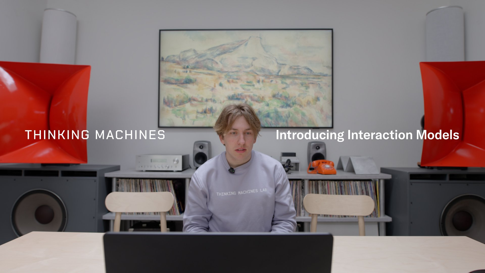
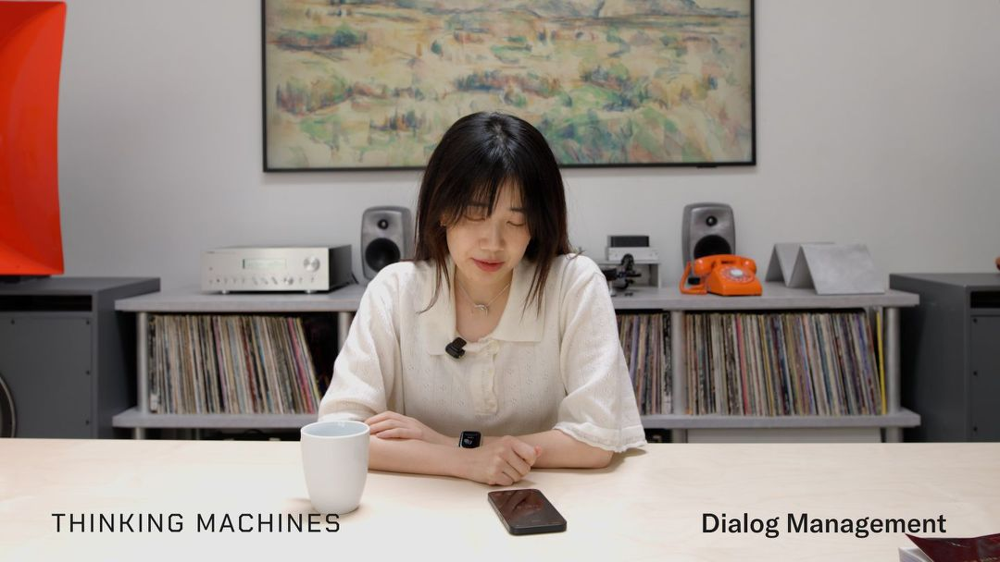
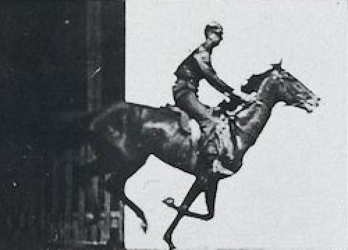

# Thinking Machines Lab Interaction Models: Moving Real-Time Collaboration from the Harness into the Model

> Source: <https://thinkingmachines.ai/blog/interaction-models/>  
> Author: Thinking Machines Lab  
> Date: 2026-05-11  
> Tags: Thinking Machines Lab / Interaction Models / Real-time AI / Multimodal Models / Human-AI Collaboration / Inference Systems

## 1. This is not just another voice assistant. It redraws the product boundary.

The central claim of Thinking Machines Lab’s “Interaction Models: A Scalable Approach to Human-AI Collaboration” is clear: **AI interactivity should not remain an external harness bolted onto intelligence; it should become a scalable capability of the model itself.**

Most AI products today are still turn-based. The user finishes speaking or typing, then the model starts paying attention. While the model is generating, the external world is largely frozen from its perspective. If a product needs interruption, live translation, visual triggers, concurrent tools, background search, or generative UI, teams stitch together VAD, ASR, TTS, turn detectors, agent loops, and UI state managers outside the model. That stack can work, but its ceiling is obvious: the component deciding “when to interrupt, when to stay quiet, when to keep listening” is often not the smartest model in the system.

TML reverses the framing. It trains an interaction model that continuously receives audio, video, and text while continuously thinking, responding, and acting. This is not merely “a chatbot that speaks faster.” It moves the interface from “write a prompt, wait for an answer” toward co-presence: the user can speak, look, point, pause, and correct; the model can listen, watch, interject, remain silent, delegate work in the background, and bring results back naturally.

For builders, the implication is bigger than the benchmark table. If this direction works, the core of the next generation of AI applications will not be only prompt engineering or agent planning. It will be a **real-time collaboration protocol**: how input streams enter the model, how output streams can be interrupted, how background work avoids hijacking the main conversation, and how UI exposes that the model is watching, waiting, thinking, or searching.

## 2. The collaboration bottleneck: autonomous agents get stronger, but interfaces push humans out

TML opens by pointing to METR’s work on measuring how long and complex a task AI agents can complete autonomously. That direction matters, but it creates a product side effect: interfaces become increasingly optimized for “hand the task to the agent and walk away,” and increasingly poor at close human-agent collaboration.

The post also quotes an Anthropic frontier model card observing that in interactive, synchronous, “hands-on-keyboard” usage, the benefits of the model were less clear and some users perceived it as too slow; autonomous long-running agent harnesses better elicited the model’s coding capabilities. That observation matters because it names a counterintuitive failure mode of frontier models: the better a model becomes at long-horizon reasoning, the worse the live collaboration experience can feel.

TML’s argument is not that humans are no longer needed. It is that the interface leaves too little room for them. In real work, requirements are rarely complete, accurate, and stable upfront. Coding, design, production debugging, tutoring, clinical reasoning, and sports coaching all depend on continuous context, corrections, preferences, and judgment. A turn-based interface compresses that high-frequency tacit knowledge into a narrow channel: you must wait until a turn ends before injecting new judgment.

That is why TML emphasizes copresence, contemporality, and simultaneity: sharing the same object of attention, receiving information as it is produced, and producing and receiving information at the same time. In engineering terms, AI applications should not only support request/response. They need low-latency, multimodal, re-entrant, concurrent sessions.

## 3. The key design: 200ms micro-turns, not a smarter turn detector

TML’s core technical choice is a **multi-stream, micro-turn design**. Instead of waiting for a full user turn and then generating a full assistant turn, the model continuously interleaves input processing and output generation in roughly 200ms units. Every 200ms it processes audio/video/text chunks while producing output chunks. Input tokens and output tokens are both streams rather than one-shot sequences.

This sounds like latency optimization, but it changes the capability boundary.

Traditional real-time speech systems usually rely on VAD or a dialogue manager to decide whether the user is done. This can simulate interruption, but it struggles with context: is the user thinking, yielding, self-correcting, talking to someone else, or inviting the model to respond? If that decision-maker is not very intelligent, products become conservative: interrupt less, wait for silence, and add latency.

Micro-turns move that decision into the model. Capabilities that previously required custom harnesses become unified model behavior:

- **Seamless dialogue management**: the model implicitly tracks whether the user is thinking, yielding, correcting, or inviting a response;
- **Verbal and visual interjections**: it can speak when the user makes a mistake, when code appears buggy, or when a physical action reaches a key moment;
- **Simultaneous speech**: for example, listening to Spanish while speaking English translation;
- **Time awareness**: the model directly senses elapsed time and can support pacing, reminders, and timing corrections;
- **Concurrent tools and generative UI**: it can search, browse, or generate interface elements while continuing to listen, then weave results back in at the right moment.

## 4. The system is not one model: foreground interaction plus background reasoning

TML does not pretend that a low-latency model can solve every long-horizon reasoning problem on its own. The system is layered:

1. **Interaction model**: stays present in real time, continuously receives audio, video, and text, and manages turn-taking, interjections, short responses, and conversational continuity;
2. **Background model**: runs asynchronously when a task requires deeper reasoning, tool use, search, or agentic workflows;
3. **Context package**: when the foreground model delegates, it sends the full conversation and task context rather than a standalone query;
4. **Streaming reintegration**: background results stream back, and the interaction model decides when and how to introduce them into the current conversation.

This architecture is highly relevant for product teams. Many agent products do not fail because the background worker cannot run. They fail because returned results “grab the microphone”: they arrive as a sudden block, interrupt the user’s current train of thought, or conflict with foreground state. TML’s design makes “when to bring background results back into human attention” a model-mediated decision. In effect, it introduces a real-time attention scheduler into the AI system.

## 5. Model and inference stack: early fusion, streaming sessions, deterministic debugging

The post includes several engineering details builders should study.

**Encoder-free early fusion.** TML avoids routing audio and video through large standalone encoders before passing representations to an LLM. It keeps preprocessing minimal: audio comes in as dMel and passes through a lightweight embedding layer; images are split into 40×40 patches and encoded by an hMLP; the audio decoder uses a flow head; all components are co-trained from scratch with the transformer. The related links include dMel, Vision Transformer/hMLP, and Flow Matching papers. The trade-off is clear: less modular replacement, more end-to-end learning of which interaction signals matter.

**Streaming sessions.** 200ms chunks create many small prefill/decode requests, and today’s LLM serving libraries are often inefficient in that regime. TML keeps a persistent sequence in GPU memory: the client sends each 200ms chunk, and the server appends it to the same session, avoiding repeated memory allocation and metadata computation. They upstreamed a related fast path to SGLang PR `#19171`: `SessionAwareCache` keeps KV ownership in per-session slots and bypasses radix prefix matching that is poorly suited to streaming.

**Latency-oriented kernels.** TML mentions using gather+gemv for MoE kernels in bidirectional serving rather than standard grouped GEMM. It also emphasizes batch-invariant kernels and trainer-sampler bitwise alignment for training stability and debugging reproducibility. This is consistent with TML’s earlier “Defeating Nondeterminism in LLM Inference” post: when debugging a complex real-time multimodal system, nondeterminism quickly consumes engineering velocity.

## 6. How to read the benchmarks

The preview model is called **TML-Interaction-Small**, a 276B-parameter MoE with 12B active parameters. It reports combined performance across FD-bench, Audio MultiChallenge, BigBench Audio, IFEval, Harmbench, and other evaluations.

A few numbers are worth remembering:

| Metric | TML-Interaction-Small | Builder implication |
|---|---:|---|
| FD-bench V1 turn-taking latency | 0.40s | The felt threshold is not just “fast generation”; it is responding at the right moment. |
| FD-bench V1.5 average | 77.8 | It performs strongly on interruption, backchanneling, and background speech scenarios. |
| FD-bench V3 Audio + Tools | 82.8 / 68.0 | Tool use should not require the live conversation to stop completely. |
| Audio MultiChallenge APR | 43.4 | The model preserves meaningful instruction following and reasoning relative to low-latency systems. |
| IFEval text | 89.7 | An interaction model still needs strong text instruction following. |
| Harmbench refusal | 99.0 | Real-time speech safety cannot be patched in only after generation. |

The more interesting part is TML’s new or adapted interactivity evaluations: TimeSpeak, CueSpeak, RepCount-A, ProactiveVideoQA, and Charades. These test capabilities traditional benchmarks mostly miss: speaking at specified times, correcting code-switching in the moment, counting pushups from video, answering only when a visual moment reveals the answer, and identifying action start/stop times.

These evals are early, but the direction is right. Real-time AI products need to evaluate not only whether an answer is correct, but also **whether it happens at the right moment in the right way**.

## 7. Limitations: powerful, expensive, and not yet productized

TML’s own limitations are practical.

First, **long sessions accumulate context quickly**. Continuous audio and video generate enormous context. Streaming sessions work for short and medium interactions, but very long collaboration requires active context management: compression, summarization, forgetting, state machines, and retrievable memory all need careful design.

Second, **deployment conditions are demanding**. Low-latency streaming audio/video depends on reliable connectivity and GPU serving. Network jitter directly harms the experience. A normal SaaS product can tolerate a slow response of a few seconds; real-time collaboration cannot.

Third, **larger models are too slow**. TML-Interaction-Small is already a 276B MoE with 12B active parameters, and TML says its larger pretrained models are currently too slow to serve in this setting. “Intelligence plus real time” remains a system-level trade-off, not something solved by simply adding parameters.

Fourth, **safety is harder**. Real-time speech refusals cannot feel like stiff text policies; long spoken conversations, visual context, and concurrent tools introduce new risks of boundary drift and accidental triggering. TML uses TTS to generate refusal and over-refusal training data and an automated red-teaming harness for multi-turn refusal data, but this is still early work.

## 8. What builders should watch

If you are building AI products, you may not be able to use TML’s research preview immediately, but you can update your design assumptions now.

**First, treat latency budget as a product spec.** Do not only measure first-token latency and total generation time. Real-time collaboration needs turn-taking latency, interrupt latency, visual-event-to-speech latency, and tool-result handoff latency.

**Second, avoid making low-intelligence harnesses responsible for high-intelligence decisions.** VAD, rule-based turn detectors, and fixed agent loops are fine as scaffolding, but identify which decisions should eventually move into the model: whether to interrupt, keep listening, stay silent, or route work to the background.

**Third, design UI for foreground/background layering.** Users should be able to tell whether the model is listening, watching the screen, searching in the background, or preparing to re-enter the conversation. Without state visibility, real-time AI becomes merely a noisier chatbot.

**Fourth, make tool calls interruptible.** The best time to show a tool result is not always “as soon as possible.” Agent infrastructure needs partial results, cancellation, priority, and handoff summaries so the foreground interaction can choose the right window.

**Fifth, build new evaluation sets.** For education, support, coding, design, sports coaching, and healthcare, single-turn accuracy is insufficient. Teams need recorded sessions with labels for when to speak, when not to speak, when to look, and when to ask.

## 9. My take

The most important part of TML’s post is not that it announces a 276B MoE interaction model. It redirects attention from “can AI complete tasks independently?” back to “how should AI complete tasks with humans?” The agent narrative can easily collapse into “write a goal, wait for the machine to deliver.” But many high-value workflows do not happen that way.

A more likely future is hybrid: background agents become increasingly autonomous, while foreground interaction models become increasingly like real-time collaborators. Users do not have to choose between doing everything themselves and handing everything to AI. They can intervene, correct, observe, delegate, and reclaim control at any moment.

That is why Thinking Machines Lab’s direction is worth watching. It is not making the prompt box prettier. It is redefining the loop in human-in-the-loop itself.