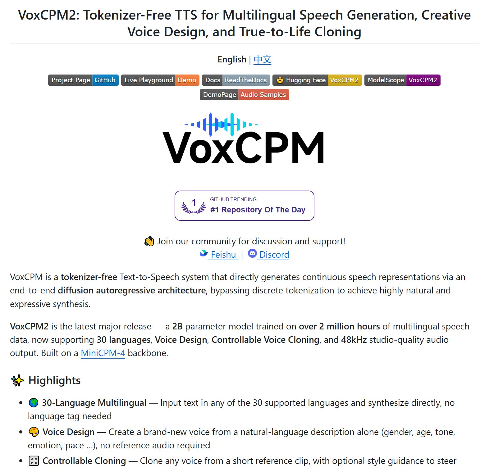

# VoxCPM2: The Real Story Is Not “Better Voice Cloning,” but a Tokenizer-Free TTS Engineering Path

> Source: <https://x.com/Honcia13/status/2054009915811713480?s=20>  
> Canonical source: <https://github.com/OpenBMB/VoxCPM>  
> Docs: <https://voxcpm.readthedocs.io/en/latest/>  
> Demo / weights: <https://huggingface.co/openbmb/VoxCPM2>  
> Date: 2026-05-11  
> Tags: VoxCPM2 / OpenBMB / TTS / Voice Cloning / Tokenizer-Free / vLLM-Omni / Synthetic Media Safety



## 1. What the X post says — and what needs calibration

GOLD ([@Honcia13](https://x.com/Honcia13)) posted on 2026-05-11 that VoxCPM2 is another sign that open-source TTS is heating up fast: an OpenBMB / Tsinghua-linked project with multilingual synthesis, natural-language voice creation, voice cloning, 48kHz output, near-real-time performance on an RTX 4090, and an Apache-2.0-friendly GitHub repo at <https://github.com/OpenBMB/VoxCPM>.

The post highlights several attention-grabbing claims:

- tokenizer-free TTS: speech is not first discretized into tokens; generation happens in a continuous latent space;
- 30 languages and 9 Chinese dialects;
- voice design: create a new voice from a natural-language description;
- controllable / ultimate cloning: use reference audio and transcripts to preserve timbre, rhythm, and emotion;
- 48kHz studio-quality output;
- Apache-2.0, commercially friendly;
- GitHub stars already past 10K.

One important correction: the X post says “20B parameters,” but the official OpenBMB README currently describes **VoxCPM2 as a 2B-parameter model**, built on a MiniCPM-4 backbone and trained on more than 2 million hours of multilingual speech data. This article follows the official repository and documentation. A GitHub API check shows the repo has already passed 18K stars, so this is no longer just a small demo circulating in a niche community.

Rather than rephrasing the README, this article looks at VoxCPM2 from a builder’s perspective: what it means for TTS products, short-video pipelines, podcasts, audiobooks, customer support, and synthetic-media safety.

## 2. Why tokenizer-free matters: one less discrete bottleneck, but new deployment constraints

Many open-source TTS systems compress speech into discrete codec tokens, let a language model predict those tokens, and then decode them back into audio. That path has a major advantage: it can reuse much of the LLM tooling stack — tokens, sequences, batching, caching, sampling, and serving. The cost is that fine-grained vocal details, breath, micro-prosody, and subtle emotion can be partially lost during discretization.

VoxCPM2’s core claim is **tokenizer-free** generation. It operates directly on continuous speech representations from AudioVAE V2 using an end-to-end diffusion autoregressive architecture. The official README describes the pipeline as LocEnc → TSLM → RALM → LocDiT, with the goal of preserving richer expressive detail while producing native 48kHz audio.

For engineering teams, this is not just an academic distinction. It changes system design:

| Dimension | Discrete-token TTS | Continuous-latent systems like VoxCPM2 |
|---|---|---|
| Strength | Easier to connect to the LLM ecosystem; mature inference patterns | Potentially better preservation of timbre, breath, and emotion |
| Risk | Tokenization can lose detail | Diffusion / latent generation can be harder to stabilize and profile |
| Product knobs | Token rate, sampling strategy, codec quality | Inference timesteps, CFG, VAE behavior, streaming, VRAM, throughput |
| Deployment challenge | Multi-stage model chain | End-to-end quality is attractive, but serving and profiling become central |

In other words, VoxCPM2 is not merely “another TTS model.” It pushes open-source TTS toward higher fidelity, more controllability, and more production-aware serving.

## 3. Three modes: TTS, Voice Design, and Voice Cloning

The official README gives a straightforward API:

```python
from voxcpm import VoxCPM
import soundfile as sf

model = VoxCPM.from_pretrained("openbmb/VoxCPM2", load_denoiser=False)
wav = model.generate(
    text="VoxCPM2 is the current recommended release for realistic multilingual speech synthesis.",
    cfg_value=2.0,
    inference_timesteps=10,
)
sf.write("demo.wav", wav, model.tts_model.sample_rate)
```

But the product value comes from three distinct modes:

1. **Standard TTS**: text in, natural speech out. Useful for podcasts, audiobooks, short-video narration, and educational content.
2. **Voice Design**: put a voice description at the beginning of the text — for example, “young woman, warm, gentle, smiling” — and generate a new voice without reference audio. This fits game NPCs, branded virtual hosts, and batch character voices.
3. **Voice Cloning / Ultimate Cloning**: provide reference audio, and optionally the exact transcript of that reference, so the model can preserve timbre, rhythm, and emotional style. This fits authorized digital twins, content localization, and re-recording workflows.

Builders should treat these modes differently. Standard TTS is mainly content generation. Voice Design is character creation. Voice Cloning immediately becomes an identity, consent, and fraud-prevention problem.

## 4. Multilingual and dialect support: short-video and localization pipelines benefit first

VoxCPM2 officially lists 30 supported languages: Arabic, Burmese, Chinese, Danish, Dutch, English, Finnish, French, German, Greek, Hebrew, Hindi, Indonesian, Italian, Japanese, Khmer, Korean, Lao, Malay, Norwegian, Polish, Portuguese, Russian, Spanish, Swahili, Swedish, Tagalog, Thai, Turkish, and Vietnamese.

It also lists 9 Chinese dialects: Sichuanese, Cantonese, Wu, Northeastern Mandarin, Henan, Shaanxi, Shandong, Tianjin, and Southern Min.

For content products, the implication is direct:

- **Short-video export**: one script can become multiple localized voice tracks without relying entirely on cloud TTS APIs;
- **Podcasts / audiobooks**: teams can synthesize privately first, then scale once quality is acceptable;
- **Education and customer support**: dialect support makes “sounds local” cheaper;
- **Virtual characters**: Voice Design plus multilingual output can keep a character identity consistent across markets.

But a supported-language list is not enough. Production evaluation needs to test pronunciation accuracy, long-form stability, code-switching, and handling of proper nouns such as place names, person names, and brand names.

## 5. Inference and deployment: VoxCPM2 already documents a serving path

The README does not stop at notebook examples. It documents two serving-oriented routes:

- **Nano-vLLM-VoxCPM**: the README claims RTF as low as around 0.13 on an RTX 4090, with concurrent requests and an async API;
- **vLLM-Omni**: the vLLM project’s omni-modal extension, with PagedAttention, continuous batching, and an OpenAI-compatible `/v1/audio/speech` endpoint.

This matters. Many open-source speech models can run a demo but fail at productization because:

1. latency spikes under concurrent requests;
2. long text must be chunked, causing voice discontinuity;
3. streaming chunks arrive too late for good UX;
4. GPU utilization is poor, raising cost per audio minute;
5. the API shape does not fit existing content pipelines.

VoxCPM2 has at least placed these problems on the operational path. Its model table lists about 8GB VRAM for VoxCPM2, roughly 0.30 RTF on an RTX 4090 with standard PyTorch, and roughly 0.13 RTF with Nano-VLLM. That means a single 4090 can already support near-real-time offline content production and possibly lightweight online serving experiments.

## 6. Safety and misuse: the more open the model, the more you need watermarking, consent, and audit trails

The X post asks whether this gives fraud operations a new weapon. That concern is not just sensational. The official README’s Risks and Limitations section also states that VoxCPM voice cloning can generate highly realistic synthetic speech, forbids impersonation, fraud, and disinformation, and recommends clearly labeling AI-generated content.

If a team wants to integrate a model like this, it should not only test model quality. It should design operational boundaries first:

- **Consent proof**: before cloning a person’s voice, store consent, intended use, and expiration;
- **Watermarking / labeling**: exported audio should carry detectable synthetic-media markers, or at least internal metadata;
- **Audit logs**: record who generated the audio, which reference clip was used, what text was synthesized, and what file was exported;
- **Risk filters**: block high-risk semantics such as banking, verification codes, impersonating relatives, government agencies, or emergency requests;
- **Rate limits**: voice-cloning APIs should not be exposed like ordinary TTS;
- **Human review**: realistic human-voice content intended for public distribution should be reviewed before publishing.

Open source does not mean no governance. In fact, the easier private deployment becomes, the more identity, consent, and audit controls must move into the product layer.

## 7. Positioning against other open-source TTS systems

I previously wrote about Fish Speech in March. That style of system is closer to “LLM-like token generation plus serving optimization.” VoxCPM2 differs by emphasizing tokenizer-free continuous latent generation, 48kHz output, and natural-language voice design.

A rough positioning looks like this:

| Type | Strength | Best fit |
|---|---|---|
| Fish Speech / codec-token systems | LLM-style token generation, ecosystem reuse, mature serving patterns | Teams with existing LLM inference stacks and token-level tuning needs |
| VoxCPM2 | Higher fidelity, continuous representations, natural-language voice creation, controllable cloning | Content production, branded voices, character voices, multilingual localization |
| Commercial APIs | Stable SLA, hosted compliance and abuse controls | Teams that do not want to manage GPUs, models, or safety governance |

The decision should not be based on which demo sounds more impressive. It should be based on the actual business bottleneck: quality, cost, latency, controllability, or compliance.

## 8. What builders should watch

1. **The official technical report**: the README still marks the VoxCPM2 technical report as coming soon. Once available, check the training mix, evaluation setup, ablations, and safety strategy.
2. **Long-form stability**: short demos can sound great; long chapters expose voice drift, pauses, mispronunciations, and chunking artifacts.
3. **Repeatability of Voice Design**: the README notes that controllable generation may require 1–3 attempts to get the desired voice or style. Product design needs decisions around seeds, candidate regeneration, and style locking.
4. **vLLM-Omni maturity**: an OpenAI-compatible TTS endpoint is attractive, but omni-modal serving is evolving quickly. Upgrade and rollback plans matter.
5. **Compliance and fraud prevention**: high-quality voice cloning makes consent and authorization core product features, not legal footnotes.

## 9. Conclusion

VoxCPM2’s real value is not simply that open-source TTS sounds a bit better. It combines three important trends: high-fidelity generation in continuous latent space, natural-language-driven voice design, and a serving path that can plausibly enter production.

For builders, it is worth serious evaluation — but it should not be exposed directly to users without guardrails. The right first step is a controlled content pipeline: scoped use cases, stored consent, watermarking, audit logs, long-form testing, and concurrency benchmarks before any external launch.

If the previous open-source TTS question was “can we generate a decent voice?”, VoxCPM2 pushes the question one level deeper: **when good synthetic voices become cheap, who is responsible for how they are used?**
