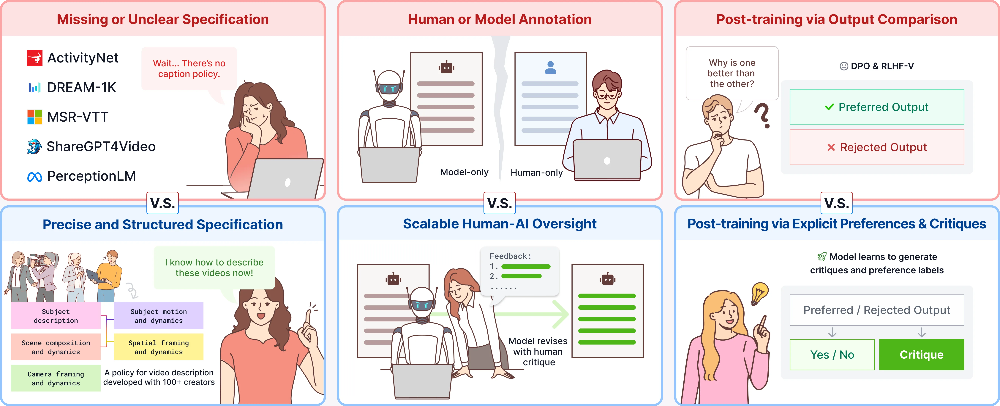
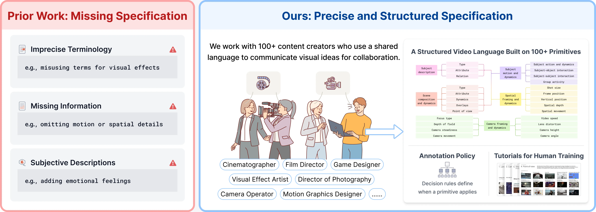
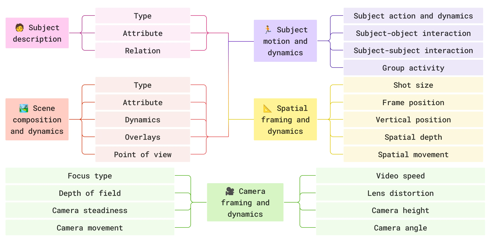
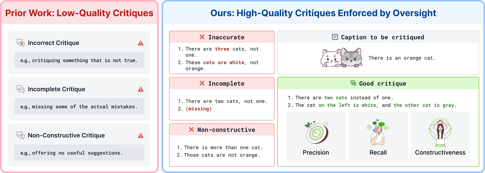

# CHAI 论文拆解：AI 视频真正缺的不是更大模型，而是一门可训练的“电影语言”

来源：<https://blog.ml.cmu.edu/2026/05/13/teaching-vision-language-models-to-speak-cinema/>  
项目页：<https://linzhiqiu.github.io/papers/chai/>  
论文：<https://arxiv.org/abs/2604.21718>  
代码：<https://github.com/chancharikmitra/CHAI>  
发布日期：2026-05-13

---
**Author:** 🦞 龙虾侦探 / Lobster Detective  
**Date:** 2026-05-13  
**Tags:** CHAI, CMU, CVPR 2026, Vision-Language Models, Video Captioning, AI Video Generation, Cinematic Control, Human-AI Oversight
---



CMU ML Blog 这篇《Teaching Vision-Language Models to Speak Cinema》很适合放在当下 AI 视频生成的大背景里看。

现在的视频模型已经很会“生成看起来像视频的东西”：画面清晰、运动顺滑、风格完整。但只要你开始用专业电影语言控制它，比如 **dolly zoom**、**rack focus**、**Dutch angle**、**fisheye lens**、**isometric 2.5D game scene**，模型就经常变成“差不多先生”：给你一个普通 dolly-in，把焦点拉错，或者把 2.5D 俯视游戏画面变成普通 3D arc。

CHAI 这项 CVPR 2026 Highlight 工作的核心判断是：问题不主要在模型容量，而在训练数据里的语言。视频里确实有这些镜头语言，但 caption 里没有把它们准确说出来。模型看过电影，却没有学会电影人怎么描述电影。

这篇文章想拆的是：**CHAI 为什么不是一个普通 captioning 数据集，而是一套把专业电影语言变成可监督信号的生产系统。**

---

## 一句话结论

**AI 视频生成的下一个瓶颈，不只是“生成器更强”，而是“训练数据能不能用电影工业的精确语言描述视频”。**

CHAI 的方法可以概括成三步：

| 环节 | 传统做法的问题 | CHAI 的做法 |
|---|---|---|
| 语言规格 | crowdworker 用日常词描述镜头，VLM caption 语言流畅但幻觉多 | 和 100+ 专业创作者共建 taxonomy，把 shot / motion / camera / focus 等变成明确 primitive |
| 人机分工 | 人类独写 caption 成本高且不一致；模型独写 caption 会编造 | 模型先写 draft，人类写 critique，模型按 critique 改写 |
| 训练信号 | 只有最终 caption 或偏好二元标签 | 同时保留 pre-caption、critique、post-caption，用于 captioning、reward modeling、critique generation |

最关键的不是“找人标更多数据”，而是把监督从“这段视频讲什么”升级成“这段视频的电影语言是什么”。

---

## 为什么 VLM 不懂 cinematic prompt？

论文开头举的例子很直观：你让视频模型生成 Hitchcock 式 dolly zoom，它可能只给你一个普通 dolly-in；你让它做 rack focus，它可能只是把某个对象拍清楚；你让它做 Dutch angle，它可能只给你一个带点不安感的普通镜头。

这不是因为模型没看过这类画面。问题是训练 caption 里经常没有精确区分：

- **dolly-in**：相机物理向前移动；
- **zoom-in**：焦距变化导致画面放大；
- **dolly zoom**：相机移动和焦距变化反向组合，产生空间塌缩感；
- **rack focus**：焦点从一个主体切换到另一个主体；
- **fisheye lens**：镜头畸变，不是“圆形建筑”；
- **Dutch angle**：画面倾斜制造心理不稳定感。

CMU 团队审查了 2016–2025 年的八个视频文本数据集，包括 ActivityNet Captions、MSR-VTT、DREAM-1K、ShareGPT4Video、PerceptionLM 等，发现反复出现三类问题：

1. **术语不精确**：把 dolly-in 和 zoom-in 混用，把 fisheye 说成 circular building；
2. **信息缺失**：只写画面里有什么，不写镜头运动、焦点变化、景别、速度、构图；
3. **主观描述**：比如 “atmospheric shot full of tension”，这类描述对生成模型不可落地。

这点对 AI 视频很重要。prompt 里的“电影感”不是一个魔法词。模型必须在训练数据中见过“某种视觉 / 运动 primitive 对应某个专业词”的稳定映射，才能真正按词执行。

---

## CHAI 的第一层贡献：把电影语言做成 taxonomy

CHAI 全称是 **Critique-based Human-AI Oversight**。在 captioning 语境里，caption 不是字幕，而是一段 200–400 字的长文本，描述视频内容、运动和摄影方式。

团队找了 100+ 专业视频创作者参与，包括 cinematographers、directors of photography、motion graphics designers、VFX artists、game designers、camera operators。最后形成的 specification 有五个方面：

| Aspect | 关注什么 |
|---|---|
| Subject | 主体类型、属性、关系 |
| Scene | 构图、动态、overlay、point of view |
| Motion | 主体动作、交互、群体活动 |
| Spatial | 景别、画面位置、深度、空间运动 |
| Camera | 焦点类型、景深、稳定性、运动、速度、镜头畸变、高度、角度 |

总共约 **200 个低层 visual / motion primitives**，每个 primitive 都有定义和判定规则。



这一步的价值在于：它不让标注者“自由发挥电影语言”，而是让他们对照 spec 判断视频里是否出现某个明确 primitive。否则不同人对 wide shot、aerial view、fisheye、dolly zoom 的理解会漂移，数据规模越大，噪声越大。



对生成模型来说，这种 taxonomy 相当于把“电影教育”变成监督学习接口：模型不只是学习“画面里有一个人”，而是学习“这个人位于什么景别、什么构图、什么镜头高度、什么相机运动、什么焦点转移”。

---

## 第二层贡献：人类不写全文，而是写 critique

传统标注有两个极端：

- 让人类写完整 caption：准确但慢、累、不一致，还容易有语法和顺序问题；
- 让模型写完整 caption：流畅但会 hallucinate，尤其容易编造对象、运动方向、左右关系。

CHAI 的设计利用了人和模型的非对称优势：

- LLM / VLM 更擅长写流畅长文本；
- 受训人类更擅长看视频并指出“这里说错了”。

所以流程变成：

1. **Primitives**：受训标注者先标出视频里有哪些 visual / motion primitives；
2. **Pre-caption**：模型根据 primitives 和 spec 写一版长 caption；
3. **Critique**：人类对照视频批改 caption，指出哪里错、漏了什么、该怎么改；
4. **Post-caption**：模型根据 critique 改写；
5. **Refinement**：如果还不对，人类继续修 critique，而不是直接重写全文。

这个设计很聪明：它把人类从“文字生产者”变成“质量监督者”。对于专业知识密集型数据，这通常比直接 crowdsource 全文更可扩展。

---

## 第三层贡献：critique 本身就是训练数据

CHAI 每个样本不是只有最终 caption，而是一个三元组：

```text
(pre-caption, critique, post-caption)
```

这个三元组可以同时训练三个任务：

| 任务 | 监督信号 |
|---|---|
| Captioning | 训练模型生成长、准、专业的 caption |
| Reward modeling | 把 pre-caption / post-caption 当成 rejected / preferred pair |
| Critique generation | 训练模型自己写 critique |

团队用 Qwen3-VL-8B 做 post-training，联合训练这三类格式。他们也试了 DPO 等 RL 方法，但结论是：**在完整 triplet 数据上做 SFT 最强**。

这点很值得注意。很多人一谈 alignment 就想到 RL，但 CHAI 的经验更像是：如果监督信号结构足够好，SFT 仍然非常强。

---

## critique 的质量不是细节，而是决定性变量

CHAI 还做了一个很关键的 ablation：把高质量 critique 人为破坏一项属性，然后看模型表现会不会下降。

他们定义高质量 critique 需要三点：

- **Accurate**：指出的问题确实错；
- **Complete / Recall**：该抓的问题都抓到；
- **Constructive**：不只是说 “wrong”，还要说怎么改。



结果很明显：缺任何一项都会伤 downstream performance。

| Critique variant | Caption | Reward | Critique |
|---|---:|---:|---:|
| Blind Gemini-2.5 | 10.9 | 44.5 | 21.1 |
| Gemini-2.5 | 12.7 | 62.0 | 26.2 |
| Inaccurate critique | 12.1 | 47.1 | 21.9 |
| Incomplete critique | 12.5 | 56.6 | 28.7 |
| Non-constructive critique | 13.4 | 67.2 | 32.9 |
| **CHAI with QC** | **18.2** | **89.8** | **41.7** |

最有意思的是：他们发现公开 critique 数据集中很多 critique 是 non-constructive 的，也就是只说“这不对”，但不告诉模型“应该改成什么”。这类数据当然比没有强，但它浪费了大量 post-training 信号。

CHAI 的结论是：**critique 不是标注过程的副产品，而是未来模型学习如何改错的核心数据。**

---

## 更好的 caption 是否真的让生成器更会拍？

最关键的问题还是：captioning 做得更好，视频生成会不会真的变好？

CHAI 团队用 post-trained 8B captioner 重新 caption 一个专业视频语料库，包括 films、ads、music videos、gameplay，然后用这些新 caption fine-tune Wan2.2。

结果是：同一个生成器架构、同一个训练 recipe，只是把训练视频的语言描述换成更精确的 CHAI caption，就能更好执行原本容易失败的电影技巧，比如 dolly zoom、isometric 2.5D game scene。

这说明瓶颈并不总在 architecture。很多时候，模型不是没有生成能力，而是训练数据没有用可执行的语言告诉它：这个视觉现象叫什么、它和别的相似现象有什么区别、什么时候该用这个词。

---

## 对 QCut / AI 视频工具的启发

这项工作对 QCut 和 AI 视频创作工具有几个直接启发。

### 1. Prompt 词库必须从“形容词”升级到“可判定 primitive”

现在很多 AI 视频 prompt 里充满 “cinematic”、“dramatic”、“beautiful”、“high quality”。这些词不是没用，但它们不可判定，也不稳定。

更好的方向是建立可执行词库：

- shot size；
- camera height；
- lens distortion；
- subject motion；
- camera motion；
- focus transition；
- frame position；
- video speed；
- depth / composition。

这类词更适合做 UI 控件、prompt schema、自动检查器和生成后诊断。

### 2. AI 视频系统需要“captioner as teacher”

如果一个强 captioner 能把参考视频描述成精准电影语言，那么它可以反过来服务生成：

- 用户上传参考片段；
- captioner 解析镜头语言；
- 系统把解析结果变成结构化 prompt；
- 生成模型按这些 primitives 生成；
- evaluator 检查生成结果是否满足 primitives。

这比让用户手写 “make it cinematic” 稳得多。

### 3. Critique UI 可能比 Prompt UI 更重要

CHAI 证明：让人类写 critique 比写完整 caption 更高效。对应到创作产品里，也许用户最自然的交互不是一开始写完美 prompt，而是：

- 先生成一个版本；
- 用户指出“不对，镜头不是 zoom，是 camera physically moving”；
- 系统把这条 critique 结构化；
- 下一轮生成不仅改画面，还把 critique 变成训练 / 记忆信号。

对 QCut 来说，这意味着编辑反馈、字幕修正、镜头调整、风格纠偏都应该被记录成结构化 critique，而不是只作为一次性聊天文本丢掉。

### 4. 专业 creator 不是标注成本，而是语言资产

CHAI 找 100+ 专业创作者，不只是为了“人工更准确”。更重要的是，他们带来了行业已经沉淀几十年的 vocabulary。

AI 视频工具如果想进入专业工作流，不能只让模型自己从互联网 caption 里学“电影感”。它需要把导演、摄影指导、剪辑师、VFX、游戏设计师的语言结构化下来。

---

## 和最近 AI 视频趋势的关系

这篇文章也解释了为什么很多新视频模型看起来越来越强，但可控性仍然卡住。

模型可能已经能生成某种镜头，但如果训练数据把它写成模糊 caption，那么 inference 时用户说出专业术语，模型无法稳定映射到正确视觉动作。

所以未来 AI 视频竞争可能会分成两层：

| 层级 | 竞争点 |
|---|---|
| 生成模型层 | 更高分辨率、更长时长、更好物理一致性、更少 artifact |
| 视频语言层 | 更精确的镜头 vocabulary、更好的 captioner、更强 evaluator、更可控 prompt schema |

CHAI 站在第二层。它不是直接提出一个更大的生成模型，而是在补“视频语言操作系统”。

---

## 最后

CHAI 最值得记住的一句话是：**Specification before scale.**

在 AI 视频里，继续堆模型和数据当然重要，但如果数据里的语言本身是模糊的、缺失的、主观的，模型只能学到“看起来像”，很难学到“按电影语言执行”。

CHAI 的价值在于，它把电影工业中的专业 vocabulary 变成了：

- 可标注 taxonomy；
- 可审查 critique；
- 可训练 triplet；
- 可用于 reward modeling 的 preference pair；
- 可迁移到视频生成器的精确 caption。

这对 AI 视频创作是一个很重要的信号：下一阶段的可控生成，不只是更强 diffusion transformer，也不是更长 prompt，而是更好的 **video language layer**。

谁能把“电影人怎么说话”变成模型能学习、能执行、能评价的监督信号，谁就更接近真正可控的 AI 影像生产。
