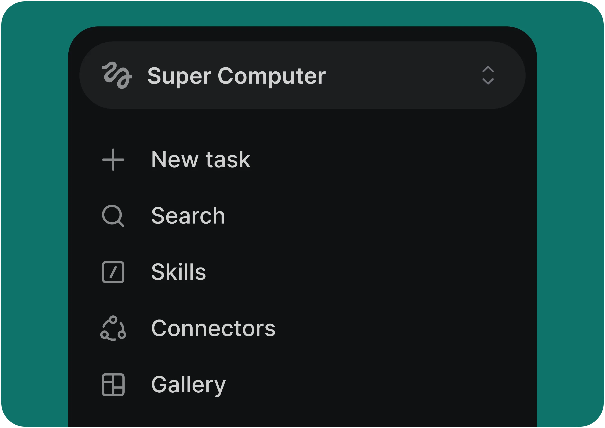
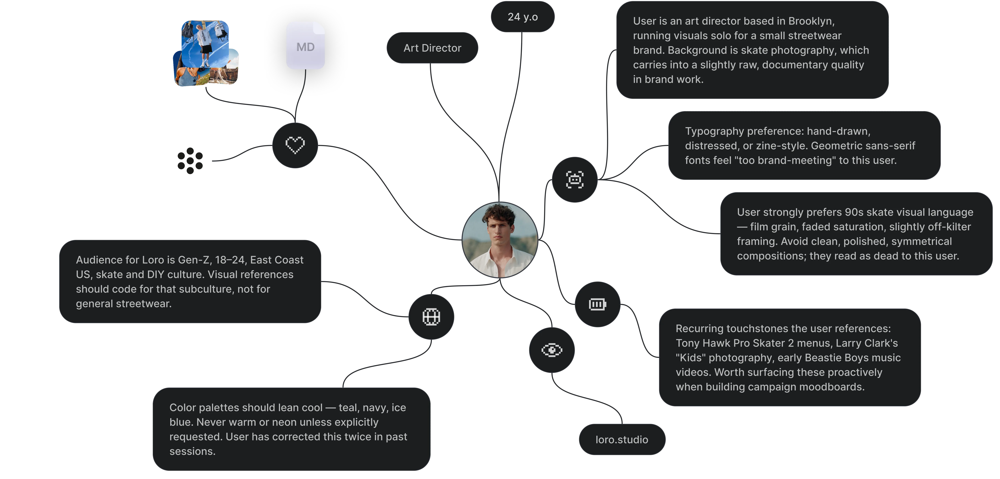
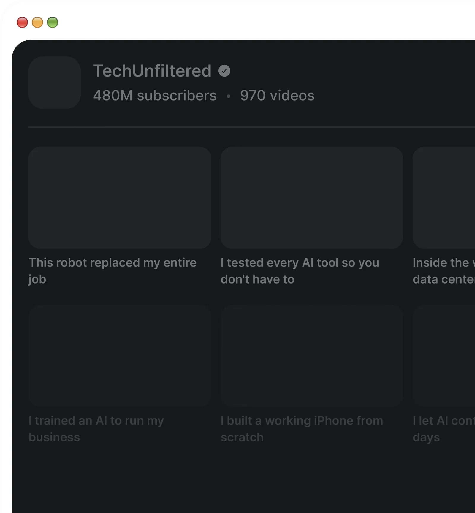
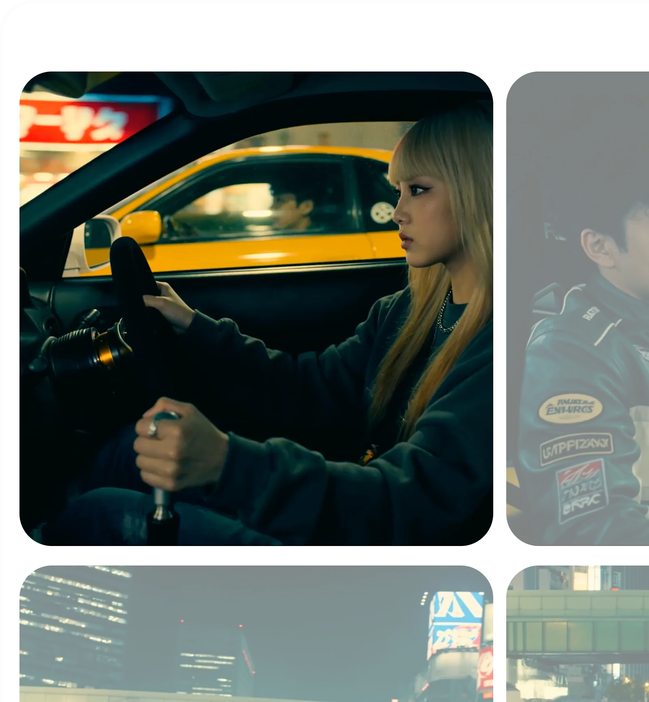
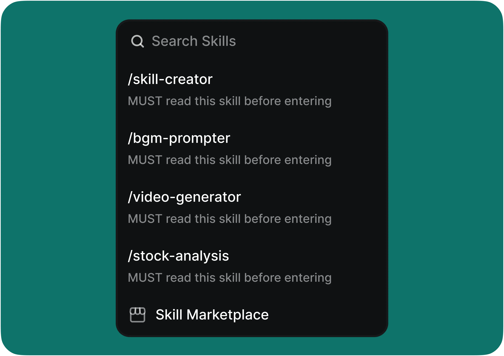
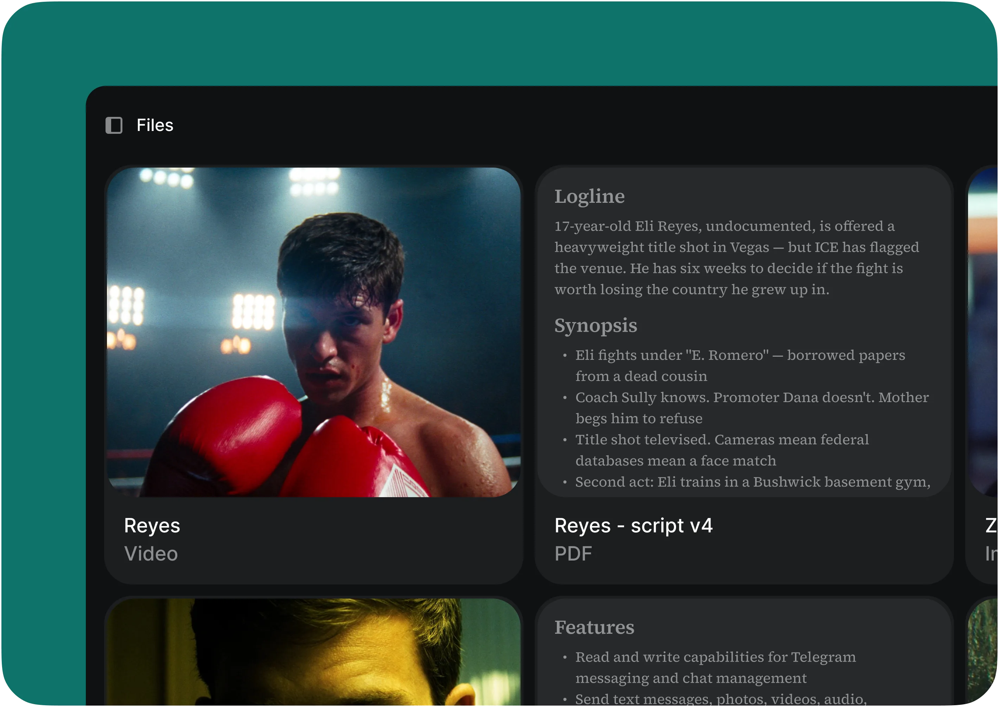
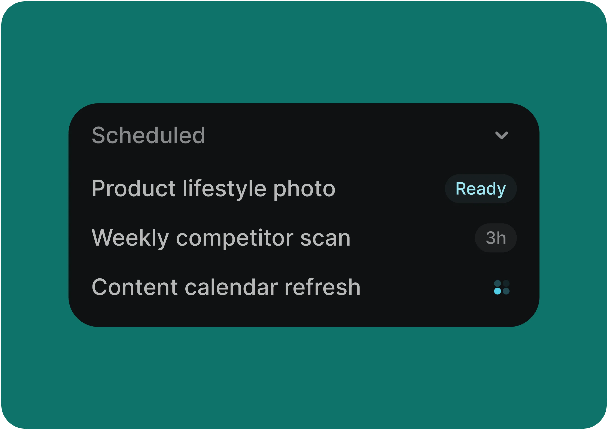
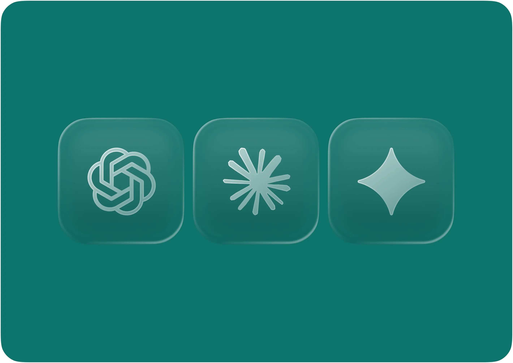

# Higgsfield Supercomputer: AI Creative Tools Are Becoming Schedulable Agent Workbenches

Source: <https://higgsfield.ai/supercomputer-intro>  
Related background: <https://higgsfield.ai/cli>, <https://github.com/higgsfield-ai/skills/tree/main>  
Captured: 2026-05-13

---
**Author:** 🦞 Lobster Detective / 龙虾侦探  
**Date:** 2026-05-13  
**Tags:** Higgsfield, Supercomputer, Agentic Creative Workflow, AI Video, AI Image, Skills, Scheduled Tasks, Creative Operations
---

Higgsfield’s new **Supercomputer** looks, at first glance, like a more conversational entry point for AI creative work. You type something like “scan competitors every Monday and draft three ads,” and it runs a workflow, calls models, generates assets, and delivers the output.

But reading it merely as another AI image/video generator misses the more interesting product shift. Supercomputer is not just adding more models. It is repackaging capabilities previously spread across Marketing Studio, Cinema Studio, Canvas, CLI, MCP, and Skills into an **agent-schedulable creative workbench**: memory, files, connectors, skills, scheduled tasks, and model routing.

This article does not repeat the landing page. Instead, it looks at the product architecture: why Higgsfield is moving from “generator” to “Supercomputer,” what that means for creative teams, and how it relates to Higgsfield Skills and the CLI.

---

## The short version

**Higgsfield Supercomputer is not trying to help users press more generation buttons. It is trying to let an agent take over repetitive creative-operations work.**

The landing page’s positioning is blunt:

> Automate workflows, run agents, skills & more.

The important part is the combination of modules:

| Module | What the page says | What it means for creative workflows |
|---|---|---|
| Connectors | Slack, Drive, Notion, Gmail, Figma, and 30+ more | The agent can read briefs, fetch assets, and deliver results outside the generator UI |
| Skills | Package `/montage`, `/cinematic`, or a brand pipeline as slash-triggered workflows | Human know-how becomes reusable agent procedure |
| Files | Every asset, revision, and brief is saved into the project | “Make another one like the third version” becomes traceable context, not guesswork |
| Scheduled Tasks | Daily, weekly, or one-off future execution | Content operations become recurring systems, not one-off prompts |
| Models | Claude Opus 4.7/4.6, Sonnet 4.6, GPT-5.5 Pro, Gemini 3.1 Pro, and routing | The user can choose a model or let the agent route work to the best fit |

Put together, these move Higgsfield from “media generation” toward “creative operations.”

---

## From generator to creative operating system

Most AI visual products still default to a single-session interaction: open the website, select a model, write a prompt, upload references, wait for results, then download or copy the asset link. That is useful for one-off creation, but it does not match how real creative teams operate.

A real team’s loop looks more like this:

1. Pull briefs, brand rules, and source assets from Notion, Drive, Figma, and email.
2. Read competitors, reviews, ads, and trends to decide what to make this week.
3. Generate hooks, scripts, UGC variants, product images, and short videos.
4. Resize and rewrite for each channel.
5. Put outputs back into the right project folder and notify the right people.
6. Repeat next week without forgetting which prior versions worked.

If a tool only solves step 3, it is a generator. If it starts covering steps 1, 2, 4, 5, and 6, it starts becoming an operating system. Supercomputer’s page is clearly aiming at the second category: **brief once, it remembers the rest**.

That memory is not a vague concept. It includes project files, revision history, brand context, external connector data, and workflow definitions inside skills. For agents, this matters more than “a stronger model” because reproducible brand process is often more valuable than a single stunning image.

---

## “The whole team is one agent” is an aggressive claim

The page says: **The whole team is one agent**.

It places Marketing, Production, and Creative under one agentic surface:

This does not mean human teams vanish. It means a lot of cross-functional glue work becomes agent-addressable:

- Marketing: hooks, ads, UGC at scale.
- Production: shot lists, characters, scene boards.
- Creative: mood, style, and world-building.

Traditional creative production contains a huge amount of handoff work: creative passes concepts to copy, copy passes scripts to editing, editing asks brand for guidance, brand gives feedback, operations publishes. Supercomputer’s product hypothesis is that if an agent can read the context, call the right skills, manage files, and run on a schedule, it can absorb much of this coordination, batch generation, and delivery layer.

That is why connectors and scheduled tasks matter. Without connectors, the agent lacks business context. Without scheduled execution, it can chat with you but cannot become part of an operating cadence.

---

## Skills are the core: turning prompts into reusable procedures

The landing page describes Skills this way:

> Teach the agent a workflow once — `/montage`, `/cinematic`, your own brand pipeline — and trigger it with a slash. Reuse across projects, share across teams, version like code.

This is the same product direction as the [Higgsfield Skills GitHub repository I previously analyzed](../2026-05-04/2026-05-04-higgsfield-skills-github-deep-dive-en.md).

The open Skills repository addresses one question: how do you wrap image generation, video generation, Soul ID, product photography, and marketplace cards into Markdown runbooks that Claude Code, Codex, Cursor, and other agents can load and execute? Supercomputer brings the same idea into Higgsfield’s own product surface, so users do not necessarily need to install an external agent skill to reuse a brand workflow.

The most important phrase is “version like code.” It implies that Higgsfield does not see a skill as a disposable prompt template. It is a team asset:

- reusable across projects;
- shareable across a team;
- versioned over time;
- bound to brand process;
- triggerable through slash commands.

For commercial creative work, that is more valuable than a prompt gallery. A prompt gallery solves inspiration. A skill solves production consistency.

---

## Files and project memory are the foundation of agentic creation

Supercomputer says:

> Every asset, every revision, every brief — saved into your project.

That sounds mundane, but it hits a major pain point in AI creative tools: outputs multiply quickly, project state becomes scattered, and users soon lose track of which image came from which generation, which video matched which brief, and which version a client approved.

An agent without a file system and project memory struggles with requests like:

- “Keep the shot language from the previous version, but swap in the new Soul Character.”
- “Use the composition from the third image and make a 9:16 version.”
- “Take last week’s five best-performing ads and generate a new variant set.”
- “Build a launch campaign in this brand’s black-and-gold style.”

All of these depend on traceable project context. By putting files and revisions at the center, Supercomputer is laying the groundwork for continuous agent work.

---

## Scheduled Tasks turn a tool into an operating cadence

The most agentic part of Supercomputer is scheduled tasks.

The landing page mentions examples such as:

- daily ad variations;
- weekly competitor scans;
- monthly content calendars;
- every morning, weekly, or next Tuesday at 9am.

That means Higgsfield is not merely trying to make users come back to a tool. It wants the tool to work even when the user is not actively on the page. For content teams, this is a big shift:

| Traditional AI tool | Agentic creative workflow |
|---|---|
| User opens the tool when they remember | Tasks run on a business cadence |
| One-off prompt generation | Recurring production jobs |
| Human downloads and organizes results | Results are delivered into folders or channels |
| Generation ends the session | The next run inherits project context |

This is where the name “Supercomputer” starts to make sense. It is not selling a button. It is selling a continuously running creative machine.

---

## Models: Higgsfield is moving toward a routing layer

The page lists Claude Opus 4.7, Opus 4.6, Sonnet 4.6, GPT-5.5 Pro, and Gemini 3.1 Pro, then says:

> Pick one yourself, or let the agent route to the best fit for the job.

That suggests at least two model layers:

1. **Reasoning/orchestration models** for reading briefs, decomposing tasks, selecting tools, writing scripts, and calling skills.
2. **Generation models** for images, videos, characters, and advertising assets.

What users are really buying is not one model. It is routing: the right task goes to the right capability. Competitor scanning and strategy may need a strong reasoning model. Product imagery uses image models. Short video may use Seedance, Kling, or Veo. Brand consistency depends on Soul, brand kits, and project memory.

This will be a major axis of differentiation for AI creative platforms. Single-model quality will keep converging. The harder problem is orchestrating multiple models, tools, files, and delivery channels into a stable workflow.

---

## Pricing reveals the product boundary

Supercomputer is already part of Higgsfield’s subscription tiers. The page shows:

- Starter: Supercomputer entry, 100MB storage, featured models, connectors, Claude Opus 4.6, but no scheduled jobs, parallel chats, all tools, or Claude Opus 4.7.
- Plus: 2GB storage, up to two scheduled jobs, up to three parallel chats.
- Ultra: 5GB storage, up to ten scheduled jobs, up to ten parallel chats, Claude Opus 4.7.
- Business: seat-based pricing with shared workspace, shared credit pool, usage analytics, shared projects, and SSO.

This reveals the cost structure. The expensive part is not only generation credits. It is **storage, parallel sessions, scheduled jobs, connectors, team collaboration, and premium reasoning models**.

In other words, Supercomputer’s business model is not just “sell more generations.” It is turning long-lived context and automated execution into subscription tiers.

---

## Lessons for QCut and creative-agent products

Viewed from QCut or any AI video workflow, the lesson is not “add a chat box.” The more specific product lessons are these:

### 1. Productize creative actions as Skills

Do not merely let an agent call a model. Package high-frequency actions — “cut a UGC ad,” “build a three-shot opener,” “generate five product-message variants” — into reusable skills with clear inputs, outputs, recovery paths, and versioning.

### 2. Treat project files as first-class state

Video creation is not one prompt. It is assets, scripts, shots, audio, subtitles, revisions, and feedback. An agent must understand the project directory, asset relationships, and revision history before it can enter real production.

### 3. Turn recurring jobs into content operations

Teams rarely need “one video today.” They need “twenty testable assets every week, delivered to the right channels.” Scheduled tasks plus connectors plus skills are what move AI creation from demo to operations.

---

## The risk: agentic UI can become complicated SaaS

Supercomputer’s direction is strong, but it has a clear challenge. If connectors, skills, files, models, and scheduled tasks pile up without good defaults, users may get lost.

The hard part of agentic creative products is not feature count. It is the default path:

- What should a new user do first?
- Are skill inputs clear enough?
- Can the agent explain generation failures?
- Are scheduled-task runs auditable?
- How does a team share skills without brand drift?
- Will project files and revisions become cluttered over time?

If those are not handled well, Supercomputer could turn from “one agent runs the team’s workflow” into “a more complicated admin dashboard.” The real product bar is making a complex workflow feel like a natural-language request while keeping it traceable, reversible, and auditable underneath.

---

## Final thought

Higgsfield Supercomputer is worth watching because it pushes AI creative products one layer forward.

Stage one was model competition: who generates better media.  
Stage two was tool competition: who has better editing, references, characters, and templates.  
Stage three is agent-workflow competition: who can connect briefs, files, tools, models, channels, and recurring jobs into a long-running creative machine.

Supercomputer is clearly aiming at stage three. It is not just giving creators a stronger generator. It is trying to give creative teams an agent workbench that remembers, schedules, calls skills, and produces on a cadence.

That is also why it pairs naturally with Higgsfield CLI and Skills. The CLI lets external agents call generation capabilities reliably. Skills package those capabilities into workflows. Supercomputer turns those workflows into a team-facing product surface.

If this direction works, the core metric for AI image and video platforms will no longer be only “single-generation quality.” It will be: **can a team safely delegate repetitive creative production to a schedulable, memorable, reusable agent?**
