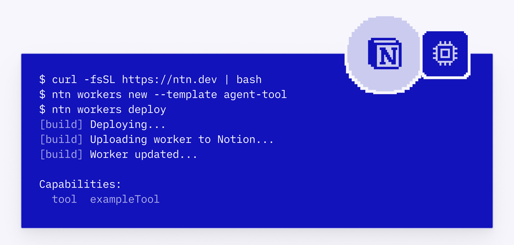
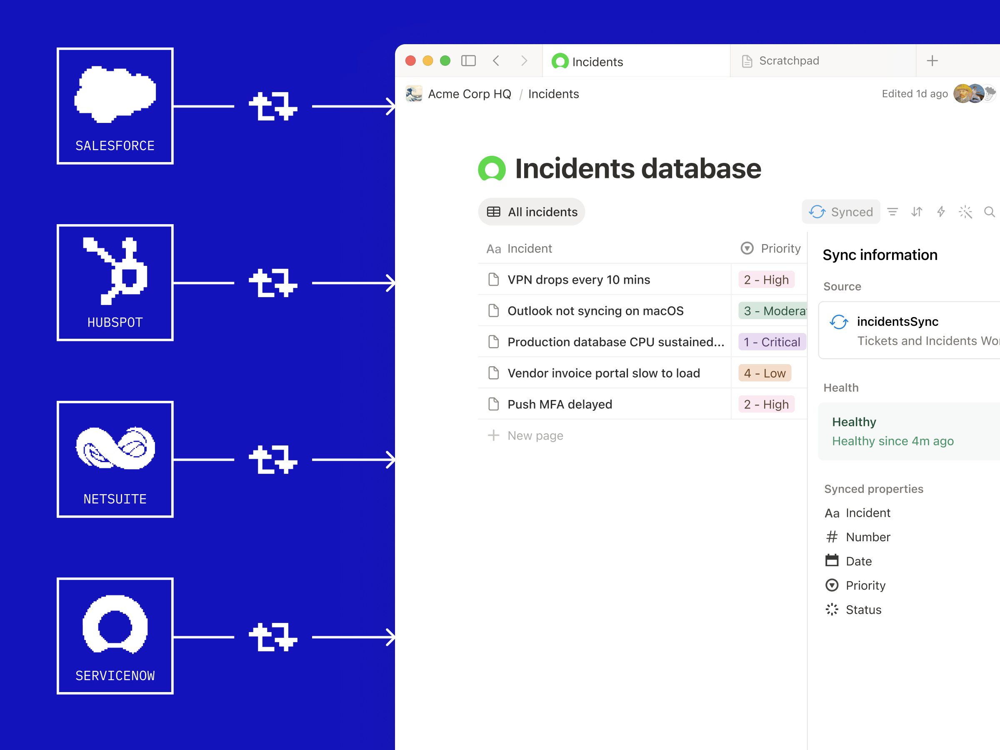
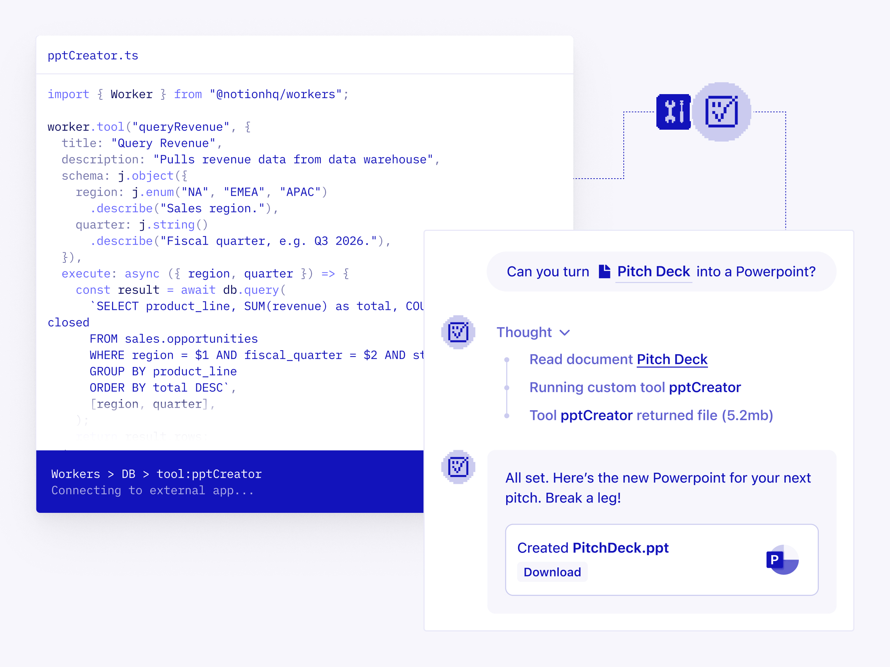
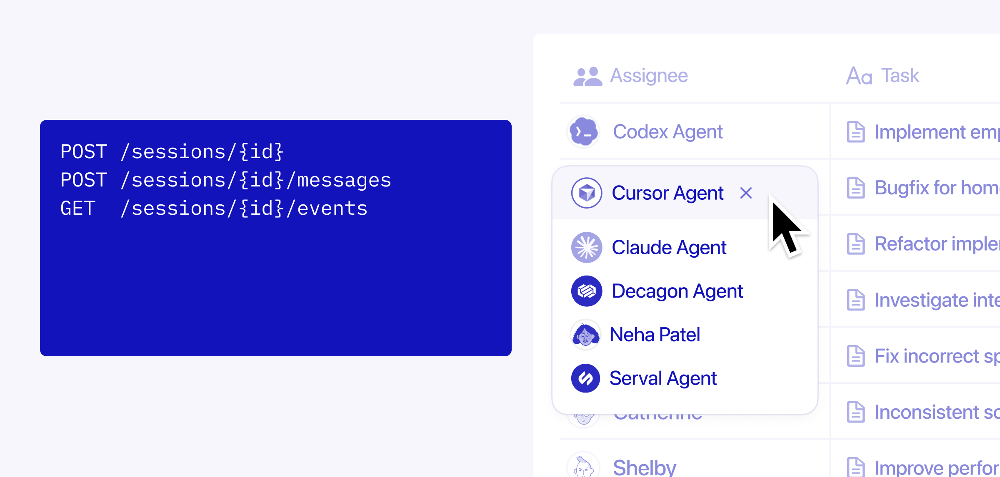

# Notion Developer Platform Deep Dive: Notion Is Turning the Workspace into an Agent Runtime

> **Source**: Notion’s X post announcing the [Notion Developer Platform](https://x.com/NotionHQ/status/2054625030970220834?s=20)  
> **Canonical sources**: Notion’s official blog post [Introducing Notion’s Developer Platform](https://www.notion.com/blog/introducing-developer-platform), [May 13, 2026 release notes](https://www.notion.com/releases/2026-05-13), and [Developer Docs](https://developers.notion.com/)  
> **Published**: 2026-05-13  
> **Keywords**: Notion Developer Platform, Notion CLI, ntn, Workers, Database Sync, Custom Agents, External Agents API, Agent SDK, Workspace Runtime

Notion’s X post framed the launch bluntly: this is a “BIG one for devs.” But reading it as just another Notion API update would miss the structural point.

The Notion Developer Platform signals that Notion is no longer only a workspace where humans organize documents, databases, projects, and knowledge. It is becoming a **collaborative runtime that agents can read from, write to, execute within, and be governed by**.

Historically, Notion’s core value was putting team information into a shared workspace. The new CLI, Workers, database sync, agent tools, webhook triggers, External Agents API, and Agent SDK answer a different question: when a team includes not just humans but Claude Code, Cursor, Codex, internal support agents, sales agents, and ops agents, where should they share context, perform actions, receive permissions, and leave an audit trail?

Notion’s answer is: still inside the workspace.



## The short version

The Notion Developer Platform is not a single feature launch. It is a set of platform primitives for AI agents:

- **ntn CLI**: a terminal interface for humans and coding agents to authenticate, read/write Notion, and deploy Workers;
- **Workers**: Notion-hosted Node/TypeScript programs that run syncs, tools, and webhook logic;
- **Database sync**: a way to bring data from Salesforce, Zendesk, Postgres, GitHub, Stripe, and other systems into Notion databases;
- **Agent tools**: deterministic Worker-backed tools that Custom Agents can call;
- **Webhook triggers**: external events that kick off asynchronous work in Notion;
- **External Agents API**: a way to bring external agents into Notion as first-class workspace participants;
- **Notion Agents SDK**: the inverse path—embedding Notion Agents into other applications.

In other words, Notion wants to become three layers at once:

1. the shared context layer for teams;
2. the data and tool layer for agents;
3. the governance and visibility layer for agent work.

That is much larger than “Notion got a developer platform.”

## Why this is not just another Zapier-style automation layer

Plenty of products support automation: triggers, actions, webhooks, third-party connectors, and scheduled jobs. But Notion’s launch is not merely about connecting Tool A to Tool B.

Zapier, Make, and n8n are primarily automation pipelines: an event comes in, a flow runs, and actions go out. The Notion Developer Platform is different because it places automation, agents, and collaborative context in the same shared space:

- external data is not merely passed through a workflow; it can be synchronized into a Notion database;
- custom code does not just run as a backend script; it can become an agent tool;
- external agents do not merely call Notion through an API; they can appear in the workspace agent list, chat with the team, receive tasks, and report progress;
- permissions, auditability, sandboxing, and human review are part of the platform design rather than enterprise add-ons.

That changes Notion’s role from “the endpoint of automations” to “the control plane for agent collaboration.”

## Workers: a lightweight business runtime inside Notion

Notion’s docs define Workers as small Node/TypeScript programs. Developers write code, deploy it through the Notion CLI, and Notion hosts and runs it. A Worker can register multiple capabilities, including syncs, tools, and webhooks.

This resembles Cloudflare Workers, Vercel Functions, or Slack Functions at a surface level, but the product context is different. Notion’s runtime is not primarily for serving public web traffic. It is for embedding business logic inside the workspace.

Examples include:

- pulling Zendesk tickets into a Notion database;
- syncing Salesforce customer data so a sales agent can prepare account briefs;
- exposing a `validateInvoice` function to a finance agent;
- receiving a GitHub webhook and updating a release checklist in a Notion project;
- authenticating to third-party APIs through OAuth and CLI-managed secrets;
- running code in a sandboxed Node.js environment.

The official blog emphasizes that Workers help when MCP tools are not enough—when a workflow needs predictable execution and custom logic. That detail matters.

MCP answers the question “what tools can a model call?” Workers answer a different question: “can this business-critical operation run deterministically, be reused, be permissioned, and be audited?” In real enterprise workflows, the second question is often more important.

## Database sync: turning external systems into shared agent context



One of the most practical capabilities in the launch is database sync. Notion’s examples include Zendesk, Salesforce, Postgres, and—through release-note examples—Stripe and GitHub.

The product meaning is not merely “Notion added more integrations.” It is that agent context can move from “whatever the user pasted into the chat” to “continuously maintained records from systems of record.”

Agents in enterprise environments often fail not because they cannot reason, but because they cannot see the right state:

- they lack up-to-date customer data;
- they do not know the real ticket status;
- projects, contracts, CRM records, and support data are scattered across tools;
- humans must repeatedly copy context before each run;
- stale data causes agents to produce plausible but wrong recommendations.

Database sync maps those external systems of record into Notion databases and lets Workers update them on an ongoing basis. The docs mention patterns such as backfill, delta sync, state reset, and manual sync triggers, which suggests this is designed as an operational data pipeline rather than a one-time import tool.

For agent workflows, this kind of continuously synchronized context layer is more important than a better one-off prompt. Agent quality depends not only on the model, but on whether the workspace state it sees is trustworthy.

## Agent tools: turning fuzzy natural-language actions into deterministic code



Notion already has Custom Agents and supports broader connectivity through MCP. But Worker-backed agent tools emphasize a different property: they are deterministic and token-efficient.

That points to a real limitation in current agent products:

- letting an LLM reason through every API call is flexible but unstable;
- encoding business rules in prompts is brittle and hard to test;
- high-frequency, low-tolerance workflows are too expensive and slow when every step becomes a token loop;
- enterprise operations often require fixed inputs, fixed validation, and fixed side effects.

Workers let developers wrap that logic as tools. Examples might include checking whether a customer qualifies for a discount, retrieving billing status, triggering an internal approval, checking a release gate, or generating a compliance report. The Custom Agent still interprets intent, organizes context, and collaborates with humans, but the action itself lands in deterministic code.

This is likely the architecture that durable agent systems converge toward: LLMs handle judgment and orchestration, while critical business actions run through testable, auditable, versioned tools.

## External Agents: Notion does not want to host only its own agents



Notion’s announcement mentions partner agents such as Claude Code, Cursor, Codex, and Decagon. Strategically, this may be even more important than Workers.

Today, every agent product is trying to become the user’s entry point. Coding agents live in IDEs, support agents live in support tools, sales agents live in CRMs, research agents live in browsers, and project agents live in project-management apps. The more agents a team adopts, the more context-moving work falls back onto humans.

The External Agents API aims to bring those agents back into the Notion workspace:

- they can appear in the agent list;
- users can chat with them directly in Notion;
- they can be assigned work;
- their progress can be tracked in the same collaborative space;
- internal agents built on other frameworks can also become first-class participants.

This is not simply “connect Claude Code to Notion.” More precisely, Notion is trying to become the shared room for the multi-agent era: humans, Notion Custom Agents, coding agents, and external business agents all looking at the same data and collaborating around the same projects.

If this direction works, Notion’s competitive set expands beyond docs, wikis, and project-management tools. It starts competing with every product that wants to become the primary work surface for agents.

## ntn CLI: an entry point for coding agents

The Notion CLI is called `ntn`. The official docs provide this install command:

```bash
curl -fsSL https://ntn.dev | bash
```

It supports several kinds of work:

- logging in and authenticating with Notion;
- reading from and writing to the Notion API;
- managing and deploying Workers;
- uploading files;
- working with data sources, syncs, secrets, OAuth, and related platform capabilities.

The key detail is that Notion explicitly describes the CLI as being for “developers and agents.” Notion is acknowledging that future users of developer platforms will not only be human developers; they will also include coding agents running in terminals and IDEs.

For tools like Claude Code, Codex, and Cursor, the CLI is the natural control plane. If an agent can authenticate, query, write, and deploy from a terminal, it can use Notion as a long-lived project context and task-state layer.

That is why Notion’s X post says that soon users may not need to be developers to build on Notion—their agents will be developers for them.

## Governance: Notion’s real enterprise advantage

One of the biggest issues in agent products is that capability is moving faster than governance. Permissions, audit logs, approval flows, isolation, and visibility often arrive after the fact.

Notion repeatedly emphasizes governance in the blog and docs:

- **Progressive trust**: start with human review for every agent action, then expand autonomy as agents prove reliable;
- **Visibility**: work from Custom Agents, coding agents, and external agents appears in the same workspace;
- **Sandboxed execution**: Workers run in Notion’s hosted sandbox and execute code in an isolated environment;
- **Authentication and permissions**: auth, permissions, and sandboxing are part of the platform from the first deploy.

This fits Notion’s enterprise trajectory. Individual users often want the most capable agent possible. Enterprises ask different questions: who approved the action? What did the agent do? Which data did it touch? How do we roll back failures? Which actions must stay human-in-the-loop?

If Notion can bind governance directly to workspace data, it may be easier to adopt inside companies than standalone agent platforms that have to reconstruct context and permissions from the outside.

## Availability and constraints

Based on Notion’s announcement and release notes:

- `ntn` CLI is available on all plans;
- Workers are in public beta, with deployment and management available to Business and Enterprise plans;
- Workers are free to try during beta, and the release notes say they will run on Notion credits starting August 11, 2026;
- External Agents API is in private beta and requires joining the waitlist;
- Notion Agent SDK is in private alpha / alpha and is meant for bringing Notion Agents into other apps;
- Workers run in a sandboxed Node.js environment and support secrets, OAuth, HTTP requests, and related platform capabilities.

So this is not yet a fully open platform that every team can use at scale immediately. It is more like Notion publicly exposing its future architecture: the CLI and Workers can be tested now, while External Agents and the Agent SDK will roll out gradually.

## What developers should do with it

For developers, the important takeaway is not “Notion has another API.” It is that the default landing zone for enterprise agents may be expanding from IDEs and chat apps into the workspace.

Useful experiments include:

1. **Sync existing business systems into Notion databases**  
   CRM accounts, support tickets, GitHub issues, billing status, release milestones, and other operational records.

2. **Wrap high-frequency internal actions as Worker tools**  
   Weekly reports, contract checks, project-status updates, approval triggers, quality gates, and compliance reports.

3. **Let coding agents use ntn to maintain project context**  
   After completing code work, agents can update project pages, design decisions, release notes, and task status in Notion.

4. **Turn internal agents into workspace participants**  
   If a team already has support, sales, ops, or engineering agents, the External Agents API may prevent them from being scattered across separate tools.

## The bigger trend: the workspace is becoming a layer of the Agent OS

This launch fits a broader product pattern:

- IDEs are becoming agent workbenches;
- browsers are becoming agent execution environments;
- terminals are becoming agent control planes;
- CRMs, support tools, and project-management systems are adding agents;
- docs and knowledge bases are moving from static records to executable context.

Notion’s special position is that it already stores a lot of teams’ semi-structured organizational memory: docs, databases, projects, meeting notes, knowledge bases, tasks, and process descriptions. If that layer gains a runtime, sync, agent tools, and external-agent integration, it can become a lightweight workspace layer for an Agent OS.

This does not mean Notion will replace every business system. It means Notion may become the collaboration plane above those systems: external data syncs in, agents read and act there, and humans review and collaborate there.

## Conclusion

The real story in the Notion Developer Platform is not any single feature—`ntn`, Workers, database sync, or the External Agents API. It is the platform assumption they form together:

> The future workspace is not just a knowledge base humans read. It is a runtime where humans and agents work together.

Notion is expanding collaboration from human-to-human work into collaboration among humans, data sources, deterministic code, internal agents, and external agents.

If the previous stage of Notion was about structuring team knowledge, this launch points to the next stage: turning structured knowledge into a work system that agents can use, update, execute inside, and be governed by.

That is why developers should pay attention. This is not merely a better API. It is Notion’s first full statement of what an agent-native workspace can look like.
