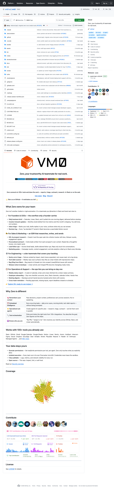

# VM0 技术架构深度拆解：把 AI Teammate 做成“应用层 + 权限层 + 微虚拟机运行时”

> Repo: [vm0-ai/vm0](https://github.com/vm0-ai/vm0)  
> Inspected commit: `2b64ac7` (`refactor(api): migrate zero runs create route (#13076)`)  
> Date: 2026-05-13  
> Tags: VM0 / Zero / AI Agent Runtime / Firecracker / Sandbox / Hono / Next.js / Agent Infrastructure



VM0 不是一个简单的“Slack 机器人 + LLM 调用”项目。它更像是在做一套面向企业团队的 **AI teammate runtime**：上层是 Slack/Web/CLI 的产品入口，中间是 agent、org、connector、permission、billing、schedule、memory、artifact 等业务控制面，底层则是 Rust 写的 Firecracker microVM 执行层。

一句话总结它的技术路线：

> **把 Agent 从聊天窗口里拿出来，放进一个可授权、可排队、可审计、可隔离、可恢复的运行时。**

这篇文章从仓库结构、运行链路、隔离模型、连接器权限、存储与测试体系几个角度，拆一下 VM0 真正在构建什么。

---

## 这不是一个 demo 仓库

我检查的版本是 `2b64ac7`。GitHub 页面显示仓库约 **1.1k stars / 61 forks**，主分支最新提交是 `refactor(api): migrate zero runs create route (#13076)`，可以看出它仍在快速迁移和重构中。

从目录规模看，VM0 已经是一个完整平台仓库：

| 指标 | 数量 |
|---|---:|
| Git 工作树文件数（排除 `.git`/依赖/构建目录） | 约 6,672 |
| Rust crates | 19 |
| TypeScript 文件 | 3,329 |
| TSX 文件 | 392 |
| Rust 文件 | 约 232 |
| SQL migration 文件 | 368 |
| Hono API route files | 153 |
| Next.js route handlers | 266 |
| DB schema 文件 | 82 |
| Connector 实现文件 | 180 |
| Bats E2E 测试 | 56 |
| Playwright E2E 测试 | 9 |

更重要的是目录分层：

- `turbo/apps/web/`：Next.js Web app 和大量仍在迁移中的 legacy API routes。
- `turbo/apps/api/`：新 API 服务，基于 Hono、OpenTelemetry、Sentry、Axiom 日志体系。
- `turbo/apps/platform/`：Vite/React 平台 UI，覆盖 activity、schedule、connector、agent、permission、billing 等页面。
- `turbo/apps/cli/`：`@vm0/cli`，处理 auth、compose、run、volume、artifact、zero 子命令、computer-use 等本地入口。
- `turbo/packages/db/`：Drizzle schema，定义 org、agent、run、runner queue、connector、secret、schedule、billing 等数据模型。
- `turbo/packages/connectors/`：100+ 工具连接器、OAuth provider、firewall policy 和权限规则。
- `crates/`：Rust sandbox runtime，包含 runner、Firecracker backend、guest agent、vsock、NBD COW、guest download 等。
- `docs/`：architecture、resource model、testing、dev workflow、安全与运行文档。
- `.claude/skills/`：给 coding agent 使用的项目技能，例如 testing、database-development、code-quality、project-principles。

这说明 VM0 的核心资产不是某个 UI，也不是某个 prompt，而是一个从产品入口到 sandbox runtime 的完整 agent 平台。

---

## 一张架构图：VM0 的五层系统

从 `docs/architecture.md`、`docs/resource-model.md` 和代码结构看，可以把 VM0 分成五层：

```text
用户入口层
  Slack / Web app / CLI / Telegram / Phone / API
        ↓
产品控制面
  agents / schedules / chats / orgs / billing / permissions / connectors
        ↓
运行控制面
  run create → context resolution → runner_job_queue → realtime notification
        ↓
执行层
  Rust runner → Firecracker microVM → guest-init / guest-agent / guest-download
        ↓
持久化与审计层
  Postgres / Drizzle / R2 storages / artifacts / memories / logs / network traces
```

这套架构的关键点是：**agent 的“智能”并不直接等于产品能力**。真正决定能否进入企业工作流的，是中间三层：权限、上下文解析、执行隔离、审计和恢复。

---

## 第一层：产品入口不是一个，而是一组 channel adapter

VM0 README 里的定位是：Zero 可以在 Slack 或 Web 中处理报告、triage、outreach、research 等工作。代码里也能看到它不是单一入口：

- `apps/web/app/api/zero/slack/*`：Slack OAuth、events、interactive、commands、channels。
- `apps/web/app/api/telegram/*`：Telegram webhook、register、setup status。
- `apps/web/app/api/zero/voice-chat/*`、`zero/voice-io/*`：语音会话、STT、TTS、quota。
- `apps/platform/src/views/zero-page/`：Web 端 agent chat、settings、activity、connectors、schedule 等页面。
- `apps/cli/src/commands/zero/*`：CLI 管理 agent、schedule、org、variable、remote-agent、skill、search 等。

这意味着 VM0 的产品抽象不是“一个聊天 app”，而是一个多入口 agent control plane。Slack 只是其中一个 channel；Web、CLI、Telegram、语音都在围绕同一个 agent/run/resource 模型工作。

这类设计对 AI teammate 很关键：同一个 agent 需要在不同上下文里被触发，但底层身份、权限、memory、artifact、connector 不应该因为入口不同而变成几套系统。

---

## 第二层：Org + User 的资源模型，解决“谁的 agent 用谁的凭证”

`docs/resource-model.md` 是理解 VM0 的核心文档。它把运行时拆成两个 org：

1. **Agent Org**：agent 定义所在的 org，拥有 agent compose 和 volumes。
2. **Runtime Org + userId**：触发运行的用户上下文，拥有 artifacts、memories、secrets、variables、connectors、model providers。

这解决了一个真实团队场景：

> A 团队发布一个 agent，B 用户运行它时，应该使用 B 自己在当前 org 下授权的 GitHub/Slack/Linear/Gmail 凭证，而不是 agent 作者的凭证。

VM0 在文档里明确写了两阶段解析：

```text
Phase 1: Runtime Org + userId
  ├── secrets
  ├── model provider credentials
  ├── connector tokens / OAuth refresh
  └── variables

Phase 2: Agent Org + Runtime Org
  ├── volumes
  ├── artifact storage
  ├── memory storage
  └── presigned storage manifest
```

这个设计比“把所有 token 放进 agent 配置”安全得多。Agent 可以共享，但 runtime credentials 跟触发用户绑定；agent 定义和用户私有资源分离；schedule 也携带自己的 `(orgId, userId)`，因此定时任务不会丢失身份边界。

---

## 第三层：Run create 是 VM0 的心脏

最新提交正好在迁移 `zero runs create route`。`turbo/apps/api/src/signals/routes/zero-runs.ts` 把创建运行的请求交给 `createZeroRun$`；后者再调用 `createAgentRun$`。

链路大致是：

```text
POST /zero/runs
  ↓
Auth + capability check: agent-run:write
  ↓
load Zero agent + validate visibility
  ↓
load user info / connectors / custom connectors
  ↓
resolve firewall policies + framework skills
  ↓
createAgentRun$
  ↓
resolve compose / model provider / secrets / variables / storage manifest
  ↓
insert agent_runs + runner_job_queue
  ↓
publishRunnerJobNotification via realtime
```

`zero-runs-create.service.ts` 里有几个细节值得注意：

- 它会根据 agent 的 framework，把系统技能挂载到 `/home/user/.claude/skills` 或 `/home/user/.codex/skills`。
- 它会把 agent identity、tone、当前用户信息、Zero CLI 使用说明拼进 append system prompt。
- 它显式禁用一些工具：`CronCreate`、`CronList`、`CronDelete`、`ScheduleWakeup`、`AskUserQuestion`，避免 sandbox 内 agent 递归调度或直接问用户。
- 它会为 agent-triggered run 生成 callback secret，让 agent 之间的触发有可验证回调。
- 它把 permission policies、connector allowlist、custom connector allowlist 一并传给底层 run。

这说明 VM0 不是“收到 prompt 就丢给模型”。它在 run create 阶段就把身份、权限、技能、模型、连接器、memory/artifact、回调、限额、队列全部绑定成一次可执行上下文。

---

## 第四层：从数据库队列到 Rust runner

`runner_job_queue` 是 Web/API 世界和 Rust runtime 世界之间的边界。Drizzle schema 里定义了：

- `runId`：主键，引用 `agent_runs`。
- `runnerGroup`：路由到哪个 runner group。
- `profile`：默认 `vm0/default`。
- `sessionId`：用于 session affinity。
- `claimedAt`：claim 状态。
- `executionContext`：JSONB，注释写明 secrets 使用 AES-256-GCM 加密。
- `expiresAt`：TTL 清理。

`agent-run-create.service.ts` 的 `dispatchRun()` 会：

1. 构建 runner job payload。
2. `insert(runnerJobQueue)`。
3. 更新 `agentRuns.runnerGroup`。
4. 调用 `publishRunnerJobNotification()` 唤醒 runner。

`docs/architecture.md` 里补充了 runner 行为：runner 订阅 Ably channel `runner-group:{org}/{name}`，被通知后 HTTP poll，原子 claim job，然后在 Firecracker VM 内执行，最后通过 webhook 上报完成。

这套机制的好处是：

- API 不直接启动 VM，而是只写入队列和发通知。
- runner 可以水平扩展，也可以 fallback 到 30 秒 HTTP polling。
- session affinity 可以让同一会话尽量路由到合适执行上下文。
- `runner_job_queue` 只保存临时执行上下文，完成后删除，减小秘密长期驻留风险。

---

## 第五层：Firecracker microVM 才是 VM0 的护城河

`crates/README.md` 直接给出了 Rust workspace 的核心组件：

| Crate | 作用 |
|---|---|
| `runner` | 轮询 job、管理 VM 生命周期、proxy、服务安装、桥接 sandbox-fc |
| `sandbox` | sandbox trait 和共享类型 |
| `sandbox-fc` | Firecracker 实现：VM lifecycle、network namespace pool、NBD COW、snapshot restore |
| `nbd-cow` | userspace NBD copy-on-write block device |
| `vsock-host` / `vsock-guest` / `vsock-proto` | host/guest IPC 协议 |
| `guest-init` | Firecracker VM 的 PID 1 |
| `guest-agent` | VM 内部执行 CLI、heartbeat、telemetry、checkpoint |
| `guest-download` | 下载并解压 R2 storage archives |
| `ably-subscriber` | runner realtime notification client |

`docs/architecture.md` 里写得更具体：每次 agent execution 发生在 Firecracker microVM 中，使用 KVM 硬件隔离；VM 启动约 3–5 秒；每个 VM 有独立 network namespace；HTTP/HTTPS 通过 mitmproxy 记录；rootfs 使用 shared read-only base + NBD COW，避免每次复制完整磁盘。

这里最值得学习的是它没有用 Docker 当最终隔离边界。对“能读写代码、调用外部 API、持有用户凭证、可能运行 arbitrary tool”的 agent 来说，container isolation 往往不够清晰。VM0 选择 Firecracker，意味着它把 agent execution 当成 untrusted workload，而不是普通后端任务。

---

## 存储模型：R2 + presigned URL + manifest，而不是 API 代理文件流

VM0 的存储层使用 Cloudflare R2。文档里的流程是：

```text
CLI → tar.gz archive → presigned PUT URL → R2
DB records: storage_id, version_id, s3_key

API → presigned GET URL → storage manifest JSON
sandbox → direct download from R2 → extract to mount paths
```

这个设计有几个实际优势：

- 大文件不需要经过 API server 转发，降低延迟和成本。
- artifact、memory、volume 都可以通过版本化 archive 管理。
- sandbox 只拿短期 presigned URL，减少长期权限暴露。
- resume/checkpoint 可以基于 artifact/memory 版本实现，而不是依赖某台 VM 的本地状态。

对于 agent 平台，artifact 和 memory 不只是“文件存储”。它们是让 agent 从一次性执行变成长期 teammate 的关键：上次产物、上次上下文、上次状态必须可恢复、可追踪、可隔离。

---

## 权限不是一个开关，而是一套 connector firewall

VM0 README 说它支持 100+ tools。仓库里最实际的实现落在 `turbo/packages/connectors/` 和 `turbo/packages/firewalls-generator/`：

- `connectors/src/connectors/*.ts` 有约 180 个 connector 文件。
- `oauth-providers/providers/` 里包含 Figma、Atlassian、Microsoft、Spotify、ElevenLabs、Fal、Brevo 等 handler。
- `firewall-types.ts`、`firewall-loader.ts`、`firewall-rule-matcher.ts` 负责把连接器权限变成可匹配的网络/工具策略。
- `zero-runs-create.service.ts` 会根据用户允许的 connector types 解析 firewall policies，并传入 run execution context。

这点很重要。企业 agent 不是“能连 GitHub”就完事，而是要回答：

- 这个 agent 是否能读 repo？能不能写？
- 它能访问哪些 API endpoint？
- OAuth token 如何刷新？
- connector token 是否以 secret 形式注入？
- agent 是否知道 token 原文？
- 每次 API 调用是否可审计？

VM0 的答案是把 connector、secret、firewall、network log、permission policy 放在同一条 run 链路里处理。这个方向比“工具列表 + prompt 禁止乱用”更接近生产系统。

---

## API 正在从 Next.js 迁移到 Hono

仓库当前有一个明显的过渡状态：`apps/web` 里还有大量 Next route handlers，而 `apps/api` 正在承接新 API。

`CLAUDE.md` 里明确写了：

> API migration is in progress — `apps/web` API traffic is migrating to `apps/api`；feature work 要保持两边同步，直到 route 完全 API-authoritative。

`apps/api/src/app-factory.ts` 也能看到这个迁移策略：

- Hono app 注册新 `ROUTES`。
- 加上 OpenTelemetry middleware、route baggage、CORS、Axiom log flush。
- 对未迁移 route，fallback proxy 到 `VM0_WEB_URL`，保证 legacy traffic 不中断。

这是一种很实用的迁移方式：不强行 Big Bang rewrite，而是把新 API 域名指向 Hono，再对未迁移请求透明代理回 Web app。代价是短期系统复杂度上升；好处是可以逐 route 迁移，同时保持产品在线。

---

## 测试和工程文化：给 Agent 看的 repo，也给 Agent 管自己

VM0 有一个很有意思的信号：仓库里不仅有测试，还有 `.claude/skills/` 和 `.claude/commands/`。

这些文件不是给用户看的，而是给 coding agent 参与开发时读的：

- `testing`：强调 integration tests only、真实数据库/文件系统、只 mock 外部依赖。
- `project-principles`：YAGNI、no defensive programming、type safety、zero lint。
- `database-development`：数据库开发流程。
- `code-quality`：lint/typecheck/knip 等规则。
- `.claude/commands/tech-debt-*`：把技术债研究和 issue 创建流程命令化。

这透露了 VM0 的自举方向：它不仅在做 agent 产品，也在用 agent 维护自身代码库。对这类系统来说，工程规范写进 repo、写成 agent-readable skills，比写在 Notion 里更有用，因为未来的 contributor 可能就是 agent。

---

## 值得借鉴的设计选择

### 1. 把“运行一次 agent”建模成 durable run

VM0 没有把 run 当成一个 HTTP request。它有 `agent_runs`、`runner_job_queue`、status、heartbeat、callbacks、queue、concurrency limits、usage events、billing、logs。这样 run 才能排队、恢复、审计、收费、取消、重试。

### 2. 把 resource ownership 拆成 Agent Org 和 Runtime Org

这比多数 agent 平台更接近团队真实需求：agent 可以共享，但凭证和产物必须属于触发者。

### 3. 把 connector 权限放进 execution context

权限不应该只在 UI 上显示。VM0 把 allowed connector、firewall policies、secrets、network policies 放进 run payload，让底层执行时也能 enforce。

### 4. 用 microVM 明确 untrusted boundary

只要 agent 能执行 shell、读写 repo、安装包、调用 API，就应该被当成 untrusted workload。Firecracker 的选择让边界更干净。

### 5. 把 API 迁移做成渐进式代理

Hono 新 API + legacy Next fallback proxy 是一个现实主义选择，适合快速增长中的产品。

---

## 当前风险和复杂度

VM0 的架构很完整，但也意味着复杂度不低：

1. **平台跨度大**：Next.js、Hono、Vite、Rust、Firecracker、R2、Postgres、Ably、Axiom、Sentry、Clerk、Stripe 都在一条链路上。
2. **API 迁移期有双写/双实现成本**：`apps/web` 和 `apps/api` 同时存在，route 同步会带来维护压力。
3. **自托管门槛不低**：Firecracker 需要 bare metal Linux、KVM、内核/rootfs、NBD、network namespace、mitmproxy 等基础设施。
4. **连接器权限是长期战场**：100+ connectors 意味着 OAuth、token refresh、API shape、rate limit、审计策略都会不断变化。
5. **安全承诺需要持续验证**：README 和文档强调 credentials、microVM、audit trail；真正的强度取决于 token 注入、proxy、network policy、secret encryption、log redaction 在所有路径上的一致性。

所以 VM0 更像一个正在快速成型的“agent OS startup repo”，不是轻量级库。学习它时，不要只看 README 的 product slogan，要看 run create、resource model、runner queue、Firecracker crates 和 connector firewall。

---

## Builder 应该从 VM0 学什么

如果你也在做 agent 产品，VM0 给出的启发是：

- **不要把 agent 平台做成聊天 UI。** 聊天只是入口，核心是身份、权限、状态、执行和审计。
- **不要把工具调用只放在 prompt 层。** 权限要进入数据模型、执行上下文和网络边界。
- **不要把 sandbox 当成可选项。** 真正能执行任务的 agent 必须有明确隔离。
- **不要忽略 artifact/memory。** 长期 teammate 需要可版本化、可恢复、可隔离的状态层。
- **不要把 agent 开发规范留在人类文档里。** 把 workflow、测试、代码质量、项目原则写成 agent-readable skills，会越来越重要。

VM0 最有价值的地方不是“Zero 能做日报、外联、triage”。真正值得研究的是：它把这些能力下面的 runtime 做成了一个多层控制系统。

这可能也是 AI teammate 产品和普通 AI chatbot 的分界线：

> Chatbot 的核心是回答；AI teammate 的核心是安全地行动。

VM0 的仓库，正是在把“安全地行动”工程化。
