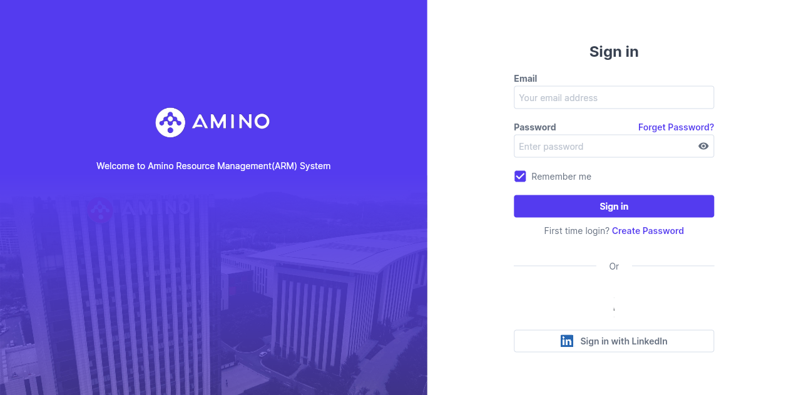

# Amino ARM Founder Space: VC CRM Is Becoming a Founder Collaboration Interface

> Source: https://arm.aminocapital.com/#/founder_space/client  
> Date: 2026-05-14  
> Tags: Amino Capital / ARM / Founder Space / VC CRM / Portfolio Collaboration / Founder Portal

At first glance, Amino Capital's ARM page is only a login screen: email, password, Remember me, Forget Password, Create Password, and LinkedIn sign-in. The interesting part is not the visible login form itself, but the route behind it: `/#/founder_space/client`.

That path suggests ARM is not merely an internal CRM for the investment team. Part of the system is exposed to founders or clients. In other words, a VC firm's internal knowledge base, portfolio collaboration layer, company records, meeting history, and investment snapshots are moving from "a system investors look at" toward "a shared workspace founders can also participate in."

From the publicly accessible login page, Flutter Web routes, and exposed front-end strings, several things are visible:

- the product is named **Amino CRM / Amino Resource Management (ARM) System**;
- founder-facing modules include `Founder Space`, `FounderSpaceClientIndex`, `FounderSpaceClientDetail`, `Founder Sign Up`, `Founder Support`, and `Chat with Amino Team`;
- the company data model includes company name, website, LinkedIn, Crunchbase, deck, mission blurb, highlight, industries, funding round, valuation history, investment snapshot, proposed investment terms, and meeting history;
- the app also contains Admin, Client, Community, Task, Report, Amino Profile, and Company Investment Chart routes;
- authentication supports Create Password, LinkedIn sign-in, first-time login, founder sign-up, and invite flows.

These clues are enough to show that ARM's Founder Space is closer to a collaboration layer for investment relationships than a simple read-only CRM portal.

## 1. Why does a VC CRM need Founder Space?

Traditional VC CRM tools are designed primarily for investment teams:

- record deal flow;
- track founders, companies, investors, and meetings;
- manage pipeline, memos, and investment terms;
- generate portfolio, fund, and report views.

But such systems have a natural weakness: most data is maintained manually by the VC team, while founders provide information through email, Notion, decks, Google Drive, Slack, WhatsApp, and calls. The same company then exists in multiple inconsistent versions: the website changed, the deck is old, the financing round moved, and the CRM was never updated. Before the next follow-up, an associate has to rebuild the context again.

Founder Space solves this by pushing part of the company-profile maintenance back to the people closest to the facts: the founders. At the same time, the VC firm can keep review, permissions, internal notes, and audit trails. The CRM stops being only a record system and becomes an interface between both sides.

This is especially important for early-stage funds. Seed and Series A investment judgment is often not based on structured financial statements. It depends on a constantly changing company narrative:

- what problem the company is solving;
- the latest traction;
- what round is being raised;
- target valuation and terms;
- key customers, competitors, and industry tags;
- founder or team changes;
- the context from the most recent meeting.

If all of this must be transcribed by the investment team, the CRM will always lag behind reality. If founders can update it through a controlled portal, the system can become much closer to real-time.

## 2. The product structure ARM implies

The public front-end strings suggest ARM is not a lightweight form app, but a broader VC operating system. Its structure appears to have at least five layers.

### Layer one: identity and access control

The login page already reveals several design choices:

- first-time login and create password;
- LinkedIn sign-in;
- founder sign-up;
- founder invitation;
- company access checks;
- Founder Sign Up White List;
- "If you enter an email address, that email will be granted FounderSpace access."

This means Founder Space is not an open community page. It is invite-based, allowlisted, and authorized at the company level. For a VC firm, that matters. Portfolio companies, potential investments, LPs, community members, and internal team members must be separated by strict data boundaries.

### Layer two: company profile and updates

The front-end strings include many company fields: company name, alias, website, Crunchbase, LinkedIn, deck, mission blurb, highlight, industries, competitors, founding year, logo, drive folder, investment document link, and more.

This suggests the first use case of Founder Space is structured company-profile maintenance. A founder can turn a company from "a deck attachment" into an indexable, filterable, comparable object inside ARM.

The product challenge is not the number of fields. It is field authority: which fields can founders directly edit? Which require Amino team review? Which are internal-only? Strings such as `Only visible to the Amino team`, change logs, review changes, Company Mission Blurb Changes, and Company Highlight Changes suggest the system has already considered review workflows.

### Layer three: meetings and relationship memory

The app contains fields such as `Meeting History`, `Add Meeting`, `Meeting Type`, `Meeting Date`, `Saved Meeting Video Link`, `Saved Meeting Video Notes`, and `Amino office`.

This looks like a productized relationship layer for CRM. It is not just a note that someone met a founder on a given day. It can preserve meeting video, notes, location, meeting type, and associated company/investor objects.

Combined with today's AI capabilities, this layer could easily support automatic transcription, summaries, action items, follow-up emails, and investment memo drafts. Founder Space may eventually become not only a data-entry portal, but a context container for portfolio support and fundraising communication.

### Layer four: investment, valuation, and terms

The strings also include `Company Funding Round & Valuation History`, `Investment Snapshot`, `Proposed Investment Terms`, `Funding Round`, `moneyRaised`, `preValue`, `postMoneyValuation`, `SAFE`, `Lead Investor`, and `Amino participated`.

That means ARM tracks not only what a company is, but also where it is in the capital market. This is valuable internally for the VC firm and potentially valuable for founders. If founders can update their latest round status, target amount, valuation range, lead investor situation, and proposed terms through a portal, the investment team can decide faster whether and how to engage.

But this is also the most sensitive layer. Valuation, proposed terms, investment intent, and lead investor status are highly confidential. The design question is not "how much data can the portal show?" It is: who can see it, who can edit it, who approves it, and who can export it?

### Layer five: Founder Support and Community

The app also exposes clues such as `Founder Support`, `Chat with Amino Team`, `Founder Chats`, `Community`, and `Community Moments`.

That suggests ARM may not be only a deal CRM. It may also be trying to host portfolio support. Founders can talk to the Amino team and potentially enter a community/member area.

For a VC firm, this is a natural product evolution:

1. CRM records deals;
2. portfolio dashboards track company state;
3. founder portals let companies update data themselves;
4. community and support bring post-investment service into the same system;
5. AI agents operate on this structured context to remind, summarize, and match resources.

## 3. What is actually hard about this kind of system?

Founder Space may look like a SaaS portal, but the hard part is not building forms. The hard part is maintaining trust boundaries.

### Challenge one: founder input and VC judgment must not be mixed

Founder-provided data is self-reported. VC notes are diligence and judgment. Both are important, but they must not be confused.

A good system should separate fields into layers:

- founder-maintained facts: website, deck, team, fundraising status;
- VC-maintained observations: meeting notes, risks, internal scores, partner comments;
- computed or imported data: Crunchbase, LinkedIn, public metrics;
- shared collaboration data: tasks, requested documents, follow-ups.

If these layers are mixed together, the system loses credibility.

### Challenge two: role-based access is not enough

Permissions in VC are rarely as simple as "admin" and "user." They are a matrix across companies, funds, people, and contexts.

A founder can see their own company's data, but not another company's. A partner can see a fund's investment data, but not necessarily every community chat. An LP may see a fund report, but not individual founder notes.

ARM's front end includes clues around company access, fund access, Founder Space access, and Community access. That implies the system needs a fine-grained entitlement model.

### Challenge three: data quality matters more than feature count

The most common failure mode of CRM is not lack of features. It is that nobody maintains the data. Founder Space addresses this by distributing maintenance to the people closest to each type of truth: founders maintain company facts, investment teams maintain judgment and relationships, and the system maintains audit trails and reminders.

This is more foundational than simply adding AI summaries. AI agents built on dirty data will only generate wrong conclusions faster.

## 4. What QCut and AI founders can learn from this

This page is worth studying not only because it is Amino's ARM entry point, but because it points to a broader lesson: when the relationship between a startup and an investor becomes long-term collaboration, the most valuable thing is not sending a polished update email once in a while. It is making the company's state continuously readable, trackable, and verifiable.

AI and video founders can learn from ARM's structure in reverse:

- structure the company narrative: mission, market, product, traction, customers, competition;
- keep demos, deck, metrics, and customer proof at stable paths;
- capture every VC meeting's questions and requested follow-ups;
- break fundraising status into round, target, lead, valuation, and commitments;
- turn investor follow-up into a small CRM instead of scattering it across Discord, Gmail, Calendar, and Notion.

Founder Space is not merely "Amino's web page for founders." It is a signal that investment relationships are becoming productized. The startups that maintain their company data like an operating system will be easier for capital and partners to understand.

## 5. One-line summary

Amino ARM Founder Space reveals an important direction for VC operating systems: CRM is expanding from an internal record tool for investment teams into a shared workspace where founders, investors, communities, and AI agents collaborate around the same structured company context.