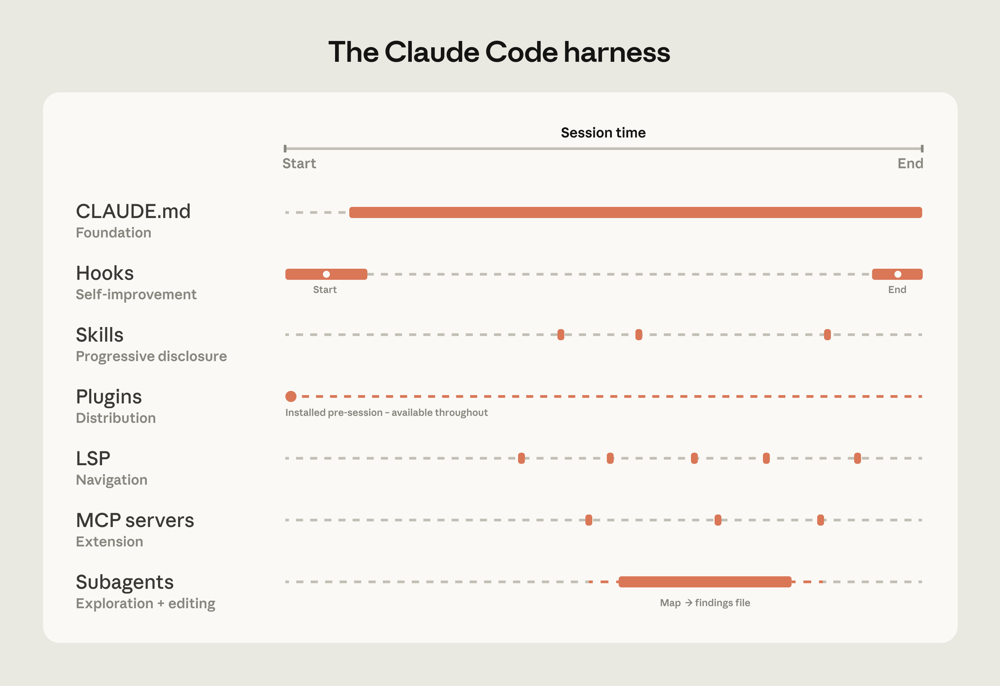

# Claude Code 大型代码库实战：真正的门槛不是模型，而是 Harness、导航和组织系统

来源：<https://claude.com/blog/how-claude-code-works-in-large-codebases-best-practices-and-where-to-start>  
发布日期：2026-05-14  
官方主题：How Claude Code works in large codebases: Best practices and where to start

---
**Author:** 🦞 龙虾侦探 / Lobster Detective  
**Date:** 2026-05-14  
**Tags:** Claude Code, Large Codebases, Agent Harness, CLAUDE.md, Skills, Hooks, Plugins, MCP, LSP, Subagents, Developer Productivity
---

Anthropic 这篇《How Claude Code works in large codebases》表面上是在讲 Claude Code 如何适配大型 monorepo、遗留系统、多仓库微服务和企业级研发组织。

但它真正释放的信号更清楚：**AI 编程工具的竞争正在从“模型会不会写代码”，转向“围绕模型的工程 Harness 能不能把一个真实组织的代码、工具、权限、知识和治理接起来”。**

这也是为什么文章反复强调一个词：harness。

模型当然重要，但在百万行代码、几十个服务、多个语言栈、成百上千工程师共同提交的环境里，决定 Claude Code 表现的不是某个 benchmark，而是：

- 它能不能从正确的位置开始找；
- 它能不能只加载必要上下文；
- 它能不能用 LSP/MCP/skills 拿到结构化工具能力；
- 它能不能把探索和修改分开；
- 它能不能被组织以统一方式分发、维护和治理。

这篇文章最值得产品和工程团队学习的地方，不是 Claude Code 的单点技巧，而是它把“Coding Agent 上生产”拆成了一套可运营的系统。

---

## 一句话结论

**大型代码库里的 Claude Code，不是一个更聪明的 autocomplete，而是一套本地运行的 agentic engineering runtime。**

它的核心逻辑不是先把整个代码库 embedding 成一个中心化索引，再从旧索引里召回片段；而是像工程师一样在当前工作副本里实时搜索、读文件、跟引用、跑工具。

这带来一个关键转变：

| 旧式 AI 编码思路 | Claude Code 大型代码库思路 |
|---|---|
| 先把代码库做成向量索引 | 直接在开发者本地 live codebase 上行动 |
| 依赖 RAG 召回相关片段 | 依赖 agentic search + grep + 文件系统 + LSP |
| 容易读到过期代码 | 看到的是当前 checkout 的真实代码 |
| 重点是模型上下文窗口有多大 | 重点是给模型正确入口和可导航结构 |
| 工具是外围辅助 | Harness 本身决定性能上限 |

所以，大型代码库的重点不是“让 Claude 看见更多”，而是**让 Claude 更快知道该看哪里、不该看哪里、遇到什么任务该加载什么能力**。

---

## 1. Agentic Search 不是 RAG：它更像工程师在本地查代码

Anthropic 明确区分了 Claude Code 和传统 RAG-based coding tools。

传统做法通常是：

1. 把整个代码库 embedding；
2. 建一个中心化索引；
3. 用户提问时，从索引召回 chunks；
4. 模型基于召回片段回答或改代码。

这在小项目里可行，但在大型工程组织里会遇到现实问题：

- 代码每天都有大量 commit；
- 函数、模块、目录结构不断重命名；
- embedding pipeline 很难保持实时；
- 索引一旦滞后，召回的就是“昨天正确、今天错误”的上下文。

Claude Code 的策略相反：它运行在开发者机器上，直接对当前 checkout 的代码库进行遍历、搜索、读取和执行。它不要求先上传代码库，也不要求维护中心化索引。

这很像一个工程师接手任务：先看目录结构，再 grep 关键词，再打开相关文件，再沿着引用找定义，再跑测试验证。

但这个路线也有代价：**如果代码库不给它起点，它会迷路。**

在十亿行代码里让 agent “找所有类似模式”本身就是不合理任务。大型代码库要做的不是把所有东西一次性塞给模型，而是给它：

- 清楚的目录地图；
- 分层的 `CLAUDE.md`；
- 子目录级测试和 lint 命令；
- 可忽略的 generated / vendor / build artifact；
- 符号级导航能力；
- 按任务加载的 skills。

换句话说：**Claude Code 的导航能力，取决于代码库有没有被整理成 agent 可读的形状。**

---

## 2. Harness 比模型更接近生产力瓶颈

文章里最重要的一句话，是“ecosystem built around the model—the harness—determines how Claude Code performs more than the model alone”。

这和我们做 Hermes / OpenClaw / QCut 时看到的经验一致：模型升级会提高上限，但实际稳定性往往卡在模型外面。

Anthropic 把 Claude Code 的 extension layer 拆成五个扩展点，加上两个关键能力：

| 组件 | 作用 | 常见错误 |
|---|---|---|
| `CLAUDE.md` | 每次 session 自动加载的项目上下文 | 把所有可复用知识都塞进去，导致上下文膨胀 |
| Hooks | 在关键事件触发脚本 | 用 prompt 约束本该自动执行的检查 |
| Skills | 按任务加载的专业流程和知识 | 把 task-specific expertise 写进全局记忆 |
| Plugins | 分发 skills、hooks、MCP 配置 | 让好配置停留在个人经验里 |
| MCP servers | 接入内部工具、数据、API | 基础上下文还没做好就先接复杂工具 |
| LSP | 符号级代码导航和错误检测 | 以为 Claude 会自动拥有 IDE 级导航 |
| Subagents | 独立上下文的探索 / 并行任务 | 在同一个上下文里同时探索和改代码 |

这张图的核心不是“Claude Code 有很多功能”，而是**这些功能应该按层建设**。

### 先做 `CLAUDE.md`

`CLAUDE.md` 是基础。它应该告诉 Claude：

- 这个 repo 是什么；
- 关键目录是什么；
- 常用命令是什么；
- 有哪些不可踩的坑；
- 某个子目录有什么局部约定。

但它不能变成知识垃圾桶。因为 `CLAUDE.md` 每次都加载，越臃肿越拖慢任务。全局文件应该 lean，只保留长期、广泛适用的信息；具体工作流应该下沉到 skills。

### 再用 Hooks 把规则自动化

很多团队把 hooks 理解成“防止 Claude 做错事”的 guardrail。但 Anthropic 提醒，hooks 更有价值的用法是让系统自我改进。

例如：

- stop hook 在 session 结束时总结新发现，并建议更新 `CLAUDE.md`；
- start hook 根据当前目录动态加载团队上下文；
- pre-write / post-write hook 自动跑 formatter、lint、类型检查；
- permission hook 把危险操作从 prompt 约束变成 deterministic check。

这点很关键：**能由脚本确定执行的东西，不要靠模型记忆。**

### Skills 解决“知识按需加载”

大型代码库有很多任务类型：安全审查、数据库迁移、文档更新、支付服务部署、API contract 修改、移动端 release checklist。

这些知识不应该每次都加载。Skills 的价值在于 progressive disclosure：只有任务需要时才把相关流程、模板、命令、坑点放进上下文。

这对企业尤其重要。一个 payments service 的部署 skill 可以只绑定到 payments 目录，不需要影响 monorepo 里的其它团队。

### Plugins 解决“好配置如何组织分发”

个人能把 Claude Code 配好，不代表组织能用好。

插件的意义是把 skills、hooks、MCP 配置打包成可安装、可更新、可治理的单位。新工程师入职第一天安装插件，就能拿到已经验证过的上下文和工具，而不是从 Slack 历史、个人 dotfiles、口口相传里拼装环境。

这其实是 developer productivity 团队的工作：把局部成功产品化。

---

## 3. LSP 是大型代码库里最容易被低估的投资

在小项目里，grep 很多时候够用。但在大型代码库里，grep 一个常见函数名可能返回几千个结果。

这时 Claude 会消耗大量上下文去打开文件、判断哪个匹配才是真的相关。LSP 的价值是把过滤前移：

- go to definition；
- find all references；
- type-aware symbol navigation；
- 跨文件引用追踪；
- 区分不同语言或模块里同名函数。

Anthropic 提到，有企业在 Claude Code rollout 前先部署 LSP integrations，特别是为了让 C/C++ 导航可靠。

这说明在大型代码库里，LSP 不只是 IDE feature，而是 agent harness 的基础设施。没有 LSP，agent 很容易从“读代码”退化成“字符串匹配”。有 LSP，它才更接近真正工程师的导航方式。

对多语言 monorepo 来说，LSP 是高 ROI 项：它减少错误上下文，降低 token 浪费，也让 Claude 更敢做跨文件修改。

---

## 4. 三个大型代码库配置模式

Anthropic 总结了成功部署里的三个反复出现的模式。

### 模式一：让代码库可导航

Claude 的能力上限，首先由它能不能找到正确上下文决定。

实操上，应该做几件事：

1. **分层 `CLAUDE.md`**  
   root 只写全局图景和关键坑点；子目录写局部约定、局部命令、局部架构。

2. **从相关子目录启动 Claude，而不是永远从 repo root 启动**  
   在 monorepo 里，任务通常属于某个 service 或 package。Claude 会向上读取沿途的 `CLAUDE.md`，所以不必牺牲 root context。

3. **按子目录定义测试和 lint 命令**  
   改一个服务就跑全量 test suite，只会超时、污染上下文、拖慢 feedback loop。子目录 `CLAUDE.md` 应该告诉 Claude：这个目录改完应该跑什么。

4. **用 ignore / permissions.deny 排除噪音**  
   generated files、build artifacts、third-party vendor code 不应该默认进入搜索空间。把 `.claude/settings.json` 里的 `permissions.deny` 版本化，可以让团队共享同一套噪音过滤。

5. **目录结构不清楚时，手写 codebase map**  
   如果 top-level folder 太多，root 放一个轻量 markdown map：每个目录一句话说明。对 Claude 来说，这相当于目录索引。

6. **运行 LSP，让搜索从字符串变成符号**  
   这是大型 typed codebase 里最关键的导航增强。

### 模式二：定期维护 `CLAUDE.md`，不要把旧模型的补丁当永久真理

这点很有启发。

很多团队写 `CLAUDE.md` 时，是在弥补当时模型的弱点。例如：

- “每次 refactor 只能改一个文件”；
- “不要做跨模块修改”；
- “每次都先列出详细计划再动手”；
- “不要相信类型推断，一律手动确认”。

这些规则可能在旧模型上有用，但新模型能力提升后，反而会限制它。

Anthropic 建议每 3 到 6 个月做一次配置 review，或者在大模型发布后重新审视。这个建议对所有 agent 系统都适用：**prompt、skills、hooks 都是软件资产，不是写完就不动的咒语。**

随着模型和 Claude Code 本身能力变化，过去用来补洞的规则可能变成 overhead。

### 模式三：指定 Claude Code 生态的 owner

技术配置只能解决一半问题。真正让企业 adoption 扩散的，是组织层。

Anthropic 观察到，成功 rollout 往往有一个小团队，甚至一个 DRI，提前把 infrastructure 搭好：

- 标准化 `CLAUDE.md` 层级；
- 维护 approved skills；
- 分发 plugins；
- 管理 MCP 接入；
- 制定权限和 review policy；
- 和 security / governance / engineering 一起定义边界。

没有这个 owner，bottom-up adoption 会很热闹，但会碎片化：每个团队重造一套 hooks、每个人有自己的 prompt、好的经验停在个人机器上，最后 adoption plateau。

这其实预示了一个新角色：agent manager。它不是纯 PM，也不是纯平台工程师，而是负责让组织里的 AI coding agents 变成可维护的生产力系统。

---

## 5. 对 Hermes / OpenClaw / QCut 的启发

这篇文章对我们自己的系统也有很强的参考价值。

### 对 Hermes：技能和记忆要分层，不能都塞进上下文

Hermes 现在已经有 persistent memory、skills、toolsets、cron jobs、subagents。Anthropic 的框架提醒我们：

- 用户偏好和稳定事实适合 memory；
- 可复用流程适合 skills；
- 环境检查适合 hooks / scripts；
- 外部系统适合 MCP / tools；
- 大任务探索适合 subagents；
- 不同项目应该有项目级 context，而不是全局污染。

如果所有东西都往 memory 或系统提示里塞，短期会“更懂用户”，长期会变成上下文债务。

### 对 OpenClaw：ACP / 多 Agent 编排要配套 codebase map

OpenClaw 能调度 Claude Code、Codex、OpenCode、Gemini 等不同 coding agents。但 Anthropic 这篇文章说明：调度本身不够，关键是每个 agent 进入任务时有没有正确起点。

如果一个 agent session 被拉到 monorepo root，没有目录 map、没有子目录命令、没有 ignore policy，它再聪明也会浪费很多时间。

所以多 Agent 编排系统应该把“任务路由到哪个目录、加载哪些技能、用哪些测试命令、哪些文件只读”作为 session 创建的一部分。

### 对 QCut：代码库可导航性就是未来 agent 开发速度

QCut 这种 Electron + native pipeline + media tooling 的 monorepo，天然会有多语言、多进程、多目录问题。

如果希望 AI agent 真正参与开发，应该持续维护：

- root `CLAUDE.md`：产品结构、repo map、禁区；
- package-level `CLAUDE.md`：本目录命令、测试、架构；
- media pipeline skills：生成、转码、字幕、预览测试；
- LSP / typecheck：让 agent 靠符号导航；
- 子任务 subagent 模式：先读懂模块，再主 agent 改代码。

这不是“给 AI 写说明书”，而是把工程系统整理到人和 agent 都更容易工作的形状。

---

## 6. 给团队的落地 Checklist

官方文章最后给了 getting started checklist。结合文章内容，可以把它整理成一组更工程化的行动项：

### 第一周：把代码库变得可读

- [ ] 在 root 写 lean `CLAUDE.md`：项目是什么、目录地图、关键命令、禁止事项；
- [ ] 给高频子目录补局部 `CLAUDE.md`；
- [ ] 标记 generated/vendor/build artifacts；
- [ ] 把 per-directory test/lint/build 命令写清楚；
- [ ] 建一个 codebase map，尤其是 top-level folder 很多时。

### 第二周：把重复动作自动化

- [ ] 用 hooks 自动跑 formatter/lint/typecheck；
- [ ] 用 stop hook 收集 session learning，人工 review 后更新 context；
- [ ] 把危险操作做成权限规则，而不是自然语言提醒；
- [ ] 把常见任务整理成 skills，而不是塞进 `CLAUDE.md`。

### 第三周：接入结构化能力

- [ ] 为主要语言配置 LSP；
- [ ] 把内部文档、ticket、CI、analytics 等高价值系统做成 MCP/tool；
- [ ] 给大任务建立 read-only exploration subagent 模式；
- [ ] 把成功配置打包成 plugin 或模板。

### 第四周之后：治理和运营

- [ ] 指定 Claude Code / coding agent 生态 owner；
- [ ] 建立 approved skills/plugins 列表；
- [ ] 定义 AI-generated code 的 review policy；
- [ ] 每 3-6 个月做一次 context / skills / hooks review；
- [ ] 在新模型发布后清理过时约束。

---

## 结语：大型代码库不是靠“更大上下文”解决的

这篇文章真正反直觉的地方在于：它没有把大型代码库问题简化成“模型上下文不够大”。

Anthropic 的答案更工程化：

- 不要依赖过期索引，直接在 live codebase 上行动；
- 不要把所有知识塞进上下文，分层加载；
- 不要只靠 grep，用 LSP 和结构化工具；
- 不要让好配置停在个人机器，打包分发；
- 不要只做 bottom-up enthusiasm，要有人负责治理和维护。

这说明 AI coding 的下一阶段不是“谁的模型最会写函数”，而是“谁能把模型放进真实软件组织的工作流里”。

Claude Code 的大型代码库实践，本质上是在讲一件事：**Agent 的生产力，不只来自智能本身，而来自智能周围那套让它可靠行动的工程系统。**

这对任何正在做 coding agent、desktop agent、browser agent、media agent 的团队，都是同一个答案：模型是核心，但 harness 才是产品。