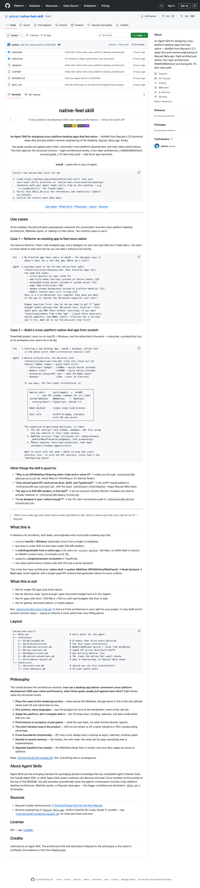

# Native Feel Skill 深度拆解：把 Raycast 的桌面架构经验打包成 Agent 可调用的产品审美

> Repo: [yetone/native-feel-skill](https://github.com/yetone/native-feel-skill)  
> Inspected commit: `d8aaa0c` (`Add Use cases section to README`)  
> Date: 2026-05-14  
> Tags: Agent Skill / Desktop Apps / Native Feel / Raycast / WebView / IPC / Product Engineering

很多跨平台桌面应用的问题，不是“功能不够”，而是用户一打开就觉得它不像本地应用：窗口闪一下、滚动不对、右键菜单像网页、弹窗是 DOM overlay、系统 accent color 不跟随、快捷键和焦点行为怪怪的。这些问题单看都很小，但它们累积起来，就是所谓的“web-y”。

`yetone/native-feel-skill` 有意思的地方在于，它不是一个库，也不是一个 demo app，而是一个 **Agent Skill**：把“如何设计一个跨平台但接近原生体验的桌面应用”这套经验，压缩成 AI agent 可以安装、触发、引用和执行审查的知识包。它的来源也很明确：Raycast 2.0 技术深挖，加上对 `Raycast Beta.app` 实际二进制的 reverse engineering。

换句话说，这个 repo 的价值不在代码量，而在它试图解决一个更高层的问题：**如何把产品审美、架构判断和工程检查项变成 agent 可复用的操作系统。**

## 仓库事实：小，但密度很高

截至本次检查，`yetone/native-feel-skill` 是 MIT 许可仓库，GitHub API 显示约 **598 stars**、**20 forks**，默认分支为 `master`。仓库创建于 2026-05-14，当前 inspected commit 为 `d8aaa0c`，最近提交是 “Add Use cases section to README”。

浅克隆后，排除 `.git`，仓库只有 **13 个文件**：

- `SKILL.md`：Agent Skill 入口，定义触发条件、使用方式和反模式；
- `README.md`：面向人类的介绍、安装方式和用例；
- `references/`：7 个参考文件，约 **1,400 行**；
- `checklists/`：2 个 checklist，约 **262 行**；
- 总文本约 **1,936 行**。

这不是一个“代码工程”，更像一个设计良好的 knowledge artifact。它的结构非常清楚：入口文件负责激活和调度，reference files 负责深层知识，checklists 负责把判断落到可执行审查。

## 它真正包装的不是 Raycast，而是“native feel”这件事

README 的一句话很关键：

> Cross-platform development AND near-native performance — refuse the trade-off.

传统选择通常是三种：

1. **纯 native**：性能和平台一致性好，但 macOS / Windows 两套 UI 要重复实现；
2. **Electron**：跨平台和迭代速度好，但很容易有 web-y 味道；
3. **Tauri / WebView wrapper**：更轻，但如果抽象层遮住了平台能力，native feel 仍然很难做到极致。

这个 skill 给出的答案不是“选某个框架”，而是把边界画在更精确的位置：**native shell → system WebView → Node backend → Rust core**。

它的核心主张是：窗口、热键、系统材质、菜单栏、托盘、文件对话框、可访问性、生命周期这些东西必须交给 native shell；React/TypeScript UI 可以共享，但只应该把 WebView 当成 rendering surface；Node 负责 extension ecosystem、业务逻辑和 AI orchestration；Rust 负责 CPU 热路径、跨平台核心和可共享到移动端/服务端的逻辑。

这不是“用 Web 技术伪装 native”，而是“让 native 负责 native 应该负责的部分，让 WebView 只负责最适合共享和快速迭代的 UI 表面”。

## 最重要的设计：把知识拆成 agent 可路由的模块

`SKILL.md` 的设计非常值得学习。它不是把所有知识塞进一个大 prompt，而是告诉 agent：

- 架构层问题 → 读 `references/02-architecture.md`；
- WebView 闪烁、卡顿、隐藏窗口节流 → 读 `references/03-webview-survival.md`；
- Rust / Swift / C# / TypeScript 之间的类型化 IPC → 读 `references/04-ipc-contract.md`；
- Activity Monitor 显示 400MB 是否真的糟糕 → 读 `references/05-memory-truths.md`；
- 如何不让 UI 像网页 → 读 `references/06-native-conventions.md`；
- Raycast 到底实际 ship 了什么 → 读 `references/07-evidence-raycast.md`；
- 推荐架构前，先跑 `checklists/decision-tree.md`；
- 号称 native feel 前，跑 `checklists/ship-readiness.md`。

这就是 Agent Skill 的正确形态：不是“知识百科”，而是一个小型决策系统。它先识别问题类型，再加载对应 reference，最后输出带约束和 trade-off 的建议。

## 四层架构：真正的重点是 seam placement

`references/01-philosophy.md` 的第一条原则是 “Place the seam at the rendering surface”。这句话是整个 skill 的中心。

跨平台桌面应用最容易犯的错，是在错误的高度画边界：

- 把所有 UI 都做成 native：体验好，但每个功能做两遍；
- 把所有平台能力都藏在跨平台抽象里：开发方便，但系统材质、焦点、热键、窗口生命周期全变成“差一点”；
- 把 WebView 当浏览器：能跑 React，但默认行为会暴露网页味。

这个 skill 选择的 seam 是 WebView rendering surface：

- **WebView 以下**：native shell，分平台写；
- **WebView 以上**：React/TypeScript UI、业务逻辑、扩展体系，尽量共享；
- **性能热路径**：Rust；
- **生态和插件层**：Node。

这个判断很适合 AI 桌面应用、launcher、开发工具、知识管理工具、团队协作工具这类“用户每天长时间使用，而且平台体验很重要”的产品。对于 QCut、Orca 这类 rich desktop / agent workspace，也很有参考价值：问题不只是“Electron 够不够快”，而是哪些 surface 必须靠 OS，哪些 surface 可以靠 Web 技术快速迭代。

## WebView Survival Guide：最像工程宝库的一部分

`references/03-webview-survival.md` 是整个仓库密度最高的文件。它把 WebView 当 native UI rendering surface 时会遇到的真实 bug 逐条列出来：症状、原因、修复方式。

例如 macOS / WKWebView 部分提到：

- 隐藏窗口被 WebKit throttle，导致 hotkey 打开 launcher 的第一帧卡顿；
- `NSWindow.orderFront()` 早于 WebView first paint，导致白/黑闪一下；
- window 扩展高度时，新露出的区域空白一两帧；
- `setFrame(..., animate: true)` 会让 WebView 在窗口动画中暂停绘制；
- 默认 WebView 背景不透明，无法融入 vibrancy / Liquid Glass；
- WebKit 默认右键菜单、link preview、dictionary lookup 会暴露“这其实是网页”；
- DOM tooltip/popover 会被窗口边界裁剪，应该交给 native popover/window。

这些内容很有价值，因为它们不是抽象原则，而是“你真的 ship 一个桌面 app 时会踩到的坑”。很多团队知道要“看起来 native”，但不知道是哪些 5 到 30 分钟的小修复，让用户从“这个像网页”变成“这就是 Mac app”。

## IPC Contract：多运行时系统的脊柱

四层架构的副作用是运行时变多：Swift / C# native shell、WebView/React、Node backend、Rust core。`references/04-ipc-contract.md` 把这件事讲得很直接：如果每条边都手写 serialization 和 type，类型漂移一个 sprint 内就会发生。

skill 推荐的做法是：**one declaration, generated clients**。也就是一个 schema，生成 Swift、C#、TypeScript、Rust 各侧类型。Rust ↔ Swift / C# 推荐 UniFFI；Node ↔ frontend 用 WebKit message handlers 或 WebView2 host objects；Node ↔ Rust 如果需要单独进程，可以用 length-prefixed JSON over stdio 或 gRPC-over-uds。

这个观点很适合 agent 时代的软件架构。因为 agent 会更频繁地改跨边界代码，如果 IPC contract 没有编译期保护，AI 很容易“看起来改对了”，但某个 runtime 的消息 shape 已经漂移。把 schema 变成系统脊柱，本质上是为人和 agent 同时提供护栏。

## Raycast evidence：避免把“经验”变成玄学

`references/07-evidence-raycast.md` 是这个 skill 最重要的可信度来源。它不是只引用 Raycast 的公开博客，而是记录了对 `Raycast Beta.app` 的实际观察：

- Swift + AppKit host shell；
- `libraycast_host.dylib` Rust core，并通过 UniFFI 暴露 `Coordinator`、`EventHandler`、`LogHandler`、`NativeSentryClient` 等接口；
- 多个 WebView HTML entry points：launcher、AI chat、settings、notes、feedback、theme studio、welcome；
- bundled Node runtime 和 backend bundle；
- native `.node` addons、worker threads、SoulverCore.framework；
- Sentry、Updater、accessibility XPC service 等生产级外围组件。

这让 skill 的建议不是“我觉得 Raycast 可能这么做”，而是“这个架构在 shipping artifact 里能看到”。对于 agent skill 来说，这点很关键：好的 skill 不只是总结文章，而是把证据、决策树、反模式和审查项打包在一起。

## 75-item ship audit：把审美变成 checklist

很多产品审美问题很难交给 AI，因为它们不是单一函数 bug，而是“感觉怪”。`checklists/ship-readiness.md` 用 75 个检查项把这个问题拆开：

- 冷启动：热启动/冷启动时间、first paint、初始焦点、无 loading placeholder；
- 窗口与焦点：关闭、最小化、multi-monitor、settings 独立窗口、失焦行为；
- 输入与 cursor：没有 `cursor: pointer`、禁用无意义文本选择、IME、focus ring、Escape 语义；
- 视觉与材质：系统 material、dark mode、accent color、system font、无 CSS window shadow；
- 滚动：平台滚动条、无 smooth scroll、惯性正确；
- 性能：idle memory、typing 无掉帧、隐藏窗口不 throttle；
- 系统集成：URL scheme、文件关联、native save dialog、notifications、auto-update；
- accessibility 和 cross-platform parity。

这就是把“品味”工程化的方式：不要求 agent 凭感觉判断“像不像 native”，而是让它逐项检查可观察行为。对未来的 AI product engineering，这类 checklist 会越来越重要。

## 它的局限

这个 repo 也有明确边界：

- 它不是可运行框架，不能 `npm install` 后自动获得 native feel；
- 它主要基于 macOS + Windows，Linux WebKitGTK 的坑没有同等覆盖；
- 它要求相当高的工程预算：两个 native shell、WebView quirks、Node、Rust、IPC schema、build/release pipeline；
- 如果只是内部工具、单平台 app、小游戏、媒体播放器或 <100ms 冷启动工具，这套架构可能过度；
- Raycast evidence 来自 binary inspection，能证明结构，但不能覆盖所有实现细节和 trade-off。

不过它自己也承认这些限制，并用 `decision-tree.md` 明确告诉 agent：有些项目应该直接用 native、Electron 或更简单的 Web app。这种“会拒绝”的 skill，比一味推荐自己方案的文档更可信。

## Builder 应该学什么

`native-feel-skill` 最值得借鉴的不是某个具体技术，而是三层抽象：

1. **把架构经验变成可安装的 Agent Skill**：让 agent 在合适场景自动调用，而不是每次靠人类重新解释；
2. **把审美判断变成 checklist**：把“像 native”拆成可观察、可审查、可回归测试的行为；
3. **把最佳实践绑定到证据**：Raycast 公开文章 + binary evidence + 反模式 + decision tree，组合起来比普通 blog summary 强很多。

这对所有 AI 产品团队都有启发。未来 agent 不只是帮我们写代码，也会携带某种“产品判断”。但产品判断不能只靠一句“make it feel native”。它需要被拆成原则、架构边界、平台坑、IPC contract、ship audit 和明确的“不适用场景”。

`native-feel-skill` 就是这样一个小而高密度的例子：它把 Raycast 式桌面产品的架构品味，打包成了 agent 可以加载的操作手册。
