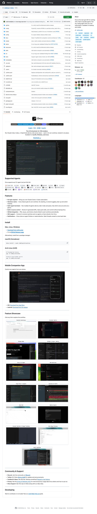

# Orca 深度拆解：AI IDE 的下一层不是聊天框，而是并行 Agent 控制台

> Repo: [stablyai/orca](https://github.com/stablyai/orca)  
> Inspected commit: `f708e57` (`fix: pr-bug-scan validated finding from #1877 (#1891)`)  
> Date: 2026-05-14  
> Tags: Orca / AI IDE / Parallel Agents / Worktrees / Electron / TypeScript / SSH / Mobile Companion

如果把 2024—2025 年的 AI coding 工具粗略分层，第一层是「代码补全」，第二层是「聊天式改代码」，第三层是「把一个 CLI coding agent 放进终端」。Orca 代表的是更靠后的问题：当一个人已经不满足于只跑一个 Claude Code、Codex 或 OpenCode，而是想同时派出一组 agent，真正困难的就不再是模型调用，而是**控制台、隔离、状态、审查和远程执行**。

Orca 的 README 把自己定义为 “The AI Orchestrator for 100x builders”：跨仓库并排运行 Claude Code、Codex 或 OpenCode，每个 agent 在自己的 worktree 里工作，并在一个地方统一跟踪。这个定位听起来像产品口号，但仓库结构说明它并不是一个薄薄的 UI shell。它更像一个本地优先的 agentic development environment：Electron 桌面应用、CLI、SSH relay、GitHub/Linear 集成、移动 companion app、终端与浏览器面板、AI diff review、usage tracking，以及一套面向多 agent 协作的 orchestration 命令。

## 先看几个仓库事实

截至本次检查，`stablyai/orca` 是一个 MIT 许可的 TypeScript 项目，GitHub API 显示约 **2.4k stars**、**162 forks**，默认分支为 `main`，主语言是 TypeScript。仓库创建于 2026-03-17，但已经有 **1,892 commits**，说明它处在非常高频的产品迭代状态。

我用浅克隆检查了 `f708e57` 这一版。排除 `.git`、`node_modules`、`dist/out/build` 等目录后，仓库约有 **1,971 个文件**。其中 `.ts` 文件 **1,447** 个，`.tsx` 文件 **313** 个，Markdown **29** 个。文本/代码行数粗略统计约 **472k 行**，其中：

- `src/`：约 **408k 行**，是主要桌面端与运行时实现；
- `mobile/`：约 **32k 行**，对应移动 companion app；
- `tests/`：约 **8.9k 行**，包含 Playwright/Electron E2E 测试；
- `docs/`：约 **3.7k 行**，含多语言 README、style guide 与设计文档；
- `skills/`：约 **987 行**，说明项目本身也在沉淀 agent-facing 工作流。

这组数字不应该被当成精确 LOC 榜单，但足够说明一点：Orca 不是「一个终端套壳 + 几个按钮」，而是一个相当完整的本地桌面开发产品。

## 产品核心：把 agent 从“会话”变成“工位”

多数 AI IDE 仍然把 agent 当作一段聊天或一个 terminal session。Orca 更有意思的地方在于，它把 agent 当作一个可以被分配、隔离、观察和回收的「工位」。README 里最关键的功能不是“支持 Claude Code / Codex”，而是这些组合：

- **Worktree-native**：每个功能/任务拥有自己的 Git worktree，减少 stash、切分支和互相覆盖；
- **Multi-agent terminals**：多个 AI agent 可以并排运行在 tabs 和 panes 中，并显示活跃状态；
- **Built-in source control**：在应用内审查 AI 生成的 diff、编辑并提交；
- **GitHub integration**：PR、issues、Actions checks 与 worktree 自动关联；
- **SSH support**：连接远程机器，在远端直接运行 agents；
- **Mobile companion app**：从手机控制 agents。

这套组合背后的判断是：未来的 coding agent 不会只以“一个聊天窗口”存在，而会像一组后台工人。人类的工作不再是逐字给模型发 prompt，而是管理一组并行任务：哪个任务在哪个分支，哪个 agent 卡住了，哪个 diff 需要 review，哪个远端环境还活着，哪个任务应该被合并或丢弃。

## 架构层：Electron UI + 本地运行时 + CLI + Relay

从 `package.json` 看，Orca 是一个 Electron + React + TypeScript 应用：`electron-vite` 负责桌面端构建，React 19 和 shadcn/radix 风格组件负责 UI，`node-pty` 与 `@xterm/*` 负责终端，`better-sqlite3` 负责本地状态，`simple-git` 与 GitHub/Linear SDK 处理开发平台集成。

目录结构可以大致拆成几层：

1. **`src/renderer/src`**：桌面 UI。这里有 sidebar、tab bar、terminal pane、status bar、settings、stats、browser、markdown/editor 等组件。也就是说，Orca 不只是启动终端，而是把终端、浏览器、文件、状态和 diff review 都做成同一个 workspace 的可组合面板。
2. **`src/main`**：Electron main process 与本地运行时能力。这里处理 window、IPC、SSH、telemetry、updater、providers、agent hooks、port scanning、worktree 与文件系统能力。
3. **`src/shared`**：跨进程共享的类型、协议、状态 schema 与 agent 枚举。`agent-kind.ts` 明确把 Claude、Codex、OpenCode、Gemini、Hermes、Goose、Cursor、Qwen Code 等 agent 映射到 telemetry kind，说明 Orca 的设计目标是支持一个不断扩展的 CLI agent 生态，而不是绑定单一模型供应商。
4. **`src/cli`**：命令行控制面。除了常规 repo/worktree/terminal/browser 命令外，`src/cli/specs/orchestration.ts` 里已经有 `orchestration send/check/reply/inbox/task-create/task-list/task-update/dispatch/ask/run/gate-create/gate-resolve` 等命令。这是一个很关键的信号：Orca 不只是 GUI，它试图让 agent 编排本身可以被脚本化。
5. **`mobile/`**：移动 companion app，让人可以在离开桌面时继续观察或控制 agents。

这几层加起来，形成的是一个本地 agent control plane：UI 是控制面，worktree 是隔离单元，terminal/pty 是执行面，Git/GitHub/Linear 是交付面，SSH relay 是远端扩展面，CLI orchestration 是自动化接口。

## SSH 不是附加功能，而是产品边界

很多桌面 AI coding 工具默认只考虑本地机器。Orca 仓库里的 `AGENTS.md` 明确要求：所有改动都要考虑 SSH use case，不能假设 local-only execution。`src/main/ssh/ssh-relay-session.ts` 也显示，SSH relay session 不是简单地 `ssh user@host` 打开终端，而是有 session state、multiplexer、provider registration、relay version mismatch、port scanning、agent hook relay、remote filesystem/git/pty provider 等机制。

这说明 Orca 对「远程运行 agent」的理解比较工程化：远程不是一个特殊 terminal，而是本地控制台背后的另一类执行 provider。对于真正使用 AI agent 的团队来说，这点很重要。因为 agent 经常需要跑测试、构建、浏览器、GPU、私有网络或更稳定的 Linux 环境；把所有事情塞在用户本地 laptop 上，既不稳定，也不易审计。

## CLI Orchestration：最值得关注的隐藏层

README 展示的是用户可见功能，但 `src/cli/specs/orchestration.ts` 更能说明 Orca 的长期方向。这里的命令包括：

- `orchestration send/check/reply/inbox`：agent 间消息；
- `task-create/task-list/task-update`：任务状态机；
- `dispatch/dispatch-show`：把任务派发给某个 terminal/agent；
- `ask`：阻塞式向 coordinator 提问；
- `run/run-stop`：启动或停止 coordinator loop；
- `gate-create/gate-resolve/gate-list`：决策门控。

这已经接近一个轻量级多 agent 调度系统。它不是只把多个 terminal 平铺出来，而是开始给「任务、消息、决策门、派发、回执」建模。对 builder 来说，这层最值得借鉴：当 agent 数量从 1 个变成 5 个、10 个时，UI 布局不是唯一问题，真正的问题是如何定义任务生命周期和人类介入点。

## 为什么 worktree 是正确的隔离原语

很多 agent orchestration 系统会先发明一套复杂的沙盒或数据库状态。但对 coding agent 来说，Git worktree 是一个非常实用的中间层：它足够轻量，天然绑定 branch/diff/commit，又能让多个 agent 在同一个 repo 的不同工作区并发改代码。

Orca 把 worktree 作为一级概念，就等于把 agent 的工作产物直接落在开发者已经理解的版本控制模型里。这样做有几个好处：

1. **隔离冲突**：不同 agent 不会直接覆盖同一个 working directory；
2. **审查自然**：结果天然以 diff/commit/PR 形式出现；
3. **失败可丢弃**：一个 worktree 跑偏了，可以删除，不污染主分支；
4. **并行可扩展**：多个任务可以同时推进，人类只在 review 阶段收敛。

这也是为什么 Orca 与普通“AI chat in IDE”的差异很大。它不是围绕 conversation 组织产品，而是围绕 change set 和 workspace 组织产品。

## 质量信号：测试、设计系统与跨平台约束

仓库的测试目录覆盖了 worktree lifecycle、terminal panes、terminal output scheduler、dead terminal stress、SSH localhost、browser tab、file open、source control discard confirmation、resource usage warm reattach 等场景。`AGENTS.md` 还规定 UI 必须遵守 `docs/STYLEGUIDE.md`，跨平台快捷键不能硬编码 `metaKey`，路径必须使用 `path.join` 或 Node/Electron path utilities。

这些细节说明项目正在面对产品级复杂度：Electron 跨平台、终端生命周期、远程 relay、agent hook、状态持久化、移动端连接、diff review，每一项都容易产生边缘 bug。Orca 的仓库里有大量 recent fix、bug-scan validated finding、entitlements、Windows EPERM 等提交，也说明它正在经历真实用户场景的打磨。

## 局限与风险

Orca 的方向很清晰，但这类产品也有几个天然难点：

- **复杂度会快速上升**：一旦同时支持多 agent、多平台、SSH、移动端、GitHub/Linear、浏览器和终端，稳定性比功能数量更重要。
- **BYO subscription 降低进入门槛，也转移了账号/配额/鉴权复杂度**：用户自己的 Claude/Codex/OpenCode 订阅意味着 Orca 不用做统一推理层，但必须处理本地 CLI、登录状态、用量、错误恢复。
- **多 agent 编排需要更强的语义层**：terminal grid 只是第一步，长期还需要任务依赖、结果评分、自动合并策略、失败回滚和人类审批。
- **安全边界会更敏感**：agent 能跑命令、访问 repo、连接远端、读写文件，权限、审计和 prompt injection 都会成为核心产品问题。

## Builder 应该借鉴什么

Orca 最值得学习的地方不是“支持多少个模型”，而是它选择的产品抽象：

- 用 **worktree** 作为 agent 工作隔离单元；
- 用 **terminal/pty + providers** 保持对现有 CLI agent 生态的兼容；
- 用 **source control review** 把 AI 输出接回软件工程闭环；
- 用 **SSH relay** 把本地 UI 和远端执行解耦；
- 用 **CLI orchestration** 给未来自动化留下接口；
- 用 **移动 companion** 承认 agent 工作流会跨设备、跨时间运行。

这也是 AI IDE 竞争的一个信号：下一层壁垒不只是更强的补全或更漂亮的 chat panel，而是谁能把「一群 agent 在真实代码库里并行工作」这件事变成可控、可审查、可恢复、可远程运行的日常系统。

Orca 还在快速迭代，但它已经把问题问对了：当 coding agent 不再是单个助手，而是一支小队时，开发者真正需要的是一个控制台。
