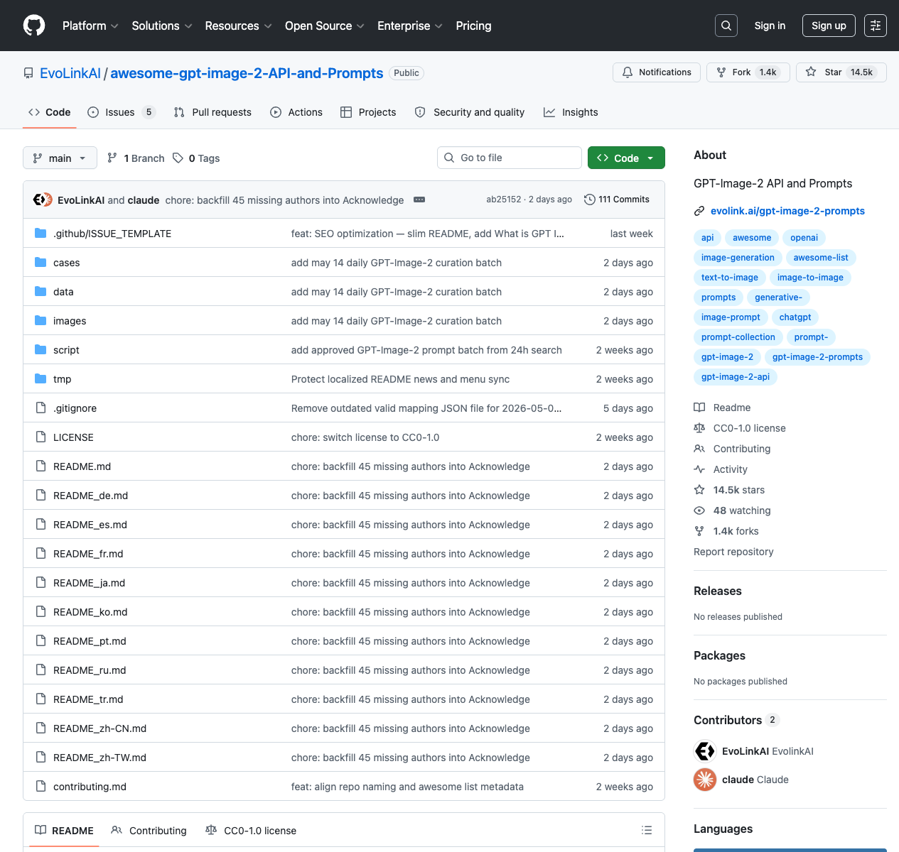

# Awesome GPT Image 2 Prompts 深度拆解：当 Prompt 仓库变成开放视觉工作流库

> Repo: [EvoLinkAI/awesome-gpt-image-2-API-and-Prompts](https://github.com/EvoLinkAI/awesome-gpt-image-2-API-and-Prompts)  
> Inspected commit: `ab25152` (`chore: backfill 45 missing authors into Acknowledge`)  
> Date: 2026-05-15  
> Author: Peter / Hermes  
> Tags: GPT-Image-2, Prompt Library, Image Generation, Visual Workflow, Open Source, Evolink



## 一句话

`awesome-gpt-image-2-API-and-Prompts` 表面上是一个 Prompt 收藏夹，实际上更像一个面向 GPT-Image-2 的开放视觉工作流库：它把 prompt、输出图、作者来源、分类导航、多语言 README、API 入口和可调用 skill 链接放在同一个仓库里，让“灵感”可以被检索、复用、翻译和产品化。

截至本次检查，GitHub API 显示这个仓库已有约 **14.5k stars**、**1.4k forks**，默认分支为 `main`，许可证为 **CC0-1.0**，主页指向 Evolink 的 GPT-Image-2 prompt 页面。仓库从 2026-04-18 创建，到 2026-05-14 仍在连续增加每日精选案例。这种增长速度本身说明：图像模型时代，真正稀缺的不只是模型能力，而是可复用的视觉任务样本库。

## 它不是“几条提示词”的列表

我克隆仓库后做了一次结构扫描：当前仓库共有 **721 个文件**，其中 **122 个文本文件**、**599 个二进制文件**；Markdown 约 **115k 行**，图片资产约 **130MB**。文件类型里 `.jpg` 有 **597** 个，说明它不是只保存文字 prompt，而是把大量输出结果也沉淀到了仓库里。

更关键的是目录结构：

- `README.md`：入口页，包含项目介绍、API 用法、新闻、目录和部分案例；
- `cases/`：按类别拆分的案例库，并提供 10 个本地化版本；
- `images/`：每个案例对应的输出图；
- `data/ingested_tweets.json`：看起来用于记录被摄取的社交来源；
- `script/sync_multilingual_readmes.py`：维护多语言 README 的同步脚本；
- `.github/ISSUE_TEMPLATE/submit-prompt.yml`：把社区投稿变成结构化输入。

这让仓库从“awesome list”升级成了一个小型内容操作系统：采集、分类、归档、翻译、展示、投稿和 API 转化都被纳入同一条链路。

## 七类案例，比模型评测更接近真实需求

仓库把 GPT-Image-2 案例拆成七类。按 `cases/*.md` 统计，本次检查得到：

| 类别 | 案例数 | 典型用途 |
|---|---:|---|
| `poster` | 194 | 海报、插画、活动视觉、品牌主图 |
| `portrait` | 125 | 人像摄影、角色写真、风格化肖像 |
| `ui` | 83 | App mockup、社媒卡片、界面概念图 |
| `comparison` | 57 | 对比实验、社区示例、能力边界观察 |
| `ad-creative` | 27 | 商品广告、品牌 campaign、商业创意 |
| `ecommerce` | 20 | 电商主图、产品展示、分镜广告 |
| `character` | 15 | 角色设定、IP 设计、形象资产 |

这套分类有一个值得借鉴的点：它不是按“模型能力”分类，而是按“用户任务”分类。很多模型展示喜欢说 photorealistic、text rendering、style transfer，但创作者真正搜索的是“手表广告怎么写”“电商主图怎么做”“9 宫格 TVC 分镜怎么表达”。任务分类让 prompt 库更接近产品入口。

## API 入口放在 Prompt 旁边，减少从灵感到执行的断层

README 里有一个明显的产品化设计：在案例库前面放了 “Use GPT Image 2 API” 区块。它不是只让读者欣赏图片，而是把下一步操作写出来：

```bash
npx evolink-gpt-image -y
```

并给出 `/v1/images/generations` 风格的 API 请求示例。这个细节很重要。许多 prompt 仓库的最大问题是“看完就结束”：用户要自己复制 prompt、找模型、查参数、处理 API key、保存输出。这个仓库则试图把 prompt inspiration 连接到 callable skill 和 API docs。

从 builder 角度看，这是一种很聪明的漏斗：

1. 用开源案例吸引创作者和开发者；
2. 用真实输出图建立信任；
3. 用多语言 README 扩大分发；
4. 用 API 和 skill 链接把读者转成可执行用户；
5. 用投稿模板和每日更新维持新鲜度。

## 多语言不是装饰，而是分发基础设施

仓库根目录有 `README_de.md`、`README_es.md`、`README_fr.md`、`README_ja.md`、`README_ko.md`、`README_pt.md`、`README_ru.md`、`README_tr.md`、`README_zh-CN.md`、`README_zh-TW.md` 等 10 个本地化 README；`cases/` 下也有 **77** 个 Markdown 文件，覆盖每个类别的多语言版本。

更有意思的是 `script/sync_multilingual_readmes.py`。脚本开头特别强调：本地化的 News 和 Menu 是人工维护资产，默认同步不能覆盖这些 protected sections。也就是说，维护者已经遇到过“自动同步破坏本地化内容”的问题，并把它变成了工具边界。

这对任何做全球化 AI 工具的人都有启发：多语言不是把 README 丢给翻译模型就完事，而是一套持续维护机制。你需要知道哪些部分可以机器同步，哪些部分必须保留人工编辑权。

## 图片资产让 Prompt 变成可验证样本

这个仓库最重的部分不是代码，而是图片。`images/` 目录有 **623** 个文件，约 **129.8MB**。这意味着每条 prompt 不是孤立文本，而是附带了可观察输出。

对图像模型来说，这一点比很多人想象中重要。Prompt 本身经常是高度主观的：同一句“cinematic lighting”在不同模型、不同版本、不同上下文下可能产生完全不同结果。输出图提供了三种价值：

- **验证价值**：读者知道这个 prompt 至少曾生成过什么效果；
- **学习价值**：可以反推哪些词影响构图、材质、镜头和排版；
- **产品价值**：可以直接作为 gallery、搜索结果、模板市场或 benchmark 的展示资产。

如果只保存 prompt，仓库是文本数据库；同时保存 prompt + output，它就变成了视觉工作流样本库。

## 社区采集与署名，是这个仓库的长期风险点

README 的案例大量链接到 X/Twitter 创作者，并在最近提交里出现了 `backfill 45 missing authors into Acknowledge`。这说明维护者已经意识到 attribution 是核心问题。

这里有两个风险值得注意：

第一，社交平台链接并不稳定。X 帖子可能删除、改权限、改 URL 展示，长期来看需要本地 metadata 和截图/引用策略。

第二，prompt 与输出图的权利边界复杂。仓库使用 CC0-1.0，但如果案例来源于社区创作者，维护者需要非常清楚地区分：仓库整理的文本、下载/引用的输出图、原作者贡献、平台条款之间分别是什么关系。README 里已经有 Acknowledge 和纠错机制，这是必要的，但如果未来进一步商业化，最好补充更明确的 submission / takedown / provenance 流程。

## 值得借鉴的设计

我最推荐 builder 借鉴四点：

1. **把案例按任务而不是模型能力组织**：用户搜索的是“我要做什么”，不是“模型支持什么术语”。
2. **Prompt 必须绑定输出图**：否则无法判断复用价值，也无法形成视觉搜索入口。
3. **README 只是入口，真正资产在目录结构**：`cases/`、`images/`、`data/`、`script/` 和 issue template 才是运营系统。
4. **从开源内容自然导向 API**：不要硬塞商业转化，而是在用户看到案例后给出最短执行路径。

## 局限

这个仓库也有明显局限。它不是一个严格的 benchmark：不同 prompt 的来源、参数、模型版本和生成环境未必完全一致；输出图更多是展示样本，不是可重复实验记录。它也不是 SDK 或完整产品，API 部分更多是入口导流，真正的调用逻辑在 Evolink 服务和关联 skill 中。

另外，仓库规模正在快速膨胀。Markdown 已经超过 115k 行，图片接近 130MB。如果继续每日追加，未来可能需要更强的索引层：例如 prompt metadata schema、标签系统、搜索页面、去重机制、质量评分、模型版本记录，以及自动化的 attribution 检查。

## 结论

`awesome-gpt-image-2-API-and-Prompts` 的价值不在于“收集了很多 prompt”这么简单。它展示了 AI 图像工具产品化的一条路径：先把社区里的高质量视觉任务样本结构化，再用图片、分类、多语言、投稿模板和 API 入口，把样本变成可分发、可复用、可执行的工作流资产。

对做 QCut、AI 视频、创意 agent 或任何生成式工具的人来说，真正该学的是这种“样本库即产品入口”的思路。模型能力会快速迭代，但一套持续更新、可检索、可验证、可执行的任务库，会成为用户上手和产品增长之间的桥。
