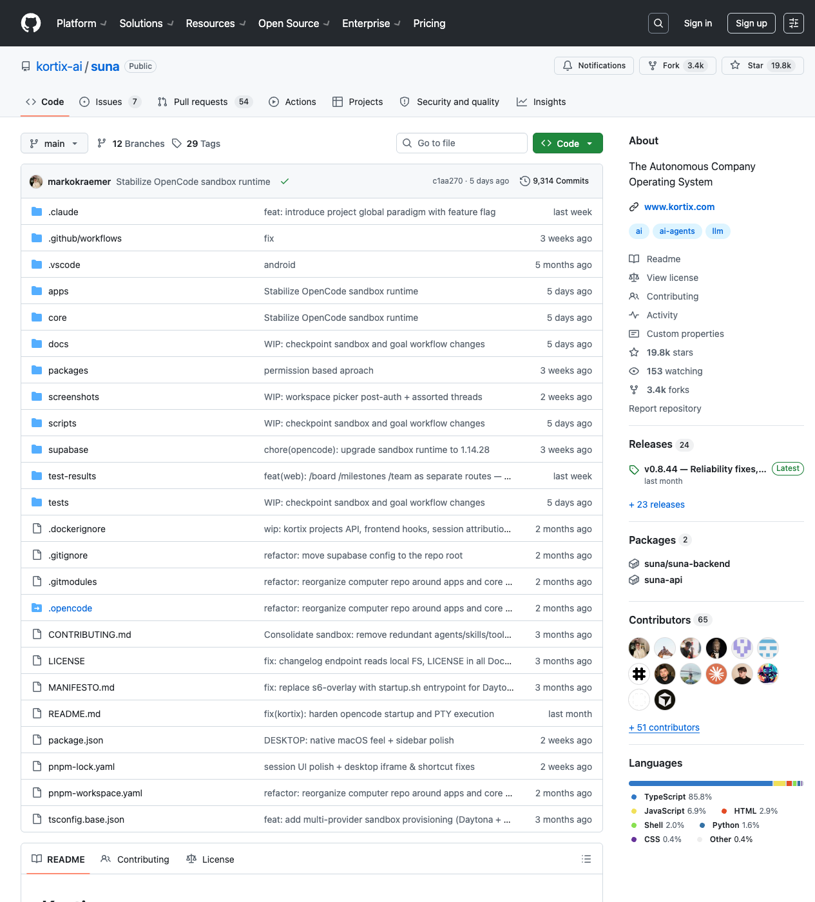

# Suna / Kortix Deep Dive: Moving Agents from Chat Boxes into a Company Computer That Keeps Working

> Repo: [kortix-ai/suna](https://github.com/kortix-ai/suna)  
> Inspected commit: `c1aa270` (`Stabilize OpenCode sandbox runtime`)  
> Date: 2026-05-15  
> Tags: Kortix, Suna, AI Agent, Agent OS, OpenCode, Sandbox, Company OS, Agent Infrastructure

The hard part of agent products is often not reasoning. It is giving the agent a real place to work. Many agents wake up inside a chat box, receive a fragment of context, call a few tools, and then lose most of the working environment when the session ends. `kortix-ai/suna` — whose README now presents the product as Kortix — is interesting because it is not trying to make yet another SaaS chat panel. It is trying to put company operations inside a persistent Linux computer.

The repository describes itself as **The Autonomous Company Operating System**. At inspection time, the GitHub API showed roughly **19.8k stars**, **3.4k forks**, TypeScript as the primary language, `main` as the default branch, and a non-fork public repository created on 2024-10-05 with recent activity in May 2026. That traction and codebase size suggest something beyond a concept demo: an agent OS, cloud computer, and company workbench converging into one system.

## The short version

Suna / Kortix is not mainly about making an agent chat. It is about giving agents a durable workplace: Ubuntu/KDE, bash, a filesystem, Docker, the OpenCode runtime, persistent volumes, APIs, web UI, mobile UI, permissions, billing, tunnels, tests, and deployment scripts. Its bet is that the next generation of agent products will not compete only on prompts; they will compete on who can organize context, tools, credentials, files, history, and background triggers into a compounding operating system.

## This is not a small demo repo

The repository is a pnpm monorepo, not a single-page prototype. A local scan produced the following rough numbers:

- about **3,248** total files, including **2,901** text files and **347** binary/media files;
- the largest code surfaces are TypeScript and TSX: about **212k** lines of `.ts` and **285k** lines of `.tsx`;
- `apps/` contains about **2,334** files and **447k** text lines;
- `apps/api/` is a **52k-line** Hono + Bun backend monolith;
- `apps/web/` is a **230k-line** Next.js frontend;
- `apps/mobile/` is about **158k** lines, which means the product is not only a desktop web app;
- `core/` is about **120k** lines and carries the sandbox runtime, Docker image, OpenCode state, and desktop services;
- `packages/agent-tunnel/` is about **8.3k** lines for tunnel, remote access, and permission boundaries;
- `supabase/migrations/` includes 31 migration files covering billing, tunnels, sandbox members, invites, access control, and related state;
- `tests/` includes Playwright E2E, shell E2E, and security-audit suites.

The numbers matter because they reveal the real problem scope. Kortix is not merely asking “how do we send a prompt?” It is asking “how do we let agents keep doing real work inside real systems?”

## Six architecture layers

I would read the repository as six layers.

The first is the **product entry layer**. `apps/web` is the main web UI, built on Next.js and a large set of dependencies including the OpenCode SDK, Supabase, TipTap, CodeMirror, xterm, Pipedream, Stripe, and Sentry. This is not a minimal chat UI. It brings sessions, files, terminal, integrations, billing, admin, sandbox, and scheduled tasks into the same control surface. `apps/mobile` and `apps/desktop` show that Kortix is also exploring multi-device access.

The second is the **backend control plane**. `apps/api/src/index.ts` mounts many sub-services into one Hono app: router, billing, platform, sandbox proxy, setup, providers, secrets, integrations, queue, servers, tunnel, teams, admin, OAuth, and access control. The package description calls it a “Unified monolith combining router, billing, platform, cron, and daytona-proxy.” That is a pragmatic early-platform choice: keep the full product loop understandable before splitting boundaries too aggressively.

The third is the **agent runtime layer**. The README explicitly says the agent runtime is [OpenCode](https://github.com/anomalyco/opencode). That choice is important. Kortix is not trying to reinvent the coding-agent kernel. It places OpenCode inside a persistent Linux machine, then adds state, permissions, channels, triggers, UI, and cloud operations around it.

The fourth is the **sandbox / cloud-computer layer**. `core/docker/docker-compose.yml` defines a privileged Docker sandbox exposing Kortix Master, noVNC, Presentation Viewer, Agent Browser Stream, SSH, and a Static Web Server. More importantly, it defines three state zones: `/workspace/` for persistent user work, `/persistent/` for OpenCode DB, secrets, auth, browser profile, and system state, and `/ephemeral/` for runtime files replaced on image update. This is central to an agent OS: before agents can work long-term, the system must know what survives updates, restarts, and migrations.

The fifth is the **connectivity and tunnel layer**. `packages/agent-tunnel`, `apps/api/src/tunnel`, `sandbox-proxy`, `local-preview`, and `preview-ownership` indicate that Kortix is not only a local container. It is dealing with remote sandboxes, preview proxying, device auth, permission requests, and audit boundaries. A company agent has to cross browser, API, file, and remote-service boundaries safely.

The sixth is the **company-operation asset layer**. `MANIFESTO.md` argues that agents, skills, tools, commands, memory, and integrations should be files. `core/docker/general_skill_inventory.json` lists many business skills: account research, audit support, brand voice, campaign planning, contract review, compliance, and more. The interesting part is not that every skill is perfect. The interesting part is the product thesis: company capability becomes installable, inspectable, accumulating text-and-script assets.

## The best design lesson: state separation

Many agent sandboxes fail because state becomes a mess. User projects, agent memory, tool caches, system packages, credentials, and runtime files all mix together. Updates delete things they should not delete, while backups drag along huge irrelevant image layers.

Kortix’s Docker Compose answers this directly:

- `/workspace/`: user code, project files, and user-installed packages;
- `/persistent/`: OpenCode DB, shadow backups, secrets, auth, browser profile, and system state;
- `/ephemeral/`: Kortix server, OpenCode config, services, and metadata that can be replaced on image update;
- `/var/lib/docker` lives in a separate `sandbox_docker` volume so Docker-in-Docker image layers do not pollute the user workspace backup boundary.

This kind of detail says more than a marketing slogan. A 24/7 agent system first needs a clear answer to what persists, what can be rebuilt, and what must never be casually touched.

## Background work needs queues, not just async buttons

`apps/api/src/queue/drainer.ts` is small but revealing. It checks sessions with queued messages every two seconds, verifies that the OpenCode session is idle, calls `prompt_async`, and requeues the message on failure.

This is a simple implementation, but the direction is right. If an agent product depends on an open browser tab, it remains an interactive tool. Once it has background queues, cron/webhook triggers, session-state checks, and retry behavior, it starts to look like a worker. The long internal spec in `docs/kortix-agent-os-framework-cloud-spec.md` makes the wedge more concrete: deploy custom agents as Slack-, schedule-, or webhook-triggered background workers with persistent context, rather than selling an abstract “company brain” on day one.

## Why OpenCode is a strong center

Kortix uses OpenCode not only because it can write code. The README’s deeper argument is that the coding-agent harness — bash, filesystem, scripts, APIs, databases, browser, package managers — is useful for most knowledge work. Finance, operations, research, support, sales, legal, and content workflows often reduce to reading files, querying APIs, editing spreadsheets, writing reports, sending messages, and running scripts.

That is why the architecture is more ambitious than no-code automation. Zapier-style systems wrap actions into fixed blocks. Kortix is closer to handing an agent a Linux machine, letting it write tools, install dependencies, call APIs, generate scripts, and turn the repeated parts into skills. The risk is higher, but so is the ceiling.

## Security and governance are the real product boundary

This system is inherently powerful and risky. The README talks about giving the model every file, every secret, every integration, and every piece of institutional knowledge. If a company really gives that much context and authority to a long-running agent, permissions, auditability, isolation, revocation, and least privilege become core product requirements.

The repository already shows awareness of this. `tests/security-audit/` covers JWT, OAuth2, API keys, CORS, tunnels, preview proxy, cloud access, and webhook HMAC concerns. `packages/agent-tunnel/src/agent/security/` includes a path validator, command validator, and permission guard. The backend includes access control, roles, members, sandbox invites, and member spend caps.

Still, this will likely be Kortix’s hardest challenge. The more it promises “full company context,” the more it must make the default safety model legible: who can see what, who can execute what, which actions require human approval, how credentials are scoped, how agents are isolated from each other, and how audit logs become trustworthy.

## The shift from Suna to Kortix

The repository is still named `suna`, but the README now leads with `Kortix` and frames the product as an open-source operating system for autonomous companies. That looks like a shift from a tool product to a platform product.

The shift makes sense. A single general assistant can be absorbed by model vendors. But a system that deploys, manages, connects, audits, persists, triggers, and coordinates agents is much harder to replace with a model API alone. Its value sits in the harness, state, integrations, and organizational workflow.

## Who should study it

Kortix is worth reading if you are building any of the following:

1. **Agent platforms / Agent OS** — study `core/docker`, `apps/api`, `packages/agent-tunnel`, and Supabase migrations;
2. **AI IDE or coding-agent consoles** — study how `apps/web` wraps OpenCode sessions, files, terminals, and previews;
3. **Enterprise automation / ops agents** — study integrations, queues, scheduled tasks, and the skill inventory;
4. **Remote sandboxes / cloud computers** — study persistent volumes, noVNC, SSH, browser streaming, proxies, and tunnels;
5. **Agent safety and governance** — study security-audit tests, permission guards, access control, and preview ownership.

## Limitations and risks

First, the repository is already large and visibly in motion. External contributors may face a steep comprehension cost.

Second, many capabilities appear to be in a “platform skeleton exists; product experience is still converging” phase. The docs include a large framework/cloud spec, while the README is closer to a manifesto plus quick start than a stable API manual.

Third, privileged sandboxes, full credentials, root access, and long-running agents are powerful but dangerous. The architecture needs extremely clear permissions, isolation, and auditing; otherwise automation will amplify incidents.

Fourth, “a company computer” is a broad product promise. The repository’s own docs point to the healthier wedge: Slack support triage, GitHub maintainers, daily sales research, failed-payment follow-up, Linear triage, and daily ops briefings — measurable background workers before the grand company-brain story.

## Conclusion: the real competition is the agent’s workplace

The most interesting thing about Suna / Kortix is that it moves the center of agent products from “conversation” to “workplace design.” A persistent Linux computer, a runnable OpenCode runtime, a stateful filesystem, a SaaS-connecting backend, a UI that sees desktop/terminal/files/tasks, and background queues/triggers — together, these start to resemble a digital employee.

For builders, the lesson is clear. If you are building the next generation of agent products, do not only ask whether the model can answer. Ask where the agent lives, how it remembers, how it gets tools, how it is triggered, how it recovers from failure, how credentials are isolated, and how humans inspect the work.

The chat box is an entry point, not an operating system. Kortix is trying to prove that a real agent OS should be a company computer that keeps working.
