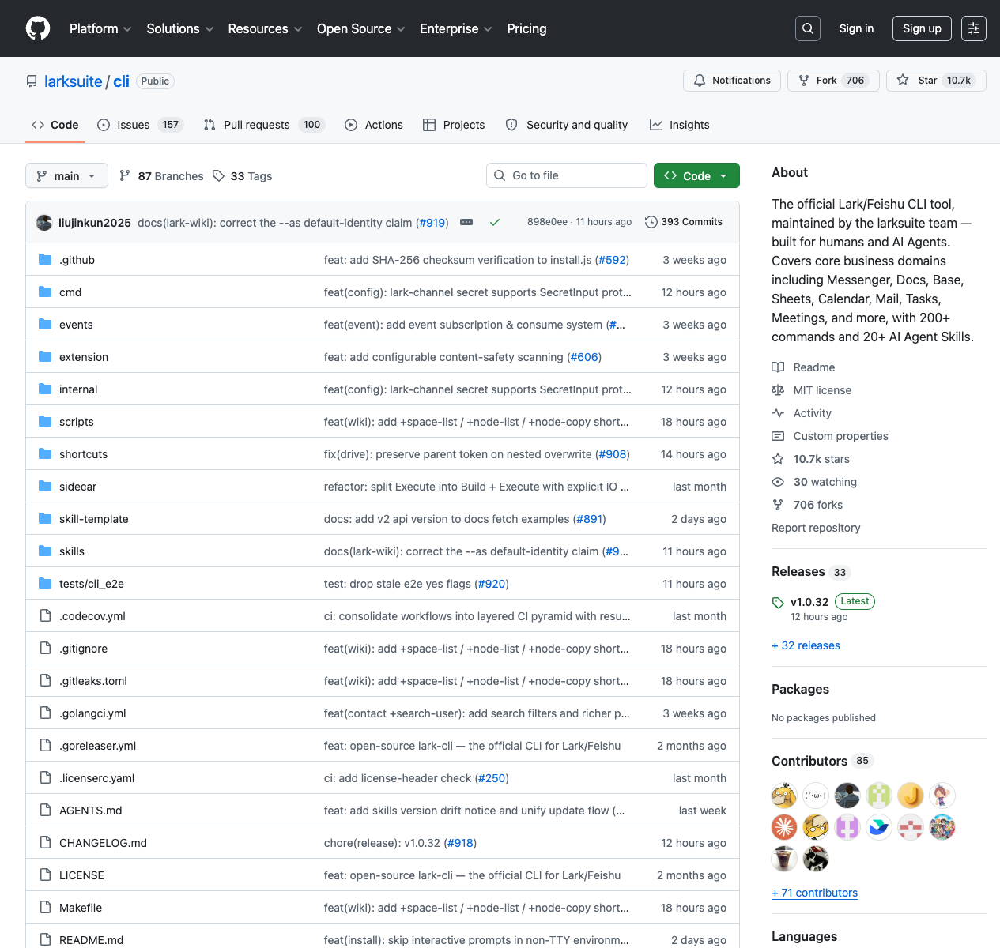

# lark-cli Update Deep Dive: The Official Feishu CLI Is Becoming an Agent-Native Office Control Plane

> Repo: [larksuite/cli](https://github.com/larksuite/cli)  
> Previous coverage: [lark-cli: Official Lark/Feishu CLI with 200+ Commands and 19 AI Agent Skills](../2026-03-31/larksuite-cli-analysis-en.md)  
> Inspected commit: `898e0ee` (`docs(lark-wiki): correct the --as default-identity claim (#919)`)  
> Date: 2026-05-15  
> Author: Peter / Hermes  
> Tags: Feishu, Lark, CLI, AI Agent, Agent Skills, Office Automation, Go, Developer Tools

## Why revisit it now?

I covered `lark-cli` at the end of March, when the headline was: official Feishu/Lark CLI, 200+ commands, 19 AI Agent Skills, and a three-layer command system. A month and a half later, the repository is no longer just a command-line wrapper around Feishu APIs. It is turning into an **agent-native office control plane**.

At inspection time, the GitHub API showed roughly **10.7k stars**, **706 forks**, default branch `main`, an **MIT** license, and **Go** as the primary language. The README now describes support for Messenger, Docs, Base, Sheets, Slides, Calendar, Mail, Tasks, Meetings, Markdown, and more, with **200+ commands** and **24 AI Agent Skills**. A direct scan of `skills/*/SKILL.md` found **25 skills**. The project has clearly moved from “tool plus prompts” toward “CLI plus skill packs plus test harness plus contribution protocol.”

## From 19 skills to 25: not just more domains

The earlier article focused on core office domains such as `lark-calendar`, `lark-im`, `lark-doc`, `lark-sheets`, and `lark-base`. The current repository includes skills such as:

- `lark-shared`: app config, auth, identity switching, scopes, and safety rules;
- `lark-calendar` / `lark-im` / `lark-doc` / `lark-drive` / `lark-sheets` / `lark-base`: core collaboration and data domains;
- `lark-mail` / `lark-task` / `lark-wiki` / `lark-minutes` / `lark-vc`: office workflow domains;
- `lark-event`: WebSocket event subscription and regex routing;
- `lark-whiteboard`: whiteboard and chart DSL rendering;
- `lark-openapi-explorer`: API exploration from official docs;
- `lark-skill-maker`: a framework for creating custom skills;
- `lark-workflow-meeting-summary` / `lark-workflow-standup-report`: higher-level workflow skills.

That matters. If an agent only receives commands, it still has to infer parameters, permissions, recovery paths, and edge cases. If the tool ships skills with the executable, it packages not only what can be run, but also how to use it correctly.

## Repository scale: this is a serious Go CLI project

A scan of the current repository produced these concrete facts:

| Metric | Count |
|---|---:|
| Total files | 1,429 |
| Go files | 992 |
| Markdown files | 328 |
| Go lines | about 229k |
| Markdown lines | about 42.5k |
| `cmd/` | 99 files / about 21.7k lines |
| `internal/` | 281 files / about 42.7k lines |
| `shortcuts/` | 526 files / about 155.6k lines |
| `skills/` | 337 files / about 117k lines |
| `tests/cli_e2e/` | 82 files / about 11.3k lines |

The most important directories are `shortcuts/` and `skills/`. The former wraps Feishu OpenAPI into task-level commands that humans and agents can actually use. The latter is the operating manual for agents. Together, they are the real product surface.

## From a three-layer command system to a five-layer control plane

The previous article described the three command layers: Shortcuts → API Commands → Raw API. The codebase now suggests a fuller five-layer control plane:

1. **Distribution layer**: `package.json` exposes `@larksuite/cli`, supports Darwin / Linux / Windows and x64 / arm64, while `scripts/install.js` handles binary installation and `Makefile` handles Go build/test flows.
2. **Command entry layer**: `cmd/root.go` wires the root command, global flags, notices, strict-mode pruning, and command groups such as `api`, `auth`, `config`, `profile`, `schema`, `event`, and `update`.
3. **Runtime factory layer**: `internal/cmdutil/factory.go` centralizes config, HTTP clients, Lark SDK clients, Keychain access, credential providers, identity resolution, and strict mode.
4. **Business shortcut layer**: `shortcuts/common/runner.go` provides RuntimeContext, identity, tokens, API clients, output formats, scope checks, and file input handling; domain directories implement the real shortcut behavior.
5. **Agent skill layer**: `skills/` and `AGENTS.md` give AI agents usage rules, domain knowledge, test expectations, and error-handling conventions.

This is the reusable pattern: agent-native does not mean adding “AI-friendly” to a README. It means turning command registration, identity inference, permission checks, structured output, tests, and skills into a maintained system.

## AGENTS.md reveals the real product philosophy

The most revealing file is not the README; it is `AGENTS.md`. It explicitly states that the CLI’s primary consumers include AI agents such as Claude Code, Cursor, and Gemini CLI. The code is read by machines. Error messages, output format, and flag design directly affect agent success rates.

The key sentence is:

> every error message you write will be parsed by an AI to decide its next action.

That is almost a manifesto for agent tool design. A human CLI can get away with slightly vague errors because humans can search, infer, and ask for help. For agents, the error message becomes the next planning input. If stderr only says `failed`, the agent guesses. If the error is structured, actionable, and specific to auth, scope, network, or parameter issues, the agent can recover.

The repo encodes this principle in engineering rules: `RunE` functions should return `output.Errorf` or `output.ErrWithHint`, not bare `fmt.Errorf`; stdout is data while stderr is progress, warnings, and hints; file access goes through `internal/vfs`; input paths must be validated before reading.

## `_notice`: non-blocking self-repair hints for agents

`cmd/root.go` contains another interesting design: command execution wires a notice provider that can inject `_notice` into the JSON envelope. There are two notice types:

- `_notice.update`: a newer binary is available;
- `_notice.skills`: locally installed skills are out of sync with the running binary.

Both recommend the same fix command: `lark-cli update`. This is not the usual human-facing “new version available” terminal message. It is a machine-readable repair hint. An agent can decide to update the CLI or sync skills before continuing with stale instructions.

At the same time, `AGENTS.md` documents opt-out variables — `LARKSUITE_CLI_NO_UPDATE_NOTIFIER=1` and `LARKSUITE_CLI_NO_SKILLS_NOTIFIER=1` — and CI is skipped automatically. That boundary is important: nudge the agent toward repair, but do not corrupt automation output.

## Identity and permission handling are the failure surface

The hard part of Feishu automation is not only endpoint count. It is identity and scope: user identity, bot identity, different permissions, default identity, and commands that only support one identity. `internal/cmdutil/factory.go` contains logic for `ResolveAs`, `ResolveStrictMode`, `CheckIdentity`, and `CheckStrictMode`:

- explicit `--as user/bot` wins;
- strict mode can force identity based on credentials;
- auto-detection uses credential hints;
- if the inferred identity is unsupported, the error can tell the agent which identity to use.

For agents, that is essential. A task should not fail halfway through because the wrong identity was selected. If the CLI can say “you are currently bot, but this command only supports user; retry with `--as user`,” recovery becomes straightforward.

## E2E tests are becoming the moat

The repository now has **82 files** under `tests/cli_e2e/`, covering Base, Calendar, Docs, Drive, IM, Mail, Markdown, Minutes, OKR, Sheets, Slides, Task, Wiki, and more. `AGENTS.md` requires dry-run E2E tests for every new shortcut and live E2E tests for new flows or behavior changes. Dry-run tests run without secrets on fork PRs; live tests use CI credentials.

This is pragmatic. Agent tools often fail not at compile time, but because a parameter name is wrong, a scope is missing, a dry-run request shape is incorrect, output format breaks downstream parsing, or a real API’s behavior changed. E2E tests catch those user-facing failures.

Even better, `tests/cli_e2e/cli-e2e-testcase-writer/SKILL.md` is itself a local skill for writing tests. The project has turned “how to test this CLI” into agent-loadable knowledge.

## Security boundaries are product features

The README emphasizes injection protection, terminal output sanitization, and OS-native keychain credential storage. The code includes `internal/validate/path.go` for path validation wrappers, and `Makefile` exposes a `gitleaks` target that first runs `scripts/check-doc-tokens.sh` and then scans for real leaked secrets.

These details are not optional. An office automation agent can touch files, chats, emails, calendars, documents, knowledge bases, and databases. Once it operates on real workspace data, paths, tokens, stdout/stderr separation, permissions, and scopes become product features, not implementation details.

## Lessons for QCut and other agent tools

The strongest lesson from the current `lark-cli` is this: **agent-native tooling is not a choice between MCP server and CLI. It is the combination of executable interface, machine-readable knowledge, verifiable tests, and recoverable errors.**

For QCut or any creative agent interface, several patterns are directly reusable:

1. **Layer the commands.** Use shortcuts for common tasks, keep lower-level APIs for complex tasks, and allow raw calls for edge cases.
2. **Version skills with the binary.** When the tool changes, the agent’s operating instructions must be detectable and syncable.
3. **Make errors parseable.** Do not emit only human stack traces; give agents next actions.
4. **Make dry-run first-class.** Agents should see the request or operation plan before mutating real state.
5. **Organize E2E by business domain.** Test real workflows, not just library functions.
6. **Move safety boundaries forward.** Paths, credentials, scopes, and output channels need explicit protocols.

## Limitations and challenges

The challenges are real. The codebase is already large: `shortcuts/` alone is over 155k lines. Continued expansion will stress the balance between generated code, handcrafted wrappers, and tests. Feishu is also a broad product surface; agent success depends not just on the CLI, but on tenant config, app permissions, user authorization, org policy, and real data state. As the skill count grows, discovery, routing, and version management become harder — agents may load too much context or choose the wrong skill.

But those are productization problems, not toy-demo problems. A toy CLI asks, “can it run?” An agent-native office control plane asks, “can an agent run it reliably in permissioned, real-data, multi-domain workflows?”

## Conclusion

Between late March and mid-May, `lark-cli` has shifted from “official Feishu CLI with 19 Agent Skills” to an office control plane for AI agents. It now combines a Go CLI, npm distribution, a three-layer command system, 25 skills, structured notices, identity resolution, path safety, E2E tests, and an `AGENTS.md` contribution protocol.

The main lesson is not any single command. It is the productization method: make every likely agent failure point — installation, auth, identity, scope, parameters, output, errors, version drift, and testing — into an explicit interface. The next generation of agent tools will not be judged only by how many APIs they expose, but by whether agents can reliably use them in real workflows.
