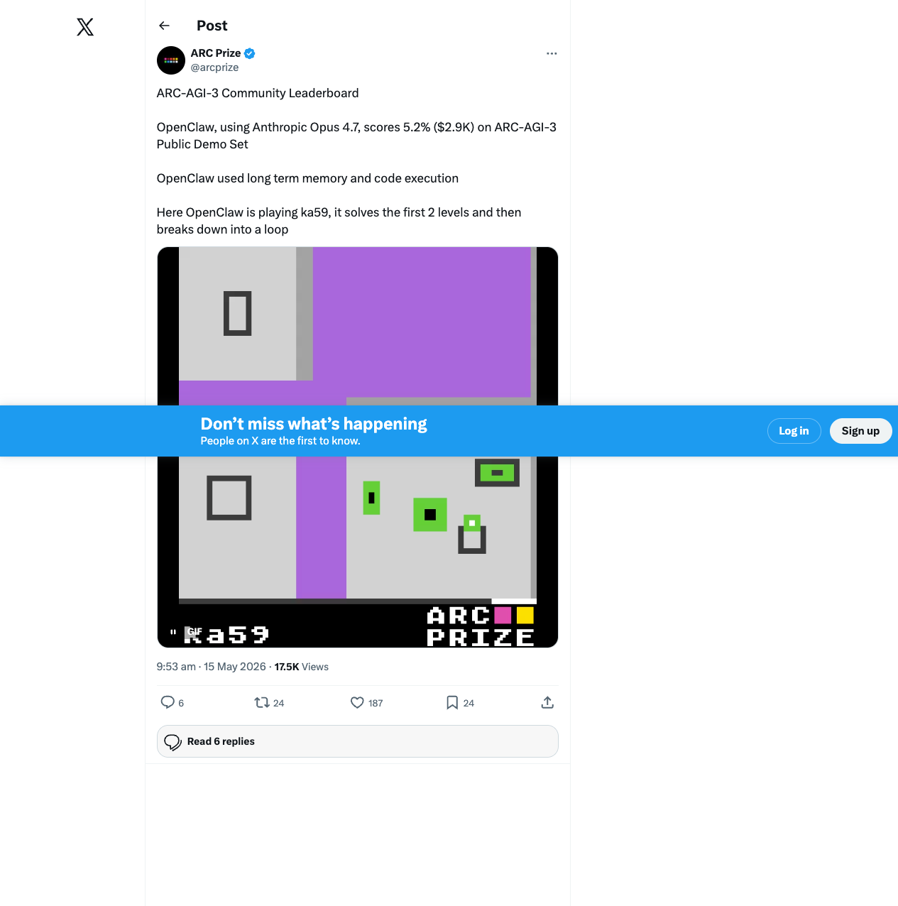
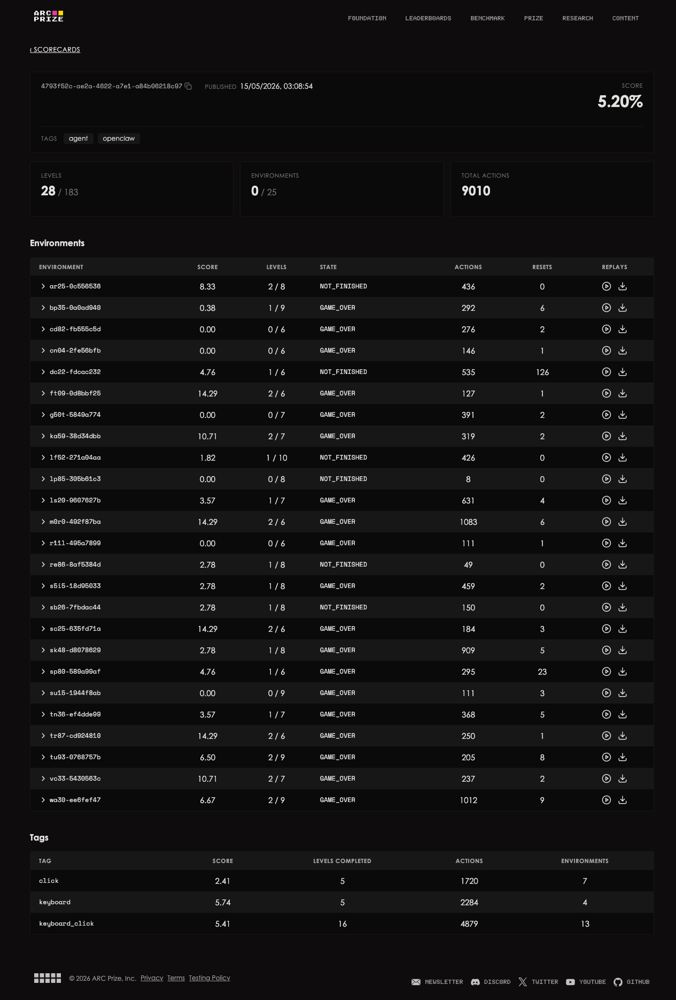

# OpenClaw on the ARC-AGI-3 Community Leaderboard: What a 5.2% Score Really Signals

> **TL;DR:** ARC Prize added OpenClaw to the ARC-AGI-3 Community Leaderboard. Using Anthropic Opus 4.7, the OpenClaw harness scored **5.2%** on the ARC-AGI-3 Public Demo Set at a reported cost of **$2,912**, completing **28 / 183** levels with **9,010** total actions. The score is far from human-level performance, but it matters: ARC-AGI-3 is shifting agent evaluation from “can the model reason?” to “can the full harness learn, remember, act, recover, replay, and control cost?”



**Sources:**

- ARC Prize Community Leaderboard: <https://arcprize.org/leaderboard/community>
- ARC Prize X post: <https://x.com/arcprize/status/2055330785625006270?s=20>
- OpenClaw agent template: <https://github.com/arcprize/ARC-AGI-3-Agents/tree/main/agents/templates/openclaw_agent>
- OpenClaw scorecard: <https://arcprize.org/scorecards/4793f52c-ae2a-4622-a7e1-a84b06218c97>

## 1. What happened

On May 15, 2026, ARC Prize listed **OpenClaw** on the Community Leaderboard. The leaderboard describes it as:

> OpenClaw Harness adapted to play ARC-AGI-3 allowed memory and code execution tools.

The entry shows:

| Field | Value |
|---|---:|
| Benchmark | ARC-AGI-3 |
| Score | 5.2% |
| Cost | $2,912 |
| Date | 2026-05-15 |
| Code | `arcprize/ARC-AGI-3-Agents/agents/templates/openclaw_agent` |
| Scorecard | `4793f52c-ae2a-4622-a7e1-a84b06218c97` |

ARC Prize’s X post adds the most important context: the run used **Anthropic Opus 4.7**, plus **long-term memory** and **code execution**. The post also highlights a replay on `ka59`: OpenClaw solves the first two levels and then breaks down into a loop.

So this is not just another “model climbed a benchmark” story. It is a harness story: a general-purpose agent runtime was adapted to a real interactive AGI benchmark, then measured through replayable action traces.

## 2. Why 5.2% is still worth studying

At face value, 5.2% is low. The scorecard summary is:



| Metric | Value |
|---|---:|
| Score | 5.20% |
| Levels | 28 / 183 |
| Environments | 0 / 25 |
| Total actions | 9,010 |
| Tags | `agent`, `openclaw` |
| Published | 15/05/2026, 03:08:54 |

The per-environment table is more revealing. OpenClaw is not random, but it is not robust either. It often advances one or two levels, yet completes no full environment:

| Environment | Score | Levels | State | Actions | Resets |
|---|---:|---:|---|---:|---:|
| `ar25-0c556536` | 8.33 | 2 / 8 | NOT_FINISHED | 436 | 0 |
| `ka59-38d34dbb` | 10.71 | 2 / 7 | GAME_OVER | 319 | 2 |
| `m0r0-492f87ba` | 14.29 | 2 / 6 | GAME_OVER | 1083 | 6 |
| `sc25-635fd71a` | 14.29 | 2 / 6 | GAME_OVER | 184 | 3 |
| `wa30-ee6fef47` | 6.67 | 2 / 9 | GAME_OVER | 1012 | 9 |

That is exactly the kind of failure ARC-AGI-3 is designed to expose. This benchmark is not a one-shot puzzle. The agent must discover rules inside an unfamiliar interactive game through observation, action, feedback, memory, and strategy repair.

A system can discover a local pattern and still fail over a longer horizon. It can misread reward, repeat a bad strategy, burn the action budget, or get trapped in a loop. The value of this run is not that OpenClaw is already strong; it is that the run exposes the next layer of problems agent builders must solve.

## 3. What the OpenClaw harness actually does

The official `openclaw_agent` is intentionally thin. The real agent loop runs inside the OpenClaw daemon:

```text
ARC main.py / Swarm
    ↓
OpenClaw Python shim
    ↓  OpenAI-compatible HTTP API
OpenClaw Gateway (localhost:18789)
    ↓
Anthropic / OpenAI / Gemini / Ollama
```

This architecture has several practical implications.

### 3.1 The agent loop lives in the OpenClaw daemon

The ARC framework still launches games, manages the swarm, records actions, and evaluates results. OpenClaw provides the gateway, session state, model routing, and agent runtime. That keeps the ARC integration small: each frame becomes a chat-completion-style request, while OpenClaw handles the long-running interaction loop.

### 3.2 Session memory is the central advantage

The README documents that each game passes a session key:

```text
x-openclaw-session-key: arc:<card_id>:<game_id>:<run-id>
```

That lets turns within a game share server-side memory. For ARC-AGI-3, this is not a convenience feature; it is core infrastructure. The agent needs to remember what it tried, which actions changed the state, which colors or regions behaved like obstacles, and which hypotheses failed.

### 3.3 The harness avoids native tool-calling assumptions

The README notes a real compatibility issue: OpenClaw’s `/v1/chat/completions` layer may silently drop the `tools` field for some backends, and this was verified against the Anthropic provider in May 2026. The OpenClaw ARC agent therefore uses a **JSON-in-text protocol** instead of depending on provider-native tool schemas:

```json
{
  "action": "ACTION1",
  "thought": "Player is below the door; moving up should advance.",
  "confidence": 0.8,
  "alternatives_considered": ["ACTION4 to test right wall"]
}
```

This is very close to real production agent engineering. Interfaces are imperfect, providers differ, and robust systems often need conservative protocols, tolerant parsing, and explicit reasoning logs.

### 3.4 The current version serializes the grid as text

The README also says OpenClaw’s compatible API does not document image input, so the grid is serialized as hex text. In other words, this run is not a full multimodal “watch the screen and play” setup. It compresses visual state into text and asks the model to act from that representation.

That limits the ceiling, but it also makes the experiment cleaner: validate memory, action protocol, code execution, and replay traces first; add richer multimodal inputs later.

## 4. Three lessons for agent builders

### First: ARC-AGI-3 evaluates the loop, not just intelligence

Static benchmarks tend to focus attention on the model: better reasoning, longer context, higher pass@k. ARC-AGI-3 evaluates a loop: observe, hypothesize, act, receive feedback, remember, revise, and act again.

That means the model is only one part of the system. The ceiling also depends on state representation, action abstraction, exploration strategy, failure detection, loop detection, cost control, and replay analysis.

### Second: long-term memory is not the same as useful learning

OpenClaw has session memory, but the `ka59` replay mentioned by ARC Prize shows that memory alone does not prevent loops. An agent can remember history and still summarize it incorrectly. It may even become more confident in the wrong strategy.

Useful memory needs structure:

- records of failed actions;
- versioned hypotheses;
- explicit “do not retry” constraints;
- reward and level-transition detection;
- strategy resets when the state stops changing.

### Third: code execution is a tool, not magic

OpenClaw used code execution, but the scorecard still shows many actions spent across the run. For ARC-AGI-3, code execution is most valuable when it turns raw experience into reusable experimental evidence:

- measure state deltas after each action;
- infer passable and blocked regions;
- detect repeated loops in replay logs;
- generate cross-level rule hypotheses.

If code execution merely helps the model describe the current frame, without building a durable world model, the gain will be limited.

## 5. Why this matters for systems like OpenClaw and QCut

This leaderboard entry is useful for anyone building agent infrastructure. OpenClaw did not appear on the board because it is a better chatbot. It appeared because it has a pluggable harness: gateway, sessions, model switching, action protocol, code execution, and logs.

That maps directly to production agent reliability:

- model capability is only the starting point;
- memory must be auditable, or it becomes longer hallucination context;
- tool protocols need fallbacks because providers do not expose identical schemas;
- replay and scorecards are mandatory observability for agent products;
- cost must be analyzed alongside success rate, especially for long-horizon tasks.

A 5.2% score is modest, but it is an honest signal. It says general agents are still early, and it also says exactly where the next engineering work is: memory structure, exploration, loop detection, state abstraction, replay analytics, and cost-aware planning.

## Conclusion

OpenClaw’s appearance on the ARC-AGI-3 Community Leaderboard matters less because of the number and more because of the direction: **agent competition is moving from model leaderboards to harness leaderboards**.

ARC-AGI-3 exposes the gap between “can talk about a task” and “can learn to act in an unknown world.” OpenClaw’s 5.2% shows that long-term memory and code execution can move a general agent a little further into that world, but loops, abstraction, exploration, and cost efficiency remain hard unsolved problems.

ARC-AGI-1 tested static abstraction. ARC-AGI-3 tests whether an agent can enter a world with no manual, try things, remember what happened, revise its theory, and eventually build a reusable policy.

That is where agent systems become truly difficult — and truly interesting.
