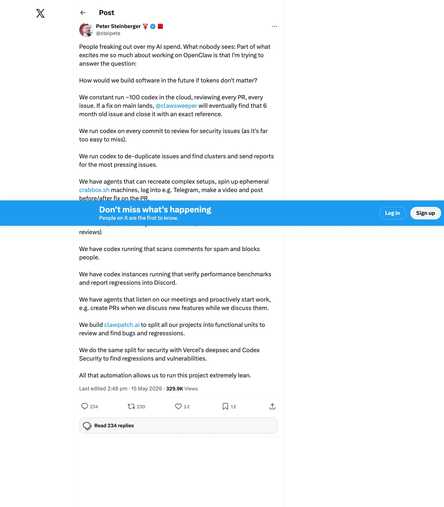
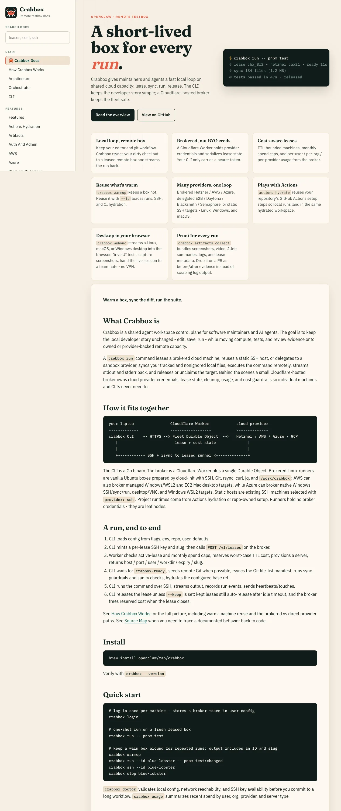
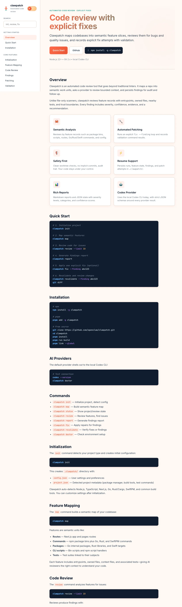

# If Tokens Don’t Matter, How Would Software Teams Organize? OpenClaw’s “100 Codex” Workflow as Agent-Native SDLC

> **TL;DR:** In an X post responding to people “freaking out” over AI spend, Peter Steinberger asked a more important question: **how would we build software if tokens were not the main constraint?** The OpenClaw workflow he describes is not “one chatbot helping with code.” It is an agent-native SDLC: roughly 100 Codex instances running in the cloud across PR and issue review, security checks, issue clustering, spam moderation, performance regression detection, meeting-to-PR automation, Crabbox-based reproduction environments, Clawpatch semantic slicing, and security auditing. The real signal is not token burn; it is a shift in the bottleneck from human attention to scheduling, verification, permissions, spend caps, and audit evidence.



**Sources:**

- X post: <https://x.com/steipete/status/2055405041843052792?s=20>
- Crabbox docs: <https://crabbox.sh/>
- Clawpatch docs: <https://clawpatch.ai/>
- Related article: [[2026-05-10/2026-05-10-crabbox-remote-agent-workspace-control-plane-en|Crabbox: Remote Testboxes and a Workspace Control Plane for Agents]]
- Related article: [[2026-04-30/2026-04-30-clawsweeper-architecture-practical-guide-en|Clawsweeper Architecture Practical Guide]]

## 1. The real question in the post

Peter’s core point is not “we use a lot of AI.” It is this question:

> How would we build software in the future if tokens don't matter?

That framing matters. Most teams today discuss AI coding under immediate constraints: how much one conversation costs, how long inference takes, whether the context window is enough, and whether humans can review the output. OpenClaw is exploring the opposite assumption: if token budget is not the first bottleneck, what shape does software engineering take?

The workflows Peter lists include:

- roughly **100 Codex** instances running in the cloud to review every PR and issue;
- after a fix lands on main, `@clawsweeper` can later find a six-month-old issue and close it with an exact reference;
- Codex runs on every commit to review for security issues;
- Codex de-duplicates issues, finds clusters, and reports the most pressing problems;
- agents recreate complex setups, spin up ephemeral `crabbox.sh` machines, log into services such as Telegram, make before/after videos, and post them to PRs;
- new issues that match the documented vision can automatically become PRs, which another Codex reviews;
- Codex scans comments for spam and blocks users;
- Codex verifies performance benchmarks and reports regressions into Discord;
- meeting-listening agents proactively start work, such as creating PRs while features are being discussed;
- `clawpatch.ai` splits projects into functional units for review, bug finding, and regression detection;
- a similar split is used for security with Vercel’s deepsec and Codex Security.

This is not a list of coding-assistant features. It is a topology for an automated software factory.

## 2. From Copilot to agent swarm

In the traditional Copilot model, the human is the scheduler. A person decides which issue to inspect, which branch to open, which tests to run, when to file a PR, and how to record evidence. AI provides local completion or advice.

The OpenClaw workflow points to a different model:

| Traditional AI coding | OpenClaw-style agent-native SDLC |
|---|---|
| Human starts each task | Agents continuously watch repos, issues, commits, and meetings |
| AI helps write local code | Many agents review, reproduce, cluster, fix, and validate |
| Test environment is local or CI | Ephemeral Crabbox testboxes start per task |
| Results are described in text | Screenshots, videos, logs, JUnit, and benchmark diffs become evidence |
| Review is a human bottleneck | AI performs first-pass triage, dedupe, risk signaling, and candidate PRs |
| Cost is measured per chat | Cost is measured against team throughput and verified outcomes |

The important shift is that AI is no longer confined to the IDE. It is entering the software delivery pipeline itself.

## 3. Crabbox: why “it actually runs” is the substrate for agent software engineering



The post mentions agents spinning up ephemeral `crabbox.sh` machines. Crabbox’s docs describe it as a **shared agent workspace control plane**: keep the local developer story unchanged, while moving compute, tests, and review evidence onto owned or provider-backed remote capacity.

Its basic loop looks like this:

```bash
crabbox run -- pnpm test
# lease cbx_8f2 - hetzner cax21 - ready 11s
# sync 184 files (1.2 MB)
# tests passed in 47s - released
```

Crabbox solves a hard problem in agent deployment: **code suggestions are cheap; trusted reproduction is expensive.**

If an agent is going to automatically work on issues, it cannot merely claim the fix is correct inside a chat context. It needs to:

- lease a short-lived machine;
- sync the dirty checkout;
- run real commands;
- log into required external services;
- collect screenshots, video, JUnit, logs, and lease metadata;
- post before/after evidence back to the PR;
- enforce TTL and spend caps;
- release resources afterward.

That makes Crabbox more than an auxiliary tool. It is the execution substrate for an agent swarm. Without this kind of reproducible testbox, 100 Codex instances could become 100 comment bots with polished explanations and little proof.

## 4. Clawpatch: slicing a repository into units agents can understand



Peter says `clawpatch.ai` splits projects into functional units for review, bug finding, and regression detection. The Clawpatch docs describe a tool that maps a codebase into semantic feature slices, reviews bounded context, and persists findings and fix attempts.

This matters because giving an agent “the whole repo” is usually a low-quality strategy. Clawpatch creates an intermediate layer better suited to agent work:

- **Feature mapping:** routes, commands, packages, CLI scripts, tests;
- **Context boundaries:** entrypoints, owned files, nearby tests, trust boundaries;
- **Findings:** category, severity, confidence, evidence, recommendation;
- **Patch attempts:** fix loops and validation results for each finding;
- **Safety:** clean worktree checks, no implicit commits, audit trail, schema validation.

This is the other side of the “tokens don’t matter” question. Once you can afford many agents running in parallel, the first thing that breaks is not the token bill. It is context organization, task boundaries, and validation state. Semantic slicing answers: how do we turn a repo into dispatchable, auditable, replayable work units?

## 5. The bottleneck moves from tokens to orchestration

If token costs drop by an order of magnitude, software teams will not merely ask ChatGPT more questions. More work will become persistent background loops.

Every scenario in the post can be modeled as a loop:

| Loop | Trigger | Agent action | Output |
|---|---|---|---|
| PR review | New PR / commit | Review code, check security, run tests | Review comment / finding / patch |
| Issue triage | New or old issue | Dedupe, cluster, link to fixes | Report / close reference |
| Reproduction | Bug report | Start Crabbox, reproduce, record | Before/after video, logs |
| Performance | Benchmark run | Compare baseline, find regression | Discord alert / PR comment |
| Meeting-to-code | Product discussion | Detect feature, create PR | Draft PR / issue |
| Security | Code slice / commit | deepsec / Codex Security / threat review | Vulnerability finding / remediation |
| Moderation | New comment | Detect spam, block user | Moderation action |

The hard part is not generating text. It is orchestration: who may trigger a loop, what permissions it receives, how much it may spend, how it retries, how output is verified, how multiple agents avoid conflicts, and where humans intervene.

So the core OpenClaw experiment looks less like a coding chatbot and more like an operating system for a software organization.

## 6. How should “AI spend” be measured?

The public discussion tends to focus on token bills, but that may be the wrong metric. For an agent-native team, better metrics are:

- how many valid issues are closed per dollar;
- how many security regressions are prevented per dollar;
- how much reviewer time is saved per dollar;
- how many performance regressions are caught early;
- how much AI output reaches a verified state rather than remaining a comment;
- how many candidate PRs are actually worth human review.

If a background Codex spends money and produces noise, it is waste. If it reproduces a bug, generates evidence, links an old issue to a fix, triggers a security review, and reduces human context switching, it looks more like DevOps, QA, and AppSec automation than chat cost.

That is why Peter concludes that “all that automation allows us to run this project extremely lean.” Lean does not mean fewer tokens. It means fewer people, fewer handoffs, less waiting, and fewer missed problems.

## 7. Risks: agent swarms are not free lunch

This mode is powerful, but it has obvious risks:

1. **Cost runaway:** 100 agents without TTLs, spend caps, and priority queues can burn through budget quickly.
2. **Permission sprawl:** agents that log into Telegram, edit issues, open PRs, or block users need fine-grained permissions and audit trails.
3. **Noise explosion:** automated review without confidence, dedupe, or severity gates can make humans busier.
4. **Verification theater:** agents claiming a fix is correct is not the same as evidence; this is why systems like Crabbox matter.
5. **Supply-chain risk:** automated scanning, patching, and PR creation must constrain destructive operations and secret exposure.
6. **Operational dependency:** once a team relies on background agents, an agent outage becomes an engineering-process outage.

In other words: when tokens stop being scarce, governance becomes scarce.

## 8. Lessons for QCut / OpenClaw-style products

This post is relevant to every agent product:

- do not only build an agent that can answer; build one that can listen to events, start environments, produce evidence, and write back to systems;
- do not only optimize prompts; optimize task slicing, state persistence, permission boundaries, spend caps, and verification loops;
- do not treat AI review as a single comment; make it resumable, deduplicated, clustered, and auditable;
- do not let agents merely write patches; require proof: logs, screenshots, recordings, benchmark diffs, and issue references;
- do not ignore the human-agent interface: Discord, GitHub, meetings, PRs, issues, and docs are all control surfaces for the swarm.

## Conclusion

Peter’s post is valuable because it moves the discussion from “is this AI bill scary?” to “how does a software organization restructure when inference becomes cheap enough?”

OpenClaw’s answer appears to be: turn agents into continuously running software engineering labor, and connect repos, issues, PRs, CI, meetings, test environments, security review, and Discord into one automation plane. Crabbox provides reproducible execution environments, Clawpatch provides dispatchable semantic slices, Clawsweeper connects issues to fix history, and Codex / Codex Security / deepsec become parallel cognitive workers.

This is not simply “using AI to write code.” It is designing a software company for a token-cheap world.
