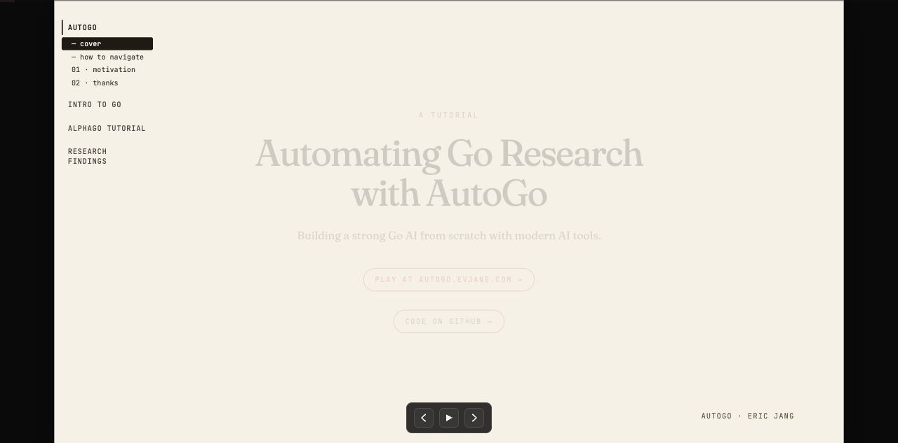
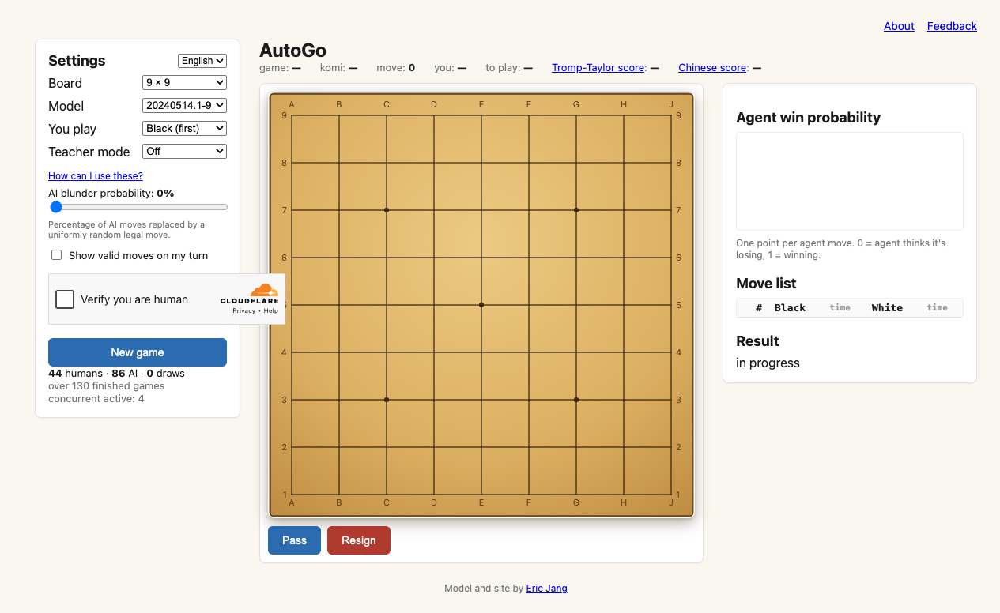
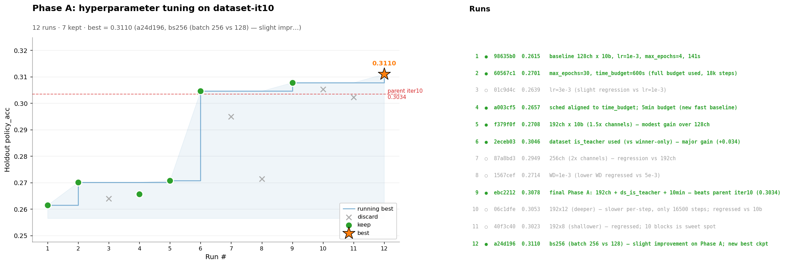
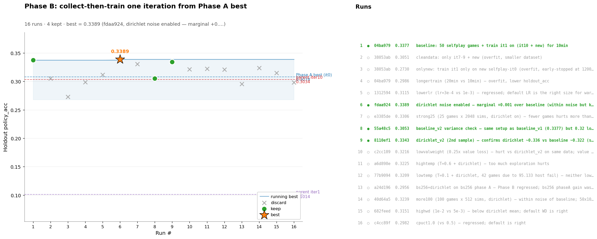
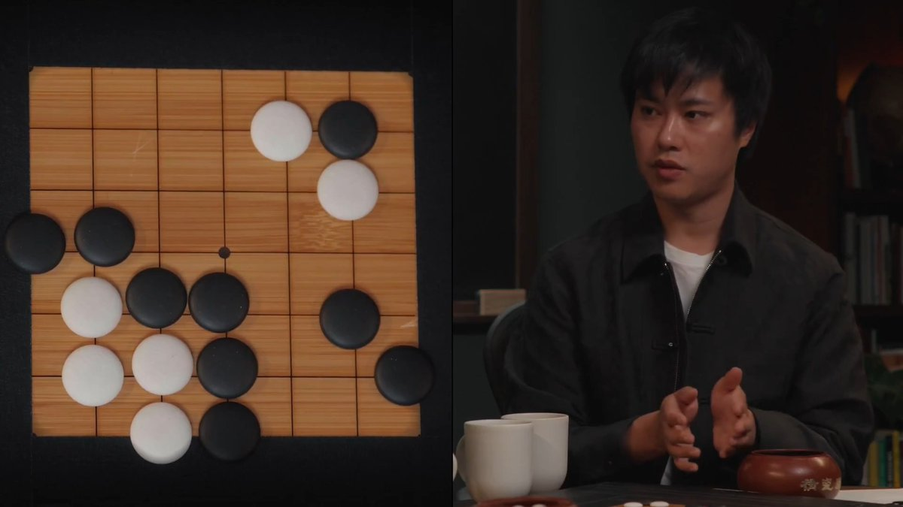

# AutoGo 深度拆解：重写 AlphaGo 不是怀旧，而是在训练自动化 AI 研究员

> Source: [Eric Jang on X](https://x.com/ericjang11/status/2055359839371772356), [AutoGo Tutorial](https://evjang.com/2026/04/28/autogo.html), [ericjang/autogo](https://github.com/ericjang/autogo), [Playable AutoGo](https://autogo.evjang.com)  
> Date: 2026-05-16  
> Author: Peter / Hermes  
> Tags: AutoGo, AlphaGo, AI Research Automation, Go, MCTS, Self-Play, Claude Code, Agent Harness

Eric Jang 发的这条 X 表面上是在说一件很“复古”的事：他花了几个月，从零实现了一个 AlphaGo。2016 年 AlphaGo 代表的是深度学习时代的经典突破；到 2026 年，重新做一遍似乎已经不是 frontier research。

但 AutoGo 真正有意思的地方恰恰不在“又做了一个围棋 AI”，而在它把 AlphaGo 当成一个**可控、便宜、反馈快、又足够复杂的 AI 研究沙盒**。Eric 在帖子里说，他原来对 AlphaGo 的理解只是“search-augmented deep neural networks trained with self-play”，但想通过创造它来真正理解它；他还强调，前沿深度学习研究很贵，但任一能力一旦被验证，成本下降会非常快。到 2026 年，你不再需要 DeepMind 级别的资源，也能用几千美元租来的算力训练一个还不错的 Go AI。

这句话的重点不是“围棋又回来了”，而是：**AI 研究本身正在被产品化成一种可被 agent 驱动的工程流程**。

## 它不是围棋项目，而是自动化研究员项目

AutoGo 的 README 开宗明义：这是一个 minimal codebase，用来从零构建一个强围棋 AI；但“更重要的是”，它是在研究如何自动化那个推动项目的 AI researcher。仓库描述也很短：`Autoresearch for Go`。

这就把问题从“能不能下棋”换成了“能不能让 AI agent 像研究员一样跑实验、读结果、改超参、修系统、继续迭代”。围棋只是一个非常合适的实验环境：

- 数据便宜，可以自对弈生成；
- 评估信号清晰，可以通过胜率、value、policy、MCTS 搜索效果衡量；
- 系统足够复杂，包含模型训练、搜索、分布式采样、回放数据、checkpoint、评估和可视化；
- 反馈循环比真实机器人、真实生物实验、真实用户系统快很多；
- 失败边界真实，比如 life/death、计分规则、训练稳定性、异步采样污染等问题都会出现。

这也是为什么 Eric 在 README 里引用 Dario Amodei 的 “virtual biologist” 概念：真正有价值的不是把 AI 当成一个数据分析工具，而是让 AI 执行、指导并改进研究流程本身。AutoGo 是这个想法的一个缩小版：不是 virtual biologist，而是 virtual Go researcher。

## 为什么选择 AlphaGo，而不是直接做 LLM / VLM / robotics？

AutoGo 的选择很聪明：AlphaGo 已经不是未知科学问题，但它仍然包含很多现代 AI 研究的核心原语。

第一，**policy / value network 的训练很像语言模型训练**。你仍然在做预测、最小化损失、比较训练/验证曲线，只是 token 换成了棋盘状态和动作。README 里甚至把 Go 的 policy/value 训练类比成最小化 perplexity。

第二，**MCTS 让 test-time compute 变得可见**。今天 LLM 的 inference-time scaling、reasoning traces、search over actions 很热；AlphaGo 早就把“训练一个函数近似器 + 推理时搜索”做成了干净样板。Dwarkesh Patel 引用帖里说，AlphaGo 仍然是 intelligence primitives 的最干净 worked example：search、learning，以及自我改进。

第三，**自对弈天然适合研究 scaling law 和递归改进**。围棋数据可以不断生成，模型又能跟旧版本、随机策略、MCTS 变体对打。相比很多开放世界任务，围棋的 reward 更干净，实验结果更容易归因。

第四，**它有一点像 robotics stack，但便宜很多**。AutoGo 需要 logging、data collection、replay buffers、distributed RL、simulated evaluation；这些也是机器人系统会遇到的东西。但围棋没有真实硬件、传感器、数据采集许可、失败安全等麻烦，系统迭代速度快几个数量级。

所以 AutoGo 的意义不是把 2016 年的系统复刻一遍，而是把 AlphaGo 变成 2026 年 agent-native AI research workflow 的训练场。

## 仓库结构：小而完整的研究系统

我检查的是 `ericjang/autogo` 的 `main` 分支，提交 `54ac8d4`（`bugfixes`）。GitHub API 显示：仓库创建于 2026-04-27，MIT 许可，默认语言 Python；截至检查时约 **121 stars、11 forks**。浅克隆统计约 **107 个文件**，其中 Python 约 **16.6k 行**，C++ 约 **1.8k 行**，另有 Shell、Dockerfile、实验图片和 Markdown 文档。

这不是一个庞大的产品仓库，但它的组成很完整：

| 层 | 主要内容 | 作用 |
|---|---|---|
| Go 环境 | `src/alpha_go/go.py`, C++ board/MCTS | 游戏规则、落子、搜索、性能关键路径 |
| 模型 | `src/alpha_go/model.py` 等 | policy / value network、PyTorch 训练 |
| Agent | `src/alpha_go/agents/` | random、MCTS、模型驱动 agent 等 |
| 实验 | `experiments/<datetime>-<slug>/` | 自包含实验脚本、数据、图表、报告 |
| Infra | `infra/cluster.py`, `remote_exec.py`, `gpu_lease.py` | 多 GPU worker 调度、SSH、Docker、租约 |
| Web / Demo | `autogo.evjang.com` | 可玩的 9×9/19×19 Go bot 和 teacher mode |
| Agent 指南 | `CLAUDE.md`, `.claude` | 给 Claude / coding agent 的操作协议 |

`CLAUDE.md` 很能说明项目取向。它要求实验脚本自包含、可复现、容易让 Claude 解释结果；所有实验优先用统一的 gameplay / self-play 函数；代码风格强调简单、少分支、单 GPU、张量维度后缀；还明确列出 `uv run -m pytest tests/`、`uv run -m mypy src/`、self-play loop 等常用命令。

这不是“人类写代码，AI 偶尔补全”的工作流，而是把 AI coding agent 当成研究系统的一等公民来设计。

## Infra 的重点：不要迷信复杂调度框架

AutoGo 的 infra 设计很有现实感：一个 dev container 负责开发和分发任务，GPU worker 通过 SSH 接收 job，每个 job 是一次性的 `docker run --rm`。worker 节点写在 `cluster.toml`，`infra/cluster.py` 提供 `add`、`ping`、`build`、`pull`、`status` 等操作；`infra/remote_exec.py` 负责把文件推过去、跑容器、再把结果拉回来。

README 里有一句经验非常重要：Eric 花了很多时间折腾分布式 job orchestration framework，最后发现回退到 **SSH + docker exec / docker run** 反而最 agent-friendly。

这对 AI research automation 很关键。很多团队一开始会想搭一个很重的 Ray/Kubernetes/Slurm 平台，但 agent 实际需要的是：

1. 能清楚知道当前有哪些 worker；
2. 能把一个实验完整打包成 job；
3. 能拿回 stdout、数据、图表、checkpoint；
4. 能在失败时快速定位是代码、数据、环境还是 GPU 租约问题；
5. 能让 agent 用简单命令重复执行。

越复杂的调度层，对人类平台工程师越强，对 LLM agent 反而可能越难调试。AutoGo 的 infra 选择说明：当目标是让 agent 驱动研究，不一定要追求最企业级的调度系统，而要追求**可解释、可恢复、可脚本化**。

## 实验不是一次训练，而是一套可读的反馈回路

README 里提到两个用于实验的技能：`autoresearch` 和 `experiment`。前者用于自动优化指标，例如最小化 validation loss 或最大化 moves/sec；后者用于一次性分析实验。更重要的是，仓库把实验结果留在 `experiments/2026-04-28_00-38-fastlearn/figures/` 这类目录里，包括学习进度、KL divergence、train accuracy、holdout eval、iteration timing、league、phaseA/phaseB progress 等图。

这类组织方式的价值是：agent 不只是“运行训练”，还可以围绕结果继续做解释和决策。比如：

- loss 是否下降但胜率没有提升？
- policy accuracy 提升是否来自数据泄漏或分布太窄？
- MCTS throughput 的提升是否真的转化成更强棋力？
- 某次 iteration 变差，是模型、数据、计分规则还是异步采样造成的？
- 是否应该先同步交替训练/采样，再尝试 async RL？

Eric 在 README 的 infra advice 中也提到，让 Claude “手动跑训练循环”，并在某个 iteration 开始不稳定时停下来评论，非常有用。这个细节非常像真实研究组里 PI / PhD / infra engineer 的交互：不是一次性自动化，而是让 agent 变成一个能盯实验、解释异常、提出下一步的人。

## 仍然不完美：这正是它有价值的地方

AutoGo README 也没有把结果包装成“已经解决围棋”。它明确写道：目前最好的模型 “plays OK”，但因为用 Tromp-Taylor scoring rules 训练，对 life/death 理解还有 bug，正在修。

这个“不完美”其实很重要。很多 AI agent demo 的问题是只展示 happy path：模型调用工具、生成文件、看起来成功。但研究自动化真正难的是长尾错误：

- 规则定义和实际目标不一致；
- 训练指标变好但真实评估变差；
- 异步数据收集导致 checkpoint / replay buffer 分布漂移；
- 搜索策略和 value network 的误差互相放大；
- agent 根据表面图表做出错误结论；
- infra failure 被误判成算法 failure。

AutoGo 把这些边界暴露出来，反而比一个“完美但不可复现”的 demo 更有研究价值。它让我们看到：自动化 AI researcher 不是让 agent 神奇地产生 insight，而是把实验、日志、数据、图表、checkpoint、规则和失败恢复做成一个 agent 能不断操作的系统。

## 这对 builder 的启发

我觉得 AutoGo 对今天做 agent / AI infra 的人有四个启发。

第一，**找一个反馈快但结构完整的任务域**。如果一上来就让 agent 做真实世界 robotics 或复杂 SaaS 增长实验，反馈太慢、变量太多。围棋这种环境既简单又深，适合练 agent 的研究能力。

第二，**把 benchmark 做成 workflow，而不只是 score**。很多评测只告诉你模型得了几分；AutoGo 更像一个可运行的研究工作台：agent 可以生成数据、训练、评估、画图、写报告、改 infra。

第三，**把代码库写给 agent 读**。`CLAUDE.md`、自包含实验目录、统一命令、清晰的张量命名、简单 infra，这些都是“agent affordance”。未来高效团队的代码库可能不只是给人维护，也要给 agent 长期维护。

第四，**不要低估旧 breakthrough 的教学价值**。AlphaGo 已经过去十年，但它把 search、learning、self-play、test-time compute、distributed data collection 组织得非常干净。回到这样的系统，反而能帮助我们理解今天 LLM agent 和 automated research 的底层形态。

## 结论：从“复刻 AlphaGo”到“复刻研究循环”

AutoGo 最值得关注的地方不是它能不能打败最强围棋 AI，而是它提出了一个更实用的问题：如果我们想让 AI agent 真正参与研究，它需要什么样的环境？

答案可能不是一个更大的聊天框，而是一套端到端研究循环：明确的任务域、可生成的数据、可重复的训练命令、可解释的指标、可恢复的 infra、可读的实验报告，以及一个能持续提出下一步的 agent。

从这个角度看，重写 AlphaGo 并不是怀旧。它是在用一个经典系统训练下一代自动化研究员。
