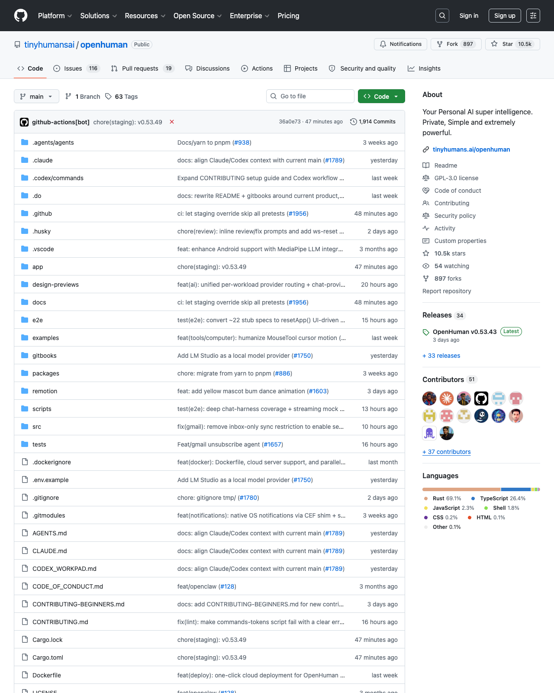

# OpenHuman Deep Dive: Personal AI Assistants Are Becoming Desktop Control Planes

> Source: [tinyhumansai/openhuman](https://github.com/tinyhumansai/openhuman)  
> Date: 2026-05-16  
> Author: Peter / Hermes  
> Tags: OpenHuman, AI Agent, Desktop App, Tauri, Rust, Memory Tree, Agent Harness

If you only read the README, OpenHuman can look like another “personal AI assistant”: chat, voice, integrations, memory, and a desktop app. The repository is more interesting than that label suggests. What it is really trying to build is a **local-first, always-on desktop control plane for personal AI**: one that can connect to external services, accumulate long-term context, route work through tools, and survive the operational messiness of a real desktop product.

I inspected `tinyhumansai/openhuman` on the `main` branch at commit `36a0e73` (`chore(staging): v0.53.49`). GitHub API metadata shows that the repository was created on 2026-02-18, is licensed under GPL-3.0, and has Rust as its primary language. At inspection time it had roughly **10.5k stars and 897 forks**; GitHub’s language sidebar showed Rust at 69.1% and TypeScript at 26.4%. This is not a tiny demo repo: a rough local scan found about **2,656 files**, **2,509 text/code files**, and about **899k lines of text/code**, with the bulk spread across the Rust core, React/Tauri app, tests, scripts, and documentation.

## The problem is not chat. It is personal context as a runtime.

OpenHuman’s tagline is “Personal AI super intelligence. Private, Simple and extremely powerful.” The README emphasizes a UI-first desktop experience, 118+ third-party integrations, Memory Tree + Obsidian Wiki, native tools, model routing, TokenJuice compression, messaging channels, and privacy/security.

Together, those features point to a runtime rather than a chat surface:

- **Desktop is the entry point**: Windows, macOS, and Linux are first-class shipping targets.
- **The Rust core owns business logic**: integrations, memory, RPC, tools, cron, scheduling, auth, and encryption live under the repository-root `src/` tree.
- **React + Tauri is the interaction shell**: `app/` owns UI, routing, windows, Tauri IPC, and the CEF WebView boundary.
- **Long-term context is the asset**: Gmail, Slack, Notion, and other integrations are not just temporary tool calls; they feed the Memory Tree.
- **The agent harness is productized**: tool execution, sub-agents, context compression, session transcripts, and background memory extraction are part of the core hot path.

In other words, OpenHuman is not asking “how do we add one more chat box?” It is asking: “what operating-system-like capabilities does a personal AI assistant need if it is going to live on your computer for weeks or months?”

## Architecture: React shell, Tauri bridge, Rust core

The repository’s `AGENTS.md` gives the current architecture in unusually practical terms:

| Layer | Main path | Responsibility |
|---|---|---|
| UI / interaction | `app/src/` | React 19 + Vite, Redux, routing, pages, components, service layer |
| Desktop host | `app/src-tauri/` | Tauri v2, CEF runtime, windows/tray, native capabilities, WebView bridge |
| Core business logic | `src/` | Rust crate `openhuman`, `openhuman-core` CLI, JSON-RPC, tools, memory, integrations, scheduling |
| Docs and workflows | `gitbooks/`, `docs/`, `.claude`, `.codex`, `.agents` | Contributor docs, AI-agent commands, checklists, workflow guides |
| Release and quality | `.github/workflows`, `scripts/` | Desktop builds, releases, E2E, coverage, debug wrappers |

A key current design choice is that the core now runs as an **in-process tokio task** inside the Tauri host. `app/src-tauri/src/core_process.rs` says this directly: the core HTTP/JSON-RPC server is tied to the GUI process, avoiding the classic sidecar-leak problem on app quit. On startup, the shell generates a 256-bit bearer token, injects it into core via `OPENHUMAN_CORE_TOKEN`, and exposes it to the frontend through a Tauri command. The frontend’s `app/src/services/coreRpcClient.ts` wraps calls as JSON-RPC 2.0 requests.

This is a sensible desktop-AI shape: the UI does not own business rules, Tauri acts as the bridge and lifecycle manager, and core state stays in Rust. Compared with an “Electron plus many JS services” design, this makes it easier to reason about local databases, encryption, long-lived processes, cross-platform packaging, and permission boundaries.

## JSON-RPC as the internal control bus

`src/core/jsonrpc.rs` implements an Axum-based JSON-RPC server with POST handling, SSE events, health checks, and schema discovery. `src/core/dispatch.rs` shows a layered dispatch flow:

1. Normalize legacy method names.
2. Handle internal core methods such as `core.ping` and `core.version`.
3. Route to registered domain controllers.
4. Fall back to the legacy domain dispatcher.

That tells us the internal API is not an ad hoc IPC surface. It is an evolvable control bus. The frontend has `normalizeRpcMethod`; the core has `legacy_aliases`. This matters a lot for desktop software: users often update one part of the app while local state or a running core remains slightly out of sync. Without compatibility layers, desktop AI apps quickly turn into a stream of mysterious 401s, unknown methods, and parameter mismatches.

## Memory Tree: not chat history, but a local knowledge pipeline

The most important subsystem is `src/openhuman/memory/tree/`. `store.rs` shows a SQLite-backed chunk store at `<workspace>/memory_tree/chunks.db`, with tables such as `mem_tree_chunks`, `mem_tree_score`, `mem_tree_entity_index`, and `mem_tree_trees`. Chunks have explicit lifecycle states: `pending_extraction`, `admitted`, `buffered`, `sealed`, and `dropped`.

That is very different from “append every old message to the prompt.” It looks more like a local knowledge pipeline:

- Raw data enters a raw/content store.
- Content is canonicalized and chunked.
- Chunks are scored and admitted or dropped.
- Accepted chunks flow into source/topic/global trees.
- Summaries are sealed into higher-level nodes.
- Entity indexes support future retrieval.
- Obsidian vault defaults are written into `.obsidian/`, so the user can browse the same memory surface manually.

`src/openhuman/composio/providers/gmail/ingest.rs` gives a concrete example. Gmail messages are bucketed by the sorted set of participants, so all correspondence between the same people lands in one source tree. If address parsing fails, the code falls back to an orphan bucket keyed by message id; if even the id is missing, the message is skipped with a warning. Re-ingestion relies on content-hash / UPSERT behavior to avoid duplicates. These are the kinds of dirty-data edges you only see when a memory system is handling real personal data.

## Agent harness: tools, compression, sub-agents, background memory extraction

`src/openhuman/agent/harness/session/turn.rs` exposes a complete turn lifecycle:

- Build the system prompt.
- Inject learned context.
- Refresh delegation tools for connected integrations.
- Call the model provider.
- Parse and execute tool calls.
- Manage the context window.
- Apply tool-result budget, micro-compaction, and autocompaction signals.
- Trigger session-memory extraction in the background.

The important design question here is not simply “can the model call tools?” It is “when tool calls multiply, outputs get long, and context becomes messy, how does the system remain usable?” The repo also has `src/openhuman/tokenjuice/`, a terminal-output compaction library whose rules can be loaded from built-in, user, and project layers. It compresses verbose git/npm/cargo/docker-style output before it enters the LLM context.

That matters because stronger tools produce more output. Without compaction, filtering, and background memory extraction, a personal AI assistant becomes slower, more expensive, and harder to control the longer it is used.

## Integrations are not a plugin marketplace. They are data entrances.

The README mentions 118+ third-party integrations, and the codebase contains `composio`, `integrations`, `channels`, `webview_accounts`, `webview_apis`, plus provider-specific surfaces for Gmail, Slack, Telegram, WhatsApp, iMessage, Google Meet, and more.

Those integrations serve at least three roles:

1. **Tool surface**: the model can perform actions on the user’s behalf.
2. **Sync surface**: external-service data enters the Memory Tree.
3. **Messaging surface**: the user can reach the agent from outside the desktop UI.

This is different from a traditional plugin store. A plugin store usually answers “can I call API X right now?” OpenHuman is closer to “how does API X become part of the long-term personal context that an agent can reason over later?”

## Why this is not a toy repo

Several signals show that OpenHuman has moved beyond a proof of concept:

- **Large codebase**: roughly 899k lines of text/code, with Rust and TypeScript as the core languages.
- **Real desktop release chain**: Tauri v2, CEF runtime, macOS/Windows/Linux build scripts, and GitHub Actions.
- **Quality gates**: Vitest, Rust tests, E2E flows, coverage workflow, PR checklist, and debug wrappers.
- **Agent-native contributor workflow**: `.claude`, `.codex/commands`, `.agents/agents`, and `docs/agent-workflows` exist to help AI coding agents operate safely in the repo.
- **Real-world scar tissue**: comments and code paths mention session expiry, param validation, SQLite busy timeouts, stale listeners, CEF cache locks, malformed Gmail addresses, and platform-specific build prerequisites.

A production-oriented codebase is not always the cleanest-looking one. It is the one where you can see the team has already been hit by real failure modes. OpenHuman has many of those traces.

## Design choices worth borrowing

Four choices stand out.

First, **treat the core as a local control plane, not a UI appendix**. React handles interaction; Rust handles state, tools, memory, and scheduling. That lets the product iterate on UI while keeping core semantics stable.

Second, **build memory as a data pipeline, not prompt concatenation**. Memory Tree, chunk lifecycle, scoring, entity indexes, and Obsidian export make memory observable and maintainable.

Third, **productize the dirty parts of an agent harness**. Tool-output compaction, legacy method aliases, parameter validation, Sentry noise reduction, RPC tokens, and stale-process recovery are not needed for demos, but they are needed for a desktop agent used every day.

Fourth, **treat AI coding agents as part of the contributor infrastructure**. AGENTS.md, Codex checklists, debug wrappers, and coverage gates are not just human documentation; they are operating instructions for automated contributors.

## Risks and unfinished edges

OpenHuman also has real risks.

First, the README and some `gitbooks` architecture docs are not perfectly synchronized. Older docs still describe a QuickJS skills runtime and sidecar-style architecture, while `AGENTS.md` and current `core_process.rs` describe an in-process core and note that the QuickJS skills runtime has been removed, with skills currently closer to metadata/catalog. The code is moving quickly, so external readers should trust current code and AGENTS.md over older narrative docs.

Second, the product surface is huge: desktop, memory, integrations, voice, meetings, messaging channels, agent harness, release infrastructure, billing, teams, wallet, and local AI. A personal AI assistant that spans that much surface area will face reliability and permission-boundary pressure.

Third, GPL-3.0 matters. Teams considering direct reuse inside closed-source products should treat the license as a real architectural constraint, not just a footer.

## Conclusion: personal AI competition is moving toward desktop control planes

OpenHuman’s value is not that every feature is already finished. Its value is that it exposes the likely shape of personal AI: a long-running local desktop control plane that connects services, maintains memory, executes tools, routes models, handles messaging channels, and survives messy real-world state.

The next competition in this category will not be only about models, and it will not be only about UI. It will be about local state, permissions, memory, sync, compression, scheduling, release engineering, error recovery, observability, and making AI coding agents safe enough to help maintain the product itself.

If you are building personal AI, agent desktops, AI OS layers, second brains, or internal agent workbenches, OpenHuman is worth studying — not because it is the final answer, but because it already contains many of the problems that appear only after the demo works.