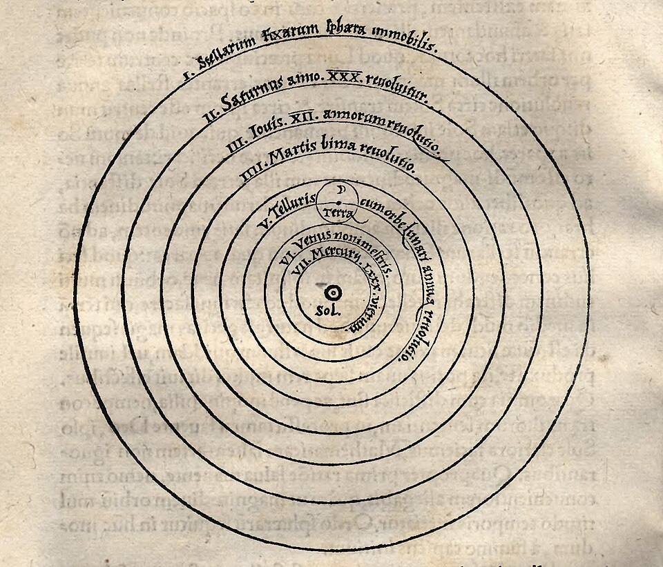
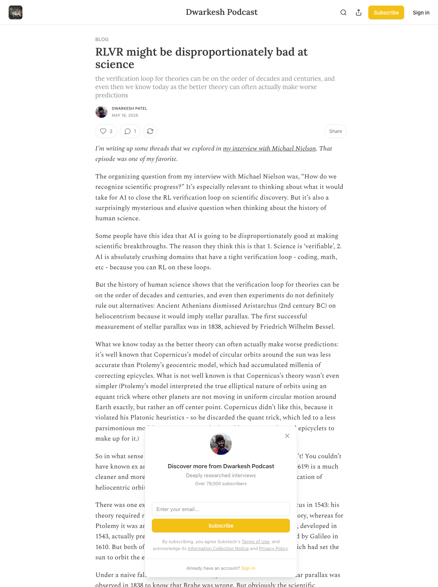

# RLVR and Scientific Discovery: Why Verifiable Rewards May Be Worst at Real Breakthroughs

> Source: [Dwarkesh Patel — RLVR might be disproportionately bad at science](https://www.dwarkesh.com/p/rlvr-might-be-disproportionately)  
> Date: 2026-05-16  
> Author: Peter / Hermes  
> Tags: RLVR, AI for Science, Scientific Discovery, Verification Loop, Research Automation, Philosophy of Science

Dwarkesh Patel’s post asks an uncomfortable question for the current AI-for-science narrative: if reinforcement learning works best when there is a tight verification loop, then real scientific breakthroughs may be one of the domains where it is least naturally advantaged.

That runs against a common intuition. RLVR — reinforcement learning from verifiable rewards — has worked extremely well in coding, math, formal reasoning, and tool-use environments. It is tempting to extrapolate: science is verifiable; experiments tell us whether theories are right; therefore AI should be especially strong at scientific discovery.

Dwarkesh’s counterargument is that this confuses “science is eventually verifiable” with “science has a short, trainable feedback loop.” In the history of science, many important theories were not more accurate at the moment they were proposed, were not obviously simpler, and could not be decisively distinguished by contemporary experiments. Scientific progress often looks less like a clean reward function and more like a long competition among research programs, heuristics, judgments, and stubborn commitments.

## RLVR’s natural habitat: short feedback and clear scoring

RLVR works for good reasons. Its best environments tend to share a structure:

| Domain | Why RLVR fits |
|---|---|
| Programming | Tests pass or fail; code compiles or breaks; benchmarks move |
| Math | Final answers can be checked; formal proofs can be verified |
| Games/simulation | Rewards are explicit and episodes are cheap to sample |
| Tool use | Task completion, API results, and state changes can be logged |

These domains let the model try repeatedly, receive quick scores, attribute failures, and feed rewards back into training. Even imperfect rewards can be dense, cheap, and short enough to be useful.

That is why coding agents, math models, and agents in verifiable environments improve quickly. They are not “like science” in general; they have an engineering feedback loop that can actually be closed.

## The scientific problem: theory verification can take decades or centuries

Dwarkesh begins with heliocentrism. Aristarchus proposed an early heliocentric view, but ancient Athenians rejected it partly because Earth’s motion should imply stellar parallax. The first successful measurement of stellar parallax came only in 1838, by Friedrich Wilhelm Bessel.

Copernicus is even more subtle. Today we know heliocentrism was the better framework, but in 1543 this was not obvious:

- Copernicus’s circular heliocentric model was less accurate than Ptolemy’s long-corrected geocentric model;
- it was not necessarily simpler, because Copernicus rejected Ptolemy’s equant trick and had to add more epicycles;
- Kepler’s laws did not arrive until 1619;
- Newton’s unification of celestial motion and terrestrial gravity came in 1687;
- under a naive falsificationist view, Brahe’s hybrid model would not be decisively ruled out until stellar parallax was observed in 1838.

The key point is that **a better scientific theory may not have a better immediate reward**. Its value may come from its future explanatory power, unification, and extensibility over decades or centuries.

That is hard for RLVR. RLVR needs to compress “good” and “bad” into a reward signal available now. But the goodness of a conceptual breakthrough often becomes clear only after history unfolds.

## Neptune and Vulcan: the same strategy can succeed or fail

Dwarkesh’s Neptune/Vulcan comparison is especially useful.

Uranus deviated from its predicted Newtonian path. Le Verrier inferred an unknown perturbing planet, calculated its mass and orbit, and Neptune was found almost exactly where predicted in 1846. That was a spectacular victory for the Newtonian research program.

Mercury also deviated from Newtonian mechanics: its perihelion precessed by an extra 43 arcseconds per century. Astronomers again speculated that an unknown planet, Vulcan, existed inside Mercury’s orbit. That research direction failed; the anomaly was eventually resolved by Einstein’s general relativity in 1915.

The difficult part is that **both moves were reasonable ex ante**.

A committed Newtonian could say: maybe there is an unknown planet; if we cannot find it, perhaps it is too small; build a bigger telescope; if it still is not found, maybe cosmic dust blocks the view; maybe the instruments are disturbed by unknown fields. If any step succeeds, it becomes a triumph for the framework. Only after years or decades can we look back and decide whether the theory was making progressive predictions or merely adding epicycles.

Games do not work like this. In a game, the episode ends and the reward arrives. In science, the reward may be delayed for decades, and each “patch” might be a path toward Neptune or a path toward Vulcan.

## Progressive vs regressive research programs are hard to identify in advance

Dwarkesh is not saying science lacks verification. He is saying that scientific verification often fails to provide a feedback signal that is short, clean, and trainable.

After the fact, we can say one research program was progressive because it predicted and explained unexpected new phenomena, while another was regressive because it kept contorting itself to absorb failures. But identifying this in advance is very hard.

This resembles Imre Lakatos’s view of scientific research programs. A theory is not killed by a single anomalous experiment. It evolves through a hard core, protective belts, auxiliary assumptions, patches, and new predictions. The question is not merely “are there counterexamples?” but “do the modifications produce new explanatory power?”

That is hard to encode as a simple reward. It requires judgments such as:

- whether a theory unifies previously separate phenomena;
- whether an anomaly is noise, instrument error, a failed auxiliary assumption, or a failed core theory;
- whether an awkward framework opens future conceptual space;
- whether a direction deserves to be preserved by a small group for decades.

AI can help with all of this, but it is not naturally “+1 if correct, -1 if wrong.”

## Prout, isotopes, and the value of stubbornness

Another important example is Prout’s hypothesis. In 1815, William Prout proposed that the atomic weights of pure chemical elements are whole numbers. Many measurements seemed close to this, but there were anomalies, such as chlorine at roughly 35.5.

Prout’s school tried to explain the anomalies: maybe samples were impure; maybe fractional atomic weights were involved. But more precise measurements made the fractions look less natural. Nearly a century later, scientists realized that the measurements reflected multiple isotopes of the same element — physically separable, but not chemically distinguishable in the obvious way.

This story shows that what looks like stubbornness can sometimes preserve a deeper structure. The problem is that, in advance, it is hard to know whether a research program represents productive stubbornness or ordinary refusal to update.

That matters for AI scientists. A system driven by a single global reward may prematurely eliminate directions that look weak today but later become central. Human science works partly because it contains many idiosyncratic, biased, competing researchers who keep different heuristics alive over long periods.

## Darwinism: simple ideas may lack decisive tests

Dwarkesh also discusses Darwin and Wallace arriving at natural selection around the same time. Natural selection seems conceptually simpler than Newtonian mechanics. Thomas Huxley famously reacted to *On the Origin of Species* by saying, “How extremely stupid not to have thought of that!”

So why did the idea not emerge thousands of years earlier? One reason is that it lacked the kind of decisive test Newton had when he could run numbers on the moon’s orbit. Darwin’s evidence was cumulative, retrospective, and contextual:

- Lyell’s geology supplied deep time;
- fossils and extinct species created intermediate intuitions;
- voyages and colonization produced biogeographic evidence;
- artificial selection, such as pigeon breeding, became more sophisticated;
- population-level and environmental intuitions had to accumulate.

The essence of natural selection may be simple, but making it visible as a serious scientific theory required a whole stack of ancillary intuition pumps. Scientific discovery is often bottlenecked not by whether someone can state a principle, but by whether the surrounding evidence structure makes the principle intelligible.

## What this means for AI for science

The takeaway is not pessimism. AI can absolutely accelerate science. It can read papers, generate hypotheses, write code, design experiments, run simulations, analyze data, build literature maps, find anomalies, and narrow search spaces. Many scientific subtasks do have tight verification loops: protein structure, materials simulation, automated labs, theorem proving, data cleaning, instrument control, and experiment design.

But if the goal is major conceptual breakthroughs, a system probably cannot rely only on one short reward loop. It also needs:

1. **Parallel research programs** — do not let one global reward prematurely collapse the search;
2. **Long-term memory and dormant agendas** — preserve directions that temporarily fail but have structural promise;
3. **Heterogeneous agent populations** — different agents should have different biases, aesthetics, heuristics, and risk tolerances;
4. **Slow-variable evaluation** — track whether a theory generates new predictions, unifications, and experimental handles over time;
5. **Human/AI hybrid judgment** — treat reward models as evidence aggregators, not final judges;
6. **Portfolio management for hypotheses** — manage research directions like a portfolio, not like a contest where only the current top score survives.

In other words, an AI scientist cannot just be a stronger problem solver. It must also be part of a system that maintains a research ecology.

## Contrast with AutoGo: not all science is Go

This also creates an interesting contrast with Eric Jang’s AutoGo project. Go is a good sandbox for automated research: rules are clear, data is cheap, self-play scales, win rates are measurable, and MCTS plus policy/value networks provide relatively clean feedback.

But Dwarkesh’s post reminds us that real science is not always Go. Many central theories have no closed board, no short episode, no clear win/loss signal, and no immediate reward. An AI that learns to run experiments in Go-like environments has not automatically learned which scientific programs deserve decades of stubborn commitment.

That does not undermine AutoGo or RLVR. It bounds them: **RLVR may be best for locally verifiable scientific modules, not for directly optimizing the entire process of scientific discovery.**

## Conclusion: science needs a community, not just a reward

Dwarkesh’s core insight is that science is not unverifiable. It is that verification is often slow, indirect, and judgment-laden. Major breakthroughs may not have better short-term reward at the moment of proposal. They need time, auxiliary evidence, conceptual space, social division of labor, and stubborn people.

So the hardest question in AI for science is not simply “how do we give AI a verifiable reward?” It is: how do we build an AI scientific community where different agents explore different biases for long periods, where failed directions are not deleted too early, and where the value of a theory can be reassessed over decades?

RLVR will remain a powerful tool. But if we reduce scientific discovery to an immediately scorable training loop, we may miss the parts of science that matter most — and that are hardest for any reward function to see.
