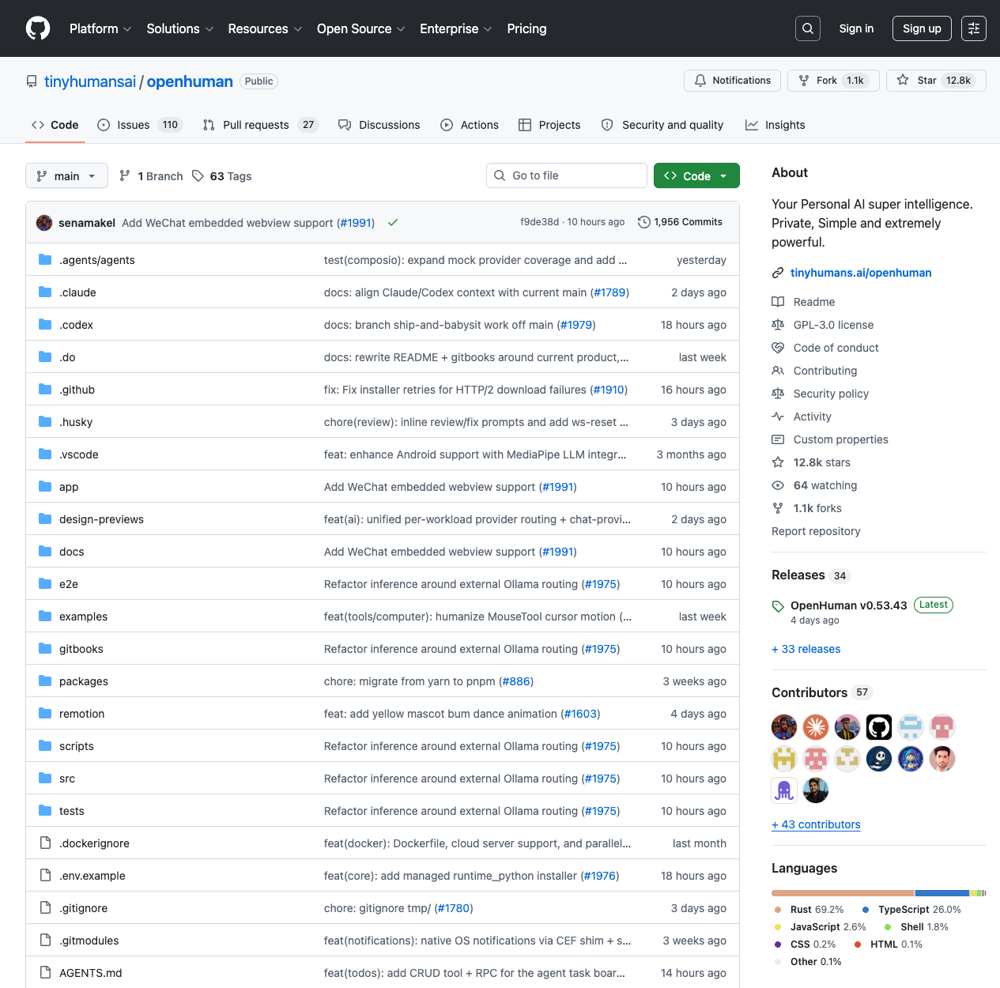

# OpenHuman Update: From Desktop Control Plane to Multi-Agent Runtime

> Source: [tinyhumansai/openhuman](https://github.com/tinyhumansai/openhuman)  
> Previous article: [OpenHuman Deep Dive: Personal AI Assistants Are Becoming Desktop Control Planes](../2026-05-16/2026-05-16-openhuman-agentic-desktop-control-plane-en.md)  
> Inspected commit: `f9de38d` — `Add WeChat embedded webview support (#1991)`  
> Date: 2026-05-17  
> Tags: OpenHuman, Agent Runtime, Desktop AI, Tauri, Rust, Subagents, MCP, Local Runtime

Yesterday’s article framed OpenHuman as more than another chat app: it is becoming a **local-first desktop control plane** for personal AI, with a Tauri + React shell, Rust core, JSON-RPC, Memory Tree, Obsidian export, integrations, tool execution, and desktop process management.

This follow-up is not a duplicate. The repository moved quickly again: from yesterday’s inspected commit `36a0e73` to today’s `f9de38d`, GitHub compare shows 42 commits and 300 changed files. GitHub API reports that the repo was created on 2026-02-18, is GPL-3.0 licensed, and uses Rust as the primary language. At inspection time it had roughly **12.8k stars and 1.1k forks**; the latest published release was `v0.53.43`, while the current source manifests were already at `0.53.49`. A rough tree scan found about **2,746 files**, **2,716 text files**, and around **960k text/code lines**, concentrated in `app/`, `src/`, `scripts/`, `gitbooks/`, and tests.

The interesting part is the direction of change: OpenHuman is moving beyond “desktop AI assistant” toward a **multi-agent, locally managed runtime** where agent orchestration, embedded accounts, local runtimes, quality gates, and AI-assisted development workflows all live in the same product system.

---

## 1. The update signal: not feature sprawl, but runtime boundary hardening

Between `36a0e73...f9de38d`, the commit list includes:

- `feat(wallet): add default rpc and EVM execution tools (#1964)`
- `feat(audio): add podcast generation and delivery toolkit (#1970)`
- `feat(core): add authenticated static directory hosting (#1966)`
- `feat(runtime): add javascript facade and skill creator agent (#1971)`
- `Add auth-aware MCP client transport layer (#1972)`
- `feat(core): add managed runtime_python installer (#1976)`
- `feat: allow inline model pinning for subagents (#1896)`
- `fix(memory,security,perf): chunker line splitting, DNS rebinding guard, regex caching (#1918)`
- `Add WeChat embedded webview support (#1991)`

This is not merely “more buttons.” It shows the project moving from demo questions — can it chat, can it call tools — into product-runtime questions:

1. **Runtimes must be managed**: Node, Python, MCP, and JavaScript tool surfaces cannot depend on a user’s machine being accidentally configured correctly.
2. **Tools need authorization boundaries**: MCP, Composio, wallet execution, and embedded webview accounts all require scoped auth.
3. **Agents need division of labor**: subagents need to enter the harness, thread model, model routing, and tool-filtering layers.
4. **Desktop apps must recover**: CEF, Tauri, core ports, stale processes, single-instance locks, bearer tokens, and 401s become real user problems.
5. **AI-assisted contribution must be productized**: `.claude/`, `.codex/`, `.agents/`, `AGENTS.md`, debug runners, and PR checklists are now part of the repo’s operating model.

The update angle is therefore clear: OpenHuman is thickening its desktop control plane into the runtime layer a personal AI OS would need.

---

## 2. Architecture fact: Rust core is authoritative; the frontend is interaction

`AGENTS.md` is currently more reliable than some older narrative docs. It says:

- `app/` is the `openhuman-app` workspace: Vite + React + Tauri desktop host.
- Root `src/` is the Rust crate `openhuman`, containing the `openhuman-core` CLI, JSON-RPC, auth, event bus, and business domains.
- The core now runs as an **in-process tokio task** inside the Tauri host.
- The frontend still talks to `http://127.0.0.1:<port>/rpc`, authenticated with a per-launch bearer token.
- The QuickJS skill runtime has been removed; `src/openhuman/skills/` is now mostly metadata/catalog logic, while canonical skill packages live in `tinyhumansai/openhuman-skills`.

That matters because parts of `gitbooks/developing/architecture.md` still describe older sidecar and QuickJS-era assumptions. In a fast-moving repo, **AGENTS.md plus current source comments are closer to runtime reality than polished narrative docs**.

This documentation drift is itself a product signal. OpenHuman is no longer a static demo; its runtime boundaries are actively moving, and the docs must chase the code.

---

## 3. Desktop process governance: the hard part is “not randomly breaking”

`app/src-tauri/src/core_process.rs` is one of the most important files in the project. Its top comment explains why the core moved in-process: the HTTP/JSON-RPC server runs as a tokio task inside the Tauri host, so its lifetime is tied to the GUI process and there is no sidecar left behind after Cmd+Q.

The implementation handles several production desktop pitfalls:

- A 256-bit bearer token is generated at startup and injected into the core via `OPENHUMAN_CORE_TOKEN`.
- The frontend obtains the token through the `core_rpc_token` Tauri command and sends `Authorization: Bearer` on RPC calls.
- If the configured port is already bound, OpenHuman probes `GET /` to identify whether it is an old OpenHuman listener.
- If it is a stale OpenHuman process, it terminates it gracefully, then force-kills only after revalidating the PID to avoid PID reuse bugs.
- If another process owns the port, it refuses to attach instead of silently causing 401s, unknown methods, or version drift.
- `OPENHUMAN_CORE_REUSE_EXISTING=1` preserves the manual attach path for debugging.

This code is not flashy, but it determines whether the product feels reliable. A personal AI assistant that lives on the desktop cannot turn every restart, update, crash, HMR loop, or force quit into a mysterious broken state.

---

## 4. Agent harness: from one assistant to a coordinated runtime

`gitbooks/developing/architecture/agent-harness.md` and `src/openhuman/agent/harness/` show that OpenHuman’s agent layer is not just “send tool schemas to an LLM.” It describes a complete turn lifecycle:

1. Resume transcript messages to preserve KV-cache prefix stability.
2. Build the system prompt only on the first turn.
3. Inject memory context and citations.
4. Enter a tool-call loop.
5. Execute tools or spawn subagents.
6. Route oversized tool results through a summarizer detour.
7. Trigger post-turn hooks such as archivist, learning, cost logging, and episodic memory indexing.

The repo already has multiple archetypes under `src/openhuman/agent/agents/`: `orchestrator`, `researcher`, `planner`, `critic`, `summarizer`, `tool_maker`, `skill_creator`, `integrations_agent`, `trigger_triage`, `trigger_reactor`, `morning_briefing`, and more.

`src/openhuman/agent/harness/subagent_runner/types.rs` exposes productized fields:

- `skill_filter_override` narrows the tool set by skill.
- `toolkit_override` narrows Composio integration context.
- `model_override` lets a single spawn pin a specific model.
- `worker_thread_id` lets subagent messages and tool results enter a persistent worker thread.

This is the important part: OpenHuman’s multi-agent design is not “open several chat windows.” It is engineering around **narrow prompts, narrow tools, and narrow context**. For a personal AI system with Gmail, Notion, Slack, wallets, filesystem tools, browser context, calendar events, and messaging channels, that separation is a prerequisite for auditability and recovery.

---

## 5. Local runtimes are becoming product assets: JavaScript, Python, MCP, and skills

Another strong signal in this update is that OpenHuman does not want tool execution to depend on “the user already installed the right environment.”

`src/openhuman/javascript/mod.rs` introduces a JavaScript facade. Today it delegates to a managed Node runtime, but the rest of the core talks to a `javascript` slot rather than a concrete Node implementation. `src/openhuman/runtime_python/` adds Python bootstrap, downloader, extractor, resolver, and process-launch modules. Its immediate use case is Python-backed stdio MCP servers.

For a desktop AI assistant, this matters because the useful surface area quickly extends beyond built-in APIs. If OpenHuman wants to support MCP servers, skills, Python tools, JavaScript tools, and service connectors, it must answer operational questions:

- how a runtime is installed;
- how it is upgraded;
- how it is isolated from the host app;
- how tools are discovered and described;
- how auth is passed safely;
- how stdout/stderr and errors are compressed for the model;
- how failures recover without asking users to read stack traces.

The direction is to make local runtimes first-class product assets managed by core, not README prerequisites.

---

## 6. Webview accounts: integrations are not only APIs

The latest commit, `Add WeChat embedded webview support (#1991)`, touches the embedded account surface. In `app/src-tauri/src/webview_accounts/mod.rs`, the provider list now includes:

- WhatsApp Web;
- WeChat Web;
- Telegram;
- LinkedIn Messaging;
- Slack;
- Discord;
- Google Meet;
- Zoom;
- BrowserScan.

Each account gets its own `data_directory`, keeping cookies and local storage isolated per account. Providers also have allowlisted host suffixes; navigation outside those hosts is cancelled and opened in the default browser. Some providers still use recipe JavaScript injection, while others have moved toward native CDP scanner modules.

This is a broader view of “integration” than a typical API connector. Some services fit OAuth + API. Some require a logged-in web session. Some messaging and meeting products need to be embedded like a Franz-style desktop workspace. Some data then needs to be turned into agent-consumable events or memory through scanners, recipes, or CDP.

That is the reality of personal AI: a user’s context does not live only in clean APIs. It lives in webviews, login sessions, DOMs, notifications, and desktop state.

---

## 7. AI contributor infrastructure is part of the product system

OpenHuman is also notable because it is not only building agents for users; it is using agent workflows to maintain itself. The repo includes:

- `AGENTS.md` as the main entrypoint for coding agents;
- `.claude/agents/` roles for architecture, build, deploy, review, test, and more;
- `.codex/skills/ship-and-babysit/` for Codex-oriented shipping workflows;
- `docs/agent-workflows/codex-pr-checklist.md` for remote-agent PR validation;
- `scripts/debug/` wrappers for unit, E2E, Rust, and log inspection;
- a changed-line coverage gate requiring at least 80% coverage.

This is not decorative. In an agentic codebase, the hard part is not whether AI can write code. It is whether AI can run the right checks, understand platform limits, avoid fake validation, report blocked commands, and handle formatter/typecheck/Rust/CEF/E2E gates honestly.

OpenHuman writes those workflows into the repo, which suggests it treats AI contributors as part of the normal development loop rather than one-off automation.

---

## 8. Risks: documentation drift, permission complexity, and expanding surface area

The project’s biggest risks are now clear.

First, **documentation drift**. README, AGENTS.md, GitBook pages, and source comments do not always agree. For current facts such as sidecar vs in-process core, QuickJS runtime vs metadata-only skills, or where skill packages live, current source and latest agent docs should win.

Second, **permission complexity**. An assistant that connects Gmail, Slack, Telegram, WeChat, Discord, wallets, MCP, filesystem, browser, calendar, voice, and meetings must constantly answer: which agent can see what, which tool can write what, are webview cookies isolated, are RPC tokens leaking, and do logs contain sensitive content?

Third, **surface-area expansion**. Desktop, core, runtime, skills, MCP, wallet, audio, webview, memory, subagents, cron, notifications, release automation, and E2E tests all live in one monorepo. That accelerates integration, but every module can become a regression source.

OpenHuman’s future will therefore depend less on adding more features and more on turning those features into stable runtime contracts.

---

## Conclusion: personal AI competition is moving from chat UX to local runtime capability

The most useful thing about OpenHuman today is not that it added WeChat support or gained stars quickly. It is that the repo exposes the real engineering problems behind personal AI:

- how the desktop process starts, exits, and recovers;
- how core and UI authenticate, version-sync, and avoid drift;
- how multi-agent work is split, tool-filtered, and persisted;
- how Python, Node, MCP, and skill runtimes are installed and executed;
- how APIs, webviews, CDP, OAuth, and scanners become data entrances;
- how AI-written code is constrained by repo-level quality gates.

Yesterday’s summary was: OpenHuman is turning personal AI into a desktop control plane. Today’s stronger version is: it is thickening that control plane into a local agent runtime.

If you are building an AI OS, personal assistant, desktop agent, agent workbench, MCP client, or second-brain product, OpenHuman is worth tracking. It may not be the final form, but it shows clearly what has to be built between a demo and a real product: runtime, permissions, recovery, integrations, and quality systems.
