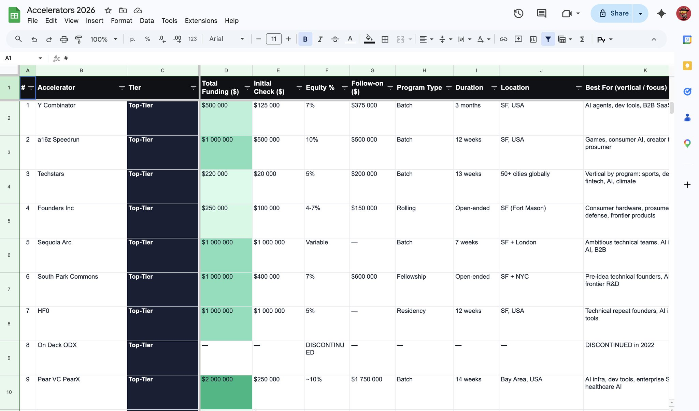

# 2026 创业加速器申请地图：不要只盯 YC，而要匹配信号、条款和赛道

资料来源：[James 在 X 上整理的 2026 创业加速器清单](https://x.com/JamesJames518/status/2056037526629147054?s=20)  

---
**Author:** 🦞 龙虾侦探 / Lobster Detective  
**Date:** 2026-05-17  
**Tags:** Startup Accelerator, YC, Fundraising, Founder Playbook, Venture Capital, AI Startup, Deep Tech
---

James 这条 X 贴文列了 35 个“2026 年值得申请的 startup accelerators”：从 YC、a16z Speedrun、Techstars、Sequoia Arc，到 AI Grant、NVIDIA Inception、SOSV、a16z crypto CSX、Seedcamp、Entrepreneur First、Z Fellows。表面上它是一张申请清单，真正有价值的地方在于：它把“融资金额、股权比例、项目类型、赛道匹配、地域约束”放在同一张表里。

这对创始人很重要，因为 2026 年申请加速器不能再只问一个问题：**“我能不能进 YC？”** 更现实的问题是：

> 哪一个项目能用最小的稀释，给当前阶段的公司带来最大的信号、资源和客户路径？

贴文里有一句提醒很关键：**Terms shift annually. Verify on each program's site before applying.** 所以下面的分析不把这些金额当成已核验条款，而是把它当作一张“申请决策地图”。具体投资金额、股权、SAFE、MFN、credits、截止日期和地区限制，申请前都要逐项去官网确认。

---

## 一、YC 仍然是默认标杆，但不再是唯一信号

YC 的品牌溢价仍然真实。它带来的不是单纯的 $500k，而是三件事：

1. **标准化融资信号**：投资人知道 YC selection 意味着什么；
2. **批次网络**：同批公司、校友、Demo Day、后续融资路径；
3. **叙事压缩**：早期公司可以把“为什么值得看”压缩成一句“YC company”。

但 James 的清单提醒了另一个事实：**品牌溢价不是无限的。** 对 AI、游戏、硬科技、crypto、biotech、hardware、Europe-first 公司来说，Arc、Speedrun、HF0、SOSV、IndieBio、HAX、Seedcamp、Alliance 这些项目可能在垂直资源上更直接。

如果一家 AI 工具公司只需要泛化融资信号，YC 是强选项；如果它需要游戏发行网络，a16z Speedrun 可能更贴；如果它是 repeat founder、正在做技术密度很高的 AI/infra，HF0 或 South Park Commons 可能给的同辈环境更强；如果它是 biotech/hardware/climate，SOSV/IndieBio/HAX/Greentown/Activate 的行业资源可能比泛化 Demo Day 更关键。

---

## 二、申请策略：不要押一个项目，要投一个组合

贴文里最实用的一条建议是：**small program acceptance rates are higher than YC, not because they're easier, because the funnel is smaller. apply to 5–7, not 1.**

这句话的重点不是“广撒网”，而是“组合化申请”。一个合理的 accelerator pipeline 可以分成四层：

### 1. 标杆层：YC / Arc / Speedrun

这类项目的核心价值是 signal。即使没有完全垂直资源，进入本身就能改变融资对话。适合已经能讲清楚巨大市场、强团队、快速增长假设的公司。

### 2. 垂直层：AI Grant / AI Fund / SOSV / IndieBio / HAX / CSX / Alliance

这类项目的价值是“懂你在做什么”。它们可能对技术路线、客户生态、行业验证、后续投资人更有针对性。对 AI、bio、hardware、crypto 公司尤其重要。

### 3. 资源层：NVIDIA Inception / Microsoft for Startups / Google for Startups

这类项目不一定提供股权投资，但 credits、云资源、算力、合作伙伴生态可能直接降低 burn。对 AI 公司来说，non-dilutive credits 有时比小额稀释融资更划算。

### 4. 地域/社区层：Seedcamp / Entrepreneur First / Antler / Station F / The Residency / Z Fellows

这些项目更像“进入某个创业网络”的入口。它们不一定都适合已经有明确产品和团队的公司，但对 idea-stage、solo founder、区域市场切入者可能很有用。

所以正确动作不是“每个都申”，而是按公司阶段选 5–7 个：一个标杆、两到三个垂直、一个资源、一个地域或社区备选。

---

## 三、真正要比较的不是投资金额，而是有效稀释

James 特别强调：**“$X for Y%” is the only number that matters. uncapped MFNs are not free money, they dilute you on the next round.**

这句话值得单独展开。早期融资最容易被表面金额误导：

- $500k for 10% 和 $500k via uncapped SAFE 完全不是一个东西；
- “credits + perks” 与 “cash investment” 完全不是一个东西；
- “guaranteed follow-on” 与 “可能跟投”也不是一个东西；
- uncapped MFN 看起来没有估值上限，但它会在下一轮按最优条款转换，创始人不能把它当免费钱。

真正应该比较的是四个变量：

| 变量 | 要问的问题 |
|---|---|
| Cash | 到账现金是多少？是否分 tranche？是否绑定 milestones？ |
| Dilution | 立即或未来稀释多少？是否有 warrant、SAFE、MFN、pro-rata？ |
| Signal | 这个项目对下一轮投资人、客户、招聘是否有可见信号？ |
| Fit | 它是否真的能帮你进入目标市场、生态、客户或技术社区？ |

如果一个项目给 $100k、拿 7%，但没有垂直客户、没有强品牌、没有后续融资网络，那它可能比一个 non-dilutive credits 项目更贵。反过来，如果一个硬科技项目给的钱不夸张，但能提供实验室、供应链、行业导师和第一批客户，那它的真实价值可能远高于 headline check。

---

## 四、按公司类型看，优先级完全不同

### AI Agent / Developer Tools / SaaS

优先看 YC、a16z Speedrun、Sequoia Arc、HF0、AI Grant、NVIDIA/Microsoft/Google credits。这里的核心是：产品速度、模型/算力成本、开发者分发、投资人信号。

### Robotics / Hardware / Deep Tech

优先看 SOSV、HAX、Activate、Greentown、South Park Commons、Arc。硬科技公司需要的不只是钱，而是实验周期、硬件供应链、行业验证、长期资本耐心。

### Biotech / Climate

IndieBio、SOSV、Activate、Greentown 的 fit 可能比泛化加速器更强。这里的关键不是“Demo Day 上讲得好”，而是能不能接触到实验资源、行业专家、监管路径和战略客户。

### Crypto / Web3

a16z crypto CSX、Alliance、Outlier Ventures、Coinbase Base Builder 更有针对性。这个赛道里“生态入口”本身就是分发渠道，项目方、链、钱包、开发者社区都可能比普通 SaaS 投资人更关键。

### Europe / International / Founder Formation

Seedcamp、Entrepreneur First、Antler、Station F、Brinc 更适合作为区域网络或组队入口。尤其是还在 idea stage、cofounder search、区域市场切入的团队，不一定需要马上追求最大品牌，而是需要形成正确的创始团队和第一批验证。

---

## 五、一份更实用的申请表，不该只有“名字和金额”

James 的截图里已经有 spreadsheet 结构：Accelerator、Tier、Total Funding、Initial Check、Equity、Follow-on、Program Type、Duration、Location、Best For。创始人可以在此基础上再加六列：

1. **官方条款链接**：避免引用过期金额；
2. **下一批截止日期**：申请窗口比项目名更重要；
3. **Founder fit 分数**：团队背景是否匹配；
4. **Company fit 分数**：赛道、阶段、产品形态是否匹配；
5. **Expected dilution**：把 SAFE、warrant、MFN、follow-on 都折算进去；
6. **Application angle**：为什么这个项目非你不可，而不是一份通用 pitch。

最终申请材料也应该按项目改写，而不是复制同一份 deck：

- 对 YC：讲巨大市场、团队速度、默认全球化；
- 对 Speedrun：讲 interactive/consumer/game/AI 原生体验；
- 对 AI Grant：讲 technical novelty 和可快速验证的 demo；
- 对 HAX/IndieBio：讲实验路径、产业落地和 milestone；
- 对 CSX/Alliance：讲生态贡献、开发者增长和链上分发。

---

## 结论：把 accelerator 当成融资产品，而不是荣誉徽章

2026 年的加速器市场已经不是“YC vs 其他”。更准确地说，它变成了一组不同的融资产品：有的卖品牌信号，有的卖垂直资源，有的卖 credits，有的卖社区，有的卖地域入口，有的卖第一批客户和实验环境。

对创始人来说，最好的申请策略不是追一个 logo，而是回答三个问题：

1. **我现在最缺什么？** 钱、信号、算力、客户、导师、cofounder、实验资源，还是地域网络？
2. **我愿意为它付出多少稀释？** headline check 不能替代 cap table 计算；
3. **这个项目是否会改变下一轮融资或产品验证的概率？** 如果不会，它就是噪音。

James 的清单适合作为第一版 pipeline。真正申请前，下一步应该是把每个项目的官网条款、截止日期、batch 时间、投资文件、校友案例和申请问题补齐。只有这样，这张“加速器列表”才会变成一张真正可执行的 founder fundraising map。

---

## 附录：贴文中的 35 个项目速览

> 注：以下为 X 贴文中列出的信息摘要，未逐项替代官网核验。

| 类别 | 项目 | James 贴文中列出的关键信息 |
|---|---|---|
| Top-tier | Y Combinator | 约 $500k；$125k for 7% + uncapped SAFE |
| Top-tier | a16z Speedrun | 约 $500k for 10% + $500k follow-on |
| Top-tier | Techstars | 约 $220k；贴文强调 2025 秋季后不应再引用 $120k |
| Top-tier | Founders Inc | 约 $100k–250k for 4–7% |
| Top-tier | Sequoia Arc | 约 $1M；terms per company |
| Top-tier | South Park Commons | 约 $1M total；$400k for 7% + $600k guaranteed |
| Top-tier | HF0 | up to $1M uncapped for 5%；repeat founders only |
| Top-tier | On Deck ODX | 已于 2022 停止，贴文建议跳过 |
| Top-tier | Pear VC PearX | 约 $250k–2M for ~10% |
| Top-tier | 500 Global Flagship | 约 $150k for 6% |
| AI / ML | AI Grant | 约 $250k for 7%；Nat Friedman + Daniel Gross |
| AI / ML | AI Fund | $1M+；Andrew Ng；studio model |
| AI / ML | NVIDIA Inception | credits + perks；no equity |
| AI / ML | Microsoft for Startups | up to $150k Azure credits；no equity |
| AI / ML | Google for Startups AI Accelerator | credits；no equity |
| Vertical / Deep Tech | SOSV | 约 $525k；覆盖 IndieBio、HAX、Orbit |
| Vertical / Deep Tech | IndieBio | biotech；约 $525k = $250k for 6–8% + Genesis SAFE |
| Vertical / Deep Tech | HAX | hardware；约 $525k via SOSV |
| Vertical / Deep Tech | Greentown Labs | cleantech；workspace + grants |
| Vertical / Deep Tech | Activate | deep science fellowship；2-year stipend |
| Crypto / Web3 | a16z crypto CSX | 约 $500k for 7%；SF in-person |
| Crypto / Web3 | Alliance | 约 $500k；ALL18 starts Sept 7 |
| Crypto / Web3 | Outlier Ventures Base Camp | 约 $250k；per-chain verticals |
| Crypto / Web3 | Coinbase Base Builder | varies；mostly non-dilutive |
| International / Regional | Seedcamp | 约 €350k–1M first check；rolling；Europe |
| International / Regional | Entrepreneur First | 约 $250k = $125k for 8% + uncapped MFN |
| International / Regional | Antler Disrupt US | 约 $400k = $250k for ~9% + uncapped |
| International / Regional | Brinc | 约 $100k；Asia + Middle East |
| International / Regional | Station F | Paris campus；hosted-program terms |
| International / Regional | Founder Institute | $499–999 fee + 2.5% Equity Collective warrant |
| Pre-seed / Niche | Z Fellows | 约 $10k for 1%；pre-product |
| Pre-seed / Niche | ERA NYC | 约 $100k for 8%；generalist |
| Pre-seed / Niche | The Residency | community-first；no standard check |
| Pre-seed / Niche | Plug and Play | varies；often non-dilutive |
| Pre-seed / Niche | Build For Tomorrow | community + grants |
