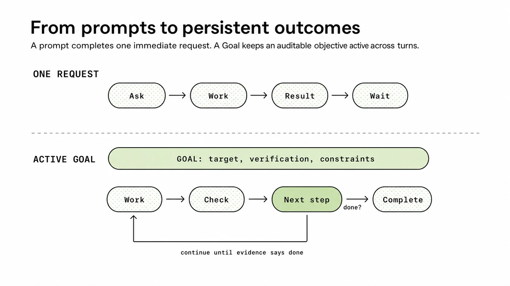
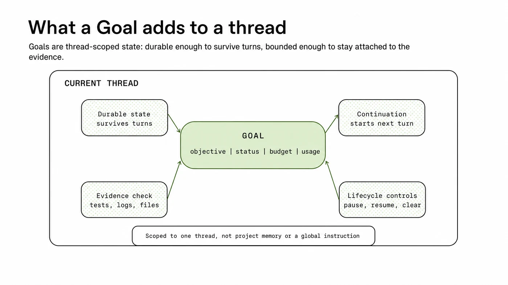
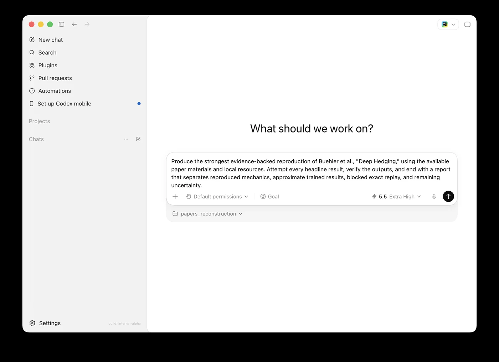

# Codex Goals 深度拆解：把“继续做”产品化成可审计的完成契约

> 原文：[Using Goals in Codex](https://developers.openai.com/cookbook/examples/codex/using_goals_in_codex)  
> 来源：OpenAI Developers Cookbook  
> 作者：Raj Pathak, Stefano Fabbri  
> 发布日期：2026-05-09  
> 文章日期：2026-05-18  
> 标签：Codex / AI Agent / Goals / Coding Agents / Evidence Loop / Agent Runtime / Developer Tools



OpenAI Cookbook 这篇《Using Goals in Codex》表面上是在介绍一个新命令：`/goal`。但它真正重要的地方，不是多了一个 CLI 功能，而是把 AI coding agent 里最常见、最容易失控的一句话——“继续做，直到真的完成”——产品化成了一个**线程级、可暂停、可恢复、可审计的完成契约**。

这和普通 prompt 的差别很大。普通 prompt 是“做下一步”；Goal 是“持续工作，直到某个可验证状态为真”。前者适合一次性修改、解释、代码审查；后者适合性能优化、flaky test、迁移、benchmark 调优、复杂 bug hunt、研究复现这类路径未知但终点明确的任务。

Peter 之前文章里已经写过 Codex multi-agent swarm、Figma MCP、Ask Question 等方向。这篇不重复讨论“Codex 会不会写代码”，而拆一个更底层的问题：**AI agent 的长期任务到底应该由 prompt 驱动，还是由可验证目标驱动？**

---

## 1. Goals 解决的不是“能力”，而是“持续性与收敛”

官方文档给 Goals 的定义很清楚：Goals are persistent objectives in Codex that keep a thread working toward a defined outcome across turns.

这里有三个关键词：

- **persistent**：目标能跨 turn 存在，不需要用户反复说 “keep going”；
- **defined outcome**：目标不是开放愿望，而是一个完成条件；
- **across turns**：Codex 可以根据上一轮发现的新证据决定下一步。

这正是很多 coding agent 工作流里最薄弱的一环。模型本身可能能跑测试、改代码、读日志、看 benchmark，但如果每一轮都要用户手动推动，就会变成“半自动工具”；如果完全自动循环，又容易跑偏、烧预算、把不确定结论包装成完成。

Goals 的设计是在这两者之间加一层状态机：目标持续存在，但完成必须由证据决定。

---

## 2. `/goal` 不是更长的 prompt，而是一个 completion contract

官方给出的基本命令很简单：

```bash
/goal Reduce p95 latency below 120 ms without regressing correctness tests
```

也可以管理生命周期：

```bash
/goal          # 查看当前 Goal
/goal pause    # 暂停
/goal resume   # 恢复
/goal clear    # 清除
```

支持版本从 Codex `0.128.0` 开始，安装/更新方式包括：

```bash
npm install -g @openai/codex@latest
codex --version
```

或：

```bash
brew update
brew upgrade --cask codex
codex --version
```

但真正关键的是 Goal 的写法。官方建议强 Goal 至少包含六个部分：

| 部分 | 作用 |
|---|---|
| Outcome | 完成后什么应该为真 |
| Verification surface | 用什么证据证明完成：测试、benchmark、报告、artifact、日志 |
| Constraints | 哪些东西不能被破坏 |
| Boundaries | 允许使用哪些文件、工具、数据、仓库 |
| Iteration policy | 每轮失败后如何选择下一步 |
| Blocked stop condition | 无法推进时如何诚实停止和汇报 |

这比“给模型更多上下文”更重要。它把任务从“模型试试看”变成“模型在一个审计标准下迭代”。

官方给出的弱目标是：

```bash
/goal Reduce p95 checkout latency below 120 ms without regressing correctness tests
```

更强版本则是：

```bash
/goal Reduce p95 checkout latency below 120 ms, verified by the checkout benchmark, while keeping the correctness suite green. Use only the checkout service, benchmark fixtures, and related tests. Between iterations, record what changed, what the benchmark showed, and the next best experiment to try. If the benchmark cannot run or no valid paths remain, stop with the attempted paths, the evidence gathered, the blocker, and the next input needed.
```

这段看起来啰嗦，但它定义了 agent 的“边界、验收和失败出口”。这才是长任务能稳定收敛的原因。

---

## 3. 架构上，Goal 是 thread-scoped state，而不是全局记忆



官方文档特别强调：Goals 被实现为 persisted thread state，不是 global memory，也不是 project-level instruction。

这个设计很重要。因为一个 Goal 的证据通常就在当前 thread 里：Codex 看过哪些文件、跑过哪些命令、生成了哪些 diff、看到哪些日志、benchmark 输出是什么、用户在哪一步打断或改变方向。

如果 Goal 被做成全局记忆，就容易污染未来任务；如果被做成项目规则，又会把一个临时目标误当成永久开发规范。thread-scoped 的边界刚好合适：它足够持久，可以跨轮次继续；又足够局部，不会变成全局偏见。

文档里的架构要点可以拆成几层：

1. **Durable state**：记录 objective、status、budget、usage；
2. **Lifecycle controls**：active、paused、complete、budget-limited；
3. **Continuation policy**：只有在线程 idle、没有用户输入排队、没有其他工作 pending 时才继续；
4. **Evidence check**：完成必须对照文件、测试、日志、benchmark、artifact；
5. **Budget handling**：到预算上限时总结进度和 blocker，不把预算耗尽当作完成。

这说明 OpenAI 并不是简单给 Codex 加了一个 while loop。它更像是给 agent runtime 加了一个受控 continuation layer。

---

## 4. Goal 的核心产品原则：让目标持久，但让证据裁决

官方文档反复强调一句话：Codex can keep moving, but the evidence decides whether it is done.

这句话可以作为 AI agent 产品设计原则。

在没有 Goal 的工作流里，用户经常需要反复发这些 prompt：

```text
Keep going.
Try the next likely fix.
Run the benchmark again.
Now check the tests.
Continue until this is actually done.
```

这些其实不是任务内容，而是**控制语义**。如果控制语义长期靠自然语言反复补丁，agent 的行为就会不稳定：有时过早停，有时过度行动，有时把“我做了一些事”当成“完成”。

Goal 把这类控制语义结构化：

- “继续”由 active Goal 表示；
- “做完”由 verification surface 表示；
- “别越界”由 constraints / boundaries 表示；
- “不能做了”由 blocked stop condition 表示；
- “别无限跑”由 budget 表示。

这就是从 prompt engineering 到 agent runtime engineering 的转变。

---

## 5. 为什么 research reproduction 是最好的示例

文档里的复杂案例是复现 Buehler 等人的 Deep Hedging 量化论文。这个例子比普通性能优化更有代表性，因为研究复现天然存在不确定性：

- 原始随机种子可能没有；
- 训练路径可能没有；
- checkpoint 可能没有；
- TensorFlow graph、优化器状态、完整 simulation state 可能没有；
- 有些 claim 只能近似支持，不能精确 replay。

弱 Goal 是：

```bash
/goal Reproduce Buehler et al., "Deep Hedging"
```

强 Goal 则要求：

```bash
/goal Produce the strongest evidence-backed reproduction of Buehler et al., "Deep Hedging," using the available paper materials and local resources. Attempt every headline result, verify the outputs, and end with a report that separates reproduced mechanics, approximate trained results, blocked exact replay, and remaining uncertainty.
```

注意这里不是要求 Codex “一定复现成功”，而是要求它最大化证据，并把结论分层：

- reproduced mechanics；
- approximate trained results；
- blocked exact replay；
- remaining uncertainty。

这非常关键。很多 AI agent 失败不是因为没做事，而是因为把 proxy evidence、partial reconstruction、exact reproduction 混成了一个“成功”。Goal 的价值就在于提前定义 epistemic boundary：什么算确认，什么只是支持，什么被 blocker 阻断，什么仍然未知。



---

## 6. 对 OpenClaw / Hermes / QCut 这类系统的启发

这篇 Cookbook 对任何 agent runtime 都有借鉴意义，不只限于 Codex。

### 第一，长任务需要显式目标状态

如果一个任务可能跨多轮、跨工具、跨测试结果，系统里最好有一个显式的 objective state。它不应该只藏在聊天历史里，也不应该只靠“请继续”驱动。

### 第二，completion 要绑定证据，不绑定模型自评

Agent 最危险的一句话是“应该可以了”。对于代码任务，完成要绑定测试、benchmark、diff、artifact；对于研究任务，完成要绑定来源、复现脚本、表格、误差范围、不可复现原因。

### 第三，pause / resume / clear 是产品能力，不是附属按钮

真正的 agent 工作流一定会被打断：用户插话、预算用完、环境失败、测试 flaky、需求变化。Goal 的 lifecycle controls 把这些状态变成一等公民。

### 第四，blocked stop condition 比“永不放弃”更重要

工业级 agent 不应该无限尝试。它应该在没有有效路径时停止，并输出：尝试过什么、证据是什么、阻塞点是什么、需要用户补什么输入。

这点尤其适合 Peter 常做的文章写作、repo deep dive、QCut 工程任务、OpenClaw 多 agent 编排：我们不应该追求“agent 永远跑”，而应该追求“agent 能诚实知道什么时候继续、什么时候停止”。

---

## 7. 什么时候不要用 Goals

官方也给了很实用的反例。

不要用 Goal 做：

- 一行代码修改；
- 简单解释；
- 短代码审查；
- 只需要一个答案的问题；
- 没有清晰完成条件的“make this better”；
- 没有测试/benchmark/artifact/证据面的开放愿望。

如果任务没有 durable objective、evidence-based finish line、multi-turn investigation 这三个特征，普通 prompt 更合适。

这也是一个好的产品判断：不是所有事情都要 agent 化。Goal 的价值不在于让 Codex 更“自主”，而在于让那些本来就需要多轮探索的任务更可控。

---

## 8. 结论：Goals 是 Codex 从工具走向运行时的一步

`/goal` 看起来只是一个命令，实际上是在给 Codex 增加一种新的工作模式：从 isolated prompts 变成 stateful work loop。

它的关键不是“自动继续”，而是“在用户定义的契约内继续”：目标在线程内持久存在，生命周期可控，预算可见，完成需要证据，阻塞必须诚实汇报。

对 coding agent 来说，这可能比单纯提升模型能力更重要。因为真实工程任务的难点往往不是“下一步能不能写代码”，而是：

- 能不能记住最终目标；
- 能不能在失败后选择下一步；
- 能不能不越界；
- 能不能用测试和 benchmark 证明完成；
- 能不能在无法完成时诚实停止。

Codex Goals 给出的答案是：让目标持久，但让证据裁决。

这也是未来 agent runtime 的核心方向：不是无限自治，而是**可验证、可暂停、可恢复、可审计的持续工作循环**。
