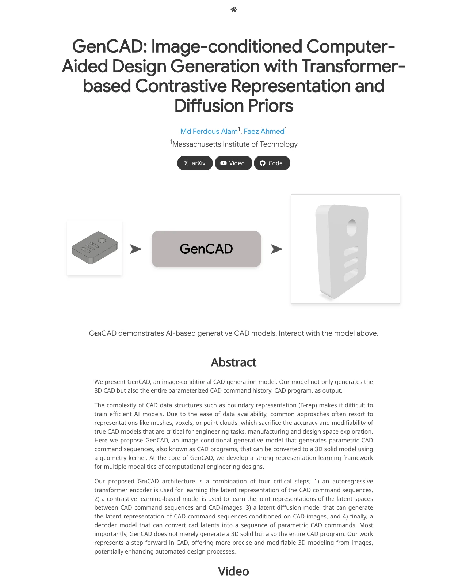
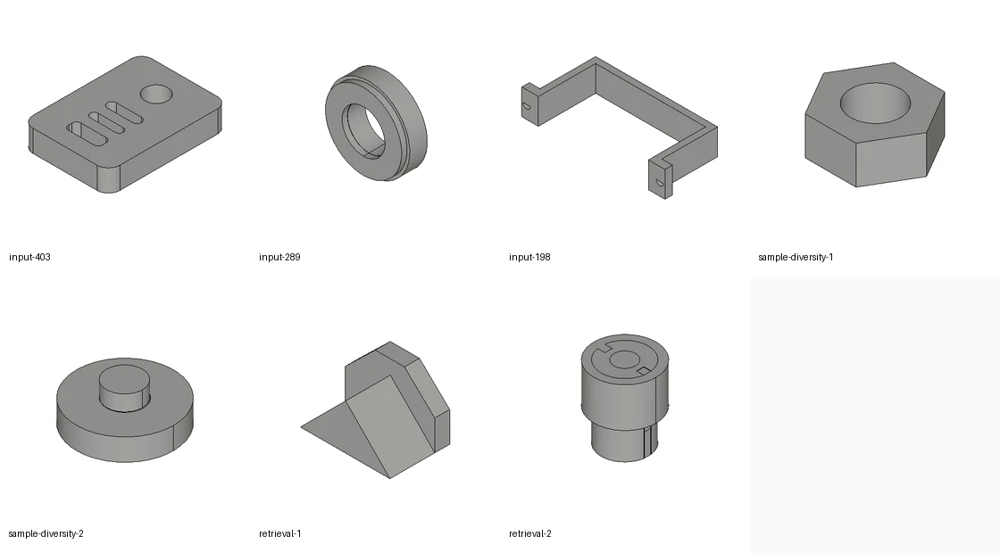

# GenCAD 深度拆解：从图像生成可编辑 CAD 程序，而不是只生成 3D 网格

> 原始项目页：[GenCAD](https://gencad.github.io/)  
> 论文：[arXiv:2409.16294](https://arxiv.org/abs/2409.16294) / [OpenReview TMLR 2025 PDF](https://openreview.net/pdf?id=e817c1wEZ6)  
> 代码：[ferdous-alam/GenCAD](https://github.com/ferdous-alam/GenCAD)  
> 作者：Md Ferdous Alam, Faez Ahmed（MIT）  
> 日期：2026-05-18  
> 标签：CAD / 3D Generation / Diffusion / Contrastive Learning / Engineering AI / Manufacturing

如果只看标题，GenCAD 很容易被归类成又一个“图像生成 3D”的研究项目。但它真正值得注意的地方不在于“从一张图变出一个三维形状”，而在于它试图生成**可编辑、可重放、可制造语义更强的 CAD 程序**。

这和常见的 mesh、voxel、point cloud 生成模型是两条路线。后者更像是在生成几何外壳：看起来像一个零件，但工程师后续很难继续修改设计意图。GenCAD 的目标则更接近工程软件里的真实对象：输出参数化 CAD command sequence，也就是 line、arc、circle、extrude 等建模命令组成的程序历史，再由几何内核转换成 solid model。

这篇文章不把 GenCAD 当作单纯论文摘要，而把它当作一个“CAD 生成系统雏形”来拆：它为什么重要，架构分了几层，开源代码里哪些部分说明它不是纯 demo，以及它距离真正工业级 CAD agent 还差什么。

---

## 1. 问题不是 3D，而是“可编辑的 3D”

3D 生成研究里，mesh、voxel、point cloud 都很自然：数据容易拿，网络容易训练，评价也相对成熟。但 CAD 场景的问题在于，工程设计并不只关心表面形状。

一个机械零件通常需要：

- 可以追溯的建模步骤；
- 参数可以修改，而不是只能雕 mesh；
- 能导出到下游制造、仿真、装配流程；
- 保留孔、槽、拉伸、草图平面等工程语义；
- 在设计空间探索时，可以让人或自动化系统继续编辑。

GenCAD 的核心主张是：从图像条件出发，直接生成 CAD command sequence，而不是先生成一个不可编辑的 3D 表面再反推 CAD。论文摘要明确说，它输出的不只是 3D CAD，还包括完整的 parameterized CAD command history / CAD program。

这点对 AI 工程工具很关键。未来真正有价值的 CAD agent，不应该只是“帮我画个看起来像支架的模型”，而应该能产生一个工程师能继续打开、修改、约束、导出和制造的设计对象。

---

## 2. GenCAD 的四层架构：先学 CAD 语言，再对齐图像，再扩散采样

项目页把 GenCAD 的架构概括成四步：

1. 用 autoregressive transformer encoder 学习 CAD command sequence 的 latent representation；
2. 用 contrastive learning 对齐 CAD command latent 和 CAD image latent；
3. 用 latent diffusion model 在图像条件下生成 CAD latent；
4. 用 decoder 把 CAD latent 还原成参数化 CAD commands。

换成工程视角，可以把它理解成三件事：

### 第一，CAD 程序语言模型

代码里的 `model/autoencoder.py` 定义了 `VanillaCADTransformer` 相关结构。它不是直接预测点云，而是把 command token 和 argument token 嵌入到 Transformer 中：

- command embedding：line、arc、circle、EOS、SOS 等命令；
- argument embedding：离散化参数；
- group embedding：草图-拉伸组等结构信息；
- encoder / decoder：把 CAD sequence 压到 256 维 latent，再解码回命令序列。

`config/configAE.py` 里也能看到这套表示的固定约束：`d_model=256`、`dim_z=256`、4 层 encoder / decoder、8 heads、`max_total_len` 等。

### 第二，图像-CAD 对齐层

`train_gencad.py` 里的 `ccip` 分支会加载 CAD autoencoder checkpoint，再构造 `CLIP(image_encoder, cad_encoder, dim_latent=...)`。默认视觉网络是 `resnet-18`，训练数据 loader 则使用 CAD image 和 command sequence 的配对。

这相当于为 CAD 程序和 CAD 渲染图像建立共同 embedding 空间：图像不只是条件输入，而是被拉到和 CAD latent 可比较、可检索、可条件生成的空间里。

### 第三，latent diffusion prior

`dp` 分支读取 `cad_embeddings.h5` 和 `sketch_embeddings.h5`，训练 `ResNetDiffusion + GaussianDiffusion1D`。这里扩散模型不是在像素空间或 mesh 空间里生成，而是在 CAD latent 空间里生成。

这是一条很务实的路线：让扩散模型只处理低维 latent，把“生成工程上合法的 CAD command sequence”的问题交给 decoder 和 CAD 表示本身。

---

## 3. 为什么它不是一个纯展示页：代码已经暴露了训练/推理管线

我检查了 GitHub 仓库当前 `main` 分支（HEAD `f5484cf`）。仓库不是一个只有论文图和 demo 的页面，而是包含了训练、推理、数据处理和 CAD 导出路径。

截至检查时，GitHub API 显示：

| 项目 | 数值 |
|---|---:|
| Stars | 2313 |
| Forks | 264 |
| 默认语言 | Python |
| 默认分支 | main |
| 公开 license | 未声明 |
| 公开 issues | 29 |
| 最新 push | 2025-07-14 |

本地浅克隆后，仓库约有 43 个 Python 文件、约 8k 行 Python 代码；同时包含数据/结果 JSON、图片资产、Dockerfile、conda/pip 依赖文件等。核心目录大致是：

- `cadlib/`：CAD primitive、extrude、sketch、visualize、geometry macro；
- `model/`：autoencoder、CLIP/CCIP、image encoder、diffusion prior；
- `trainer/`：autoencoder、CCIP、1D diffusion trainer；
- `utils/`：dataset、loss、CAD vector / point cloud / image utilities；
- `train_gencad.py`：三阶段训练入口；
- `inference_gencad.py`：从图像生成 CAD、导出 STL/PNG 的推理入口；
- `stl2img.py`：STL 可视化辅助。

README 还给出了 Docker 和手动安装两条路线，其中推理依赖 `pythonocc-core` / OpenCascade，并建议在 headless server 上用 `xvfb-run` 做可视化导出。这说明它面对的是实际 CAD 几何内核，而不是只在网页里渲染图片。

---

## 4. 生成、检索和多样性：同一套 embedding 的三种用途

项目页展示了三类能力。

### 图像条件 CAD 生成

输入是一张 CAD 渲染图，输出是可交互查看的 3D 模型。论文和网页强调：这不是单纯 solid 外观，而是 CAD program 生成。

### 同一图像的多样化采样

网页的 sample diversity 部分展示：同一张输入图像可以采样多个 CAD 结果。这正是 latent diffusion prior 的用武之地。对工程设计来说，这意味着模型不只是“复刻图像”，而是可以做候选设计探索。

但这里也要谨慎：多样性不等于工程可用性。CAD agent 真正需要的是多样性 + 约束满足 + 可制造性检查。GenCAD 解决了“从图像到 CAD 程序”的关键一步，但还没有把工程约束闭环做完整。

### 图像条件 CAD 检索

网页还展示了 retrieval：从约 7000 个 CAD programs 集合中，用图像 query 检索 top-3 CAD 程序。这个能力通常比生成更容易产品化：在企业 CAD 库里，用草图、截图或渲染图找相似零件，比从零生成更安全，也更容易被工程团队接受。

从这个角度看，GenCAD 的 contrastive representation 不只是中间模块，而可能是 CAD 数据库搜索、设计复用、零件推荐的基础层。

---

## 5. 对 AI 产品的启发：别生成“结果”，要生成“操作历史”

GenCAD 最值得借鉴的不是某一个模型细节，而是它的对象选择：它没有满足于输出终态几何，而是把生成目标放在 CAD command sequence 上。

这对很多 AI 工具都有启发：

- 视频编辑 agent 不该只输出 mp4，而该输出可编辑 timeline；
- 设计 agent 不该只输出 PNG，而该输出 Figma layer / constraint / component；
- 数据分析 agent 不该只输出图表，而该输出 notebook / SQL / pipeline；
- CAD agent 不该只输出 mesh，而该输出可修改的 CAD history。

也就是说，面向专业软件的 AI 生成，真正有价值的中间层通常不是“漂亮结果”，而是**可继续操作的程序状态**。

这也是为什么 GenCAD 虽然是研究项目，但它和 Agent/Workflow 产品的方向高度相关。它把图像理解、检索、扩散生成和参数化程序重建接到了一起，给出了“从感知输入到工程操作历史”的雏形。

---

## 6. 目前的限制：离工业 CAD Agent 还有几道门槛

GenCAD 很有启发，但不能直接等同于生产级 CAD automation。

第一，数据仍然来自 DeepCAD 风格的程序化 CAD 数据和渲染图。真实企业 CAD 往往包含装配关系、标准件、材料、容差、BOM、制造约束和历史命名规范，这些不只是几何问题。

第二，生成结果需要更强的合法性校验。CAD command sequence 能否稳定转 solid、是否自交、是否满足工程约束、是否可制造，都需要几何内核和规则系统闭环。

第三，当前仓库更像研究复现/实验管线。README 里 Evaluation 仍标注 “Coming soon”，license 未声明，checkpoint 和 dataset 依赖 Google Drive 下载，推理脚本里也有硬编码 checkpoint 路径。这些都是从论文代码走向产品系统时必须补齐的工程层。

第四，图像条件本身有歧义。同一张渲染图可能对应多种 CAD history。GenCAD 用 diffusion 给出多样性，这是合理的；但工程软件里还需要用户约束、尺寸标注、草图意图、材料/制造上下文等额外条件。

---

## 7. 结论：CAD 生成的正确方向，是“可编辑程序”而不是“漂亮外壳”

GenCAD 的价值在于，它把 CAD 生成问题重新拉回工程对象本身：不是生成一个看起来像零件的 3D 形状，而是生成能被 CAD kernel 解释、能保留 command history 的参数化程序。

这会让它比普通 3D 生成更难，但也更接近真实工业需求。

对做 AI 工具的人来说，GenCAD 给出的最大提示是：当 AI 进入专业软件，不要只追求最终渲染结果。真正能进入工作流的系统，必须输出可编辑、可审计、可继续执行的中间表示。

CAD 里是 command sequence；视频里是 timeline；设计里是 layer tree；代码里是 commit / diff / test harness。GenCAD 只是 CAD 领域的一个例子，但它指向的是同一个产品原则：**AI 生成的终点，不应该是死文件，而应该是下一轮人机协作可以继续操作的状态。**
