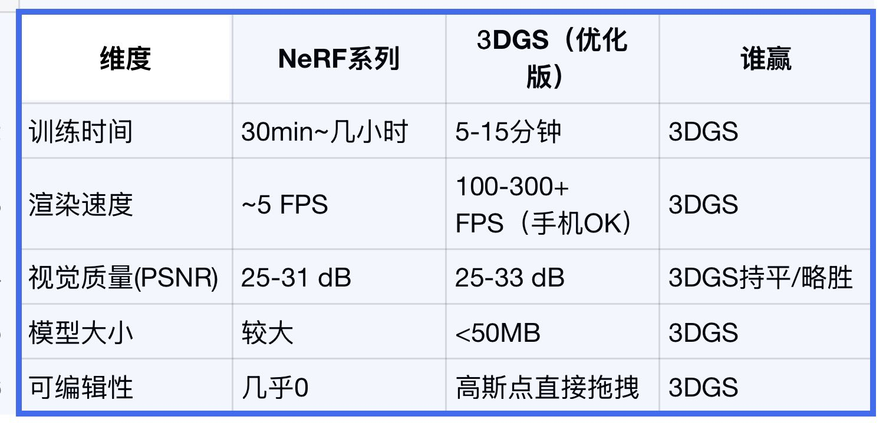

# Small-Object High-Fidelity Reconstruction: Why 3DGS Is Moving NeRF from Research Quality to Product Delivery

> Social source: [AYi on X](https://x.com/AYi_AInotes/status/2056612803482439775?s=20)  
> References: [3D Gaussian Splatting for Real-Time Radiance Field Rendering](https://arxiv.org/abs/2308.04079) / [NeRF: Representing Scenes as Neural Radiance Fields for View Synthesis](https://arxiv.org/abs/2003.08934) / [GaussianObject](https://arxiv.org/abs/2402.10259)  
> Date: 2026-05-19  
> Tags: 3DGS / NeRF / 3D Reconstruction / Gaussian Splatting / Mobile Rendering / Digital Twin

AYi’s X post captures the small-object reconstruction race in a very practical way: if we only compare visual quality, NeRF and 3D Gaussian Splatting (3DGS) are not separated by a simple generational leap. But once training time, rendering speed, model size, and editability are added to the product scorecard, 3DGS starts to look meaningfully different.

The post’s comparison can be summarized as follows:

| Dimension | NeRF family | Optimized 3DGS | Takeaway |
|---|---:|---:|---|
| Training time | 30 minutes to several hours | 5–15 minutes | 3DGS is better suited to fast capture-reconstruct loops |
| Rendering speed | Around 5 FPS | 100–300+ FPS, mobile-capable | 3DGS reaches interactive product territory |
| Visual quality (PSNR) | 25–31 dB | 25–33 dB | Similar quality, sometimes slightly better |
| Model size | Relatively large | Around 430k points can be compressed below 50MB | 3DGS is easier to distribute |
| Editability | Nearly zero | Gaussian points can be dragged, filtered, or cropped | 3DGS behaves more like an operable asset |

This article does not frame the topic as “3DGS beats NeRF again.” The more useful question is product-oriented: why is the real dividing line in small-object reconstruction not PSNR, but whether the result can be opened on ordinary devices, iterated quickly, edited as an asset, and distributed cheaply?

---

## 1. NeRF’s Strength: High Quality, Heavy Interaction Loop

The original NeRF paper proposed an elegant representation: a continuous 5D scene function that takes spatial location and viewing direction as input, outputs density and view-dependent color, and renders images through differentiable volume rendering. That idea made it possible to synthesize highly realistic novel views from sparse input images.

The engineering cost is equally clear: rendering an image requires querying a neural network many times along camera rays. Later systems such as Instant-NGP, PlenOctrees, TensoRF, and K-Planes dramatically accelerated the pipeline, but NeRF’s default product feel still leans toward “offline optimization plus rendered output,” rather than “scan with a phone and receive an interactive 3D product asset a few minutes later.”

Small-object scenarios are especially sensitive:

- e-commerce SKUs, figurines, parts, shoes, bags, and jewelry require fine details;
- users expect capture, reconstruction, preview, and correction within minutes;
- assets need to open directly in web pages, mobile viewers, AR previews, or editors;
- if each training run takes tens of minutes or hours, the operational loop breaks.

NeRF’s issue is not that the quality is bad. The issue is that the product loop is too heavy.

---

## 2. The Key Shift in 3DGS: From Implicit Network to Explicit Point-Like Asset

The original 3DGS paper states its ambition in the title: Real-Time Radiance Field Rendering. Instead of using an MLP that is repeatedly queried along rays, 3DGS represents a scene as a set of 3D Gaussians. Each Gaussian has position, scale, orientation, opacity, and color / spherical-harmonic attributes. Rendering projects them to the screen through visibility-aware splatting.

This changes three things.

First, training and rendering become closer to a graphics pipeline. 3DGS starts from sparse points produced by SfM / COLMAP, then optimizes them through densification and pruning. It is not a purely black-box network; it is a collection of explicit primitives that can be visualized, filtered, and manipulated.

Second, rendering enters the interactive zone. The 3DGS paper emphasizes real-time novel-view synthesis at 1080p; the project page further describes high-quality real-time rendering at the 100 FPS level. This is why WebGL, Unity, Unreal, and mobile viewers quickly emerged around splat assets.

Third, the asset can be compressed, cropped, and distributed. A NeRF “model” usually comes with a network, sampling strategy, and inference code. A 3DGS asset behaves more like a hybrid of point cloud and texture: it can be quantized, pruned, level-of-detail optimized, chunked, and streamed. For small objects, that maps directly to “upload an SKU and generate an embeddable 3D product card.”

---

## 3. Why Small Objects Are a Better First Landing Zone Than Large Scenes

Large-scale 3DGS still faces occlusion, dynamic objects, inconsistent exposure, large-asset chunking, and cross-device streaming issues. Small-object reconstruction has a more favorable shape:

1. **Controlled spatial extent**: object size, background, and camera trajectories are easier to standardize;
2. **Low capture cost**: a turntable, multi-view phone shots, or a short video can provide enough input;
3. **Clear asset boundary**: the background can be removed and the object isolated;
4. **Obvious delivery forms**: e-commerce display, AR try-on, robotic grasping, and part digital twins all want object-level assets;
5. **Direct quality judgment**: users ask whether the object looks correct, not whether a large navigable scene feels coherent.

That is why work such as GaussianObject matters: it applies 3DGS to sparse-view object reconstruction, aiming for high-quality object appearance rather than another large-scene demo.

In other words, small-object reconstruction is a low-friction entry point for 3DGS productization. It does not require city-scale capture complexity, and it is not as constrained by large-scale 4D streaming and player ecosystems. Once capture, reconstruction, compression, and preview are connected, the result can enter e-commerce, industrial inspection, education, game-asset capture, and creator workflows.

---

## 4. The Real Metric Is Not PSNR, but TTI: Time to Interactive

The post cites PSNR ranges: 25–31 dB for NeRF and 25–33 dB for 3DGS. That suggests both approaches already sit in a similar reconstruction-quality range. In real products, a more decisive metric may be TTI: Time to Interactive — the time from capture completion to the moment a user can interact with the asset.

A product-grade small-object reconstruction system needs to answer:

- How long does it take from uploaded images / video to a first asset?
- Can the user preview while training is still running?
- Can the pipeline finish on a low-end GPU or short cloud job?
- Can the asset render reliably in browsers and on phones?
- Can the file fit into a tens-of-megabytes distribution budget?
- If the user sees floaters, noise, or background residue, can they fix it directly?

NeRF may achieve excellent PSNR. But if each iteration is slow, rendering depends on specialized inference, and assets are hard to edit, it is difficult to turn into a daily tool. 3DGS is attractive because it brings “good enough quality” and “fast enough interaction” into the same usable range.

---

## 5. Editability Is the Underestimated Product Advantage of 3DGS

Many comparisons focus on speed and quality, but editability may matter more.

NeRF is an implicit representation: you can optimize the network, change the loss, or modify sampling, but it is hard to directly delete an erroneous region as you would with a mesh or point cloud. 3DGS is not traditional CAD or mesh either, but its basic units are explicit Gaussian primitives. In practice, engineers can:

- remove floaters and background noise;
- crop an object with a spatial box;
- filter Gaussians by density or opacity thresholds;
- generate levels of detail;
- chunk and stream local regions;
- convert between splats, point clouds, meshes, and texture-based pipelines.

This makes 3DGS feel more like an operable visual asset format, not just a trained neural network.

For content toolchains such as QCut / OpenClaw, this is also suggestive: future video, product-image, 3D-display, and short-drama assets may not all remain centered on 2D media. An interactive, croppable, compressible, web/mobile-deliverable 3DGS asset could become a new unit of creative material.

---

## 6. 3DGS Still Has Unsolved Problems

3DGS should not be mythologized. Several product-side issues remain difficult.

### 6.1 Geometry Is Not CAD

3DGS is strong at appearance reconstruction, but it is not parametric geometry. It may be enough for e-commerce display, but manufacturing, measurement, assembly, and simulation often need mesh reconstruction, CAD reconstruction, semantic segmentation, and scale calibration.

### 6.2 Highlights, Transparency, and Thin Structures Remain Hard

Glass, metal, reflective plastic, hair, transparent packaging, and thin wires challenge multi-view consistency. An explicit Gaussian representation does not magically solve all material problems.

### 6.3 Compression and Viewer Ecosystems Are Still Moving

Sub-50MB assets are already distributable, but a page containing dozens of SKUs still requires stronger compression, progressive loading, LOD, and caching. The asset format ecosystem is not yet as stable as glTF.

### 6.4 Capture Protocol Determines the Ceiling

Small-object reconstruction is not “just take a few random photos.” Lighting, background, focal length, exposure, motion blur, and viewpoint coverage all shape the result. In productization, capture guidance matters as much as the model.

---

## 7. Builder View: Where Should a Product Start?

If we treat 3DGS small-object reconstruction as a product opportunity, four entry points look especially promising.

### Entry 1: E-Commerce SKU 3D Conversion

Turn phone videos or multi-view product photos into embeddable 3DGS previews. The goal is not technical spectacle; it is reducing the cost of producing 3D product cards.

Key metrics: generation time, file size, mobile FPS, background cleanup, embed code, batch processing.

### Entry 2: Creator Asset Libraries

Let creators scan real objects into assets usable for video, AR, games, and short-form storytelling. 3DGS does not need to replace meshes at first; it can serve as a fast photorealistic preview layer.

Key metrics: editing experience, export formats, and integration with Blender / Unity / Unreal / Web viewers.

### Entry 3: Robotics and Industrial Inspection

Small-object digital twins can help robotic recognition, grasping, and simulation training. But this path demands scale, geometry accuracy, and robustness; pretty rendering alone is not enough.

Key metrics: scale calibration, geometric error, occlusion completion, and fusion with depth / point cloud / mesh pipelines.

### Entry 4: Agentic 3D Pipelines

Let an agent handle capture QA, training, anomaly detection, compression, preview generation, and publishing. The explicit asset structure of 3DGS is friendly to post-processing agents: remove floaters, crop backgrounds, compress, generate variants, and publish to CDN.

Key metrics: automated QA, failure retry, explainable quality reports, and end-to-end asset delivery.

---

## Conclusion: 3DGS Wins the Product Loop, Not Just the Paper Table

The important point in AYi’s comparison is not that 3DGS dominates NeRF on every axis. It is that 3D reconstruction is being evaluated by product metrics: training should be fast, rendering should be real-time, files should be distributable, and assets should be editable.

NeRF proved the quality ceiling of neural rendering. 3DGS is pushing the same idea toward an engineering path that is interactive, compressible, editable, and embeddable. For small-object reconstruction — especially e-commerce, creator assets, AR previews, and lightweight digital twins — that may be the shift from “impressive demo” to “daily usable tool.”

One-line summary: **the winner in small-object high-fidelity reconstruction is not simply the method with higher PSNR, but the method that becomes a deliverable, openable, modifiable, and distributable 3D asset faster.**
