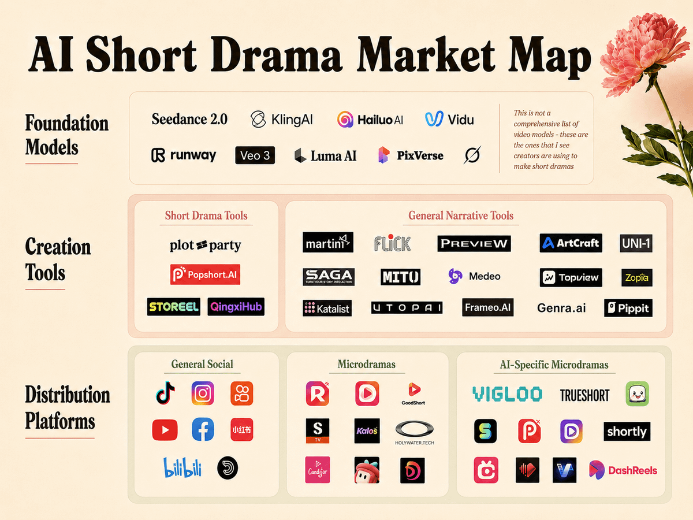

# AI Short Drama Market Map: The Real Opportunity Is Not “Generating Video,” but Rebuilding the Model–Tool–Distribution Stack

> Source: User-provided “AI Short Drama Market Map” image  
> Date: 2026-05-20  
> Tags: AI Short Drama / AI Video / Microdrama / Seedance / Kling / Hailuo / Vidu / Runway / Veo / Short Drama Export / Creator Tools / Distribution Platforms



The most valuable part of this “AI Short Drama Market Map” is not the number of companies it lists. It is the structure: the market is divided into three clear layers — **Foundation Models, Creation Tools, and Distribution Platforms**.

Those three layers map directly to three different problems in short-drama industrialization:

1. **The model layer** answers: can we generate usable shots?
2. **The creation-tool layer** answers: can we organize those shots into stories?
3. **The distribution-platform layer** answers: can we sell those stories to users?

If you only look at the first layer, it is easy to mistake AI short drama for a competition over “which video model is best.” But short drama has never been just a technical demo. It is a highly commercialized content category built around pacing, paid acquisition, conversion, and retention. The real competition will not stop at individual video generation models. It will happen across the whole chain: script structure, character assets, shot continuity, ad creatives, platform monetization, paid unlocks, and user feedback loops.

---

## 1. The core insight: AI short drama is no longer a single-tool market, but a three-layer ecosystem

The image divides the market into three main layers:

| Layer | Category in the map | Problem solved |
|---|---|---|
| Foundation Models | Seedance 2.0, KlingAI, Hailuo AI, Vidu, Runway, Veo 3, Luma AI, PixVerse, etc. | Generate high-quality video clips, shots, motion, and character visuals |
| Creation Tools | Short Drama Tools, General Narrative Tools | Package model capabilities into scripts, storyboards, characters, editing, previews, and batch workflows |
| Distribution Platforms | General Social, Microdramas, AI-Specific Microdramas | Acquire users, test content, convert payments, and host short-drama consumption |

There is an important caveat in the upper-right corner of the map:

> This is not a comprehensive list of video models — these are the ones that I see creators are using to make short dramas.

That matters. This is not a benchmark-style ranking of all video models. It is a creator-practice map. Short drama is not a paper benchmark: creators do not migrate tools just because one model has better single-shot quality. They care about stability, speed, cost, character consistency, controllability, workflow integration, and platform conversion.

---

## 2. Foundation Models: video models are the engine, not the whole vehicle

The Foundation Models layer includes:

- Seedance 2.0;
- KlingAI;
- Hailuo AI;
- Vidu;
- Runway;
- Veo 3;
- Luma AI;
- PixVerse;
- one additional logo that is not clearly labeled in the image.

This layer is the base of AI short drama. Without strong video models, there is no scalable shot production. But in short drama, model evaluation differs from generic “AI video wow factor.”

Short-drama creators do not need one amazing clip. They need repeated production of usable shots:

- Can the same character remain stable across multiple episodes?
- Can face, clothing, age, and personality stay consistent?
- Are dialogue shots, reaction shots, and conflict shots controllable?
- Does the output fit vertical-video platforms?
- Is generation speed fast enough for frequent iteration?
- Is the per-clip cost compatible with paid-acquisition ROI?
- Can it connect with narration, subtitles, dubbing, and editing tools?

That is why the map lists models creators actually use, not every available model. Short-drama production is pragmatic: **the best model is not always the strongest model, but the one that can enter the production pipeline**.

---

## 3. Creation Tools: the largest opportunity may be the “story operating system,” not the video model itself

The second layer, Creation Tools, is split into two groups.

### 3.1 Short Drama Tools

The visible short-drama-specific tools include:

- plot party;
- Popshort.AI;
- STOREEL;
- QingxiHub.

The opportunity here is direct: short-drama creators do not start from a blank prompt. They need an integrated workflow for genre, character relationships, conflict rhythm, episode cliffhangers, dialogue, storyboards, shot assets, subtitles, and ad creatives.

Short-drama structure is often more templated than generic video:

```text
Strong hook → status reversal → escalating conflict → emotional peak → misunderstanding / twist → next-episode cliffhanger
```

So a short-drama tool should productize more than “generate a beautiful video.” It should provide:

- genre templates;
- character cards and worldbuilding;
- episode outlines;
- cliffhanger design;
- multi-shot storyboards;
- character-consistency assets;
- narration, subtitles, and dubbing;
- trailers and ad creatives;
- A/B testing variants;
- multilingual localization.

If this category works, it will be closer to a real creator workstation than a thin wrapper around video models.

### 3.2 General Narrative Tools

The General Narrative Tools section includes martini, Flick, Preview, ArtCraft, UNI-1, SAGA, MITO, Medeo, Topview, Zopia, Katalist, UTOPAI, Frameo.AI, Genra.ai, Pippit, and others.

These tools are not necessarily short-drama-only, but they cover important modules in AI narrative production: scripts, assets, previews, ad videos, editing, characters, storyboards, product videos, and branded content.

This suggests that the AI short-drama tool ecosystem will follow two routes:

1. **Vertical short-drama tools**: built specifically around microdrama production, genre templates, episode structure, and platform adaptation.
2. **General narrative tools**: starting from ads, social videos, branded content, and UGC, then expanding into short-drama workflows.

Over time, these two routes will collide. Short-drama tools will try to become more general video-creation platforms. General narrative tools will try to capture the most profitable parts of short-drama production.

---

## 4. Distribution Platforms: short drama is not just a content format, but a distribution and monetization mechanism

The third layer, Distribution Platforms, is the easiest one to underestimate. The map splits it into three groups.

### 4.1 General Social

The visible logos include TikTok, Instagram, Kuaishou, YouTube, Facebook, Xiaohongshu, Bilibili, and one unclear black-logo platform.

These are not short-drama-only platforms, but they are the main battleground for audience acquisition and content testing. Short-drama creators use them to test:

- which story hook works best;
- which character setup spreads more easily;
- which cover and title produce higher click-through;
- which conflict scene makes the best ad creative;
- which country or language market converts better.

AI’s value here is not “auto-posting videos.” It is increasing creative iteration speed by an order of magnitude. If a short-drama team can rapidly generate 20 openings, 10 covers, 5 subtitle languages, and multiple ad variations, it can find winning creatives much faster.

### 4.2 Microdramas

The Microdramas section includes ReelShort, GoodShort, Kalos, Holywater.tech, Candjar, and several logos that are not fully clear.

These platforms host the short-drama consumption experience itself. Users are not just accidentally seeing a clip in a feed; they are entering a drama platform to watch, unlock, and pay.

This is the key difference between short drama and ordinary social video. Social platforms sell attention. Microdrama platforms sell continuous plot and emotional payment triggers. The model is closer to:

```text
mobile fiction + TikTok pacing + gamified payment funnel
```

AI can affect these platforms deeply:

- lower pilot-production cost;
- speed up localization;
- expand genre testing;
- validate long-tail story niches;
- move platforms from content purchasing toward owned content factories.

### 4.3 AI-Specific Microdramas

The AI-Specific Microdramas section includes Vigloo, TrueShort, Shortly, DashReels, and several logos that are difficult to identify from the image.

This category may be the most interesting one. These platforms do not merely treat AI as a backend efficiency tool; they position AI-generated or AI-assisted content as part of the product itself.

Three possible models may emerge:

1. **AI-native short-drama platforms**: focused on AI-generated or AI-assisted microdrama content.
2. **Creator platforms**: enabling individual creators to produce and distribute AI dramas.
3. **Interactive or personalized story platforms**: generating or remixing stories based on user preferences.

The third model is especially important. If AI only lowers production cost, it still serves the old short-drama model. But if AI can dynamically adapt plots to user preferences, short drama may move from linear content toward personalized entertainment.

---

## 5. The real business opportunity: the middle layer will be crowded, but valuable

From an industry-structure perspective, the model layer will be powerful but may not be the best entry point for most startups. Training foundation models requires large compute budgets, data, research teams, and distribution. It will likely be dominated by large model labs and platforms.

The distribution layer is also hard. A short-drama platform needs content supply, paid acquisition, payment conversion, localization operations, and copyright/compliance capabilities. It is not a pure software product.

That makes the Creation Tools layer — the middle layer — the most elastic opportunity for startups:

```text
Foundation Models → Creation Workflow → Distribution Platforms
```

This layer connects model capability to commercial outcomes. It does not need to train the best video model, but it must understand short-drama production deeply:

- which genres convert;
- how to create memorable characters;
- which shots require human control;
- which shots can be AI-generated in bulk;
- how to design episode rhythm;
- how to produce multilingual and multi-market variants;
- how to feed performance data back into scripts and ad creatives.

In other words, the defensibility of AI short-drama tools will not be mere model access. It will be **production taste + workflow + data loop**.

---

## 6. AI will reshape the edges of short-drama production before it owns the core

In the short term, AI may not replace full short-drama production immediately. The more realistic path is to automate high-frequency edge workflows first:

- ad openings;
- trailers;
- cover images;
- multilingual subtitles;
- dubbing and lip sync;
- plot summaries;
- localization rewrites;
- storyboard drafts;
- low-cost test clips;
- social cutdowns and paid-acquisition creatives.

These workflows have several shared traits:

1. They iterate frequently.
2. They do not require perfect continuity as much as the main episode.
3. Their performance can be measured quickly.
4. They connect directly to ROI.

Once these workflows are reliable, AI can move deeper into core episode production: character consistency, reusable scenes, full-episode storyboarding, continuous multi-episode assets, and production management.

This is why short drama is a strong commercialization scenario for AI video. It does not demand the artistic control of cinema, and it is more standardized than ordinary UGC. It is templated, commercial, and iteration-driven — exactly where AI toolchains can enter.

---

## 7. Implications for QCut and AI video tools: don’t build a generate button; build a short-drama production line

As product inspiration, the map gives one clear warning to AI video tools: **do not stop at “prompt in, video out.”**

Short-drama creators need a production line:

```text
Genre selection
  → plot outline
  → character design
  → episode structure
  → storyboard script
  → shot generation
  → dubbing and subtitles
  → editing and packaging
  → multi-version ad creatives
  → distribution testing
  → data feedback
  → next rewrite cycle
```

Video generation is only one part of this chain. The larger value lies in:

- parameterizing story structure;
- persisting character assets;
- binding shots to scripts;
- managing versions clearly;
- feeding distribution performance back into creation;
- wrapping multiple models into workflows that creators do not need to understand.

A real AI short-drama tool should feel more like a “short-drama production operating system” than a video-model shell.

---

## 8. Appendix: structured extraction from the market map

> Note: The table below is extracted from readable text in the image. Some platforms are visible only as logos without clear text, so they are marked as “unclear logo” to avoid false identification.

| Main category | Subcategory | Visible names |
|---|---|---|
| Foundation Models | Video foundation models | Seedance 2.0, KlingAI, Hailuo AI, Vidu, Runway, Veo 3, Luma AI, PixVerse, unclear logo |
| Creation Tools | Short Drama Tools | plot party, Popshort.AI, STOREEL, QingxiHub |
| Creation Tools | General Narrative Tools | martini, Flick, Preview, ArtCraft, UNI-1, SAGA, MITO, Medeo, Topview, Zopia, Katalist, UTOPAI, Frameo.AI, Genra.ai, Pippit |
| Distribution Platforms | General Social | TikTok, Instagram, Kuaishou, YouTube, Facebook, Xiaohongshu, Bilibili, unclear logo |
| Distribution Platforms | Microdramas | ReelShort, GoodShort, Kalos, Holywater.tech, Candjar, several unclear logos |
| Distribution Platforms | AI-Specific Microdramas | Vigloo, TrueShort, Shortly, DashReels, several unclear logos |

---

## Conclusion: the winning move is turning generation capability into a commercial loop

The greatest value of this market map is that it pushes us away from a single-model view of AI short drama.

AI short drama is not just a video-generation-model market. It is a new content industrial chain made of **foundation models, creation tools, and distribution platforms**. Models create possibility. Tools create production efficiency. Platforms create commercial conversion.

The eventual winners may not be the companies with the best single-frame quality. They will be the companies that can close this loop:

```text
faster generation → faster testing → faster localization → faster conversion → faster feedback into the next drama
```

Short drama is an emotion industry. AI does not replace emotion. It increases the speed of testing, packaging, distribution, and localization for emotional products by an order of magnitude.

That is the real market opportunity behind AI short drama.
