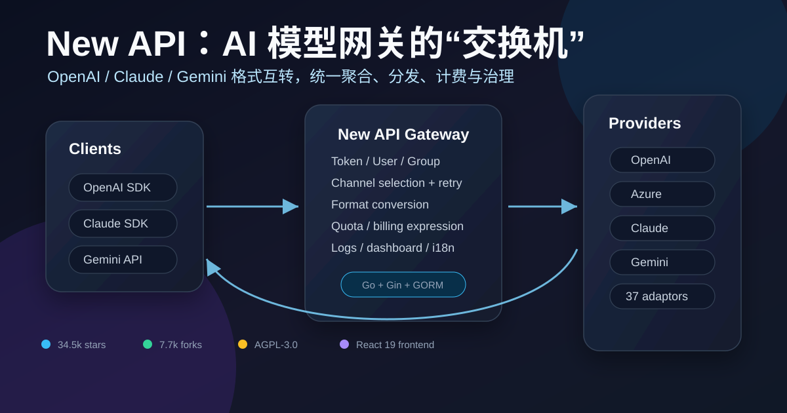

# New API 深度拆解：AI 模型网关正在从“转发器”变成企业级模型交换机

> 项目：[QuantumNous/new-api](https://github.com/QuantumNous/new-api)  
> 官网：[newapi.ai](https://www.newapi.ai)  
> 文档：[docs.newapi.pro](https://docs.newapi.pro/en/docs/api)  
> 来源：GitHub repository / README / source code / GitHub API  
> 文章日期：2026-05-20  
> 标签：New API / AI Gateway / OpenAI Compatible / Claude / Gemini / Model Routing / Billing / Enterprise AI Infrastructure



New API 最值得关注的地方，不是它“又做了一个 OpenAI-compatible proxy”，而是它把模型接入这件事，做成了一套更接近企业内部 **AI 模型交换机** 的基础设施。

它的 GitHub 描述很直接：这是一个用于聚合和分发的统一 AI model hub，支持把不同 LLM 转换成 OpenAI-compatible、Claude-compatible 或 Gemini-compatible 格式，并提供个人和企业模型管理的集中网关。仓库当前约 **34.5k stars、7.7k forks**，主语言是 Go，许可证为 AGPL-3.0。

从代码看，New API 不是一个简单的 HTTP reverse proxy。它同时处理：用户、令牌、分组、渠道、模型映射、格式转换、计费表达式、失败重试、敏感词检测、日志、仪表盘、支付、OAuth、缓存、WebSocket Realtime、Midjourney/Suno/视频任务等。换句话说，它试图接管的不只是“请求往哪里转发”，而是模型使用的整个运营面。

这篇文章想拆的是：New API 的架构到底解决了什么问题，为什么它代表了 AI 应用基础设施的一个真实趋势，以及如果把它放进企业内部，会有哪些价值和风险。

---

## 1. AI 模型接入的核心问题，已经从“有没有 API”变成“怎么治理 API”

过去两年，大部分 AI 应用最早的接入方式都很简单：

```text
App → OpenAI API
```

后来模型供应商变多了，链路变成：

```text
App → OpenAI / Azure / Claude / Gemini / DeepSeek / OpenRouter / Bedrock / 本地模型 ...
```

这时候问题开始复杂起来：

- 不同供应商的 API schema 不一样；
- 同一个模型在不同渠道的价格、延迟、限额、稳定性不一样；
- 企业内部不同用户、项目、团队需要不同配额；
- 失败时要不要自动重试、换渠道、降级；
- token 如何估算、预扣费、结算；
- 流式输出、工具调用、图片、音频、Realtime 等接口都要兼容；
- 管理员需要可视化地看用量、日志、余额、错误；
- 安全上还要处理 key 泄漏、权限、敏感词、请求体大小、跨域、OAuth。

所以模型网关的价值，不再只是“把 `/v1/chat/completions` 转发出去”，而是把模型供应商变成一个可治理的资源池。

New API 正是沿着这个方向发展：它对外尽量保持 OpenAI / Claude / Gemini 等客户端可用的接口，对内则管理渠道、计费、权限和转换逻辑。

---

## 2. 架构上，它是 Go 后端 + React 管理台 + 多适配器 relay 层

仓库规模能说明它已经不是玩具项目。粗略统计显示，去掉构建产物后，项目有约 **1989 个文件**，其中 Go 文件 571 个、TS/TSX/JSX/JS 前端文件超过 1200 个。核心代码分布大致是：

| 目录 | 作用 |
|---|---|
| `main.go` | 服务启动、资源初始化、缓存、后台任务、Gin server |
| `router/` | API、relay、dashboard、video 等路由 |
| `controller/` | 请求入口、管理接口、relay 调度 |
| `middleware/` | TokenAuth、Distribute、CORS、限流、统计、请求解压等 |
| `relay/` | OpenAI / Claude / Gemini / image / audio / embedding / rerank / responses 等 relay handler |
| `relay/channel/` | 具体供应商适配器，当前有 37 个 provider 目录 |
| `model/` | GORM 数据模型：用户、令牌、渠道、日志、订阅、价格等 |
| `service/` | 计费、token 估算、重试、任务、OAuth、转换等业务逻辑 |
| `setting/` | 系统设置、比例设置、性能设置、模型设置等 |
| `web/default/` | React 19 + TypeScript + Rsbuild + TanStack Router 的新管理台 |

启动流程也很典型：`main.go` 里先初始化资源和数据库，然后启用内存/Redis 缓存、渠道缓存同步、配置热更新、配额数据看板、渠道自动测试、Codex credential 自动刷新、订阅配额重置、上游模型更新检查、Midjourney/任务轮询、Pyroscope profiling，最后启动 Gin server，并把前端静态文件 embed 进 Go binary。

这说明 New API 的产品定位不是“SDK 层小工具”，而是一个长期运行的服务端控制面。

---

## 3. Relay 路由：同一个网关承接多种 API 语义

从 `router/relay-router.go` 可以看到，New API 对外暴露的路由已经覆盖了大量接口：

- `/v1/models`、`/v1/chat/completions`、`/v1/completions`；
- `/v1/responses`、`/v1/responses/compact`；
- `/v1/images/generations`、`/v1/images/edits`；
- `/v1/audio/transcriptions`、`/v1/audio/translations`、`/v1/audio/speech`；
- `/v1/embeddings`；
- `/v1/rerank`；
- `/v1/realtime` WebSocket；
- `/v1/messages` Claude Messages；
- `/v1beta/models/*path` Gemini；
- `/mj/*` Midjourney proxy；
- `/suno/*` Suno task；
- 以及视频任务相关接口。

更关键的是，它不是把这些路由直接转发到固定后端，而是会先经过一套统一 pipeline：

```text
Request
  → CORS / decompress / stats
  → TokenAuth
  → ModelRequestRateLimit
  → Distribute 选择渠道
  → request validation
  → token estimate
  → price / pre-consume billing
  → relay handler
  → retry / refund / settlement / log
```

`controller/relay.go` 里的 `Relay()` 函数很能体现这个设计：它先解析并校验请求，再生成 `RelayInfo`，做敏感词检查、token 估算、价格计算和预扣费，然后进入重试循环选择渠道并调用对应 relay helper。请求失败时，系统会归还预扣额度，并在必要时收取 violation fee。

这已经是一个完整的“模型交易处理系统”，而不是单纯的代理层。

---

## 4. Distribute 层是核心：模型请求被路由到“可用且合适”的渠道

New API 的渠道模型非常关键。`model.Channel` 里包含了：

- `Type`：渠道类型；
- `Key` / 多 key 信息；
- `BaseURL`；
- `Models`；
- `Group`；
- `Weight` / `Priority`；
- `Balance`；
- `ResponseTime`；
- `AutoBan`；
- `ModelMapping`；
- `StatusCodeMapping`；
- `ParamOverride` / `HeaderOverride`；
- `Setting` / `OtherSettings`。

这相当于把“一个上游 API key”抽象成可运营的资源对象。

在 `middleware/distributor.go` 里，请求进入 relay 前会先做分发：

1. 从请求中读取模型名；
2. 检查 token 的模型访问限制；
3. 读取用户当前 group；
4. 如果 playground 请求指定 group，则校验用户是否可用；
5. 尝试使用 channel affinity；
6. 否则从满足条件的渠道中选择一个；
7. 把选中的 channel、group、model mapping 等写入上下文。

这个设计很像负载均衡，但比普通负载均衡多了模型、用户、分组、价格、余额、权限和失败策略。对企业来说，这正是模型治理需要的抽象：应用只关心“我要用某个模型能力”，平台负责“这个请求应该走哪个供应商、哪个 key、哪个 group、什么价格、失败如何处理”。

---

## 5. 多格式互转：它在做 AI API 的“协议翻译层”

New API 支持的接口格式不仅包括 OpenAI-compatible，也包括 Claude Messages、Google Gemini、OpenAI Responses、Realtime、Rerank、Midjourney、Suno 等。

README 里明确列出了一些转换能力：

- OpenAI Compatible ⇄ Claude Messages；
- OpenAI Compatible → Google Gemini；
- Google Gemini → OpenAI Compatible；
- OpenAI Compatible ⇄ OpenAI Responses（仍在开发）；
- thinking-to-content 功能。

代码里也能看到相应转换。例如 `relay/channel/openai/adaptor.go` 中，Claude 请求可以通过 `service.ClaudeToOpenAIRequest()` 转成 OpenAI request；Gemini 请求可以通过 `service.GeminiToOpenAIRequest()` 转成 OpenAI request。反过来，针对 Gemini 路由也有 `GeminiHelper` 和 embedding handler。

这层协议翻译有很高价值，因为它让应用开发者少处理大量供应商差异：

```text
Claude client → /v1/messages → New API → OpenAI-compatible upstream
Gemini client → /v1beta/models/... → New API → OpenAI-compatible upstream
OpenAI client → /v1/chat/completions → New API → Claude / Gemini / OpenRouter / Azure / ...
```

当然，协议互转永远不可能 100% 无损。工具调用、system prompt、thinking、cache_control、multimodal content、safety settings、response schema 等字段，在不同供应商之间都有语义差异。New API 的价值在于把这些差异集中到网关层处理，而不是让每个业务服务重复写一套兼容逻辑。

---

## 6. 计费表达式：从“比例表”进化到可编程 billing contract

New API 里一个很值得关注的模块是 `pkg/billingexpr`。

它的设计理念是：**One expression, one truth**。也就是用一条表达式定义模型计费逻辑，包括输入、输出、缓存、图片、音频、阶梯价格、时段折扣、请求参数条件等。

示例形式类似：

```text
tier("base", p * 2.5 + c * 15 + cr * 0.25)
```

其中：

- `p`：输入 token；
- `c`：输出 token；
- `cr`：cache read token；
- `cc` / `cc1h`：cache create token；
- `img` / `img_o`：图片输入/输出 token；
- `ai` / `ao`：音频输入/输出 token；
- `len`：完整上下文长度，用于长上下文阶梯判断。

它还支持 `param(path)`、`header(key)`、`hour(tz)`、`weekday(tz)` 等函数，用于按请求体、header 或时间条件动态计费。

这个方向非常重要。因为现在模型定价已经越来越复杂：

- 有 cache hit / cache write；
- 有 long context tier；
- 有 reasoning effort；
- 有 audio/image/video token；
- 有 batch discount；
- 有不同供应商不同单位；
- 有企业内部自定义倍率。

如果还只用一个简单的 `model ratio` 表，很快就会失控。New API 把计费逻辑表达式化，本质上是在把 billing 从硬编码规则变成可配置合约。

---

## 7. 前端管理台已经不是“配置页面”，而是运营控制台

`web/default` 使用 React 19、TypeScript、TanStack Router、TanStack Query、Zustand、Base UI、Tailwind CSS、VChart、i18next 等。前端代码规模很大，说明管理台承担了大量功能。

从依赖和目录结构可以推断，这个 UI 不只是增删改查渠道，而是覆盖：

- 用户、token、渠道、模型；
- 日志和用量统计；
- dashboard 图表；
- 计费和价格配置；
- 订阅、支付、兑换码；
- 国际化；
- playground；
- 主题和响应式管理界面。

New API 的这点很现实：AI 网关如果只提供 YAML 配置，对个人开发者还可以接受；但一旦进入团队和企业，就必须有管理界面。因为配额、余额、渠道状态、失败率、日志、用户权限，都需要非代码方式持续运营。

---

## 8. 它最适合的用户，不是单个 demo，而是多模型、多团队、多渠道场景

如果你只是个人项目，直接用 OpenAI 或 OpenRouter SDK 可能更简单。New API 的价值主要出现在下面这些场景：

### 8.1 内部统一模型入口

企业内部多个服务都要调用模型时，可以统一接入 New API：

```text
Business apps → New API → 多家模型供应商
```

这样业务服务不再保存供应商 key，也不需要各自处理供应商差异。

### 8.2 多供应商成本和稳定性管理

同一个模型能力可能有多个渠道：官方 API、云厂商、第三方聚合、本地模型。New API 可以基于 group、priority、weight、retry、channel status 做分发。

### 8.3 对外提供统一 API 平台

如果一个团队想给内部或客户提供“统一 AI API 服务”，New API 已经包含用户、token、计费、支付、日志、配额等基础模块。

### 8.4 快速兼容不同客户端生态

很多工具只支持 OpenAI-compatible API；也有些工具开始支持 Claude 或 Gemini 原生格式。New API 的多格式入口可以减少客户端适配成本。

---

## 9. 风险和注意点：网关越强，责任越集中

New API 的能力很强，但也意味着部署者要承担更高的工程责任。

### 9.1 安全边界

模型网关保存大量上游 API key 和用户 token，是高价值目标。生产部署时必须关注：

- `SESSION_SECRET`；
- `CRYPTO_SECRET`；
- 数据库访问权限；
- Redis 安全；
- HTTPS；
- 管理员账户；
- 日志中是否包含敏感内容；
- 备份和恢复。

README 也明确提醒：多机部署必须设置 `SESSION_SECRET`；共享 Redis 必须设置 `CRYPTO_SECRET`，否则数据无法解密或登录状态不一致。

### 9.2 协议转换的边界

OpenAI、Claude、Gemini 的语义并不完全一样。网关可以降低适配成本，但不应该让开发者误以为所有模型都可以无损互换。特别是 tool calling、structured output、thinking、cache、multimodal content 等能力，仍然需要按模型特性测试。

### 9.3 计费准确性

预扣费、流式输出、失败重试、缓存 token、图片/音频 token 都会影响最终账单。企业部署时必须用真实请求回放验证计费表达式，不要只依赖默认比例。

### 9.4 AGPL-3.0 许可证

New API 使用 AGPL-3.0。对内部部署通常问题较小，但如果你修改后通过网络向外提供服务，AGPL 的源代码开放义务需要认真评估。

---

## 10. 为什么这个项目值得关注：AI 基础设施正在进入“模型运营”阶段

New API 这类项目的出现，说明 AI 应用工程化正在进入新阶段。

第一阶段是 **API 接入**：能调用模型就行。  
第二阶段是 **SDK 兼容**：让不同工具都能用 OpenAI-compatible。  
第三阶段是 **模型运营**：把模型当作企业资源管理，有权限、配额、计费、路由、审计、降级和监控。

New API 明显已经进入第三阶段。

它把模型供应商抽象为 channel，把用户能力抽象为 group/token，把价格抽象为 billing expression，把 API schema 差异抽象为 relay/adaptor，把运营需求抽象为 dashboard 和日志。这套抽象虽然复杂，但很贴近真实生产环境。

未来类似系统可能还会继续演化：

- 更细粒度的成本优化路由；
- 基于质量/延迟的自动模型选择；
- prompt、tool、response schema 的跨供应商标准化；
- eval 驱动的路由策略；
- 与企业 IAM、SIEM、FinOps 系统集成；
- 对 agent trace 和 tool use 的完整审计。

从这个角度看，New API 不是“另一个 one-api fork”，而是一个很典型的 AI gateway 产品雏形。

---

## 结语：模型网关的终局不是代理，而是控制面

New API 的核心价值可以用一句话概括：

> 它把不可控、分散、格式各异的模型 API，变成了可以被团队统一管理、路由、计费和审计的资源池。

对于个人开发者，它是一个强大的多模型聚合工具。  
对于团队，它是统一模型入口和成本控制面。  
对于企业，它代表的是 AI 基础设施里越来越重要的一层：模型运营控制面。

随着模型数量、接口形态和价格策略继续复杂化，应用直接接入单个供应商 API 的方式会越来越难维护。真正长期可持续的架构，很可能会在业务应用和模型供应商之间放一个这样的网关。

New API 的意义就在这里：它不是让模型调用变得更“酷”，而是让模型调用变得更可管理。
