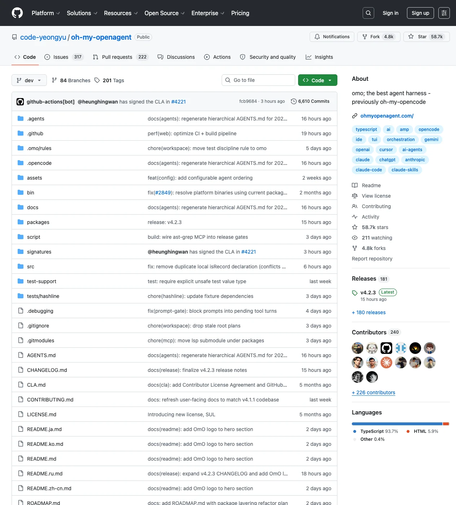

# Oh My OpenAgent 深度拆解：OpenCode 生态里的多模型 Agent Harness 正在变成“开发团队操作系统”

> 项目：[code-yeongyu/oh-my-openagent](https://github.com/code-yeongyu/oh-my-openagent)  
> 官网：[ohmyopenagent.com](https://ohmyopenagent.com/)  
> 文档：[Installation Guide](https://github.com/code-yeongyu/oh-my-openagent/blob/dev/docs/guide/installation.md) / [Overview](https://github.com/code-yeongyu/oh-my-openagent/blob/dev/docs/guide/overview.md) / [Team Mode](https://github.com/code-yeongyu/oh-my-openagent/blob/dev/docs/guide/team-mode.md)  
> 来源：GitHub repository / README / docs / source code  
> 项目：Oh My OpenAgent / omo，原名 oh-my-opencode  
> 文章日期：2026-05-20  
> 标签：OpenCode / Oh My OpenAgent / Agent Harness / Multi-Agent / Multi-Model / Claude Code / OpenAI / Gemini / Developer Tools / Agent OS



Oh My OpenAgent 这个项目最值得关注的地方，不是它又给 OpenCode 加了几个快捷命令，而是它把“AI 编程助手”的产品边界从单个聊天代理，推到了一个可配置、可观测、可扩展的 **agent harness**。

它的自我定位很直接：`omo; the best agent harness - previously oh-my-opencode`。仓库当前默认分支是 `dev`，最新 release 为 `v4.2.3`；GitHub 页面显示它已经有约 5.87 万 stars、4.8k forks。这样的热度说明开发者对“比单模型 CLI 更强的 agent 编排层”已经有真实需求。

这篇文章想拆的是：Oh My OpenAgent 到底在 OpenCode 之上补了什么，它为什么不是简单的 prompt pack，以及它代表的下一阶段 AI IDE / Coding Agent 竞争，会从“谁的模型更强”转向“谁的运行时更会组织工作”。

---

## 1. 从插件到 harness：它真正接管的是工作流，而不是 UI

从源码入口看，Oh My OpenAgent 是一个 OpenCode plugin。核心初始化流程大致是：

1. 加载并迁移配置；
2. 检查外部 skill plugin 冲突；
3. 注入 OpenCode client auth；
4. 读取用户和项目级 JSONC 配置；
5. 根据配置初始化 OpenClaw、team mode、tmux；
6. 创建 managers、tools、hooks；
7. 最后导出 OpenCode 能识别的 plugin hooks 和工具表。

这说明它不是一个“外层 wrapper”，而是把自己插进 OpenCode 的事件、消息、工具、配置和 session 生命周期里。`src/plugin-interface.ts` 里能看到它接入了 `chat.params`、`chat.message`、`tool.execute.before`、`tool.execute.after`、`experimental.chat.messages.transform`、`event` 等 hook。

换句话说，它控制的不是“给模型发一句更好的系统提示词”，而是整个 agent loop：

- 模型参数怎么改；
- 哪些消息要注入上下文；
- 哪些工具可以执行；
- 子 agent 如何启动；
- 后台任务怎么回收；
- session compact 时如何保留状态；
- 发生错误时如何降级、恢复、继续。

这就是 harness 的核心价值：模型只是发动机，真正让车能跑长途的是底盘、传动、刹车、仪表盘和维修系统。

---

## 2. 多模型不是卖点，而是调度策略

Oh My OpenAgent 文档里反复强调一件事：它不是锁定 Claude、OpenAI、Gemini 或某一家供应商，而是把不同模型放进不同角色里。

它内置 11 个 specialized agents，包括：

| Agent | 角色 |
|---|---|
| Sisyphus | 默认 orchestrator，负责规划、委派、持续推进 |
| Hephaestus | GPT-native 深度执行者，适合复杂实现和架构问题 |
| Prometheus | 战略规划者，通过 interview mode 澄清需求 |
| Atlas | 计划执行和 todo orchestration |
| Oracle | 只读架构顾问和复杂 debugging consultant |
| Librarian | 多仓库分析、文档查找、OSS 参考 |
| Explore | 快速代码库探索和 grep |
| Multimodal-Looker | 图片、PDF、图表等视觉材料分析 |
| Metis / Momus | 计划前分析和计划审查 |
| Sisyphus-Junior | 由 category 路由出的通用执行子 agent |

更关键的是 category system：用户不必手动决定“这一步用哪个模型”，而是描述任务类型，比如 `visual-engineering`、`deep`、`quick`、`writing`、`ultrabrain`。系统再把类别映射到模型、温度、prompt 和权限。

这其实是 coding agent 产品里一个非常重要的方向：**模型选择从用户操作变成 runtime decision**。

传统工具让用户在模型下拉框里切来切去；更好的 harness 会把模型当成资源池，把任务分类、预算、上下文窗口、工具权限和失败回退都编排进去。开发者不应该关心“这一步到底是 Claude、GPT 还是 Gemini”，开发者应该关心“这个子任务有没有完成、证据是什么、成本和风险是否可控”。

---

## 3. Tool + Hook + Manager：这是一个小型操作系统结构

项目代码规模很能说明问题：仓库里主要是 TypeScript，`src/` 下有 agent、hooks、tools、features、plugin、config、openclaw、mcp 等模块。粗略统计显示仓库有超过 2500 个文件，TypeScript 行数超过 30 万行；其中 hooks、tools、features 是三个最重的区域。

它的工具注册逻辑也很典型。基础工具包括：

- `grep` / `glob` / session manager；
- background task tools；
- `call_omo_agent`；
- `task` delegation；
- `skill` / `skill_mcp`；
- 可选 `interactive_bash`；
- 可选 hashline `edit`；
- 可选 task system；
- team mode 打开后额外注册 12 个 `team_*` 工具。

这些不是简单“工具越多越好”。源码里还能看到 `filterDisabledTools`、`experimental.max_tools`、低优先级工具裁剪、工具 schema normalization 等机制。换句话说，它知道工具数量本身会污染 agent 的决策空间，所以需要 runtime 层去做 gating、排序和剪枝。

Hooks 则负责另一类事情：把 agent 容易出错的地方变成制度。

比如：

- tool pair validator 防止工具调用/结果不配对；
- thinking block validator 检查模型输出格式；
- write existing file guard 降低误写风险；
- JSON error recovery 处理常见解析错误；
- model fallback 在模型不可用时切换；
- compaction context injector / todo preserver 在上下文压缩后保留任务状态；
- background notification 把后台任务完成信号带回主流程。

这就是为什么我更愿意把 Oh My OpenAgent 看成“agent OS”，而不是“agent 插件”。一个操作系统的核心不是应用图标，而是资源调度、权限边界、进程通信、错误恢复和可观测性。

---

## 4. Team Mode：从子任务委派走向多 agent 协作协议

仓库里最有意思的新方向之一是 Team Mode。它默认关闭，需要在 `~/.config/opencode/oh-my-openagent.jsonc` 或项目级 `.opencode/oh-my-openagent.jsonc` 中开启：

```jsonc
{
  "team_mode": {
    "enabled": true,
    "max_parallel_members": 4,
    "max_members": 8,
    "tmux_visualization": false
  }
}
```

开启后会暴露 12 个 `team_*` 工具，包括：

- `team_create` / `team_delete`；
- `team_send_message`；
- `team_task_create` / `team_task_list` / `team_task_update` / `team_task_get`；
- `team_status` / `team_list`；
- shutdown request / approve / reject。

Team spec 可以定义 lead 和 members，成员既可以是 `sisyphus`、`atlas`、`sisyphus-junior` 这样的 agent，也可以通过 category 路由。运行时状态保存在 `~/.omo/runtime/{teamRunId}/`，包括 state、inboxes、processed messages、tasks 等文件。

这点很重要：它不是“同时启动几个子进程然后等结果”，而是开始显式建模多 agent 之间的通信协议：

- 谁是 lead；
- 谁能广播；
- 每个成员的 inbox 在哪里；
- 消息如何原子写入；
- 任务如何 claim；
- shutdown 是否需要确认；
- crash 后如何 reclaim 中间状态。

这类协议一旦稳定下来，AI 编程助手就会从“一个模型在一个上下文里努力工作”，变成“多个有身份、有权限、有任务队列、有通信规则的 worker 在同一个项目里协作”。这更像软件团队，而不是 chatbot。

---

## 5. 它对 Claude Code / Codex / Gemini CLI 的启发

今天大部分 coding agent 产品还在竞争三件事：

1. 模型质量；
2. IDE 集成；
3. 工具调用能力。

但 Oh My OpenAgent 暴露出第四层竞争：**运行时组织能力**。

当上下文变长、任务变复杂、子 agent 变多，真正决定体验的会是：

- 能不能把需求澄清和执行分开；
- 能不能让 planner、reviewer、executor 扮演不同角色；
- 能不能保存任务状态，而不是压缩后失忆；
- 能不能把后台 agent 的结果可靠带回主流程；
- 能不能根据任务类型选择模型，而不是让用户手动切换；
- 能不能在失败时降级、重试、恢复，而不是一句“出错了”。

这也是为什么它和 Claude Code、Codex CLI、Gemini CLI 不是同一层产品。后者更像 agent runtime 或模型入口；Oh My OpenAgent 更像在这些入口之上搭了一层“组织系统”。它把模型、工具、hooks、skills、MCP、tmux、background task、OpenClaw integrations 都拉进一个可配置框架里。

如果说早期 AI IDE 的核心是“把聊天框放进编辑器”，下一阶段的核心就会是“把 agent 团队放进工程流程”。

---

## 6. 风险与代价：强 harness 也会带来复杂性

当然，这种路线并不免费。

Oh My OpenAgent 的能力越强，系统复杂度也越高：配置文件、provider auth、模型 fallback、工具权限、hook 顺序、team mode runtime、tmux integration、skills 和 MCP 都可能成为故障面。

从安装文档也能看出来，它强依赖用户对订阅和 provider 的选择：Claude、OpenAI、Gemini、GitHub Copilot、OpenCode Go、Kimi for Coding、Z.ai、Vercel AI Gateway 等选项会影响 agent 的默认路由。文档还明确提示，如果没有 Claude subscription，Sisyphus 体验可能不理想。

这给未来的 agent harness 提了一个产品挑战：

> 越强的编排层，越需要把复杂性藏在诊断、默认值和自动修复后面。

否则用户获得的是“理论上很强的系统”，实际体验却可能变成“我先 debug agent 的 debug 工具”。

Oh My OpenAgent 目前已经有 `doctor`、runtime logger、config schema、兼容迁移、postinstall validation 等机制，这些都是正确方向。长期看，谁能把复杂 agent runtime 做成“能自诊断、自解释、自恢复”的产品，谁就更可能赢。

---

## 7. 我的判断：Agent Harness 会成为 AI IDE 的护城河

我认为 Oh My OpenAgent 代表了一个很清晰的趋势：coding agent 的护城河不会只在模型，而会越来越在 harness。

模型会继续变强，但强模型放进弱 harness 里，仍然会遇到：上下文丢失、任务漂移、工具误用、权限混乱、无法并行、结果不可验证、失败不可恢复。相反，一个好的 harness 可以把多个“不完美但擅长不同事”的模型组织起来，让它们像一个团队一样工作。

Oh My OpenAgent 的价值正在这里：

- 它把 OpenCode 从单 agent 工作台扩展成多 agent orchestration layer；
- 它把模型从“用户手动选择”变成“按角色和任务路由”；
- 它把 hooks 当成工程纪律，而不是附加脚本；
- 它把 team mode 做成协议和 runtime state，而不是演示级并发；
- 它把 CLI、skills、MCP、tmux、OpenClaw integrations 都纳入同一个 agent OS 视角。

如果未来的软件团队真的会出现“一个人管理十几个 agent”的工作方式，那么这种 harness 很可能就是基础设施的一部分。

真正的问题不是“它能不能写代码”。真正的问题是：**它能不能长期、稳定、可审计地组织一群模型完成工程工作**。

Oh My OpenAgent 给出的答案是：可以，而且这条路才刚开始。
