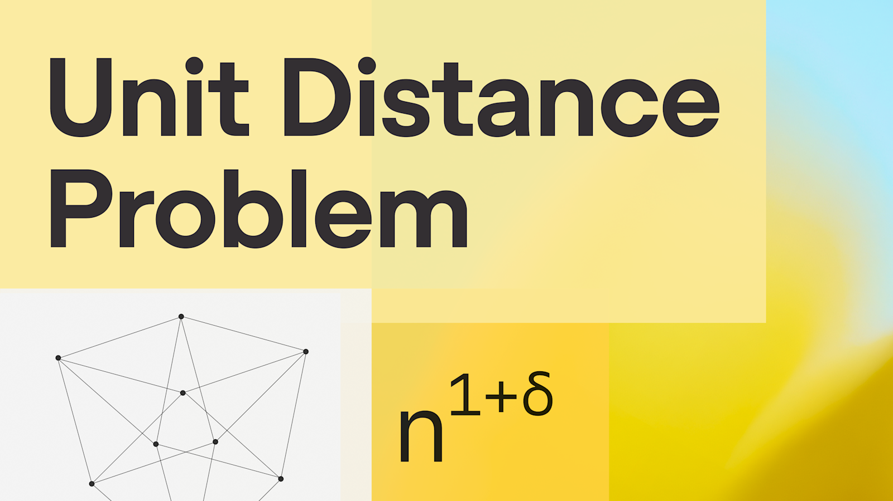
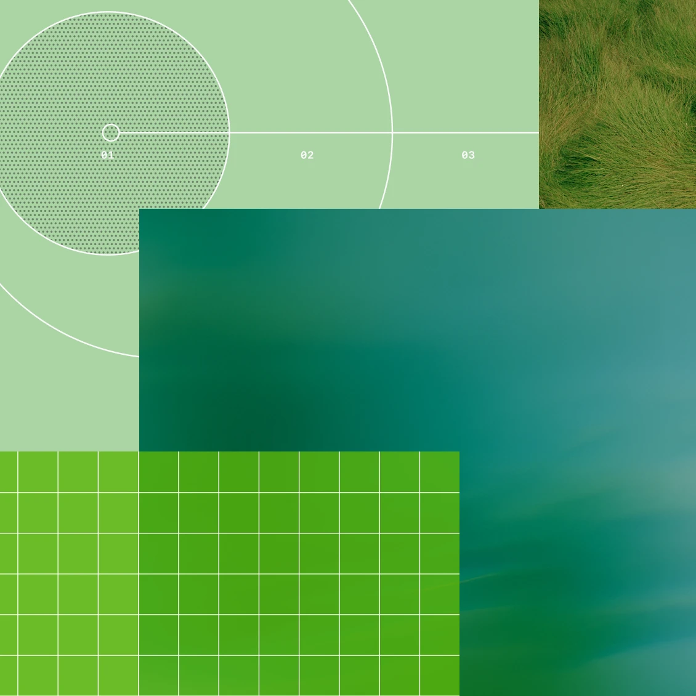

# OpenAI 离散几何突破：当 AI 第一次独立推翻 Erdős 单位距离猜想

> 原文：[An OpenAI model has disproved a central conjecture in discrete geometry](https://openai.com/index/model-disproves-discrete-geometry-conjecture/)  
> 证明：[Planar Point Sets with Many Unit Distances](https://cdn.openai.com/pdf/74c24085-19b0-4534-9c90-465b8e29ad73/unit-distance-proof.pdf)  
> 伴随评注：[Remarks on the Disproof of the Unit Distance Conjecture](https://cdn.openai.com/pdf/74c24085-19b0-4534-9c90-465b8e29ad73/unit-distance-remarks.pdf)  
> CoT 摘要：[Rewritten Chain of Thought for the Solution to the Unit Distance Problem](https://cdn.openai.com/pdf/1625eff6-5ac1-40d8-b1db-5d5cf925de8b/unit-distance-cot.pdf)  
> 来源：OpenAI  
> 作者：OpenAI  
> 发布日期：2026-05-20  
> 文章日期：2026-05-20  
> 标签：OpenAI / AI for Math / Discrete Geometry / Unit Distance Problem / Erdős / Algebraic Number Theory / Research Automation



OpenAI 这次公布的不是一个 benchmark、一个产品功能，或者一个“数学题刷分”演示，而是一个更有历史重量的事件：一个内部通用推理模型，给出了平面单位距离问题的反例，推翻了 Erdős 在离散几何中一个长期被广泛相信的上界猜想。

问题本身非常容易讲清楚：在平面上放置 $n$ 个点，最多能有多少对点之间的距离恰好等于 1？这个问题从 Paul Erdős 1946 年提出至今接近 80 年，是组合几何里最经典、最容易解释、但长期难以推进的问题之一。

真正的突破点不只是“AI 解了一道难题”，而是：模型没有被专门训练成单位距离问题求解器，也不是围绕这个问题写了一个人类设计的搜索 scaffold。OpenAI 的说法是，这个证明来自一个新的通用推理模型；证明随后由外部数学家检查，并由 Noga Alon、Thomas Bloom、W. T. Gowers、Daniel Litt、Will Sawin、Arul Shankar、Jacob Tsimerman、Victor Wang、Melanie Matchett Wood 等人写了 companion remarks。

这篇文章想拆的不是“AI 会不会取代数学家”这种泛泛问题，而是更具体的三件事：

1. 这个数学结果到底推翻了什么；
2. 为什么代数数论会突然出现在一个平面几何问题里；
3. 这件事对 AI research automation 的意义，为什么比一次比赛金牌更深。

---

## 1. 被推翻的不是“上界存在”，而是近线性信念

设 $u(n)$ 表示 $n$ 个平面点中最多可以形成多少条单位距离边。

几个尺度可以帮助理解这件事：

| 构造 / 上界 | 含义 |
|---|---|
| 一条直线上的 $n$ 个等距点 | 大约 $n-1$ 条单位距离，线性规模 |
| 方格构造及其缩放版本 | 约 $n^{1+C/\log\log n}$，比线性略快 |
| Spencer–Szemerédi–Trotter 上界 | $O(n^{4/3})$，目前最好的通用上界量级 |
| Erdős 猜想方向 | 本质上认为 $u(n)$ 不会显著超过 $n^{1+o(1)}$ |
| OpenAI 模型给出的反例 | 对无穷多个 $n$，构造至少 $n^{1+\delta}$ 条单位距离边 |

也就是说，新的证明不是把上界从 $n^{4/3}$ 改成某个更小数值，而是推翻了一个长期信念：最优构造不只是“比线性多一点点”，而是可以有一个固定多项式指数增益。

OpenAI 原文写道，原始 AI 证明没有给出显式的 $\delta$；但 Will Sawin 后续 refinement 显示可以取 $\delta=0.014$。这个数值本身不大，但意义很大：它把“指数里趋近于 0 的增益”变成了“固定正数指数的增益”。

---

## 2. 经典直觉：方格为什么曾经看起来像最优

Erdős 经典下界背后的直觉来自方格。

在 $m \times m$ 整数方格里，点数 $n=m^2$。如果选一个可以表示成两个平方和的整数 $k=a^2+b^2$，那么相差向量 $(a,b)$ 或其对称变换会给出许多长度为 $\sqrt{k}$ 的边；整体缩放 $1/\sqrt{k}$ 后，这些边就变成单位距离。

更代数一点地说，这和 Gaussian integers $\mathbb{Z}[i]$ 有关：形如 $a+bi$ 的整数可以把“两个平方和”写成范数问题。若 $k$ 有很多 $1 \pmod 4$ 的素因子，它就有很多表示为平方和的方式，于是方格里会出现很多同长度方向。

但这个机制有一个极限：方向数的增长大致只能给出 $n^{1+C/\log\log n}$ 这种“指数增益趋近 0”的量级。它很强，但不够强到产生 $n^{1+\delta}$。

所以在几十年里，一个自然信念是：方格类构造已经抓住了平面单位距离问题的本质。OpenAI 模型的反例，恰恰是在这个直觉之外找到了新的构造空间。


---

## 3. 新构造：从 Gaussian integers 跳到更深的代数数论

新证明的关键不是在平面里直接画出更聪明的点阵，而是先进入高维代数结构，再投影回平面。

OpenAI 证明摘要里的核心路线是：

1. 构造一族无穷 unramified tower 的 totally real number fields；
2. 这些扩张有 3-power Galois groups，且一组固定有理素数完全分裂；
3. 再 adjoining $i$ 得到相应的 CM field；
4. 在这些数域的嵌入空间里得到高维 lattice；
5. 找到许多元素，使它们在每个复嵌入下的绝对值都是 1；
6. 最后把 lattice 的窗口投影到复平面的一个坐标，得到平面点集和大量单位距离。

这听起来不像一个“初等几何问题”的常规工具箱。伴随评注也明确说，这个 argument 依赖 Ellenberg–Venkatesh、Golod–Shafarevich、Hajir–Maire–Ramakrishna 等思路。尤其是 Golod–Shafarevich theory 用来保证所需的 infinite tower 存在，即使还要让指定 Frobenius classes 变成 trivial。

最值得注意的地方是：模型不是在方格构造上做微调，而是把“单位长度差”翻译成“数域嵌入下绝对值为 1 的代数数”。这相当于把平面几何问题绕道到 class field towers、class numbers、discriminants 和 splitting primes 的世界里。

这也是为什么数学家会觉得惊讶：这些工具在代数数论里并不陌生，但它们居然可以对一个看似 elementary 的欧氏平面问题产生决定性影响。

---

## 4. 为什么这是 AI 数学的里程碑，而不是普通解题表演

OpenAI 原文中最强的一句话是：这是第一次由 AI 自主解决一个 prominent open problem、且该问题处在一个数学子领域的中心位置。

这里要小心区分几个层次：

- 不是“模型写出一个漂亮证明片段”；
- 不是“模型在已知题库或竞赛题上达到人类水平”；
- 不是“模型帮数学家检查、整理或补全证明”；
- 而是“模型提出了一个足以推翻长期猜想的构造，并且经由外部数学家消化、检查、重写和评价”。

伴随评注里的表达很有分量。Tim Gowers 说，如果这篇论文由人类写成并投给 Annals of Mathematics，他会毫不犹豫建议接收。Arul Shankar 则指出，模型的 CoT 里有相当多篇幅在尝试构造反例，而不是尝试证明社区广泛相信的上界；这显示出某种数学直觉、愿意尝试 long-shot approach 的倾向，以及把构造推进到底的能力。

这和“搜索所有证明路径”不一样。真正有意思的是模型选择了一个反社区默认信念的方向：不是证明 $n^{1+o(1)}$，而是怀疑它，并寻找反例。



---

## 5. 人类数学家的角色没有消失，反而更关键

这次事件很容易被误读成“AI 直接替代数学家”。但从公开材料看，更准确的描述是：AI 产生了一个高价值原始证明，人类数学家完成了验证、消化、简化、背景定位和意义解释。

伴随评注的摘要说得很清楚：它提供的是一个 short, digested, human-verified version。也就是说，原始 proof 可能足以包含关键思想，但社区真正能吸收这个结果，还需要人类把它放进已有文献、指出归因、抽象出可复用结构、评估它对其他问题的影响。

Thomas Bloom 在评注里提出了一个很好的判断标准：一个 AI-generated proof 是否重要，要看它是否让我们对问题有了新的理解。这个结果的答案是“moderated yes”：它告诉离散几何研究者，数论构造对这类问题可能比大家想象得更有力，而且需要的数论可以非常深。

这正是 AI for science 里比“自动产出答案”更重要的部分：

- 模型可以跨领域连接工具；
- 人类专家判断连接是否真实、有无意义、能否推广；
- 社区把一次结果转化成新的研究方向。

---

## 6. 对 AI research automation 的真正信号

这件事对 AI 的意义不在于“数学是最后堡垒之一，现在被攻破了”。更实际的信号是：模型开始具备一种研究自动化里非常关键的能力组合。

### 6.1 长链条一致性

数学证明不像普通问答。一个长论证只有在每一段都能接上、定义没有漂移、量词没有偷换、边界条件没有破坏时才成立。单位距离问题的反例需要从数域构造一路走到平面点集计数，任何一个环节松动都会失败。

### 6.2 跨领域迁移

这个问题表面属于 discrete geometry，但关键工具来自 algebraic number theory。模型能把一个领域里的结构拿来攻击另一个领域的问题，说明它不只是模式匹配局部技巧，而是在更高层做问题重编码。

### 6.3 反主流方向探索

社区长期相信某个上界，模型却沿着“也许反例存在”的方向深入。这对自动化研究很重要，因为很多突破不是把共识证明得更严，而是发现共识的隐藏漏洞。

### 6.4 可验证产物

数学的好处是 proof 可以被检查。相比很多 science discovery 任务，数学给了 AI 一个非常清晰的 verification surface：要么证明成立，要么不成立。这也是为什么数学会成为高级推理模型的关键试验场。

---

## 7. 也要保持冷静：这不是“模型已经会做所有数学”

这次结果很强，但仍然有几个边界需要明确：

1. **模型身份和训练细节没有公开**：OpenAI 称其为 internal model，不应把能力外推到所有公开模型。
2. **结果经过人类验证和重写**：最终社区可读版本不是纯原始输出直接发表。
3. **一个突破不等于稳定产线**：能在某个问题上产生 breakthrough，不代表能稳定解决任意开放问题。
4. **数学验证环境相对特殊**：proof 的可检查性比生物、材料、医学实验更清楚；迁移到实验科学还需要更复杂的现实反馈闭环。

所以更合理的判断是：这不是终点，而是一个明确的 phase change signal。AI 已经不只是“解题助手”，而开始在少数前沿问题上进入“提出原始可验证构造”的区域。

---

## 8. 最值得 QCut / OpenClaw 这类产品记住的点

对做 AI agent 产品的人来说，这个故事的启发不只是“模型更强了”，而是：**突破来自模型能力、任务选择、验证表面和人类审阅体系的组合**。

如果把它抽象成 agent workflow，大概是：

```text
高价值开放问题
  → 明确可验证目标
  → 模型生成候选构造/证明
  → 外部专家验证
  → 人类消化重写
  → 社区吸收为新研究方向
```

这比“让 agent 无限自主工作”更像真实的 research automation。关键不是完全去掉人，而是把人放在更高杠杆的位置：选择问题、设定评估、审查结果、解释意义。

在软件工程、视频生成、科学计算、材料搜索里，类似的模式也会成立：真正有用的 agent 不只是会执行命令，而是能产出可验证 artifact，并让专家快速判断它是否值得推进。

---

## 9. 结论：AI 开始进入“创造性研究”的硬区

OpenAI 这次单位距离问题突破之所以重要，是因为它同时满足了几个条件：

- 问题历史悠久、表述简单、社区熟悉；
- 猜想不是边缘 folklore，而是组合几何中的核心信念之一；
- 反例不是暴力搜索小规模配置，而是无穷族构造；
- 技术桥梁来自意外的深层数学区域；
- 结果被外部数学家验证、消化并公开讨论。

这让它不同于很多“AI 数学新闻”。它更像一个信号：当模型能够维持长链条推理、跨领域重编码问题、提出可检查的新构造时，AI 在研究中的角色会从“助手”变成“候选发现者”。

但候选发现者仍然需要人类数学家。真正的科学进展不是模型输出那一刻完成的，而是在专家验证、概念重写、社区理解和后续推广中完成的。

也许这正是这次事件最值得记住的地方：AI 没有让数学变得不需要人；它让人类数学家的判断、品味和解释能力变得更稀缺。
