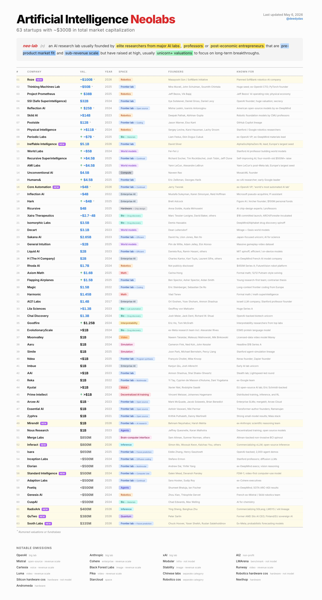

# 63 家 Artificial Intelligence Neolabs 到底在做什么：一家公司一段话

> Source: NotionHQ / Deedy Das “Artificial Intelligence Neolabs” map  
> Source URL: https://x.com/NotionHQ/status/2054625030970220834?s=20  
> Screenshot date in source: Last updated May 6, 2026  
> Tags: AI Neolabs / Frontier Labs / Robotics / World Models / AI for Science / Inference / Agents

这张图把 63 家估值很高、但多数还没有清晰产品市场匹配或收入规模的 AI “neolab” 放在一起。它们的共同点不是“都在做大模型”，而是都试图把 AI 研究能力迁移到一个更具体的控制点：机器人、世界模型、科学发现、数学、推理基础设施、企业 agent、语音、视频或脑机接口。

下面按图中的顺序，每家公司用一段话说明它大概在做什么。注意：其中不少公司仍处在 stealth 或半公开状态，以下描述以截图中的 founder / known-for / category 信息为主，并结合公开定位做归纳。

## 一家公司一段话

### 01. Roze（Robotics）

SoftBank 孙正义主导的机器人 AI 计划，目标不是先做一个聊天产品，而是把大模型、具身智能和 SoftBank 的机器人资产重新组合成面向物理世界的 AI 公司。

### 02. Thinking Machines Lab（Frontier lab）

Mira Murati、John Schulman、Soumith Chintala 等 OpenAI/PyTorch 背景成员创办的前沿模型实验室，重点是重新设计人和模型协作的交互方式，而不只是训练一个更大的基础模型。

### 03. Project Prometheus（Robotics）

Jeff Bezos 参与的 AI 操作型公司，方向指向 physical economy：把 AI 从软件助手推进到制造、仓储、物流和机器人执行层。

### 04. SSI (Safe Superintelligence)（Frontier lab）

Ilya Sutskever 创立的安全超级智能实验室，核心产品不是短期 API，而是围绕长期 AGI/ASI 安全路线训练下一代前沿模型。

### 05. Reflection AI（Frontier lab / Open source）

由前 DeepMind 研究者创办，主打美国开源前沿模型，希望在开放权重、推理能力和企业可控性之间找到 Anthropic/OpenAI 之外的路线。

### 06. Skild AI（Robotics）

CMU 教授 Deepak Pathak、Abhinav Gupta 创办，做机器人 foundation model：让不同形态的机器人共享感知、控制和操作能力，而不是为每台机器单独写策略。

### 07. Poolside（Frontier lab / Coding）

GitHub Copilot  lineage 的 AI 编程公司，方向是为软件工程训练专门的代码模型和开发环境，而不是把通用聊天模型简单接进 IDE。

### 08. Physical Intelligence（Robotics）

由 Stanford/Google 机器人研究者创办，目标是通用机器人智能：让机器人从互联网规模数据、仿真和真实操作中学习可迁移的物理技能。

### 09. Periodic Labs（Bio / Materials）

Liam Fedus 与 Ekin Dogus Cubuk 参与的材料科学 AI 公司，想用模型加速新材料发现，把“科学实验”变成可被模型规划、生成和验证的循环。

### 10. Ineffable Intelligence（Frontier lab）

AlphaGo/AlphaZero 核心人物 David Silver 的新实验室，可能围绕强化学习、搜索和通用推理能力，延续 DeepMind 式“先解决难题再产品化”的路线。

### 11. World Labs（World models）

李飞飞创办的空间智能公司，做 world model：让 AI 不只是识别图片，而是理解三维世界、物体关系和可行动的空间结构。

### 12. Recursive Superintelligence（Frontier lab / Continual）

Richard Socher、Tim Rocktäschel、Josh Tobin、Jeff Clune 等创办，核心关键词是 self-improving AI：让模型通过持续学习、工具使用和自动研究循环提升自己。

### 13. AMI Labs（World models）

Yann LeCun 与 Alexandre LeBrun 相关的欧洲 world model 公司，可能延续 LeCun 对 JEPA、预测式学习和非自回归世界建模的路线。

### 14. Unconventional AI（Compute）

MosaicML 创始人 Naveen Rao 的新公司，重点不是一个模型应用，而是围绕训练/推理算力、芯片或系统栈重新设计 AI compute。

### 15. Humans&（Frontier lab）

Eric Zelikman 与 Georges Harik 的研究型实验室，结合早期 Google 组织经验和 xAI 研究背景，可能探索更强的推理、合成数据和自主研究系统。

### 16. Core Automation（Frontier lab / Continual）

前 OpenAI VP Jerry Tworek 的“最自动化 AI Lab”设想，重点是把研究、实验、评测和训练流程本身自动化，让 AI 实验室变成高吞吐机器。

### 17. Inflection AI（Enterprise AI）

Mustafa Suleyman、Karen Simonyan、Reid Hoffman 创立的企业 AI 公司；Pi 助手之后，团队和技术大量转向 Microsoft，留下的是面向企业助手和模型服务的路线。

### 18. Hark（Enterprise AI）

Figure AI/Archer 创始人 Brett Adcock 个人资金支持的企业 AI 项目，可能把机器人、航空和企业自动化经验结合到面向公司流程的 AI 系统。

### 19. Recursive（Hardware / Chip design）

Anna Goldie 与 Azalia Mirhoseini 创办，做 AI 芯片设计：用机器学习自动探索布局、架构和优化，让芯片研发本身被 AI 加速。

### 20. Xaira Therapeutics（Bio / Drug discovery）

Marc Tessier-Lavigne、David Baker 等参与的药物发现公司，结合生成模型、蛋白设计和湿实验平台，试图把生物医药研发变成 AI 原生流程。

### 21. Isomorphic Labs（Bio / Drug discovery）

DeepMind/Alphabet 孵化的药物发现公司，基于 AlphaFold 相关能力，把结构生物学、分子设计和制药合作连接起来。

### 22. Decart（World models）

Mirage 与 Oasis 背后的 world model 公司，尝试从视频和交互环境中生成可实时探索的世界，把“看视频”推进到“进入世界”。

### 23. Sakana AI（Frontier lab / Efficient）

David Ha、Llion Jones、Ren Ito 在日本创办，强调高效、进化式、组合式 AI 系统，也把 AI for science 作为重要方向。

### 24. General Intuition（World models）

基于大规模 gameplay video dataset 训练世界模型，让 AI 从游戏视频中学习物体、行动、反馈和策略，最终迁移到仿真和现实任务。

### 25. Liquid AI（Frontier lab / Efficient）

MIT spinout，围绕 liquid neural networks 和高效端侧模型做低延迟、低功耗 AI，希望在设备端和企业边缘场景替代庞大云模型。

### 26. H (The H Company)（Enterprise AI）

法国前 DeepMind 研究者创办的模型公司，目标是企业级 agent 和自动化工作流，把模型能力打包进可部署的公司流程。

### 27. Rhoda AI（Robotics）

FutureVision robot platform 背后的机器人公司，已获大额融资，方向是把机器人硬件、感知系统和学习控制整合为可扩展平台。

### 28. Axiom Math（Math）

Carina Hong 创办，做形式数学与 Putnam 级解题能力，重点是让模型在可验证的数学环境中证明、搜索和泛化。

### 29. Flapping Airplanes（Frontier lab）

Ben Spector、Asher Spector、Aidan Smith 的年轻研究团队，主打 contrarian thesis：用非主流研究路线挑战大实验室的规模化默认假设。

### 30. Magic（Frontier lab / Coding）

来自欧洲的长上下文 AI 编程公司，目标是让模型理解更大代码库、长期保持项目状态，并完成跨文件软件工程任务。

### 31. Harmonic（Math）

Robinhood 创始人 Vlad Tenev 支持的数学超级智能公司，方向是用形式化验证和自动证明把数学推理变成可靠的机器能力。

### 32. AI21 Labs（Enterprise AI）

以色列 LLM 公司，早期做 Jurassic/Jamba 等模型和企业写作工具，定位是面向企业的语言模型、长上下文和可控生成平台。

### 33. Lila Sciences（Bio / Lab automation）

Geoffrey von Maltzahn 创办，做生物实验室自动化与 AI 科学平台，把实验设计、执行、数据回流和模型更新连成闭环。

### 34. Chai Discovery（Bio / Drug discovery）

OpenAI 支持的 biotech unicorn，做药物发现和分子/蛋白设计，目标是把生成式 AI 用到候选药物设计和验证流程。

### 35. Goodfire（Interpretability）

由顶级实验室解释性研究者创办，做模型可解释性和可控性工具：理解神经网络内部特征，并把这种理解变成安全和产品控制能力。

### 36. EvolutionaryScale（Bio / Drug discovery）

前 Meta 研究团队推出 ESM3 蛋白语言模型，目标是像生成文本一样生成、编辑和搜索蛋白质序列与结构。

### 37. Moonvalley（Video）

做授权数据训练的视频生成模型 Marey，核心差异是版权清晰、面向专业创作流程，而不是只追求社交媒体爆款效果。

### 38. Aaru（Simulation）

拿到 headline $1B Series A 的仿真公司，方向是构建可用于训练、评测和推演的模拟世界，让 AI 在虚拟环境里低成本学习。

### 39. Simile（Simulation）

Joon Park、Michael Bernstein、Percy Liang 的 Stanford agent-simulation lineage，关注社会模拟、多智能体行为和可观察的人类/组织系统。

### 40. Ndea（Frontier lab / Program synthesis）

François Chollet 与 Zapier 创始人 Mike Knoop 的 program synthesis 实验室，核心是让 AI 学会构造程序和抽象，而不仅是补全文本。

### 41. Imbue（Enterprise AI）

早期 AI lab unicorn，最初围绕 agent、推理和面向开发者的 AI 工具，试图让模型可靠完成多步任务。

### 42. AAI（Frontier lab）

Mobileye 相关的 Amnon Shashua、Shai Shalev-Shwartz 创办的 stealth lab，可能把视觉、自动驾驶和学习理论经验迁移到前沿模型。

### 43. Reka（Frontier lab / Multimodal）

前 Google 团队创办的多模态前沿模型公司，做文本、图像、音频/视频理解与生成，并服务企业模型部署。

### 44. Kyutai（Voice）

欧洲开源 AI lab，重点是实时语音和语音模型，试图在开放研究、低延迟交互和多语言语音助手之间建立欧洲路线。

### 45. Prime Intellect（Decentralized AI training）

做分布式训练、推理和强化学习基础设施，把全球闲置算力组织起来训练开放模型，挑战集中式 GPU 集群模式。

### 46. Arcee AI（Frontier lab / Open source）

面向企业小模型的公司，做 SLM、模型合并 mergekits 和 Arcee Cloud，重点是让企业拥有更便宜、可控、可私有化的模型栈。

### 47. Essential AI（Frontier lab / Open source）

Transformer 作者 Ashish Vaswani、Niki Parmar 创办，方向是面向企业任务的 AI worker，让模型真正进入表格、文档和业务操作。

### 48. Zyphra（Frontier lab / Open source）

以强小模型和 Maia stack 闻名，方向是训练高效、开放、可部署的模型，让小参数模型在实际任务中接近大模型体验。

### 49. Mirendil（Frontier lab / AI research）

前 Anthropic 科学推理团队成员 Behnam Neyshabur、Harsh Mehta 创办，定位是科学推理和研究自动化，把模型用于发现、证明和实验规划。

### 50. Nous Research（Agents）

去中心化训练和开源模型社区代表，做开放权重模型、RL、agent 和研究协作，强调社区驱动的模型能力扩散。

### 51. Merge Labs（Brain-computer interface）

Sam Altman 支持的非侵入式 BCI spinout，方向是在人脑信号和 AI 系统之间建立更高带宽、更低摩擦的交互接口。

### 52. Inferact（Inference）

Simon Mo、Woosuk Kwon、Kaichao You 等 vLLM/开源推理背景成员创办，核心是把高性能 LLM 推理商业化，服务模型部署和吞吐优化。

### 53. Isara（Frontier lab / Future prediction）

OpenAI 支持、展示过 2,000-agent demos 的未来预测公司，方向是用大量 agent 模拟市场、组织和事件演化。

### 54. Inception Labs（Frontier lab / Diffusion coding）

Stanford Stefano Ermon 相关的 diffusion LLM 公司，探索用扩散生成替代自回归生成，尤其用于代码和复杂文本任务。

### 55. Elorian（Frontier lab / Multimodal）

前 DeepMind 高管创办，主打视觉推理：让多模态模型更擅长看懂复杂图像、空间关系和需要推理的视觉任务。

### 56. Standard Intelligence（Frontier lab / Computer Use）

Galen Mead、Devansh Pandey 的 computer-use 模型公司，FDM-1 走 video-first 路线，让 AI 从屏幕视频中学习如何操作电脑。

### 57. Adaption Labs（Frontier lab / Continual）

前 Cohere 高管创办，方向是持续学习和企业模型适配，让模型能跟随公司数据、流程和反馈长期更新。

### 58. Poetiq（Agents）

前 DeepMind 团队，做 agent 与 ARC-AGI 级任务结果，重点是让系统在抽象推理、工具使用和长程任务中稳定提升。

### 59. Genesis AI（Robotics）

法国前 Mistral/Skild 机器人团队创办，做具身智能和机器人基础模型，把操作、仿真、学习控制和真实机器人训练连起来。

### 60. CuspAI（Bio / Materials）

Chad Edwards、Max Welling 创办的 AI chemistry 公司，用生成模型和材料搜索设计新分子、新吸附剂和工业化学材料。

### 61. RadixArk（Inference）

Ying Sheng、Banghua Zhu 创办，承接 SGLang、LMSYS、xAI 系谱，目标是把高效推理系统商业化，降低大模型服务成本。

### 62. QuTwo（Quantum）

前 AMD Silo AI CEO Peter Sarlin 创办，带有芬兰/EU 主权 AI 色彩，方向是量子与 AI 交叉或下一代计算平台。

### 63. Sooth Labs（Frontier lab / Future prediction）

Chuck Hoover、Yaser Sheikh、Ruslan Salakhutdinov 的预测模型公司，核心是概率预测：让模型不仅给答案，还能对未来事件分布建模。

## 这张图真正说明什么

第一，资本正在把“AI lab”从单一前沿模型公司拆成很多垂直研究公司：机器人、材料、药物、数学、视频、语音、芯片、仿真、推理服务都在吸收同一批大实验室人才。第二，这些公司的估值不是由当下收入解释的，而是由“如果某个基础能力突破，谁会控制新平台层”解释的。第三，真正值得跟踪的不是每家公司今天的 demo，而是它们选择的控制面：数据、算力、硬件、模型架构、评测、实验自动化，还是分发渠道。

如果只用一句话概括：这不是 63 家聊天机器人公司，而是 63 个赌注——赌 AI 下一层平台会落在现实世界、科学实验、软件工程、推理基础设施或人机接口中的哪一个。

## 按方向重新分类

下面这个分类不是按公司自我介绍，而是按它们最可能争夺的“控制面”来分。很多公司会横跨多个方向，例如 Periodic Labs 既可以放在 AI for Science，也可以被资本看成“AI scientist / frontier lab”的一种。

| 分类 | 代表公司 | 主要赌注 |
|---|---|---|
| 大模型训练 / Frontier Lab | Thinking Machines Lab、SSI、Reflection AI、Ineffable Intelligence、Recursive Superintelligence、Humans&、Core Automation、Sakana AI、Liquid AI、AAI、Reka、Arcee AI、Essential AI、Zyphra、Ndea、Inception Labs、Elorian、Adaption Labs | 继续训练更强、更高效、更可控的基础模型，或在开源、推理、持续学习、多模态、代码生成上形成差异化路线。 |
| AI 编程 / Software Agent | Poolside、Magic、Inception Labs、Standard Intelligence、Essential AI、Imbue、Nous Research、Poetiq | 把模型能力变成软件工程、电脑操作、企业任务执行和长程 agent 工作流。 |
| AI for Science / Bio / Materials | Periodic Labs、Xaira Therapeutics、Isomorphic Labs、Lila Sciences、Chai Discovery、EvolutionaryScale、CuspAI、Mirendil | 用模型做药物发现、蛋白质设计、材料搜索、实验规划和科学推理，把科研流程变成可自动化闭环。 |
| Robotics / Embodied AI | Roze、Project Prometheus、Skild AI、Physical Intelligence、Rhoda AI、Genesis AI | 把 AI 从屏幕和 API 推进物理世界，让机器人学会可迁移的操作、导航、制造和真实环境执行能力。 |
| World Models / Simulation | World Labs、AMI Labs、Decart、General Intuition、Aaru、Simile | 让模型理解、生成和预测三维世界、动态环境、社会系统或复杂仿真，而不只是处理文本和图片。 |
| Math / Formal Reasoning | Axiom Math、Harmonic、Mirendil、Ineffable Intelligence | 攻克数学证明、形式化推理、搜索和可验证推理，作为通用智能能力的硬测试场。 |
| Inference / Compute / Hardware | Unconventional AI、Recursive、Prime Intellect、Inferact、RadixArk、QuTwo | 降低训练和推理成本，重构 GPU 集群、芯片设计、分布式训练、高吞吐推理和下一代计算平台。 |
| Enterprise AI / AI Worker | Inflection AI、Hark、H、AI21 Labs、Essential AI、Imbue、Adaption Labs | 把模型接进企业流程、知识库、表格、文档、客服和内部操作系统，争夺工作入口。 |
| Media / Voice / Multimodal | Moonvalley、Kyutai、Reka、Elorian、Decart | 围绕视频、语音、视觉推理和多模态生成建立新的内容生产与理解平台。 |
| Prediction / Agent Simulation | Isara、Sooth Labs、Aaru、Simile | 用大量 agent 或概率模型模拟市场、组织、社会事件和未来分布。 |
| Brain-Computer Interface | Merge Labs | 在人脑信号和 AI 系统之间建立新交互接口，争夺人机协作的更高带宽入口。 |

## 按估值 / 融资规模排序

下面按原图 `VAL.` 列从高到低整理。这里的数值更接近“估值 / 市场资本化 / 传闻融资口径”，不等同于所有公司已经公开确认的累计融资额；`~`、`>`、`<` 和 `*` 保留原图中的不确定性标记。

| 排名 | 公司 | 估值 / 融资规模 | 方向 |
|---:|---|---:|---|
| 1 | Roze | ~$100B* | Robotics |
| 2 | Thinking Machines Lab | ~$50B* | Frontier lab |
| 3 | Project Prometheus | $38B | Robotics |
| 4 | SSI (Safe Superintelligence) | $32B | Frontier lab |
| 5 | Reflection AI | $25B* | Frontier lab / Open source |
| 6 | Skild AI | >$14B | Robotics |
| 7 | Poolside | $12B | Frontier lab / Coding |
| 8 | Physical Intelligence | >$11B* | Robotics |
| 9 | Periodic Labs | ~$7B* | Bio / Materials |
| 10 | Ineffable Intelligence | $5.1B | Frontier lab |
| 11 | World Labs | ~$5B | World models |
| 12 | Recursive Superintelligence | ~$4.5B | Frontier lab / Continual |
| 13 | AMI Labs | ~$4.5B | World models |
| 14 | Unconventional AI | $4.5B | Compute |
| 15 | Humans& | $4.5B | Frontier lab |
| 16 | Core Automation | >$4B | Frontier lab / Continual |
| 17 | Inflection AI | ~$4B | Enterprise AI |
| 18 | Hark | ~$4B* | Enterprise AI |
| 19 | Recursive | $4B | Hardware / Chip design |
| 20 | Xaira Therapeutics | ~$2.7-4B | Bio / Drug discovery |
| 21 | Isomorphic Labs | $3.5B | Bio / Drug discovery |
| 22 | Decart | $3.1B | World models |
| 23 | Sakana AI | $2.65B | Frontier lab / Efficient |
| 24 | General Intuition | ~$2B | World models |
| 25 | Liquid AI | $2B | Frontier lab / Efficient |
| 26 | H (The H Company) | $2B | Enterprise AI |
| 27 | Rhoda AI | $1.7B | Robotics |
| 28 | Axiom Math | $1.6B | Math |
| 29 | Flapping Airplanes | $1.5B | Frontier lab |
| 30 | Magic | $1.5B | Frontier lab / Coding |
| 31 | Harmonic | $1.45B | Math |
| 32 | AI21 Labs | $1.4B | Enterprise AI |
| 33 | Lila Sciences | >$1.3B | Bio / Lab automation |
| 34 | Chai Discovery | $1.3B | Bio / Drug discovery |
| 35 | Goodfire | $1.25B | Interpretability |
| 36 | EvolutionaryScale | >$1B | Bio / Drug discovery |
| 37 | Moonvalley | $1B | Video |
| 38 | Aaru | $1B | Simulation |
| 39 | Simile | $1B | Simulation |
| 40 | Ndea | <$1B | Frontier lab / Program synthesis |
| 41 | Imbue | $1B | Enterprise AI |
| 42 | AAI | >$1B | Frontier lab |
| 43 | Reka | $1B | Frontier lab / Multimodal |
| 44 | Kyutai | >$1B | Voice |
| 45 | Prime Intellect | >$1B | Decentralized AI training |
| 46 | Arcee AI | $1B | Frontier lab / Open source |
| 47 | Essential AI | $1B | Frontier lab / Open source |
| 48 | Zyphra | $1B | Frontier lab / Open source |
| 49 | Mirendil | $1B | Frontier lab / AI research |
| 50 | Nous Research | $1B | Agents |
| 51 | Merge Labs | $850M | Brain-computer interface |
| 52 | Inferact | $800M | Inference |
| 53 | Isara | $650M | Frontier lab / Future prediction |
| 54 | Inception Labs | ~$500M | Frontier lab / Diffusion coding |
| 55 | Elorian | ~$500M | Frontier lab / Multimodal |
| 56 | Standard Intelligence | $500M | Frontier lab / Computer Use |
| 57 | Adaption Labs | ~$500M | Frontier lab / Continual |
| 58 | Poetiq | <$500M | Agents |
| 59 | Genesis AI | ~$500M | Robotics |
| 60 | CuspAI | ~$500M | Bio / Materials |
| 61 | RadixArk | $400M | Inference |
| 62 | QuTwo | $380M | Quantum |
| 63 | Sooth Labs | $335M | Frontier lab / Future prediction |
