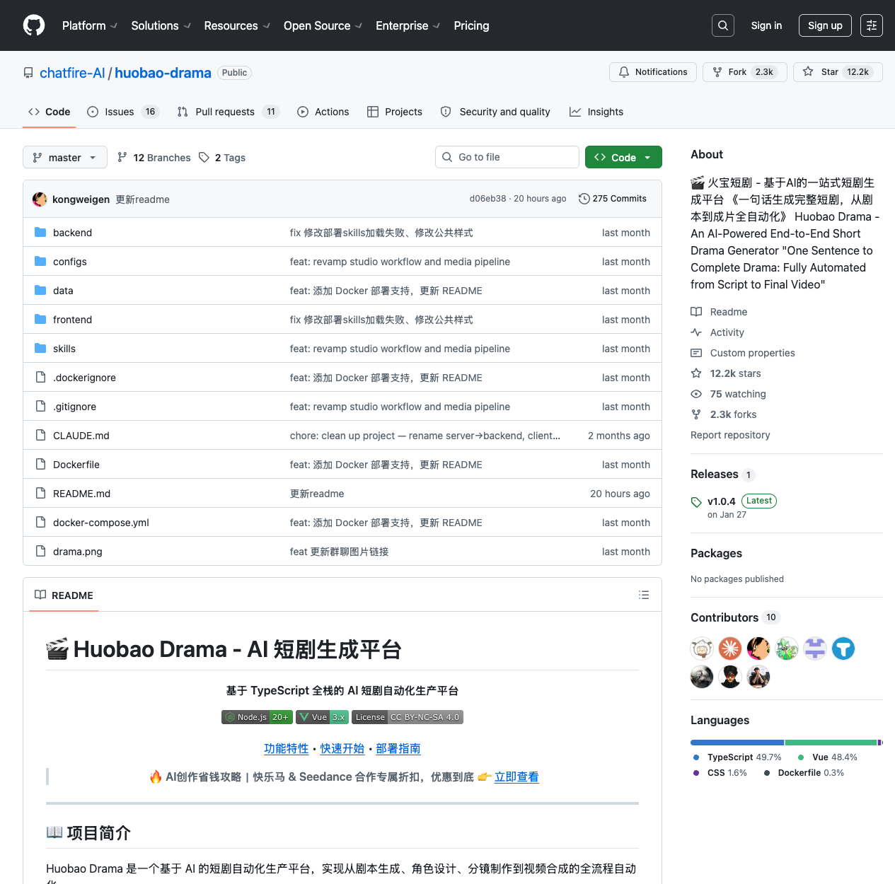
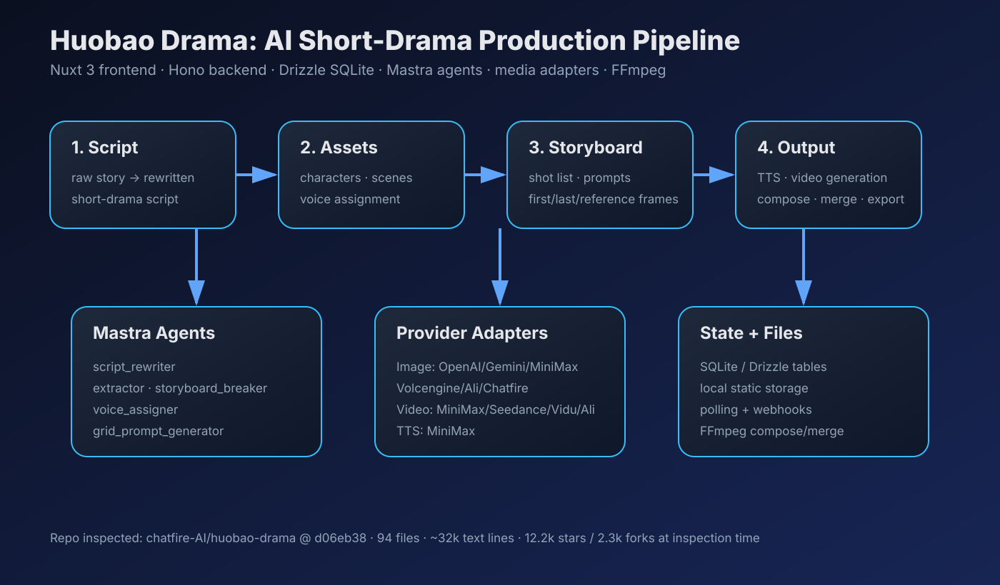

# Huobao Drama Deep Dive: The Hard Part of AI Short Drama Is Turning Generative Models into a Production Pipeline

> Repo: [https://github.com/chatfire-AI/huobao-drama](https://github.com/chatfire-AI/huobao-drama)  
> Inspected commit: `d06eb38` (`更新readme`)  
> Date: 2026-05-22  
> Tags: Huobao Drama / AI short drama / Nuxt 3 / Hono / Mastra / Drizzle / FFmpeg / provider adapters

Huobao Drama looks, at first glance, like an “one sentence to a complete short drama” open-source project. The repository tells a more useful story: its real asset is not a single text-to-image, text-to-video, or TTS call, but an attempt to turn those model calls into an **11-step production pipeline**: raw content, AI rewriting, character/scene extraction, voice assignment, storyboard breaking, character images, scene images, dubbing, shot images, video generation, and final compose/export. For creator tools, that matters more than a one-shot demo. Short drama production is stateful, iterative, asset-heavy, and full of rework.

## Repository snapshot

I inspected `chatfire-AI/huobao-drama@d06eb38`. GitHub API describes it as an AI-powered end-to-end short drama generator. The main language is TypeScript, the default branch is `master`, the repo was created on 2026-01-05, and it was last pushed on 2026-05-21. At inspection time it had about **12.2k stars and 2.3k forks**. The GitHub API did not return a standard license field, while the README shows a `CC BY-NC-SA 4.0` badge, so anyone planning commercial use should verify the code/content licensing boundary carefully.

This is not just a README concept. In a shallow clone, excluding `.git`, `node_modules`, `dist`, and similar generated folders, the repo contains about **94 files, 90 text files, and 32,034 text lines**. There are 56 TypeScript files, 8 Vue files, and 10 Markdown files. Most text/code lives in `frontend` (~17.4k lines) and `backend` (~13.5k lines). The repo already includes UI, API routes, database schema, agents, media-generation services, provider adapters, Docker deployment, and runtime skill documents.

## It is not “video generation”; it is production-state management

Many AI-video products stop at “enter a prompt, receive a clip.” Huobao Drama is more interesting because it first turns short-drama production into data models: `dramas`, `episodes`, `characters`, `scenes`, `storyboards`, `image_generations`, `video_generations`, `ai_service_configs`, `agent_configs`, `ai_voices`, `video_merges`, and related tables. Scripts, characters, scenes, shots, image tasks, video tasks, dubbing, and composed outputs become trackable SQLite objects rather than temporary variables.

That is essential for short drama. A one-minute demo can survive on a prompt. A multi-episode series needs reusable characters, reusable scenes, per-shot status tracking, failed-generation visibility, missing audio detection, and final composition state. Huobao Drama uses Drizzle ORM plus better-sqlite3 to persist that state, then exposes it through a frontend workbench and progress model.

## Frontend: a Nuxt 3 workbench, not a simple form

The frontend uses Nuxt 3, Vue 3, and TypeScript on port 3013 by default. The heaviest file is the episode workbench at `frontend/app/pages/drama/[id]/episode/[episodeNumber].vue`. It is not a simple CRUD page. It is a production console: the left sidebar shows the 11 sub-steps, the top bar shows the current stage and `pipelineProgress/11`, and the main area switches between script, asset, storyboard, production, and export panels.

That UI reveals the product assumption: users are not supposed to click “generate” once and walk away. They move back and forth between script, characters, scenes, shot images, videos, and composition. The workbench supports skipping rewrite, re-extracting, regenerating, batch generation, grid splitting, and shot assignment. The core idea is to make model outputs editable inside a film-production flow.

## Backend: Hono API, SQLite, and local static storage

The backend uses Hono, Node 20, Drizzle ORM, and better-sqlite3 on port 5679 by default. The entrypoint `backend/src/index.ts` mounts routes for `/api/v1/dramas`, `episodes`, `storyboards`, `scenes`, `characters`, `images`, `videos`, `upload`, `ai-configs`, `agent-configs`, `agent`, `compose`, `merge`, `grid`, `skills`, and `ai-voices`, while serving files under `data/` as `/static/*`.

The design is not a complex microservice system. Its priority is “run locally, persist state, save generated assets.” The README recommends Docker deployment as a single combined frontend/backend image on one port, with `data/` and `configs/config.yaml` mounted as volumes. For a creator tool, that is a practical starting point: get the full production loop working on one machine before introducing cloud queues and multi-user collaboration.

## Agent layer: five Mastra agents mapped to production jobs

Huobao Drama includes five Mastra agents: `script_rewriter`, `extractor`, `storyboard_breaker`, `voice_assigner`, and `grid_prompt_generator`. These are not generic chatbots. Each is bound to a specific `drama_id` / `episode_id` and database tool surface.

`script_rewriter` converts raw fiction or outlines into formatted short-drama scripts. `extractor` reads the script, extracts characters and scenes, and deduplicates them by character name or by location + time period. `storyboard_breaker` turns scripts into shot sequences with shot type, camera angle, movement, characters, dialogue, image prompt, video prompt, BGM, sound effects, and duration. `voice_assigner` maps characters to voices. `grid_prompt_generator` generates English prompts for character images, scene images, and grid images.

The important design is in `backend/src/agents/index.ts`: default prompts live in code, but the app also reads prompt/model/temperature settings from the `agent_configs` table and loads runtime skills from the `skills/` directory. In other words, the project does not pretend prompts are static. It treats short-drama operations as something production teams will keep tuning.

## Media generation: provider adapters are the survival layer

The project is not tied to one model vendor. The README lists image support for OpenAI, Gemini, MiniMax, Volcengine, Ali, and Chatfire; video support for MiniMax, Volcengine/Seedance, Vidu, and Ali; and TTS support for MiniMax. The code registers these through `backend/src/services/adapters/registry.ts` as image/video/TTS adapters.

That abstraction is a survival layer for AI creator tools. Model vendors change, APIs change, prices change, and quality changes. If product logic is coupled directly to one provider, the tool becomes brittle. The adapter layer separates the business action—generate an image, generate a video, generate speech—from vendor-specific request and response formats. The rest of the app can focus on tasks, status, result URLs, and failure reasons.

## The grid-image workflow is a real production detail

The `grid_prompt_generator` and `grid` workflow are especially revealing. The project supports `first_frame`, `first_last`, and `multi_ref` grid modes, with explicit prompt constraints such as exact rows x cols, exactly N visible panels, no merged panels, and no missing panels. It can then split the generated grid image and assign cells to different storyboard first frames, last frames, or reference images.

That is a productized detail. In real AI-image workflows, generating every shot separately is slow, expensive, and stylistically inconsistent. A grid image lets users generate several shot references at once and split them afterward. It is not the most elegant research solution, but it is exactly the kind of cost/control compromise that practical creator tools adopt.

## FFmpeg composition: the last mile from assets to deliverable video

Huobao Drama does not treat video generation as the end of the pipeline. The `compose` route supports single-shot composition and batch composition across an episode. The `merge` route merges an episode into a final video. Backend services such as `ffmpeg-compose.ts` and `ffmpeg-merge.ts`, together with `fluent-ffmpeg`, handle video, dubbing, subtitles, and final export.

This is the dividing line between an AI-video demo and an AI-short-drama product. Users ultimately want a publishable deliverable, not a folder of disconnected mp4, wav, subtitle, and image files. Huobao Drama brings generation, composition, and merge tasks into the same database-backed state machine. It is not yet a full cloud-rendering platform, but it has the skeleton of a production line.

## Engineering choices worth borrowing

First, the workflow is decomposed finely enough to create human intervention points. Eleven steps may look heavy, but they make the product a tool rather than a black-box magic button. Second, agents are bound to tools and database objects instead of being allowed to free-form chat. Their outputs become characters, scenes, storyboards, or voice assignments. Third, provider adapters let the platform follow the model ecosystem. Fourth, local SQLite plus filesystem storage keeps deployment friction low, which is useful for individual creators and small teams.

## Current limitations

The project is still closer to an early, local-first production tool than a mature collaborative studio. SQLite plus local `data/` is great for trying the loop, but multi-user collaboration, permissions, job queues, retry policy, cost accounting, asset versioning, and cloud rendering would need more system design. The adapter registry also contains signs of work in progress, such as comments that the Chatfire video API format is not yet confirmed. And because GitHub does not expose a standard license for the repo, commercial users should verify licensing before building on it.

More broadly, the hard part of AI short drama is not just automating each step. It is maintaining character consistency, shot continuity, story rhythm, audio-video sync, and acceptable batch cost. Huobao Drama provides the workflow structure, but final quality still depends on model capability, prompt quality, user review strategy, and provider reliability.

## Who should study it

If you are building AI video tools, short-drama export workflows, creator platforms, agentic workflows, or multi-model media generation systems, Huobao Drama is worth studying. It does not showcase a frontier model. It shows a more practical product question: once images, video, TTS, and LLMs are all callable, how should a product orchestrate them into a usable content-production system?

In one sentence: Huobao Drama’s value is not the slogan “one sentence to a drama,” but the way it turns short drama into persistent, retryable, editable, composable production objects. The next AI-short-drama competition may not be won by the flashiest generation button, but by the team that turns model capability into a stable, cheap, controllable content factory.
