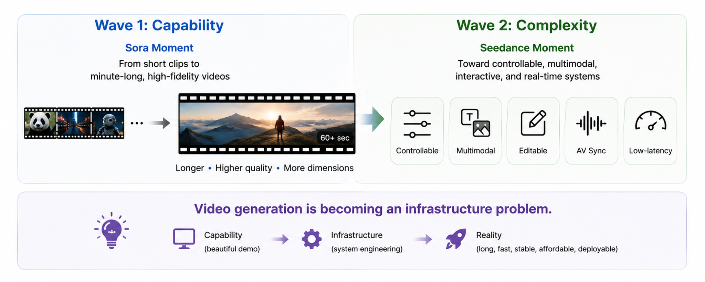
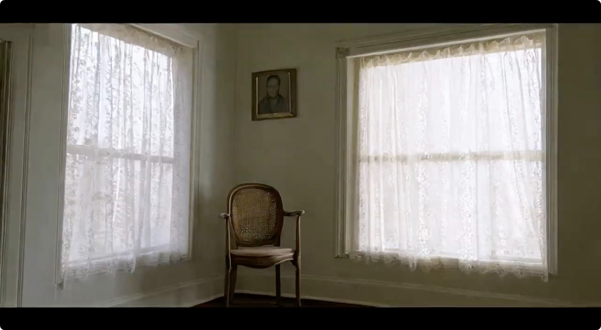
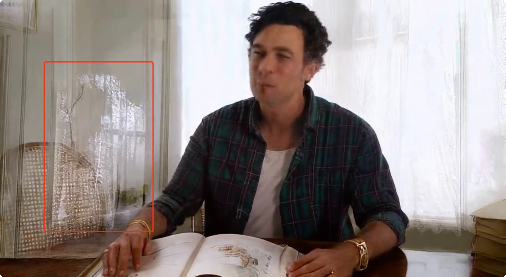
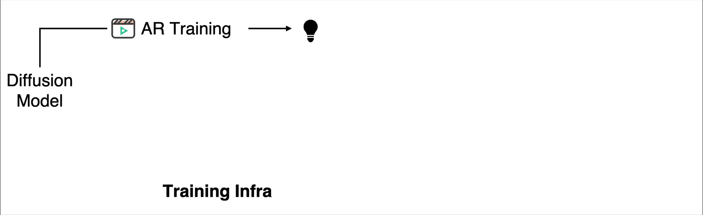
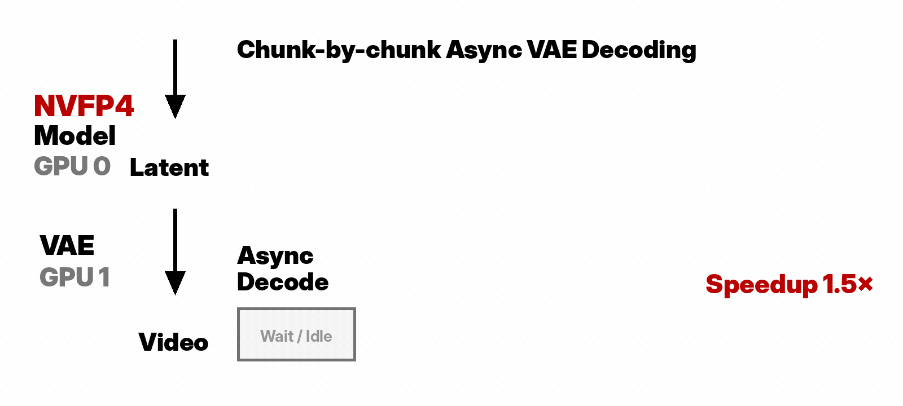
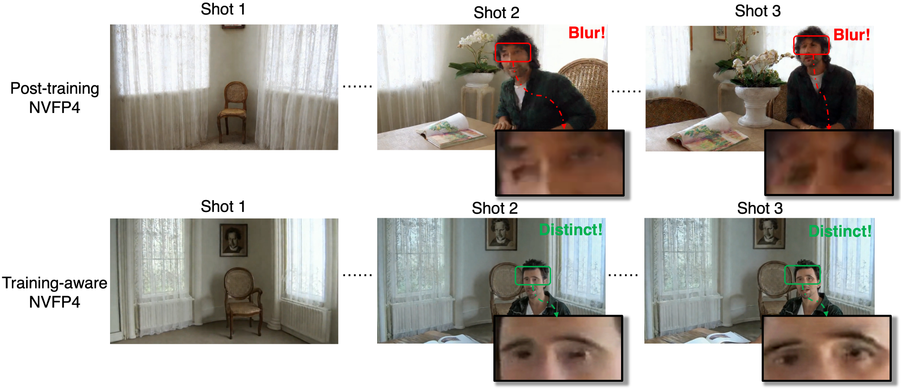
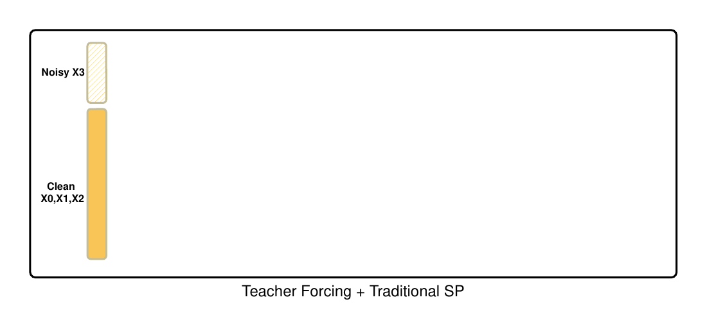

# NVIDIA EAI 深度拆解：视频生成真正的瓶颈正在从模型能力转向基础设施

NVIDIA EAI 这篇《Why Video Gen Is an Infra Problem》最值得注意的地方，不是它又展示了一个“更长、更快、更好看”的视频模型，而是它把 AI 视频生成的竞争问题重新定义了一遍：**视频生成已经不只是模型能力问题，而是端到端基础设施问题。**

过去一年，视频生成的叙事大多围绕 Sora、Veo、Seedance、Kling、Runway、Hailuo 这类模型的视觉质量、运动一致性、镜头语言和时长上限。但真正进入产品化后，用户并不是在体验一个孤立的 DiT denoiser；用户体验的是一个必须把记忆、解码、调度、压缩、并行、低精度推理和像素交付全部串起来的系统。

这篇文章的核心判断可以压缩成一句话：**漂亮 demo 证明“能生成”，基础设施决定“能不能长期、稳定、低成本、低延迟地生成”。** 对 QCut、AI 短剧、视频 Agent、广告生成、虚拟拍摄这类产品来说，这个判断非常重要，因为它把竞争焦点从“谁的模型截图更惊艳”推到了“谁能把生成视频做成可持续生产流水线”。

## 1. Demo 和系统是两种完全不同的评估对象

一个漂亮样片能证明模型学到了一些运动、外观和语义结构。但产品系统需要回答另一组问题：角色能否在一分钟内保持一致？下一个 shot 会不会忘记前一个 shot？用户能否足够快地拿到可播放的像素？这套东西能否在真实显存、成本和部署预算里跑起来？

NVIDIA EAI 的文章把这个差异说得很清楚：demo 可以用一次成功输出评价，infrastructure 要在多 prompt、长时长、多镜头、有限硬件和真实服务约束下评价。也就是说，视频生成的评价对象正在从“单次生成质量”变成“持续生成能力”。

这对产品团队意味着：不要只问模型能不能生成 60 秒视频，而要问系统如何维护跨镜头记忆、如何避免错误积累、如何做流式输出、如何把 decode 和 denoise overlap 起来、如何让低精度不破坏时序稳定性。

## 2. 长视频不是短视频拼接，而是在线记忆问题

最容易误导人的直觉是：如果模型能生成一个 10 秒好视频，那 60 秒视频就是生成 6 次再拼起来。NVIDIA EAI 明确指出这不成立。长视频改变了问题性质：后续片段依赖前面片段，人物身份要保持，房间布局要保存，镜头运动要自然延续，镜头切换时该变的要变、不该变的要留下。

这就是“记忆”成为核心系统组件的原因。长视频系统必须决定哪些信息要记住、哪些要刷新、哪些要压缩、哪些要忘掉。理论时长和有效时长不是一回事：模型技术上能生成 60 秒，不代表这 60 秒内的视觉一致性、全局记忆和部署效率都可用。

文章里的 ghosting 例子非常典型：第一帧是空房间，但最后一帧仍然残留早期画面的“幽灵”。这不是单纯美学问题，而是记忆机制没有干净更新的问题。对于长视频生成，错误不是一次性发生后结束，而是会被 autoregressive history、KV cache、latent history 和后续条件继续传播。

## 3. 实时不是 DiT FPS，而是端到端像素交付

很多视频模型讨论会把速度简化为 denoising 的速度，尤其是在多步 diffusion pipeline 中，DiT denoiser 确实长期占据主要延迟。但随着 few-step generation、autoregressive decoding、KV caching、低精度推理进入主流，隐藏系统成本开始浮出水面：VAE decoding、KV cache 更新、同步、显存搬运、CPU-GPU transfer、runtime scheduling。

CausVid 把双向视频 diffusion 改造成 autoregressive few-step generator，并通过 KV cache 在单 GPU 上实现 9.4 FPS 流式生成。LTX-Video 则从另一个方向说明同一件事：它把 Video-VAE 和 denoising transformer 联合设计，通过高压缩 latent space 报告 faster-than-real-time generation。两者都说明，视频生成速度已经不能只看“模型内部 FPS”。

真正的产品指标应该是：用户什么时候拿到可播放的像素？如果 denoiser 很快，但 VAE 解码、数据搬运、同步和多镜头调度拖慢尾延迟，用户体验仍然不是实时。

NVIDIA EAI 的系统图把 LongLive 2.0 作为一个端到端基础设施来看：训练、few-step distillation、NVFP4 执行、KV-cache 管理、parallel dequantization、asynchronous decoding 不是分开的优化点，而是同一个 runtime 目标下的协同设计。

## 4. VAE 解码和调度会变成产品级瓶颈

短视频时代，把 VAE decoding 当作固定 tax 也许还能接受；长视频时代，这会误导系统设计。VAE decoding 不只是“最后一步”，它影响端到端延迟、峰值显存、流式行为和 runtime pipeline 的形状。

文章提出的 chunk-by-chunk asynchronous VAE decoding 很有产品含义：模型可以继续生成后续 latent chunk，同时 VAE 解码前面的 chunk。这里的关键不是某个单模块更快，而是 pipeline 的重叠、调度和吞吐形状发生变化。

这对 AI 视频产品尤其重要。很多工具在 demo 中可以等待完整视频生成完再播放，但真正的交互式剪辑、短剧生成、镜头预览和 Agent 自动迭代，需要系统尽快吐出可审查的片段。异步解码、分块输出、progressive preview 会决定创作者是否愿意把它放进工作流。

## 5. 低精度不是压缩技巧，而是训练-推理对齐问题

LongLive 2.0 论文题目中的 NVFP4 很容易被理解成“为了省显存的低精度格式”。但 NVIDIA EAI 这篇文章强调了更深的一层：在 autoregressive long video 中，量化误差不是孤立的。误差会进入生成历史，被存入 KV cache，再条件化未来片段。

因此，低精度不是简单 post-training compression，而是 training-serving alignment。数值格式、KV cache、LoRA handling、dequantization kernel 都会影响部署系统是否稳定。

图中 training-aware NVFP4 和 post-training NVFP4 的对比说明：如果训练和推理世界不一致，跨多个 shot 的细节会更容易丢失或漂移。视频生成的低精度优化，不能只看单帧质量或单 kernel speed，而要看长时序误差如何累积。

## 6. LongLive 2.0 的真正定位：把训练和服务当成一个系统

LongLive 2.0 最有价值的不是某个单点技术，而是它把长视频生成拆成一组基础设施瓶颈，并把这些瓶颈放进同一个设计空间：

| 系统挑战 | LongLive 2.0 的对应设计 |
|---|---|
| 长时长生成 | Autoregressive long-video generation 和 multi-shot inference |
| 跨镜头一致性 | Global-level / shot-level attention sinks |
| 端到端延迟 | Parallel dequantization 和 asynchronous VAE decoding |
| 显存与部署成本 | NVFP4 W4A4 inference 和 NVFP4 KV cache |
| 训练扩展 | Balanced sequence parallelism 和 chunk-aware VAE encoding |
| few-step generation | Standalone DMD LoRA |

分布式训练也暴露同样问题：更多 GPU 不自动等于更高效。在 teacher forcing 下，朴素 sequence parallelism 会把 clean history 分散到多个 rank，却把 noisy target 和 loss 集中在一个 rank，造成计算不均衡。Balanced SP 的价值就在于它不是单纯“并行更多”，而是让训练布局适配 autoregressive long-video 的真实计算结构。

## 7. 对 AI 视频产品的启发：模型只是供应链的一环

这篇文章对产品团队最重要的启发是：视频生成的未来竞争会越来越像云基础设施、编解码器、推理 runtime 和创作工作流的混合体。

如果要把视频生成做成真正的生产工具，需要同时解决：

1. **记忆机制**：角色、场景、镜头语言、物体关系如何跨 shot 传递。
2. **解码链路**：VAE/decoder 如何异步、分块、可预览地输出。
3. **低精度稳定性**：W4A4、NVFP4、KV cache 压缩如何避免长时序误差传播。
4. **调度系统**：多请求、多镜头、多版本、多 Agent 迭代如何排队和复用资源。
5. **训练-服务闭环**：训练时看到的条件、数值格式、chunk layout 和服务时保持一致。
6. **产品级反馈**：用户需要的不是单个样片，而是可修改、可重试、可比较、可交付的流水线。

这也是为什么“AI 视频生成”最终不会只是模型公司之间的较量。它会变成模型、GPU、runtime、workflow tool、asset memory、editing surface、review loop 之间的系统竞争。

## 结论：视频生成正在进入基础设施阶段

Sora 之后，行业已经知道大模型可以生成令人惊讶的视频。Seedance 2.0、CausVid、LTX-Video、LongLive 2.0 这些工作则把问题推向下一层：视频生成如何变长、变快、变稳定、变便宜、变可部署？

NVIDIA EAI 这篇文章的价值在于，它把“AI 视频”从模型排行榜问题重新拉回工程现实：下一代视频系统不会只由更好的 denoiser 定义，而会由更长记忆、更快 decode、更安全量化、更自然并行和真实延迟预算下的像素交付能力定义。

对创作者工具和视频 Agent 来说，这意味着一个新的判断标准：**不要只看模型能生成什么样片，要看系统能否持续交付可控的视频生产能力。**

## 参考来源

- NVIDIA EAI: [Why Video Gen Is an Infra Problem](https://research.nvidia.com/labs/eai/blogs/video-gen-is-an-infra-problem/)
- LongLive-2.0: [An NVFP4 Parallel Infrastructure for Long Video Generation](https://arxiv.org/abs/2605.18739)
- Seedance 2.0: [Advancing Video Generation for World Complexity](https://arxiv.org/abs/2604.14148)
- CausVid: [From Slow Bidirectional to Fast Autoregressive Video Diffusion Models](https://arxiv.org/abs/2412.07772)
- LTX-Video: [Realtime Video Latent Diffusion](https://arxiv.org/abs/2501.00103)
