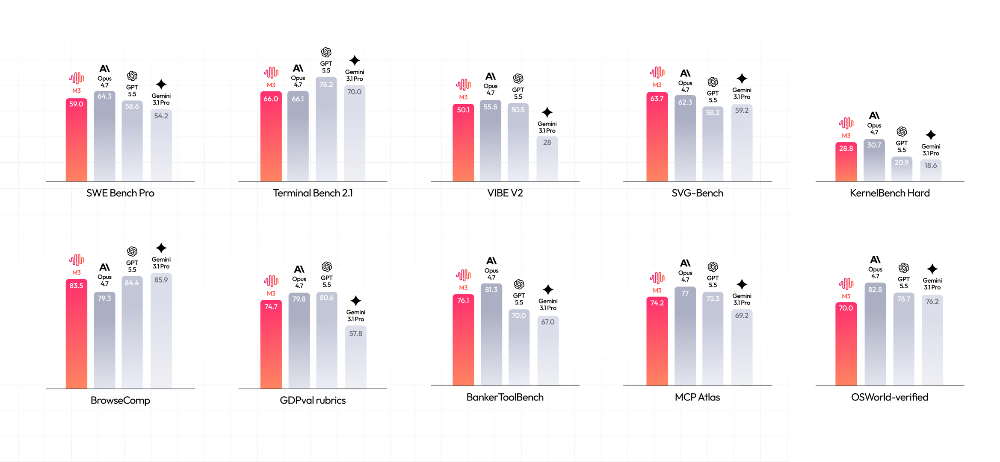
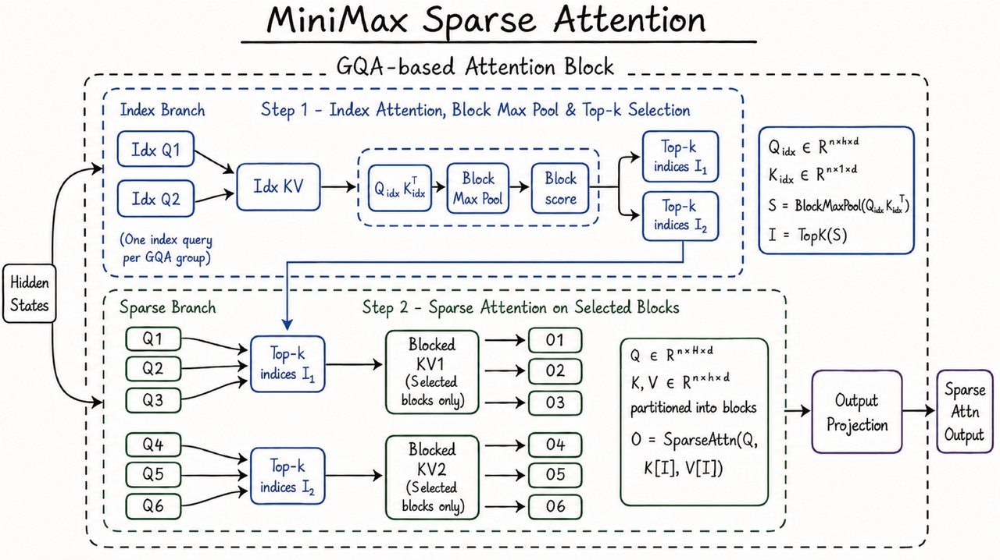
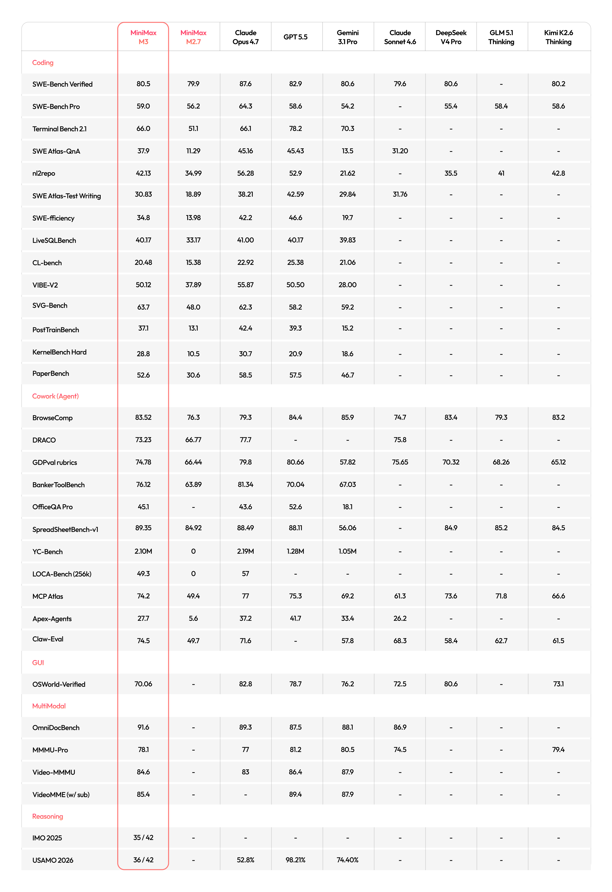
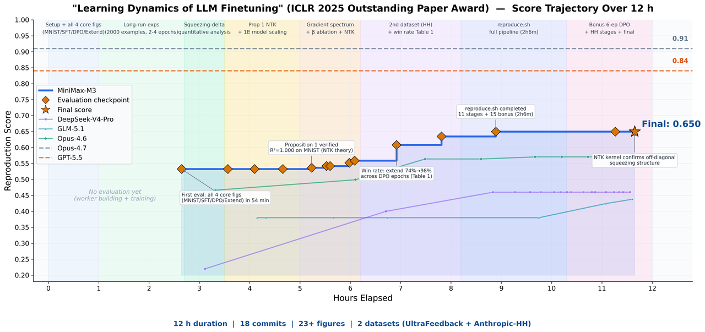
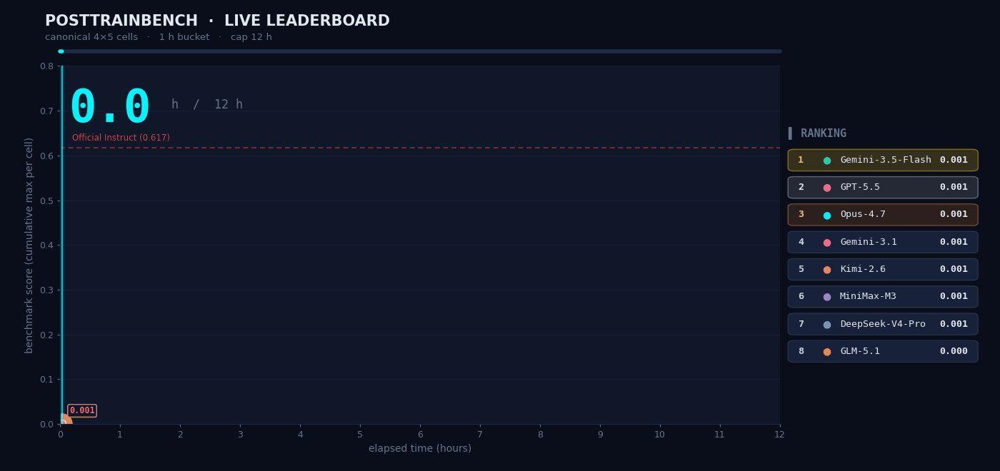
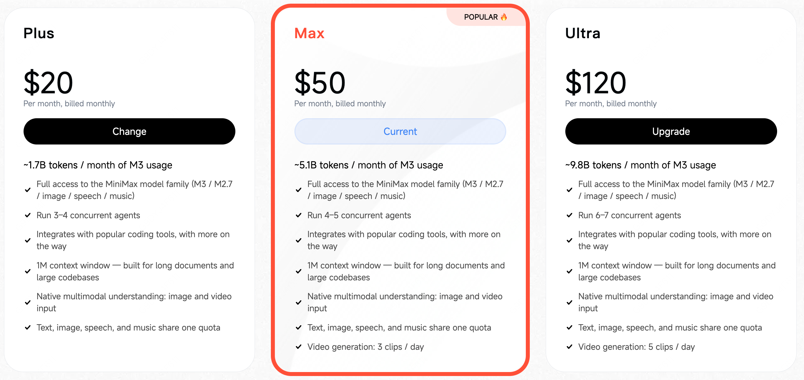
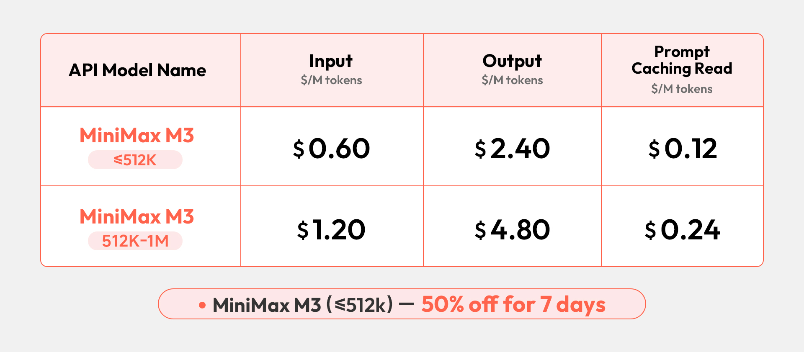

# MiniMax M3 深度拆解：真正的竞争点不是“又一个大模型”，而是把 Coding、长上下文和多模态合成 Agent 底座

> **TL;DR:** MiniMax M3 的发布重点不只是榜单分数，而是一个更清晰的产品判断：下一代 frontier model 必须同时具备 **强 coding / agent 能力、百万级上下文、原生多模态与电脑操作能力**。M3 用 MSA（MiniMax Sparse Attention）把 1M context 做成可扩展的架构能力，再用 MiniMax Code、Token Plan 和 API 把它包装成开发者日常可用的 Agent 基础设施。

- **Source:** [MiniMax M3: Frontier Coding, 1M Context, Native Multimodality — All in One Model](https://www.minimax.io/blog/minimax-m3)
- **Published:** 2026-05-31
- **Tags:** MiniMax M3 / Frontier Model / Coding Agent / 1M Context / Sparse Attention / Multimodal / MiniMax Code / Agent Harness

## 1. M3 的核心叙事：Frontier 能力开始收敛成“三件套”

MiniMax 这次没有把 M3 讲成单点能力升级，而是把它放在一个更大的判断里：闭源 frontier model 的门槛正在从“语言能力强”变成三件套——**专业 coding / agent 能力、超长上下文、原生多模态**。

官方博客给出的定位很明确：M3 在 SWE-Bench Pro、Terminal-Bench 2.1、SWE-fficiency、KernelBench Hard、MCP Atlas 等编码与 agent 相关评测上进入 frontier 区间；同时支持最高 1M token 上下文；并从训练起点就做混合模态训练，支持图像、视频输入以及 desktop computer use。

这意味着 M3 的卖点不是“我能写代码”，而是“我能在长线程里理解论文、代码、日志、图表、文件系统和工具反馈，并持续推进一个工程任务”。这也是为什么文章中反复出现真实任务：复现论文、优化 FP8 GEMM kernel、自动 post-training base models、用 MiniMax Code 做多 Agent 协作。

## 2. MSA：把百万上下文从“堆资源”变成架构能力

M3 的底层技术关键词是 **MSA（MiniMax Sparse Attention）**。官方的解释很直接：如果要让 agent 解决复杂任务，context scaling 是绕不过去的问题；而 full attention 的二次复杂度是根本瓶颈。

MSA 的路线是稀疏注意力：在进入注意力计算前做更精细的 KV block 选择，让模型不用对所有 token 做全量注意力。MiniMax 对比了 DSA、MoBA 等稀疏方案，强调 MSA 可以更精确地划分 KV blocks，提高有效上下文覆盖率。

更重要的是工程实现。官方提到他们采用了 **“KV outer gather Q”** 的算子组织方式：以 KV block 作为外层循环，把命中的 query 聚合起来；每个 block 只读取一次，并尽量保持连续内存访问。在 M3 的 head 配置下，这让算术强度优于常见方法，官方称速度超过开源 Flash-Sparse-Attention 与 flash-moba 4 倍以上。

结果是两个层面的收益：

1. **能力层面：** 1M context 不只是 marketing number，而是可以在论文、代码、实验日志、工具调用历史里长期保留结构化信息。
2. **成本层面：** 在 1M context 长度下，M3 每 token 计算量只有上一代模型的 1/20；prefill 加速超过 9 倍，decode 加速超过 15 倍。

这对 Agent 产品很关键。长上下文不是为了“塞更多文档”本身，而是为了减少反复摘要、丢失状态、重读文件和重建任务记忆的摩擦。

## 3. Coding 能力：重点不是单轮写代码，而是长期协作

官方列出的关键编码 / agent 指标包括：

| Benchmark | MiniMax M3 官方分数 |
|---|---:|
| SWE-Bench Pro | 59.0% |
| Terminal-Bench 2.1 | 66.0% |
| SWE-fficiency | 34.8% |
| KernelBench Hard | 28.8% |
| MCP Atlas | 74.2% |

这里需要注意一个细节：MiniMax 没有只强调 benchmark，而是强调现有 coding benchmark 与真实开发体验之间的差距。真实开发不是一次性 prompt，而是连续会话：用户补充需求、模型讨论方案、工具反馈失败、再切换上下文继续推进。

所以 M3 的训练与评测加入了 **interactive user simulator framework**。这个 simulator 试图模拟真实开发者在协作中的行为：需求展开、方案讨论、基于反馈纠错、持续任务切换、复杂项目迭代。换句话说，MiniMax 在把 coding model 从“代码生成器”推向“协作型工程 agent”。

对产品来说，这比单榜单更重要。一个真正可用的 coding agent 需要在以下问题上稳定：

- 知道什么时候该问、什么时候该直接执行；
- 能在多轮反馈后保持目标一致；
- 能消化工具调用产生的大量结构化上下文；
- 能把失败变成下一轮计划，而不是结束任务；
- 能在用户插话、改需求、切换任务时不崩掉。

M3 的叙事正是在往这个方向靠。

## 4. 真实任务：三组案例比榜单更有信息量

### 4.1 复现 ICLR 2025 Outstanding Paper：长上下文 + 多模态 + coding 的组合测试

MiniMax 给 M3 的任务是复现 ICLR 2025 Outstanding Paper **Learning Dynamics of LLM Finetuning**。官方描述里，M3 连续自主运行近 12 小时，产出 18 个 commits 和 23 张实验图，完成核心实验；不仅复现了 SFT 阶段 prediction probability 的变化趋势，也观察到 DPO 实验中的 squeezing effect，并验证原论文提出的 Extend mitigation method。

这类任务的难点不是“看懂一段代码”，而是模型必须同时处理论文公式、图表、代码、实验日志和运行反馈。多模态负责理解图表与公式，长上下文负责把论文与日志装进同一线程，coding / agent 能力负责持续执行。

### 4.2 Hopper FP8 GEMM：从不能运行的 Triton skeleton 到 71.3% 峰值利用率

第二个案例更工程：让 M3 在 NVIDIA Hopper GPU 上优化 FP8 GEMM kernel。官方说模型起点只有任务描述、benchmark 脚本和一个不能直接运行的 Triton skeleton，没有可抄的高性能实现。

随后约 24 小时里，M3 完成 147 次 benchmark submissions 和 1,959 次 tool calls，从 baseline 实现一路做到 autotune、瓶颈诊断、CUDA Graph、persistent kernel rewrite、host-side scheduling optimization。最终把 Hopper FP8 硬件峰值利用率从 7.6% 提升到 71.3%，相当于 9.4 倍加速。

这件事的信号是：高价值 coding agent 不只是写业务代码，而是能在高密度反馈循环里不断试错。官方还提到，除 Opus 4.7 和 M3 外，多数模型在前 30 次提交内就停止取得新进展并自行退出；M3 的最佳方案出现在第 145 次提交。这说明“愿不愿意继续探索”和“如何利用长期工具历史”本身就是能力。

### 4.3 PostTrainBench：把 Agent 推到研究自动化流程里

第三个案例是 PostTrainBench：给 M3 四个只完成预训练、还没有下游能力的 Base models，让它在 12 小时内自动完成 data synthesis、training、evaluation、iteration。最终目标是让这些 base models 在 AIME2025、BFCL、GPQA Main、GSM8K、HumanEval 等任务上获得基础能力。

官方结果是 M3 得分 0.37，略低于 Opus 4.7 的 0.42 和 GPT-5.5 的 0.39，但明显高于其他模型。这个任务更接近 AI 研究员 workflow：没有单一清晰 reward，需要自己决定合成什么数据、怎么训练、怎么根据评估调整下一轮。

这也是 MiniMax 把 M3 定位为 Agent 底座的关键：coding 是入口，research automation 才是更长期的方向。

## 5. MiniMax Code：模型能力需要被 Harness 产品化

M3 同步更新了 **MiniMax Code**。官方把它描述为专门为 M3 设计、并与 M3 一起训练的 agent product，用来充分释放长上下文、coding / agent、多模态能力。

最值得关注的是 **Agent Team**：它可以把长程复杂任务拆成多阶段、并发、动态调整的工作流，由 agent cluster 协同推进。官方还提到一个 **Producer + Verifier adversarial harness loop**：一组 agent 生产方案，另一组 agent 验证与纠错，让系统在执行中不断反思和修正。

这和 Claude Code 最近强调 Dynamic Workflows 的方向相近，但 MiniMax 的区别表述是：Claude Code 更强调基于 JS code 的固定编排，MiniMax Code 更强调“深度反思和持续纠错”，并允许用户随时插入需求或修正方向。

对 builder 来说，这里有一个明显启发：模型能力最终要落到 harness。再强的 1M context，如果没有任务拆解、并发调度、验证器、权限控制、日志与恢复机制，也很难稳定变成产品级输出。

## 6. Token Plan 和 API：把 frontier model 做成日常消耗品

M3 的商业包装也很 aggressive。MiniMax Token Plan 三档为：

| Plan | Price | M3 token quota |
|---|---:|---:|
| Plus | $20 / month | ~1.7B tokens / month |
| Max | $50 / month | ~5.1B tokens / month |
| Ultra | $120 / month | ~9.8B tokens / month |

官方强调文本、图片、语音、音乐共享同一个 usage pool。这个定价策略的含义是：MiniMax 希望把 frontier model 从“高价调用”变成开发者日常工具，把大量 agent 试错、长线程、并发任务的 token 成本降下来。

API 层面，M3 按输入长度区分计费：≤512K input tokens 按标准价格，超过 512K 则进入 long-context rate。M3 还支持 thinking on/off：thinking 开启适合复杂推理、agentic tasks 和长程协作；关闭则更快，适合对话和 code completion。两种模式价格相同，可在 request time 切换。

另外还有 standard 与 priority 两档 service tier。priority 主要面向高并发和 SLA 敏感场景，目前通过 sales support 开启，官方称几天后会对所有用户开放。

## 7. 需要保持谨慎的地方

这篇发布文很强势，但阅读时仍然要区分三类信号：

1. **官方 benchmark 分数**：很有参考价值，但多个评测使用内部基础设施、内部 benchmark 或自有 scaffolding，需要等第三方复现。
2. **开源承诺**：MiniMax 表示未来 10 天会发布 technical report 并 open-source 对应 model weights；真正的社区采用还要看权重、license、推理成本和 serving 工具链。
3. **Agent 产品稳定性**：长程 autonomous run 的 demo 很吸引人，但真实产品还要面对权限、沙箱、成本上限、失败恢复、审计和用户可控性。

换句话说，M3 已经给出了非常清晰的方向，但最终能否成为开发者基础设施，还取决于开放权重与 MiniMax Code / API 的工程成熟度。

## 8. 我的判断：M3 是 MiniMax 从“模型公司”走向“Agent 基础设施公司”的一次转向

M3 的最大意义，不是它在某个榜单上接近或超过谁，而是 MiniMax 开始把模型、稀疏注意力架构、开发者订阅、API、桌面 agent、multi-agent harness 讲成一套完整系统。

如果说过去大模型竞争的核心是“谁的聊天更聪明”，M3 指向的竞争则是：

- 谁能让模型在长任务中不丢状态；
- 谁能让 agent 在工具反馈里持续自我修正；
- 谁能把 multimodal、coding、computer use 放进同一个执行循环；
- 谁能用足够低的 token 成本支撑大量真实试错；
- 谁能把 open-weight model 做成可部署、可审计、可扩展的工程系统。

这也是为什么 M3 值得关注。它不是单纯发布一个模型，而是在押注：未来 frontier model 的胜负，会发生在 **Agent runtime + long context + multimodal execution + developer economics** 的组合层。对于正在做 QCut / OpenClaw 这类 agent-native 工具的人来说，这个方向非常值得拆。