# MIRA / MPA 深度拆解：AI Scientist 真正重要的不是“发现了一个模型”，而是把材料模型研发做成递归闭环

> **TL;DR:** 这篇微信公众号文章和 Deep Principle 的 MPA 技术报告，真正值得关注的不是“材料性质预测又刷了 SOTA”，而是 **MIRA 这类 AI Scientist 开始把模型研发流程本身自动化**：文献调研、代码重构、数据清洗、训练策略、损失函数、读出头设计、评估迭代，形成一个可度量的递归改进飞轮。MPA 在 40 个实验性质预测任务上平均降低 MAE，说明“AI for AI / AI for Science”的第一批硬指标正在出现。

- **Source:** [AGI将至！40项实验全面SOTA，超级递归智能体自主打造最强材料基座模型](https://mp.weixin.qq.com/s/Do3sauQ8oSoRluaCptYe-g)
- **Technical report:** [Materials Property Axiom: Scaling Foundation Models to Experimental Property Generalists via Multi-phase Training](https://www.deepprinciple.com/papers/mpa.pdf)
- **Report date:** 2026-06-01
- **Tags:** AI Scientist / MIRA / Materials Property Axiom / MPA / AI for Science / Recursive Self-Improvement / Materials Foundation Model / Experimental Property Prediction

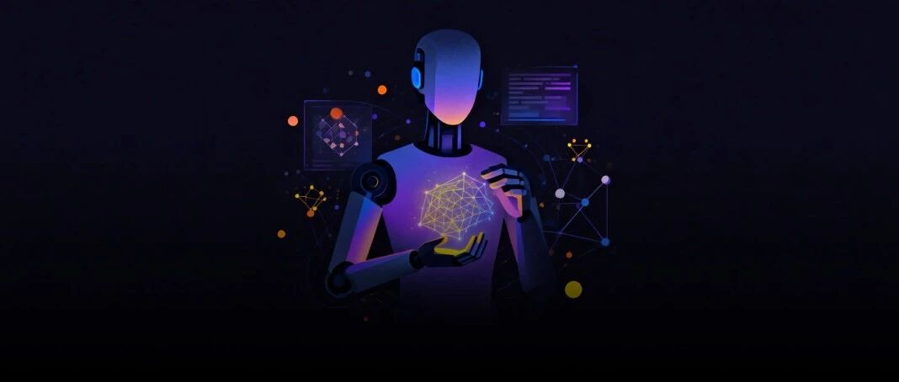

## 1. 这件事为什么比“材料模型 SOTA”更大

原文把 MPA 放在一个很大的背景里：递归自我改进（recursive self-improvement）正在从 AGI 讨论里的概念，进入可操作的研发流程。Anthropic 的 Jack Clark 曾判断 2028 年底前递归自进化出现的概率不低，OpenAI 也公开招聘递归自我改进安全研究员；与此同时，AI4S 领域已经出现了 Co-Scientist、FutureHouse Robin、Google ERA 等自动科研系统。

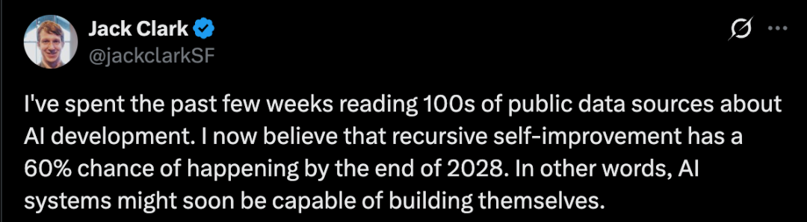

Deep Principle 这次发布的 **Materials Property Axiom（MPA）**，表面上是材料实验性质预测模型；更深一层，它是由 AI Scientist 平台 **MIRA** 推动形成的模型研发结果。原文称，MIRA 在整个流程中承担了初步研究、骨干模型适配与更新、自动训练与评估循环、实验结果分析、报告初稿撰写等关键工作。

这就是它比普通 SOTA 更值得关注的地方：如果一个 agent 能在材料科学这种专业领域里改写代码、清理数据、设计训练流程、做 ablation、看实验反馈并继续迭代，那么它已经不是“工具调用器”，而是初级的研发操作系统。

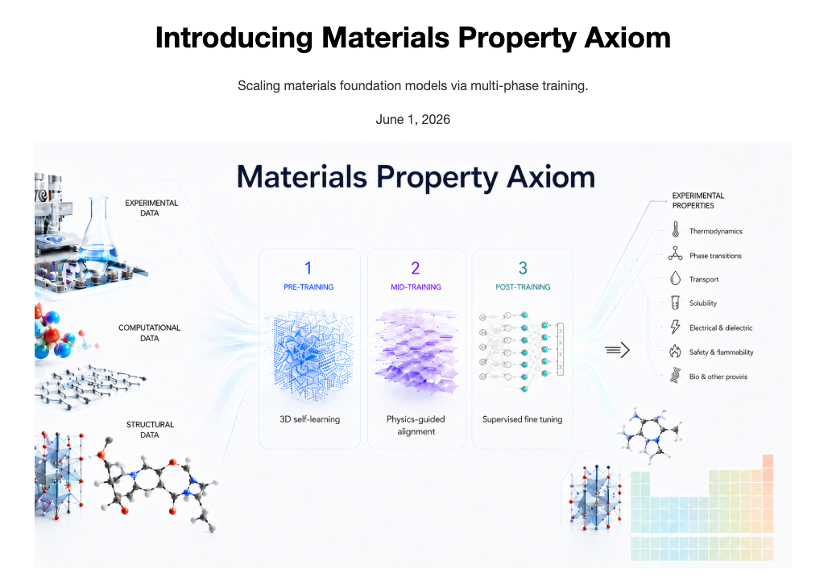

## 2. MPA 切中的不是计算性质，而是实验性质

过去材料基座模型的一条典型路线是“暴力美学”：更大的模型、更大的计算性质数据集、更大的 GPU 集群。原文提到，上海科学智能研究院 2026 年 3 月发布的 Suiren-1.0，是 1.8B 参数分子基座模型，使用 320 张 NVIDIA H800 GPU 和约 7000 万条量子化学级别分子构象数据，击败长期霸榜的 UniMol 系列。

但 Deep Principle 技术报告指出，一个结构性问题是：很多材料 foundation model 主要围绕 **computational properties** 训练，例如热稳定性、吸附能、量子化学计算性质。这些性质可以批量计算，规模大、标签相对干净，但离真实产业需求仍有一步距离。

真实材料研发更关心的是 **experimental properties**：沸点、闪点、毒性、溶解度、燃烧焓、吉布斯自由能等。这类数据有三个麻烦：

1. **稀疏**：实验昂贵，很多端点样本量小；
2. **噪声大**：不同实验室、不同条件下测量结果会不一致；
3. **机制异质**：热力学性质、界面性质、生物相关性质、强度性质、广延性质背后物理机制不同。

所以问题不是“再堆一点数据”，而是：模型能不能学到跨任务可迁移的物理结构？MPA 的核心假设正是：材料性质任务之间的迁移，不只由数据统计相似性决定，而是由共享物理机制决定。

## 3. MIRA 的 AutoResearch：从“人调模型”到“AI 研发模型”

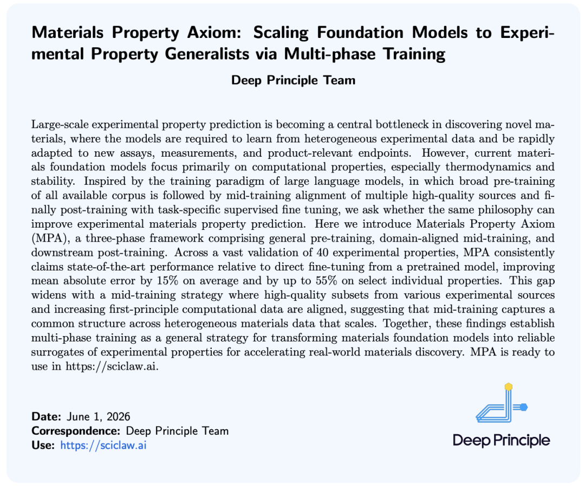

原文描述的 AutoResearch 架构很关键：人类科学家只负责意图说明和阶段性审核，MIRA 则自主完成文献调研、代码实现、数据处理、模型训练、结果分析和下一轮策略调整。

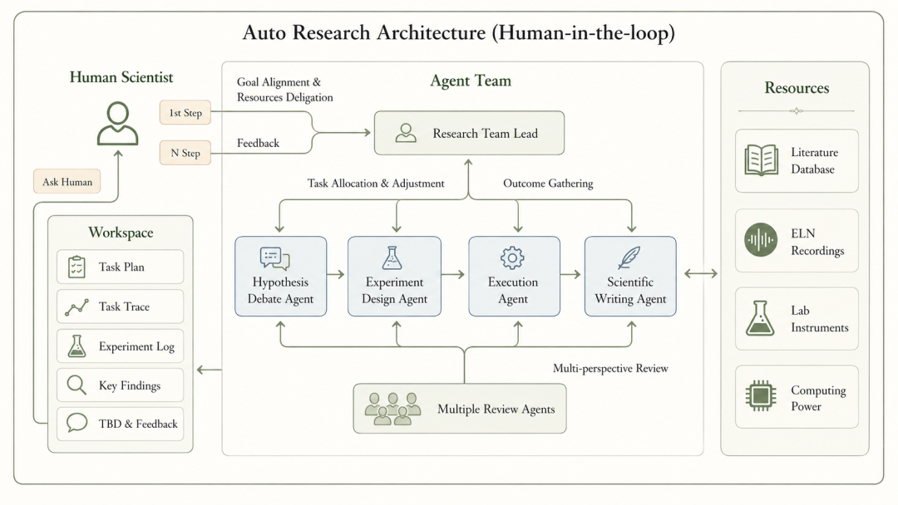

这个流程和普通 AutoML 不一样。AutoML 主要搜索超参数、模型结构或 pipeline 组合；MIRA 操作的是更大的研发对象：

- 研究路线选择：判断 UniMol-v2 这类 3D 预训练编码器是否是合理起点；
- 代码重构：调整已有模型代码，标准化预训练、中间训练、后训练接口；
- 数据工程：整合 OPERA、Yaws、CRC、TDC、MoleculeNet 等实验数据源；
- 数据清洗：处理单位不一致、重复样本、标签噪声与可疑数据点；
- 训练策略：设计三阶段训练框架；
- 架构设计：提出 hybrid readout，把注意力池化与原子加和分支结合；
- 评估迭代：根据 40 个 experimental endpoints 的反馈继续调整。

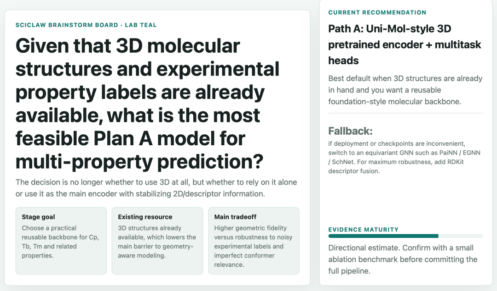

这里真正有价值的是“闭环”。MIRA 不是一次性生成方案，而是在一个月内做了上百轮“假设 → 验证 → 调整”。每一轮实验结果都会反过来改变下一轮的数据、模型结构、损失函数或推理策略。

## 4. 三阶段训练：把 LLM 的训练范式迁移到材料模型

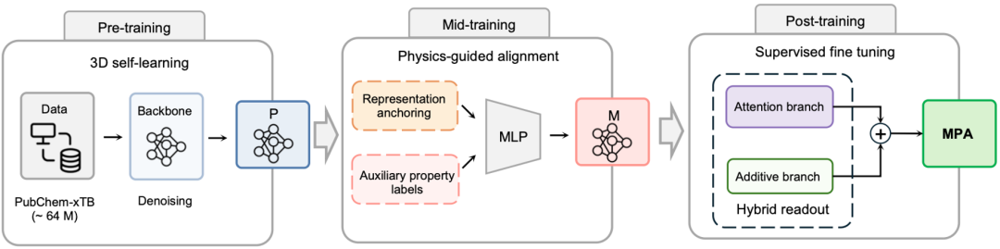

MPA 技术报告的标题很明确：**Scaling Foundation Models to Experimental Property Generalists via Multi-phase Training**。它借鉴了大语言模型的训练范式：

1. **Pre-training**：在大规模通用语料上学习基础表示；
2. **Mid-training / alignment**：用高质量、能力相关的数据对齐模型；
3. **Post-training / task SFT**：针对下游任务做监督微调。

MPA 把这个思想迁移到材料模型上，但关键改造是：中间训练的数据不能只是“可用”或“规模大”，而必须和下游实验端点共享物理机制。

技术报告摘要中给出的结果是：MPA 在 40 个实验性质验证任务上，相比从预训练模型直接 fine-tuning，平均 MAE 改善约 15%，部分性质最高改善约 55%。公众号原文给出的表述则是 40 项实验性质预测任务全面刷新 SOTA，平均 MAE 降低 10%，最高降幅达 51%；并称与 Suiren 正面对比时，在 40 个可比端点中赢下 35 个，平均误差再降 5.4%。两组数字口径略有差异，但方向一致：多阶段训练对实验性质预测确实有显著收益。

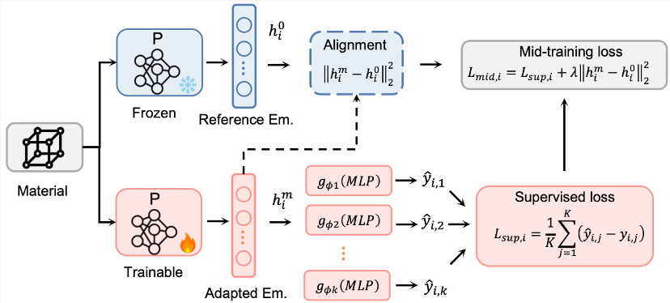

这个发现对 AI4S 很重要。它说明材料模型的 scaling 不只是“更多分子 + 更大模型”，还需要 **物理对齐的中间训练**。换句话说，材料模型也需要自己的“instruction tuning / alignment”，但 alignment 的对象不是人类偏好，而是物理机制。

## 5. Hybrid readout：把物理先验放回模型结构

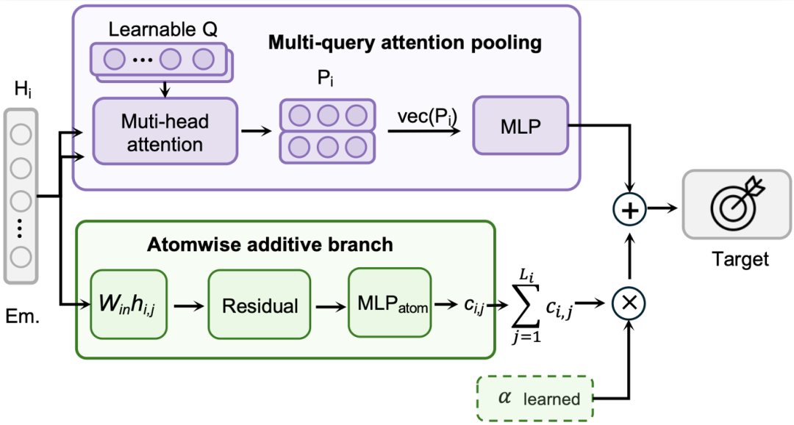

MPA 的一个很漂亮的设计是 **hybrid readout**。MIRA 在迭代中发现，不同实验性质有不同物理结构：

- 有些性质是 **广延性质（extensive properties）**，会随着分子规模近似加和，例如部分热力学量；
- 有些性质是 **强度性质（intensive properties）** 或非加和性质，不能简单按原子贡献求和，例如闪点等。

因此 MPA 把两条读出路径结合起来：

1. **Attention pooling branch**：提供灵活的非加和分子摘要；
2. **Atomic summation branch**：强制原子级分解和求和，提供广延性质所需的归纳偏置；
3. **Learnable coefficient α**：让模型按任务自动调整两条分支的权重。

这不是纯粹的深度学习 trick，而是把物理先验编码进模型架构。原文提到，对于热力学量，hybrid readout 在 scaffold split 下 MAE 最高降低 21.38%；对于非加和性质，注意力分支更重要。

这说明 MIRA 的价值不只是“自动调参”，而是能发现任务背后的物理分类，并把分类转化成架构设计。

## 6. 数据清洗与损失函数：真正的科研直觉藏在脏活里

AI Scientist 的一个关键考验不是会不会写漂亮公式，而是能不能处理真实数据的脏活。MPA 下游 benchmark 覆盖 40 个 experimental property tasks，数据来自 OPERA、Yaws Handbook、CRC Handbook、TDC、MoleculeNet 等多个源。不同来源之间存在单位不一致、重复、异常值、标签噪声和潜在数据泄漏。

原文强调，MIRA 在数据预处理阶段自主执行了多阶段清洗，并基于物理常识判断可疑数据。例如，当某个分子的沸点与分子量和官能团组成明显不匹配时，MIRA 会将其标记为可疑点并移除。

在损失函数上，MIRA 还把 MSE 换成 Huber / Smooth L1，用来降低实验数据中极端值对训练的干扰。原文称这一步带来额外 MAE 降低；技术报告也强调，readout 和 training objective 会决定结构如何映射到标量端点。

对产业界来说，这类“脏活自动化”可能比单点模型结构更值钱。因为真实材料项目最慢的地方，往往不是跑模型，而是把数据清理到可以信任。

## 7. 最终结果：SOTA 是结果，鲁棒泛化才是关键

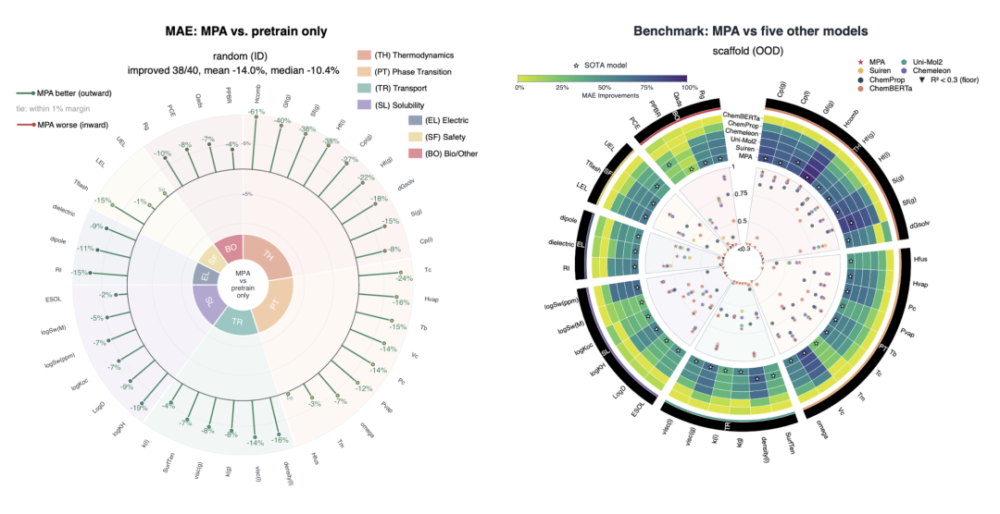

原文总结的 MPA 最终成绩包括：

- 与仅预训练后直接微调的模型相比，40 个实验性质中 38 个提升，平均误差降低 14.0%；
- 热力学性质提升最明显：燃烧焓误差降低 51.1%，吉布斯自由能降低 31.6%；
- 与 Suiren 对比：40 个可比端点中赢下 35 个，平均误差再降 5.4%；
- 分布外泛化更稳：面对全新分子骨架时，MPA 性能退化 25.7%，Suiren 为 31.8%。

最后一点尤其关键。材料发现真正关心的是没见过的新分子、新骨架、新组合，而不是训练分布内的漂亮分数。MPA 在 scaffold split / out-of-distribution 场景下退化更小，说明它可能学到了一部分更通用的物理结构。

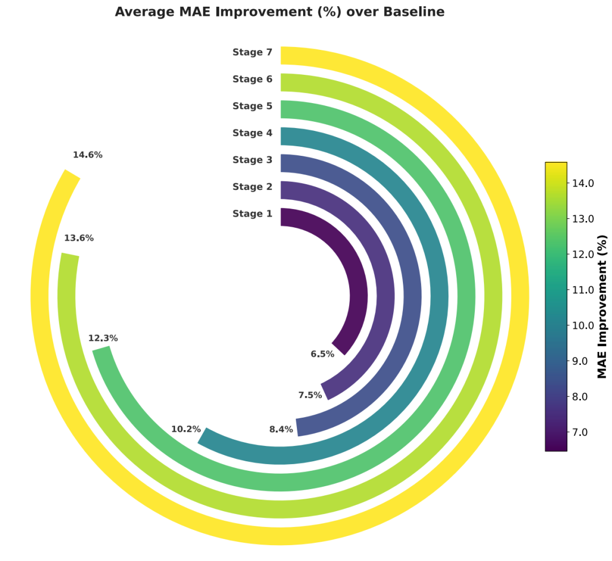

## 8. 需要谨慎看待的地方

这件事很重要，但也不能把它直接等同于“AGI 将至”。几个点需要分开看：

1. **MPA 是强证据，但不是完整递归自我改进**：它展示了 AI 参与模型研发并形成迭代飞轮，但仍有人类目标设定、阶段审核和边界约束。
2. **结果需要第三方复现**：公众号和技术报告都来自发布方，后续需要看公开数据、代码、模型、评测协议和独立复现。
3. **材料科学不是所有科学的简单模板**：材料性质预测有明确 benchmark 和数值指标，适合自动迭代；更开放的理论发现、实验设计和湿实验闭环会更难。
4. **Agent 安全和审计会变重要**：当 agent 开始改代码、筛数据、跑训练、写报告，日志、版本管理、数据泄漏检查、成本上限和人类审核都必须产品化。

所以更准确的判断是：MIRA / MPA 不是 AGI 本身，而是 AGI 路径上一个很好的“可度量里程碑”。

## 9. 我的判断：AI Scientist 的竞争点会从“会调用工具”升级成“会改进研发系统”

MIRA / MPA 这件事对 QCut、OpenClaw 这类 agent-native 系统也有启发。真正的 agent 产品不应该只停留在“帮我执行命令”，而要能形成可审计的改进循环：

- 明确目标；
- 拆解研发路径；
- 改代码和数据；
- 跑实验；
- 读结果；
- 形成下一轮假设；
- 记录证据；
- 在必要节点让人类审核。

这才是 “AI for AI” 最真实的一面：不是模型突然自我觉醒，而是研发流程中的越来越多环节被 agent 接管，并且每一轮都能留下可验证的性能提升。

MPA 的意义就在这里。它把“递归自我改进”从哲学讨论拉回到一个具体问题：能否让 AI Scientist 产出一个更强的材料基座模型？至少在这 40 个实验性质任务上，答案已经开始变成“可以”。

## 附：素材归档

本文保留了微信公众号原文中的关键视觉素材，未在正文展开的两张图也归档如下，方便之后复查原始上下文：

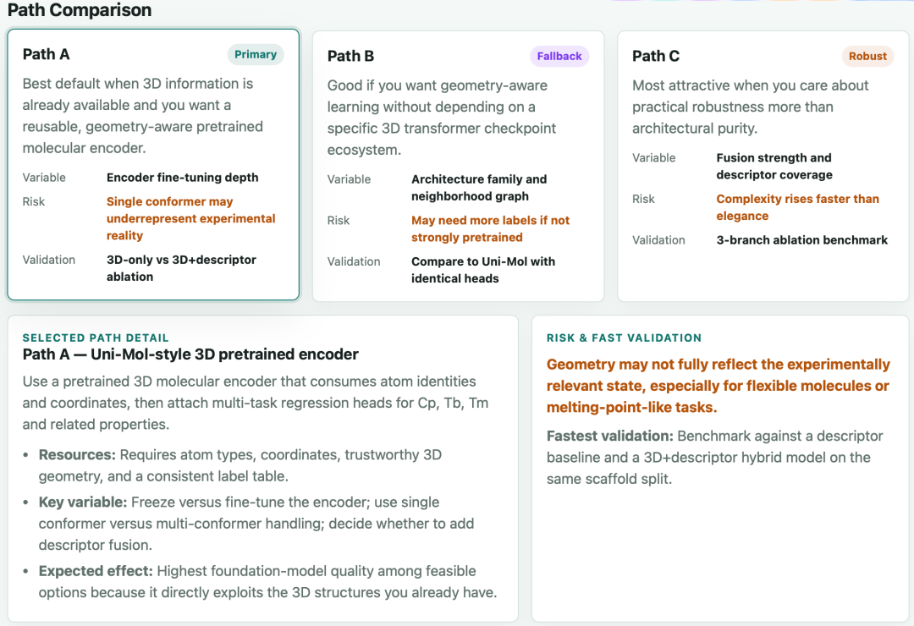
