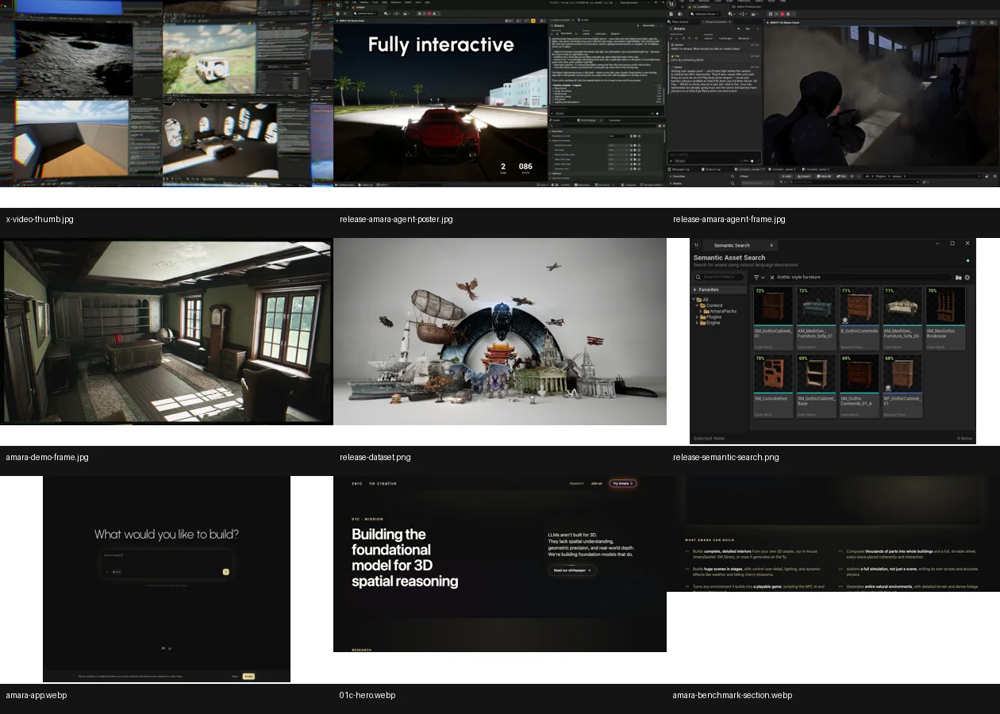
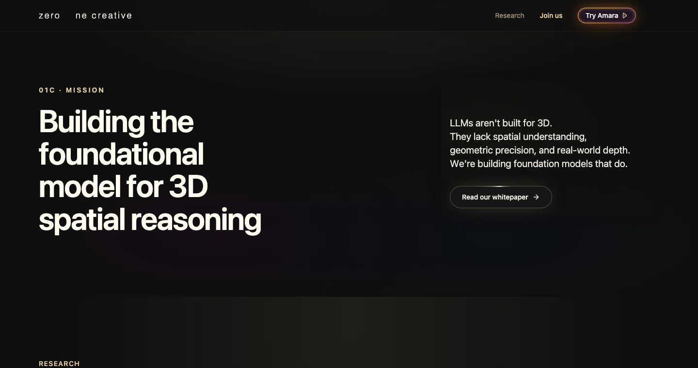
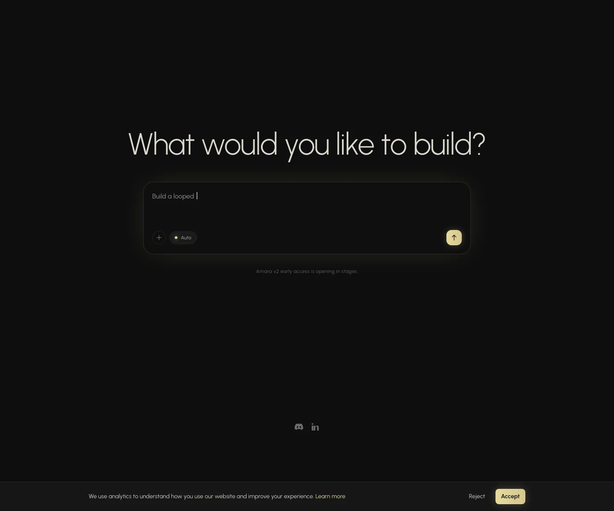
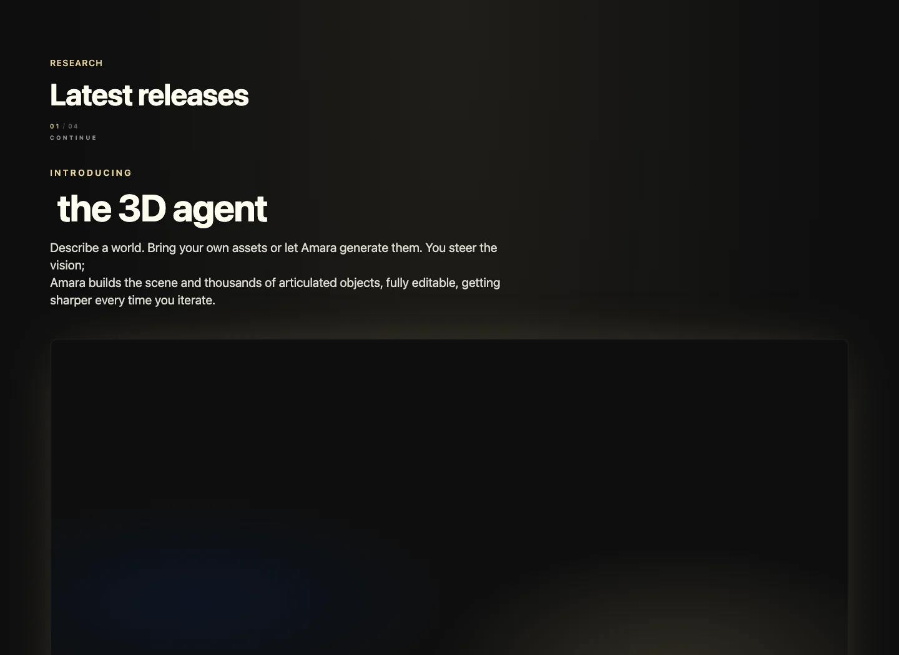
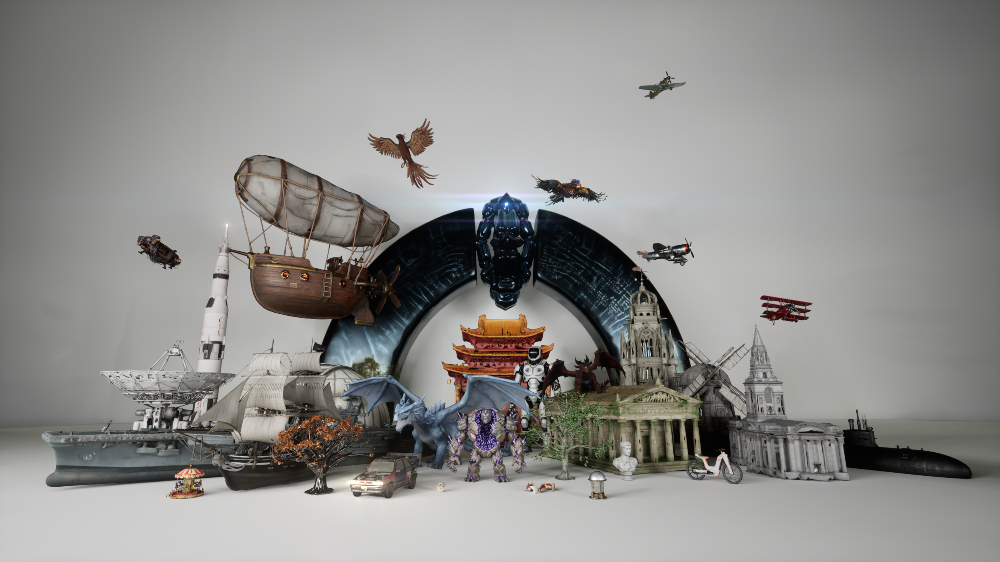
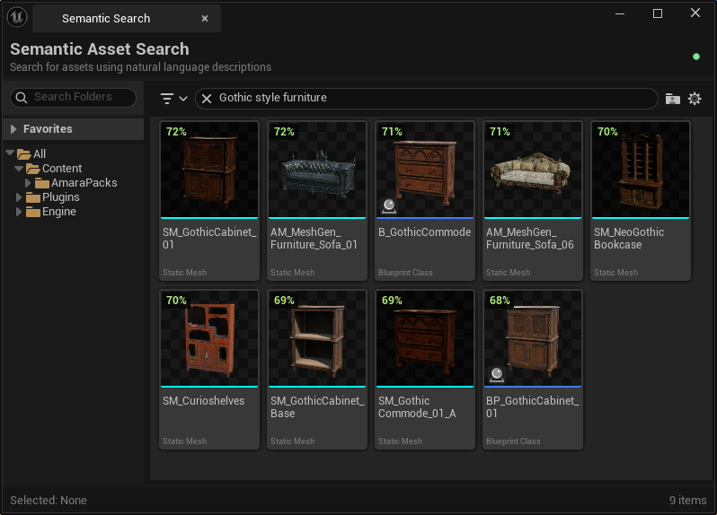
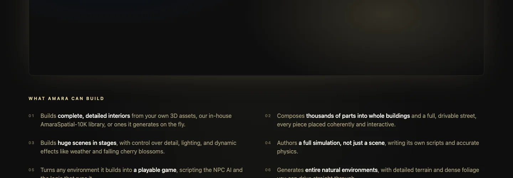

# 01C Amara 深度拆解：3D Agent 的核心，不是生成一个模型，而是把“世界构建”做成可编辑的空间工作流

> **TL;DR:** Ashkan 发布的 01C 3D agent **Amara**，表面上是“描述一个世界，Agent 帮你搭出来”的产品演示；真正值得关注的是它把 3D 生成从单个 mesh 或单张场景图，推进到 **资产生成 / 资产检索 / 场景组合 / 物理脚本 / 可交互世界 / 迭代编辑** 的完整工作流。01C 官方把自己的使命定义为“building the foundational model for 3D spatial reasoning”，这说明它押注的不是普通 text-to-3D，而是面向游戏、仿真、机器人、AR/VR 和 AI 视频预演的空间推理基础设施。

- **Source:** [Ashkan on X](https://x.com/ashkan01C/status/2061827613107134481?s=20)
- **Canonical:** [01C / Amara official site](https://01c.ai/), [Amara app](https://amara.01c.ai/app), [AmaraSpatial-10K on Hugging Face](https://huggingface.co/datasets/ZeroOneCreative/amara-spatial-10k)
- **Topic:** 3D agent / spatial reasoning / world building / editable 3D scenes / embodied AI
- **Tags:** 01C / Amara / 3D Agent / 3D Spatial Reasoning / Text-to-3D World / Unreal / Simulation / Game AI / Embodied AI

## 1. 这不是又一个 text-to-3D demo，而是“世界构建 Agent”

X 上这条发布的核心句子很直接：

> Describe a world. Bring your own assets or let Amara generate them. You steer the vision; Amara builds the scene and thousands of articulated objects, fully editable, getting sharper every time you iterate.

如果只看表面，Amara 像是一个 3D 生成工具：输入描述，生成场景。但 01C 的官网和演示把事情讲得更大：它不是只生成一个椅子、一个建筑、一个房间，而是要构建“完整世界”。

这里的关键差别在于：

- 普通 text-to-3D：生成一个 mesh 或一个可视化模型；
- scene generator：生成一个静态场景；
- world builder：生成一个可以被编辑、交互、模拟、驾驶、玩耍的空间；
- 3D agent：不仅生成资产，还要理解任务、规划结构、检索/生成资产、摆放对象、写脚本和迭代修改。

Amara 的产品语言里反复出现三个词：**world、editable、iterate**。这意味着它的定位不是“一次性产物”，而是“可持续修改的生产环境”。

## 2. 01C 的大命题：LLM 不懂 3D，所以需要空间推理基础模型

01C 官网首页把问题说得很清楚：

> LLMs aren't built for 3D. They lack spatial understanding, geometric precision, and real-world depth. We're building foundation models that do.

这句话值得拆开看。大语言模型擅长语言推理，但 3D 世界不是语言问题，而是几何、尺度、层级、碰撞、材质、约束、可达性和交互逻辑的问题。

一个真正可用的 3D Agent 至少要回答这些问题：

1. 这个物体真实世界里应该多大？
2. 它的 pivot / origin 应该在哪里？
3. 它应该站在地面上、挂在墙上，还是嵌在另一个物体里？
4. 两个物体之间是否碰撞？
5. 门、抽屉、轮子、角色骨骼是否可动？
6. 灯光、天气、物理、NPC 行为是否需要脚本？
7. 场景能否被 Unreal / Unity / 仿真器直接使用？

这些都不是“文字描述漂亮一点”能解决的问题。它们要求模型有空间表征、几何约束和工程输出能力。

## 3. Amara 的产品形态：从 prompt 到可编辑 3D 工程

Amara app 的入口非常像今天的生成式应用：一个输入框，提示用户 “What would you like to build?”。但它背后不是普通 chatbot，而是连接 3D engine 和资产库的构建工作流。

从官方描述看，Amara 可以：

- 根据用户描述构建完整室内空间；
- 使用用户自己的 3D 资产、01C 自有的 AmaraSpatial-10K 资产库，或动态生成资产；
- 把成千上万个部件组合成建筑、街区和可驾驶街道；
- 分阶段构建大场景，并控制细节、灯光、天气、樱花飘落等动态效果；
- 写脚本和物理逻辑，让输出不仅是 scene，而是 simulation；
- 把环境转成 playable game，包含 NPC AI 和运行逻辑；
- 生成自然环境、城市街区、可动画角色、动态环境和面向 embodied AI 的可交互对象。

这套能力如果能稳定落地，意义不只是让美术更快，而是让“空间生产”从 DCC 工具链转向 agentic workflow。

## 4. 真正的难点：不是生成资产，而是“组合”和“约束”

3D 世界构建最容易被低估的是组合问题。生成一把椅子和生成一个能使用的房间，是完全不同的复杂度。

一个房间里有墙、地板、窗、门、桌椅、灯、书架、装饰、路径和光照。一个街区里有道路、建筑、交通、可驾驶空间、碰撞边界、行人/NPC、路灯、天气和交互脚本。每多一个对象，系统就多一组空间关系和物理约束。

所以 Amara 如果要成立，核心能力不是“生成更多 mesh”，而是：

- **资产选择**：根据语义找到正确类型和风格的资产；
- **尺度一致性**：桌子不能比门还高，杯子不能像水桶；
- **空间摆放**：物体不能穿模，不能漂浮，不能挡住路径；
- **功能关系**：椅子要在桌边，门要能打开，车要能在路上跑；
- **层级组织**：大场景要分阶段构建，不能一次性糊成一团；
- **可编辑性**：用户要能改，而不是只能重新生成；
- **运行时逻辑**：物理、NPC、天气、驾驶和交互都需要脚本。

这就是为什么 01C 会强调 articulated objects、fully editable、simulation-ready，而不是只展示“更漂亮的 3D 图”。

## 5. AmaraSpatial-10K：3D Agent 为什么需要自己的资产底座

01C 同时发布/维护了 AmaraSpatial-10K 数据集。Hugging Face 页面显示它是 **CC BY 4.0**，包含 **10,071** 个 AI 生成 3D meshes，覆盖 10 个一级类别和 476 个子类别；README 强调每个资产同时具备 metric-scale、semantic anchoring、PBR-ready 和 rich descriptions。

这很关键。3D Agent 不是只靠模型本身就能搭世界，它需要一个“可检索、可组合、可部署”的资产底座。普通 3D 资产库的问题通常是：

- 尺度不统一；
- pivot/origin 不规范；
- 材质、UV、PBR 不完整；
- 描述信息贫弱，语义搜索很难；
- 放进游戏引擎或仿真器后需要大量人工清理。

AmaraSpatial-10K 的研究摘要还给出一些可验证指标：相比 Objaverse，CLIP Recall@5 提升约 3.4×（0.612 vs. 0.181），在 Habitat-Sim 中达到 99.1% physics-stability，并有约 20× wall-time speed-up。先不讨论这些指标是否能完全代表真实生产效果，它至少说明 01C 不是只做前端 demo，而是在补 3D 数据工程的底层短板。

## 6. Semantic Search：3D 世界构建里的“找素材”比想象中更重要

01C 早期 release 里还有 Amara Semantic Search：输入 “gothic chair the king sits on”，系统可以找到 throne，而不依赖文件名和人工 tag。

这看起来是小功能，但在大规模 3D 生产里非常关键。原因是 3D 世界构建的成本常常不在“生成一个东西”，而在“从资产海里找到合适的东西”。

如果一个 Agent 要自动搭建 tavern、temple、street、island 或 city district，它必须具备两类能力：

1. 生成缺失资产；
2. 检索已有资产并正确使用。

第二点通常比第一点更工程化，也更接近真实 studio pipeline。大量资产已经存在，问题是命名混乱、尺度不一、语义缺失、材质不统一。一个好的 3D Agent 需要先成为资产库的“空间语义索引”。

## 7. 官方 benchmark 的重点：一张 GPU、五分钟、同一评估标准

01C 官网 benchmark 区域声称 Amara 在相同 prompts 和 acceptance criteria 下对比 NVIDIA SAGE：

- Amara：5 分钟；
- NVIDIA SAGE：10 分钟；
- Amara 使用 1× GPU；
- NVIDIA SAGE 需要 8× GPUs；
- 官方称为 8× fewer GPUs、2× faster wall-clock、same evaluators。

这类 benchmark 需要谨慎看待，因为完整报告在 DocSend，外部读者不一定能直接复现实验。但它透露了 01C 想解决的问题：3D 世界构建如果要进入交互式创作，不能依赖长时间 batch job。用户需要的是“几分钟内看到结果，然后继续改”。

也就是说，Amara 的竞争点不只是质量，而是 **迭代速度**。对于创作工具来说，生成一次 30 分钟和生成一次 5 分钟是完全不同的产品体验。

## 8. 对 AI 视频和 QCut 的启发：3D Agent 可能成为分镜和镜头预演层

这条 Amara 发布和最近很多 AI 视频工作流可以连起来看。AI 视频模型越来越强，但仍然缺乏稳定空间控制：人物站位、物体位置、机位、路径、遮挡和动作逻辑很容易漂。

3D Agent 的一个潜在价值，是成为 AI 视频生成之前的 **空间预演层**：

- 先用自然语言生成可编辑 3D 场景；
- 在 3D 场景中确定人物、物件、机位和路径；
- 截取 keyframe 或 camera view；
- 把这些参考图与角色设定、风格图、场景图一起交给视频模型；
- 最后进入剪辑、重生成和镜头连续性管理。

这和 QCut 这类 AI 视频工具的方向非常相关。未来创作者可能不再只是在 prompt 框里描述“一个人在街上奔跑”，而是先让 3D Agent 搭出街区、角色、车辆、灯光和路径，再让视频模型负责真实感、动态和风格。

## 9. 风险与未验证点：demo 很强，但生产级闭环还要看三件事

我会把 Amara 看成一个非常值得跟踪的方向，但还不能只凭 X 视频就下结论。关键要看三件事。

第一，**编辑闭环是否真的顺滑**。如果用户每次修改都要等待很久，或者小修改会破坏整个场景，那它仍然像生成器，而不是生产工具。

第二，**输出是否真的 engine-ready**。Unreal / Unity / simulation 对尺度、材质、碰撞、脚本、骨骼和性能都有要求。看起来能跑和可用于生产，是两个等级。

第三，**多轮一致性是否稳定**。Amara 的承诺是 getting sharper every time you iterate。真正难的是用户连续修改 10 次、20 次后，场景结构不崩，资产关系不乱，脚本逻辑还能保持。

## 10. 我的判断：3D Agent 会成为“世界模型产品化”的第一批入口

Amara 的重要性不在于它是不是已经完美，而在于它明确把 3D AI 的目标从“生成一个资产”抬高到了“构建一个可编辑世界”。

未来的 3D 生产可能会分成三层：

1. **资产层**：mesh、材质、UV、语义描述、物理属性；
2. **场景层**：对象组合、空间约束、灯光、天气、路径；
3. **行为层**：脚本、NPC、物理、游戏逻辑、仿真任务。

Amara 试图把这三层连成一个 Agent 工作流。它的机会不只是做给 3D 艺术家，也可能进入游戏原型、AI 视频预演、机器人仿真、AR/VR 场景生产和 embodied AI 训练环境。

如果 text-to-image 的下一层抽象是 layout，那么 text-to-3D 的下一层抽象可能就是 **editable world state**：一个可检索、可约束、可运行、可反复修改的三维世界状态。Amara 正是在押这个方向。
