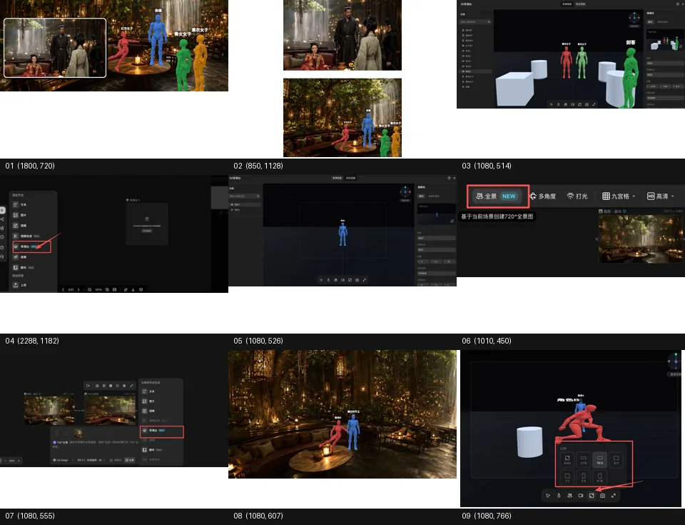
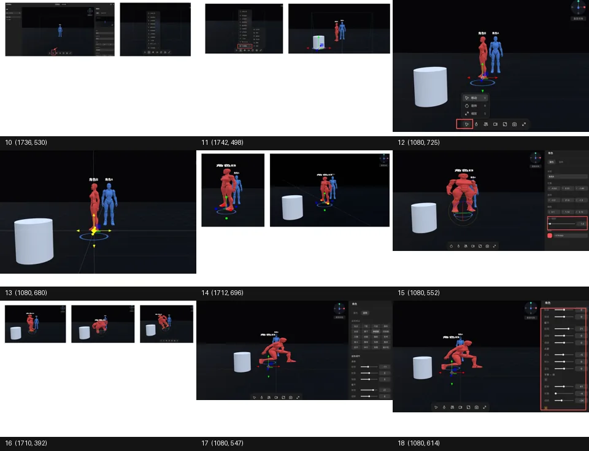
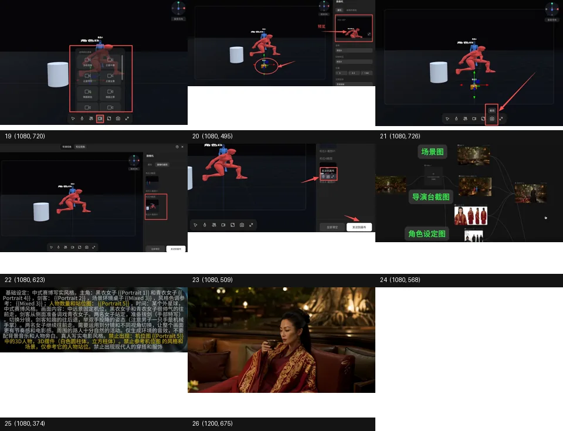

# AI 视频人物站位控制实战：3D 导演台的价值，不是“更酷的界面”，而是把镜头调度前置成可验证的空间方案

> **TL;DR:** 探路AI 这篇 X Article 演示的是一个很具体的问题：AI 视频里多人物站位、景别、机位和动作很难只靠文字 prompt 稳定控制。3D 导演台的价值在于把“人物在哪里、镜头在哪里、物体在哪里、角色姿势是什么”先变成一个可操作的三维空间草图，再把机位截图、角色设定图、场景图等参考物料一起交给视频模型（文中使用 Seedance 2.0）。这不是简单多一个 UI，而是把 AI 视频生产从“写一句话赌结果”推进到“先做空间预演，再生成镜头”的工作流。

- **Source:** [探路AI X Article](https://x.com/TanLuAI/status/2062167075540676650?s=20)
- **Topic:** AI video / 3D director stage / character positioning / camera control / Seedance 2.0
- **Tags:** AI 视频 / 导演台 / 3D 预演 / 人物站位 / 镜头调度 / Seedance 2.0 / 参考图工作流

## 1. 这篇教程真正解决的问题：AI 视频不缺“生成”，缺的是“调度”

今天的 AI 视频模型已经能生成非常复杂的画面，但多人物镜头仍然经常失控：人物前后关系不稳、站位漂移、镜头角度不对、角色之间距离不符合叙事、动作和空间方向不一致。传统 prompt 会把这些内容写成自然语言，例如“一个女人坐在前景，两个男人站在后方，镜头从左侧中景拍摄”。问题是，模型未必能把这句话稳定映射成几何关系。

探路AI 的教程把这个痛点拆得很实用：不要把人物站位、姿势和机位全部压进一句 prompt，而是先用 **3D 导演台** 搭出空间结构，再把截图作为参考物料输入给视频模型。

这其实是 AI 视频生产中的一个关键转向：

- prompt 负责描述语义和风格；
- 角色设定图负责人物一致性；
- 场景图负责世界观和美术；
- 3D 导演台负责空间布局、镜头和姿势；
- 视频模型负责把这些约束综合成运动画面。

换句话说，3D 导演台不是为了替代 prompt，而是为了把 prompt 最不擅长的“空间控制”单独拿出来。

## 2. 什么是 3D 导演台？

按原文的定义，导演台是一个可以提前规划画面内容和镜头位置的操作面板。不管是人物站位、姿势动作，还是镜头的位置、角度、景别，都可以在一个操作面板里完成规划。

从教程截图看，这类导演台通常包含：

1. 一个三维空间画布；
2. 可摆放的人物模型或上传角色；
3. 几何模型，用于占位、障碍物、桌椅、墙面等空间提示；
4. 移动、缩放、旋转工具；
5. 人物姿势库和关节调节；
6. 多个摄影机位；
7. 导演视角与机位视角切换；
8. 截图并发送到画布/生成流程。

它像是一个轻量版的 previs（pre-visualization，预演）工具：先不追求最终画质，而是先把叙事空间确定下来。

## 3. 创建导演台的两种路径：空白空间 vs 场景锚定

原文提到两种创建方式。

第一种是在空白画布里直接新建导演台。进入后就是一个空白三维空间，用户可以任意摆放人物和物件。这种方式适合抽象构图、产品镜头、简单关系图，或者还没有固定场景图的时候。

第二种是先用一张场景图生成 720 度全景图，再用全景图生成导演台。这样人物站位和摄像机摆放就发生在具体场景里，而不是黑箱空间里。这种方式更适合叙事视频、电影感镜头、固定场景内的多人物调度。

这里有一个很重要的操作建议：进入导演台后先设置画面尺寸比例。因为站位、景别和构图都依赖最终画幅。如果先随便摆，后面再从横屏改竖屏，人物位置和镜头关系就可能全部失效。

## 4. 导演台内部操作：先放对象，再调空间关系

教程的基础操作可以归纳成五步。

### 4.1 添加人物和物体

导演台支持自带人物模型，也支持上传本地角色。几何模型则可以添加各种形状的物件。不要小看这些几何体：它们可以作为桌子、柱子、墙、障碍物、道具、画面边界和景深参照。

在 AI 视频里，几何体的意义不是“最终要长这样”，而是告诉模型：空间中存在一个占位关系。比如一个圆柱可以代表“前景物体”，一个盒子可以代表“桌面”，人物和物体的距离可以约束镜头层次。

### 4.2 移动、缩放、旋转

教程里强调，通过下方工具栏的第一个按钮切换移动、缩放和旋转模式：

- **移动**：x 轴左右，y 轴上下，z 轴前后；
- **缩放**：x 轴变宽/变窄，y 轴变高/变矮，z 轴变厚/变薄；
- **统一缩放**：保持整体比例；
- **旋转**：切换成球形控制器后，从不同角度调整物体或人物方向。

这一步是把自然语言里的“站在旁边”“更靠前”“面对镜头”“转身”变成可见的三维操作。

### 4.3 调整人物姿势

选中人物后，可以在右侧姿势列表里选择预置姿势，也可以自定义关节动作。这对 AI 视频非常关键，因为人物姿势往往决定下一帧运动的起点：坐着、站着、奔跑、回头、伸手、跪地，这些动作如果只写在 prompt 里，很容易被模型理解成不同的身体结构。

3D 姿势的优势是把身体状态先固定下来，然后让视频模型做风格化和动态生成。

### 4.4 调整机位

教程提到，下方工具栏第四个按钮可以选择多个机位角度，也可以手动移动摄像机位置。这个环节决定最终截图是全景、中景、近景、俯拍、仰拍、侧拍还是主观视角。

这是 3D 导演台最像“导演”的地方：它不只是摆人物，而是在决定观众从哪里看。AI 视频很多“看起来不对”的结果，本质不是模型不会画，而是机位没有被提前定义。

### 4.5 切换视角、截图、上传到画布

完成角色、物体、场景和摄影机摆放后，用户可以截取机位视角。截图会出现在“摄像机截图”位置，然后可以通过总按钮或小图按钮发送到画布。

原文特别提醒：切换到“机位视角”时无法进行操作，如果要继续调整，需要切回“导演视角”。这个细节很实际，因为导演台工作流里最容易混乱的就是“我现在是在观察画面，还是在编辑空间”。

## 5. 机位截图怎么用：不要只当关键帧，而要当空间参考

教程给出两种用法。

第一种是把导演台机位截图直接生成场景锚定图，也就是关键帧。原文作者并不太建议东方题材 AI 视频这样做，因为图片模型对于东方面孔的人物一致性保持较差。

第二种，也是作者推荐的方法：把导演台机位截图与角色设定图、场景图等参考物料一起喂给 Seedance 2.0。这样导演台截图负责空间结构，角色设定图负责人物一致性，场景图负责美术和环境，prompt 则负责动作、镜头、情绪和叙事。

这个建议很重要。导演台截图不一定要成为最终画面本身，它可以是“空间约束图”。如果把它当成唯一关键帧，模型可能继承 3D 小人的粗糙外观；如果把它当成参考物料之一，模型更容易综合其他图像，把空间结构和美术质量分开处理。

## 6. 为什么这套流程适合 Seedance 2.0 这类视频模型

原文里提到模型依旧使用 Seedance 2.0。对这类新一代视频模型来说，参考图已经不只是“风格参考”，而是可以承担更细的任务分工：角色图、场景图、机位图、动作图分别约束不同维度。

这和传统单 prompt 工作流的差别很大：

| 维度 | 单 prompt 工作流 | 3D 导演台 + 参考图工作流 |
|---|---|---|
| 人物站位 | 用文字描述，容易漂移 | 用三维位置和机位截图显式约束 |
| 角色一致性 | 依赖模型记忆和 prompt | 依赖角色设定图 |
| 场景一致性 | 容易随镜头变化重绘 | 依赖场景图/全景图 |
| 镜头角度 | 文字描述不稳定 | 摄像机位可视化 |
| 动作起点 | 模型自行理解 | 姿势模型给出初始状态 |
| 可迭代性 | 失败后重写 prompt | 可以回到导演台微调空间 |

所以，3D 导演台的价值不是“生成更漂亮”，而是让失败更可诊断：如果人物距离不对，回去调位置；如果机位不对，回去换摄像机；如果姿势不对，回去调骨架；如果脸不像，补角色图。

## 7. 对创作者的实操建议

如果要把这套流程变成稳定 SOP，可以按下面方式执行：

1. **先确定画幅**：横屏、竖屏、方形，先定再摆。
2. **先放主角，再放配角和物件**：避免空间关系被次要元素牵着走。
3. **用几何体表达空间意图**：桌子、墙、前景遮挡、距离感都可以先用简单形状占位。
4. **每个镜头只解决一个调度问题**：不要在一个导演台里塞太多人物、动作和机位变化。
5. **截图前切到目标机位视角检查构图**：确保人物大小、朝向、前后关系正确。
6. **截图不要单独使用**：和角色设定图、场景图一起作为参考材料。
7. **prompt 重点写动作和镜头语言**：空间位置交给导演台，prompt 不要重复写太多几何细节。
8. **保留导演台文件/截图版本**：方便后续镜头连续性和返工。

## 8. 对 QCut / AI 视频工具的启发

这类导演台工作流对 AI 视频产品很有启发：未来视频工具的核心不只是“输入 prompt → 生成视频”，而是把创作者的意图拆成多个可编辑层：

- 角色层：人物设定、服装、脸、体型；
- 场景层：环境、光线、风格；
- 空间层：人物和物件位置；
- 镜头层：机位、景别、运动轨迹；
- 动作层：姿势、动作起点、运动方向；
- 文本层：prompt、旁白、对白；
- 时间层：镜头顺序、节奏、剪辑点。

3D 导演台其实就是“空间层 + 镜头层”的可视化编辑器。它把 AI 视频从一次性生成变成了可拆解、可复用、可调参的 production pipeline。

## 9. 我的判断：AI 视频的下一阶段，是从 prompt engineering 走向 production engineering

探路AI 这篇教程看起来是基础操作演示，但背后的方向很清楚：AI 视频越来越需要传统影视工业里的预演、分镜、机位、调度和资产管理。

单 prompt 时代，创作者像是在和模型猜谜；导演台工作流里，创作者开始把结果拆成可验证的中间状态。这个变化会让 AI 视频更接近真正的制作系统：先搭空间，再定机位，再配角色和场景，最后交给模型生成。

未来最强的 AI 视频工具，可能不是模型按钮最多的工具，而是能把 **导演意图 → 空间方案 → 参考素材 → 视频生成 → 剪辑迭代** 串成闭环的工具。3D 导演台只是这个闭环里的第一块拼图。
