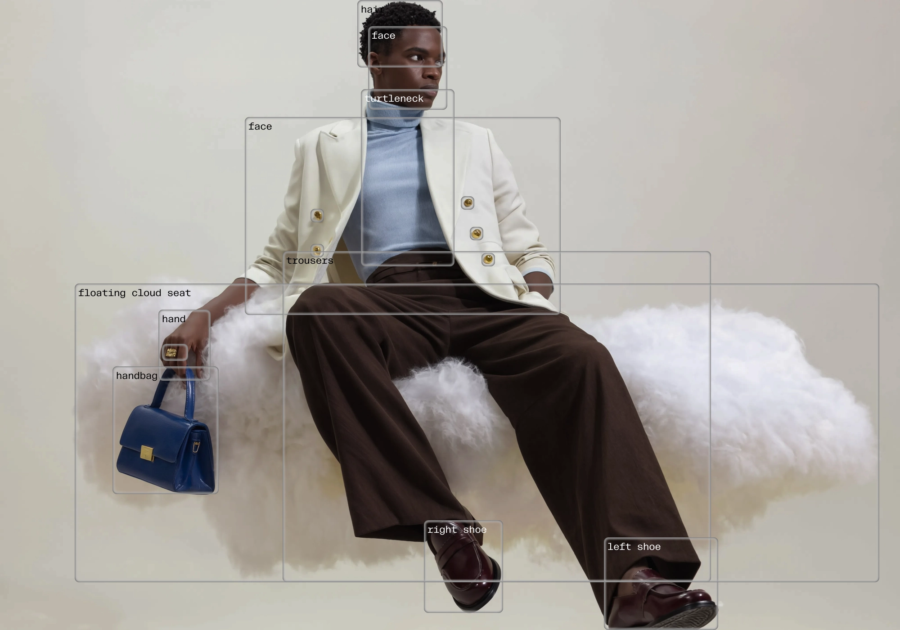
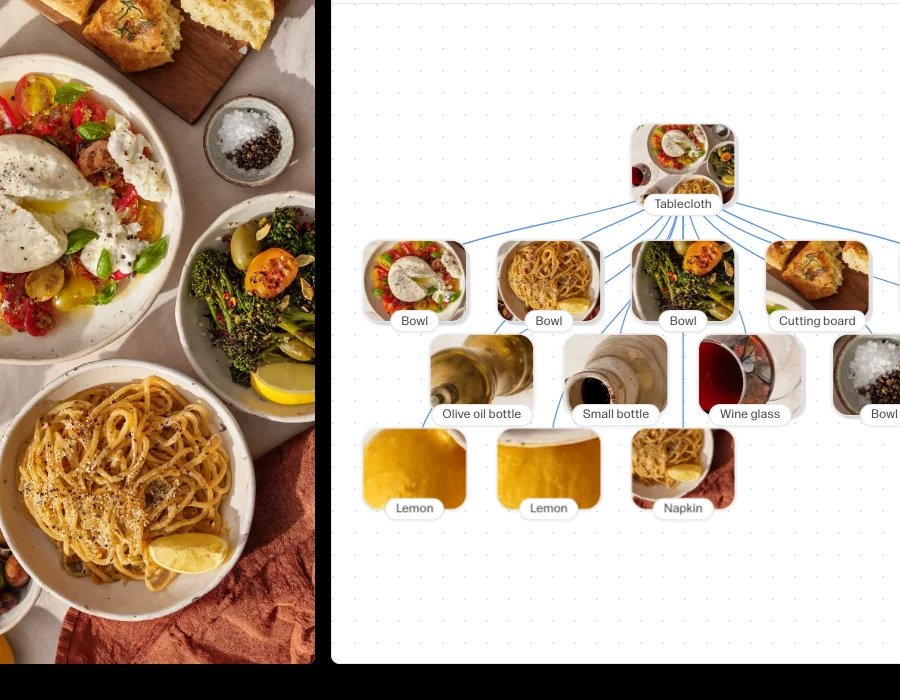
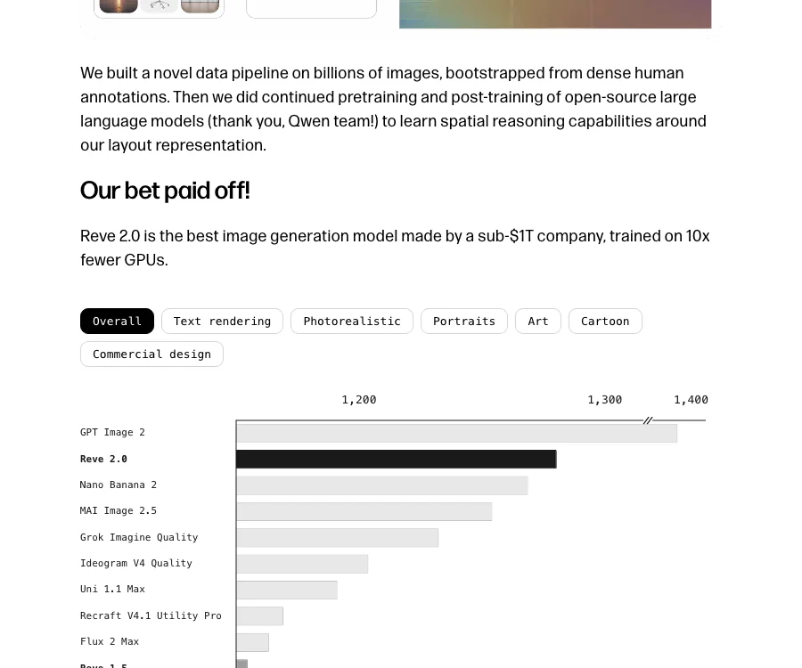
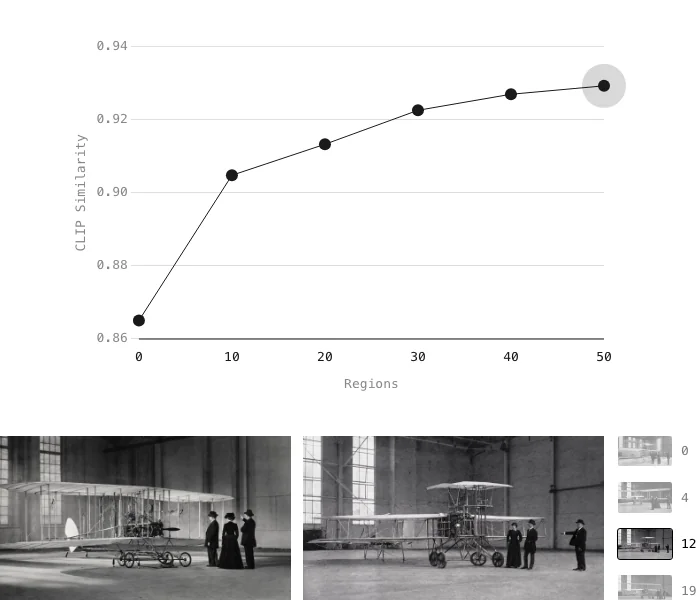
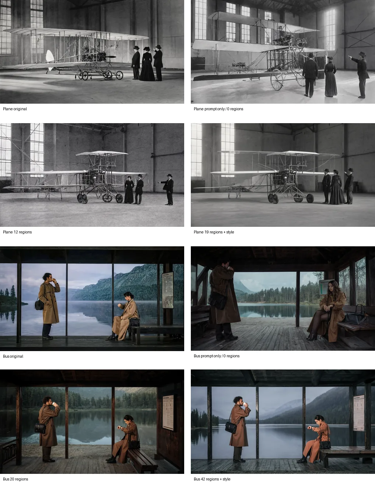
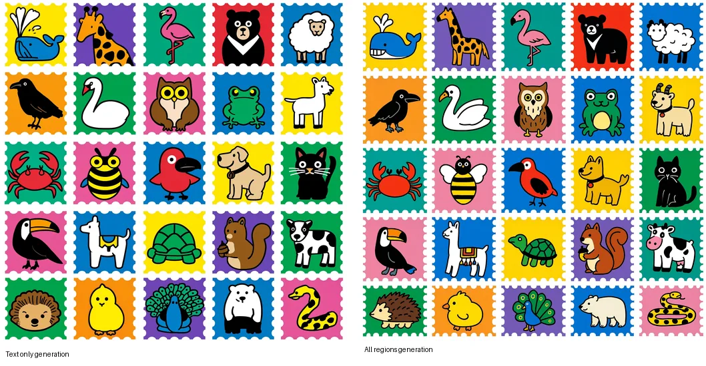

# Reve “The Layout Bet” Deep Dive: The Next Abstraction for Image Generation May Be Layout, Not Prompting

> **TL;DR:** Reve’s “The Layout Bet” makes a clear argument: modern image models use natural language as an internal representation, but language is ambiguous and cannot reliably specify object position, size, hierarchy, local attributes, and references. Reve instead makes **layout** a structured, hierarchical, readable intermediate representation, then trains a Large Layout Model to reason across layouts, instructions, and images. The significance is not just better image quality. It is a shift from “writing prompts” toward something closer to **program synthesis, a visual DOM, and editable production files**.

- **Source:** [The Layout Bet](https://blog.reve.com/posts/the-layout-bet/)
- **Author:** Reve Research Team
- **Published:** 2026-06-03
- **Tags:** Reve 2.0 / Large Layout Model / image generation / layout representation / spatial reasoning / visual agents / program synthesis / controllable generation

## 1. Reve’s core claim: prompt text is not a good enough visual intermediate representation

Most image generation systems expand a user prompt into a longer text description, then render that description into pixels. This works because language is natural: users can speak, and models can read. But the weakness is just as obvious: **text is expressive, but imprecise**.

When a user says “put the cup in the upper-left corner,” “center the text without changing the background,” or “only fix this hand, do not touch the face,” natural language does not reliably bind to concrete objects, coordinates, and layers inside the image. A small prompt change can move the entire composition. A local request can trigger a global redraw.

Reve’s “layout bet” asks the opposite question: if image generation needs control, why should English prose be the model’s internal representation? A better path may be to represent an image as a structured layout: each element has a position, size, local description, color, image reference, and other attributes. The model then renders pixels from that layout.

The HTML / SVG analogy is the key. Webpages are not produced from a paragraph of natural language; they are organized through DOM nodes, styles, and referenced assets. Reve is trying to build a similar “visual DOM” for image generation.

## 2. Layout is a readable and writable protocol between semantics and pixels

Reve defines layout as a structured, hierarchical description of an image. Each element has a location, size, local description, and optional attributes such as image references or color. It is not the final image; it is the image’s backbone.

This creates three important shifts:

1. **Semantic intent is separated from pixel rendering:** the system first specifies “what goes where,” then renders how it should look.
2. **Control moves from global prompting to local structure editing:** to change one object, edit its region instead of rewriting the whole prompt.
3. **Humans and agents get a shared interface:** users can modify layouts through language, while agents can directly read and write the layout structure.

This is exactly the layer image-generation products need. Today’s generated images often feel like one-off samples. With layout, they start to look like editable project files.

## 3. Large Layout Model: generating visual structure, not just images

Reve says it built a unified **Large Layout Model** for agentic visual understanding and generation. The model can take any combination of layouts, instructions, and images as input, derive a layout from its internal thinking trace, and render the final pixels.

That sentence contains several architectural implications:

- the input is no longer just a prompt; it can combine images, layouts, and instructions;
- the intermediate reasoning object is layout, not only text;
- the output is not only pixels; it implies a structure that can be inspected and edited;
- the core model capability shifts from “describing an image” to “spatial reasoning plus structure generation.”

Reve also says it built a data pipeline over billions of images, bootstrapped from dense human annotations, then continued pretraining and post-training open-source language models to learn spatial reasoning around its layout representation. The important point is that layout is not an after-the-fact tool. It is part of the training target and inference interface.

## 4. Arena results: Reve 2.0 is betting on structure as compute leverage

Reve claims that Reve 2.0 is the best image generation model made by a sub-$1T company and was trained on 10x fewer GPUs. The Arena text-to-image leaderboard shown in the post has GPT Image 2 still clearly ahead, with Reve 2.0 next, ahead of Nano Banana 2, MAI Image 2.5, Grok Imagine Quality, Ideogram V4 Quality, Uni 1.1 Max, Recraft V4.1 Utility Pro, Flux 2 Max, and Reve 1.5.

The important interpretation is not “Reve has surpassed every image model.” A more precise read is that Reve is trying to prove that a structured intermediate representation can improve quality and compute efficiency. In other words, it is not only betting on a larger image model; it is betting on a better representation layer.

If this holds, competition in image generation expands from “whose base model is larger?” to “whose intermediate representation is better for editing, collaboration, agent use, and production workflows?”

## 5. Reconstruction: more layout detail means more control

Reve uses reconstruction quality as a clean validation. A text prompt alone cannot faithfully reconstruct an image because even a detailed description loses spatial and local detail. But as the number of regions increases, the model reconstructs progressively finer image structure. The post’s CLIP similarity chart rises from 0.865 with 0 regions to 0.929 with 50 regions.

The experiment does not simply show that “more regions are better.” It shows that layout gives the model more **visual thinking context**. It is like decomposing visual reasoning into local tokens, where each region carries a local constraint.

This matters even more for editing. Users rarely want a completely new image; they want to preserve identity, composition, and style while changing one local part. Layout makes “what to change” and “what not to change” explicit.

## 6. Generation quality: structured constraints make models feel more like design tools

Reve also compares text-only generation with all-regions generation. In the peacock stamp example, region constraints help the model follow local requirements such as “peacock facing image-right,” “solid purple background,” and “white scalloped stamp border.”

This is crucial for design workflows. Designers, brand teams, e-commerce teams, and advertising teams usually do not want only a “beautiful image.” They need images that obey layout, object position, brand elements, text zones, aspect ratios, and reusable templates. Prompt text is a weak carrier for these constraints. Layout is closer to a schema inside a design system.

This puts Reve in the same broader direction as Ideogram 4.0, editable generation files, JSON prompting, and visual agents: image generation is moving from generating pixels to generating controllable structure.

## 7. “Image generation as program synthesis” is the most important long-term claim

Reve ends by saying layout is only the first step toward treating image generation as program synthesis, so humans and agents can read, write, and reason over a shared, code-like semantic intermediary.

That claim may be more important than the leaderboard. Once image generation becomes program synthesis, the product surface changes:

- images are no longer only bitmaps; they have structure, hierarchy, and references;
- agents can generate, inspect, and edit layouts instead of repeatedly trying prompts;
- visual workflows can use version control, diffs, templates, tests, and automation;
- enterprises can encode brand rules, ad layouts, and e-commerce templates as structural constraints;
- multimodal models can share the same intermediate representation between image understanding and image generation.

That makes image models look more like front-end engineering and design systems, not just creative tools.

## 8. My take: layout is the API layer for visual agents

My read is that Reve has identified a central problem: visual agents cannot operate images through prompt text alone. Agents need a stable API that lets them read objects, modify objects, constrain objects, and verify objects. Layout is a strong candidate for that API.

Future image generation systems may split into three layers:

1. **Semantic layer:** user goals, brand intent, design brief;
2. **Structure layer:** layout, regions, objects, coordinates, references, constraints;
3. **Pixel layer:** final rendering, style, texture, lighting.

For the past few years, competition has mostly happened at the third layer: who can render more realistic and beautiful pixels. Now the competition is moving up to the second layer: who is more controllable, more editable, and more agent-friendly.

That is why Reve’s “layout bet” deserves attention. It is not a small feature; it is a move up the abstraction stack of image generation. Prompting made it easy for ordinary users to start generating images. Layout may be what lets image generation enter professional production workflows.
