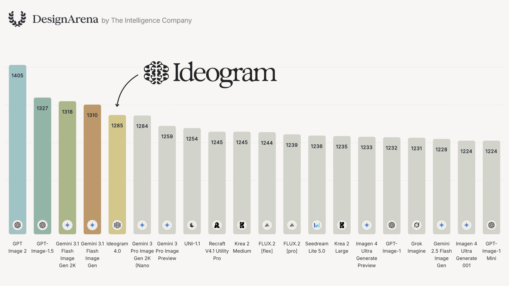
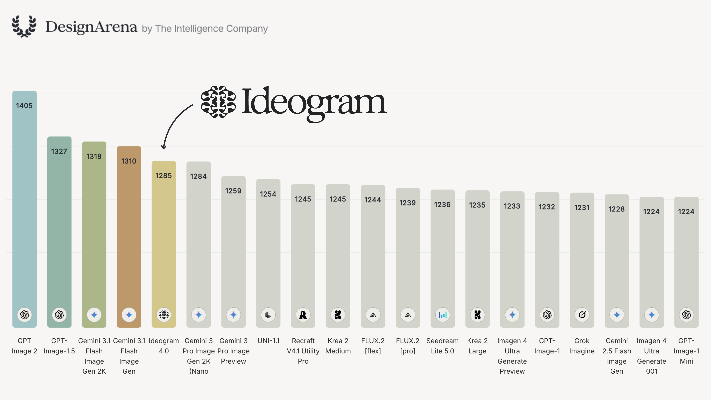
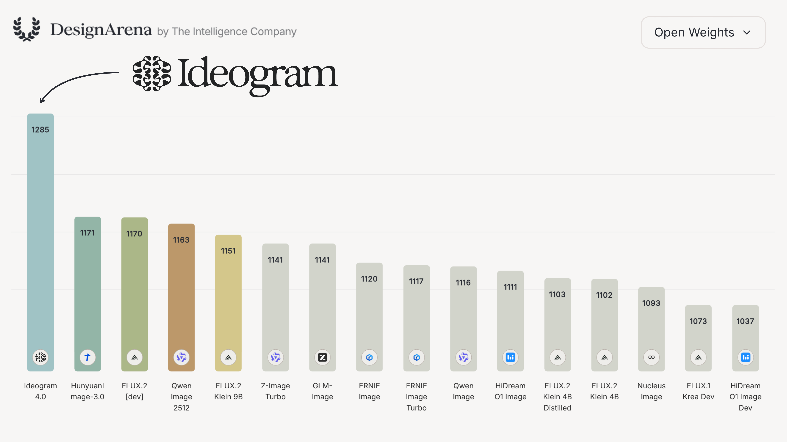

# Ideogram 4.0 Deep Dive: Open-Weight Image Models Are Moving from “Can Draw” to Controllable Design Systems

> **TL;DR:** Ideogram 4.0 is not just another text-to-image release. It is an open-weight image model aimed at the full design workflow: text rendering, layout control, structured JSON prompting, native 2K output, editable production files, and private enterprise deployment. On DesignArena it scores 1285 overall, behind only GPT Image and Gemini models, and it is the top open-weight model by a large margin. The bigger signal is that image-model competition is moving from “can it draw?” to “can it become a controllable design system?”

- **Source X post:** [Ideogram on X](https://x.com/ideogram_ai/status/2062202228770045991?s=61)
- **Official page:** [Ideogram 4.0](https://ideogram.ai/models/4.0/)
- **GitHub:** [ideogram-oss/ideogram-4](https://github.com/ideogram-oss/ideogram-4)
- **Hugging Face collection:** [ideogram-ai/ideogram-4](https://huggingface.co/collections/ideogram-ai/ideogram-4)
- **Release date:** 2026-06-03 / 2026-06-04
- **Tags:** Ideogram 4.0 / Open-Weight Image Model / DesignArena / Text-to-Image / Typography / Layout Control / Diffusion Transformer / JSON Prompting / Enterprise AI

## 1. What the post actually announces

Ideogram’s post says the core claim plainly: **Ideogram 4.0 is the top open-weight text-to-image model on DesignArena’s third-party leaderboard**, trailing only closed models from OpenAI and Google. In the visible overall chart, GPT Image 2 scores 1405, GPT Image-1.5 scores 1327, Gemini 3.1 Flash Image Gen 2K scores 1318, Gemini 3.1 Flash Image Gen scores 1310, and Ideogram 4.0 scores 1285.

This is not simply a story about an open model “catching up” to closed models. The more precise story is that open image models are becoming competitive on **real design tasks**: posters, packaging, brand assets, marketing images, social graphics, and visuals that contain text. These are different from ordinary “make a pretty image” prompts. The hard part is whether the text is correct, whether the layout is controllable, whether brand elements land in the requested location, and whether the output can move into an editing workflow.

The official GitHub README makes the positioning explicit: Ideogram 4 is Ideogram’s first open-weight text-to-image model, a 9.3B foundation model trained from scratch rather than a fine-tune of an existing checkpoint. It ships in nf4 and fp8 quantized variants under the Ideogram 4 Non-Commercial license; commercial deployment requires a commercial license matching the user’s scale.

## 2. “Open” here has three layers: weights, code, and commercial rights

Ideogram uses open-source and open-weight language, but the practical meaning has to be separated into three layers:

1. **Open weights:** the model weights are available through the Hugging Face collection, including `ideogram-4-nf4` and `ideogram-4-fp8`;
2. **Open code:** the GitHub repository includes inference code, documentation, prompting guidance, pipeline notes, and safety documentation;
3. **Commercial rights are not unconditional:** the model card and README list the Ideogram 4 Non-Commercial license, and the official site states that commercial deployments require a license matched to scale.

So the right interpretation is not “anyone can use this commercially without constraints.” It is: **researchers and developers can download, study, modify, and fine-tune the model; companies that want to put it into commercial production need to use the hosted API or arrange commercial licensing.**

That boundary matters. For developers, open weights mean local experimentation, LoRA or fine-tuning work, and private workflow validation. For enterprises, the value is the ability to run behind the firewall and respect data-residency constraints — but the actual engineering plan must include licensing, Hugging Face gating, tokens, API keys, and safety-screening dependencies.

## 3. Why it performs well on DesignArena: it is not just drawing, it is typesetting

Ideogram has always been known for text rendering. Version 4.0 turns that advantage into a broader set of structured design capabilities:

- **Multilingual text rendering** for posters, packaging, slogans, logos, and social graphics;
- **Precise layout control** through bounding boxes for text, subjects, and background regions;
- **Color-palette conditioning** through hex colors in structured prompts;
- **Native 2K image support**, with resolutions from 256 to 2048 in multiples of 16 and aspect ratios up to 6:1;
- **Editable production output**, with Background Remover and Layerize already available and a future 4.0 release expected to return alpha channels and editable text layers directly from inference.

That lines up with what a real-design benchmark cares about. In design work, failure is often not in the texture details. It is a misspelled headline, a warped logo, drifting element placement, unreadable packaging copy, or a social image whose text cannot be revised. Ideogram 4.0 pushes the training target one step earlier: read the structure first, then recreate the image from that structure.

## 4. The training idea: describe → structure → recreate

The official page describes Ideogram 4.0 as being trained with a **describe-to-structure-to-recreate loop**. Instead of pairing images with sparse captions, the system first reads scenes, backgrounds, text, and objects as structured data, then learns to rebuild images from that representation.

The GitHub README goes further: Ideogram 4 is trained on **structured JSON captions**. Plain-text prompts still work, but the best results come from JSON objects because that is what the model saw during training. The training captions are deliberately exhaustive: objects, text regions, composition, style, lighting, color, and bounding boxes are all spelled out.

This turns image generation into something closer to design compilation:

1. A user gives a natural-language brief;
2. a magic-prompt LLM expands the brief into structured JSON;
3. the JSON contains objects, text, layout, colors, and bounding boxes;
4. the image model renders a 2K image from that plan;
5. post-processing — or future native output — returns editable text layers, alpha channels, and production-ready elements.

This is especially important for agents. Agents are not great at “eyeballing” endless visual tweaks, but they are good at writing structured specifications, validating JSON, editing bounding boxes, generating variants in batches, and encoding brand guidelines into prompt schemas. Ideogram 4.0 gives agents something closer to a programmable design engine than a black-box image button.

## 5. Model specs: 9.3B, DiT, flow matching, nf4 / fp8

According to the GitHub README, Ideogram 4 is a 9.3B-parameter flow-matching text-to-image foundation model using a fully single-stream Diffusion Transformer architecture. Text and image tokens are concatenated into a unified sequence and processed through the same 34-layer transformer, rather than being handled by separate text and image branches.

The current model zoo includes two variants:

| Model | Params | Quantization | Hardware | Diffusers | License |
|---|---:|---|---|---|---|
| Ideogram 4 nf4 | 9.3B | nf4 | CUDA | Yes | Ideogram 4 Non-Commercial |
| Ideogram 4 fp8 | 9.3B | fp8 | All | No | Ideogram 4 Non-Commercial |

The engineering implications are concrete:

- the nf4 variant fits existing CUDA + Diffusers workflows better;
- the fp8 variant targets broader hardware, but the README marks it as not yet supported by Diffusers;
- weights are gated on Hugging Face, so users must accept the license gate and authenticate with `hf auth login` or `HF_TOKEN`;
- plain prompts are expanded through Ideogram’s hosted magic-prompt API by default, requiring `IDEOGRAM_API_KEY`;
- safety screening can be integrated through Hive text and visual moderation keys.

In other words, this is not a “download and forget” model. It is a production component whose deployment includes weight access, prompt expansion, safety screening, hardware choices, and license management.

## 6. Why this matters for enterprises and creators

The official enterprise story is not just “cheaper images.” It is about three operational advantages:

1. **Converging on a company’s own style:** open weights plus a commercial license allow teams to fine-tune on style guides, product photography, and historical campaigns;
2. **Running where the CIO needs it to run:** behind the firewall, on owned hardware, and in the required region for data residency;
3. **Changing the marginal economics of visual production:** at high volume, cost depends on provisioned compute rather than per-image SaaS pricing.

Ideogram also keeps a hosted API path. The official page lists Turbo at $0.03 per image, Default at $0.06, and Quality at $0.10. That creates a practical adoption ladder: validate quickly through API, then decide whether commercial licensing and private deployment are worth it.

## 7. The pressure it puts on the open image ecosystem

On the open-weight DesignArena chart, Ideogram 4.0 scores 1285, ahead of HunyuanImage-3.0 at 1171, FLUX.2 dev at 1170, and Qwen Image 2512 at 1163. That is not a narrow lead; it is a distinct gap on design-oriented generation.

This creates three pressures for other open image models:

- **Text rendering can no longer be secondary.** A model that cannot enter advertising, packaging, UI, posters, and brand material remains limited to illustration and concept art;
- **Prompting needs to become structured control.** Bounding boxes, color palettes, layer hierarchy, and object lists become the basis of programmable generation;
- **Outputs need to enter production pipelines.** Alpha channels, editable text layers, object layers, and integration with PSD / SVG / Figma-like workflows may matter more than a single PNG.

The next open-image race is not about who can draw a better cat. It is about who can become part of a **design system**.

## 8. My take: Ideogram 4.0 is a useful substrate for visual agents

If you only look at the leaderboard, Ideogram 4.0 is an open-weight image model approaching the closed frontier. From the perspective of agent products, it is more like a substrate for visual workflows: an agent can translate requirements into JSON schema, control bounding boxes, generate layout variants, send outputs through background removal and text-layer editing, run brand checks, and prepare assets for publishing.

That is relevant to content-production systems such as QCut and OpenClaw. Video and image generation only become product-grade when there is a full pipeline: **structured specification → generation → editable asset → review → distribution**. Ideogram 4.0 matters because it moves image generation closer to controllable design files.

The tweet is worth more than a leaderboard note because it marks a direction for open-weight image models: open weights are the entry point, but the real moat will be structured control, brand adaptation, private deployment, and production-grade editable output.
