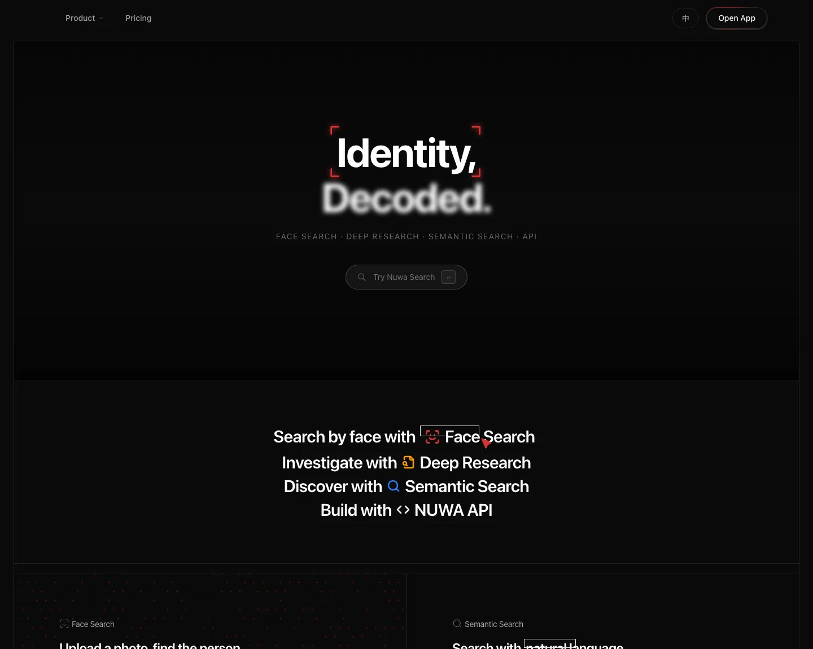
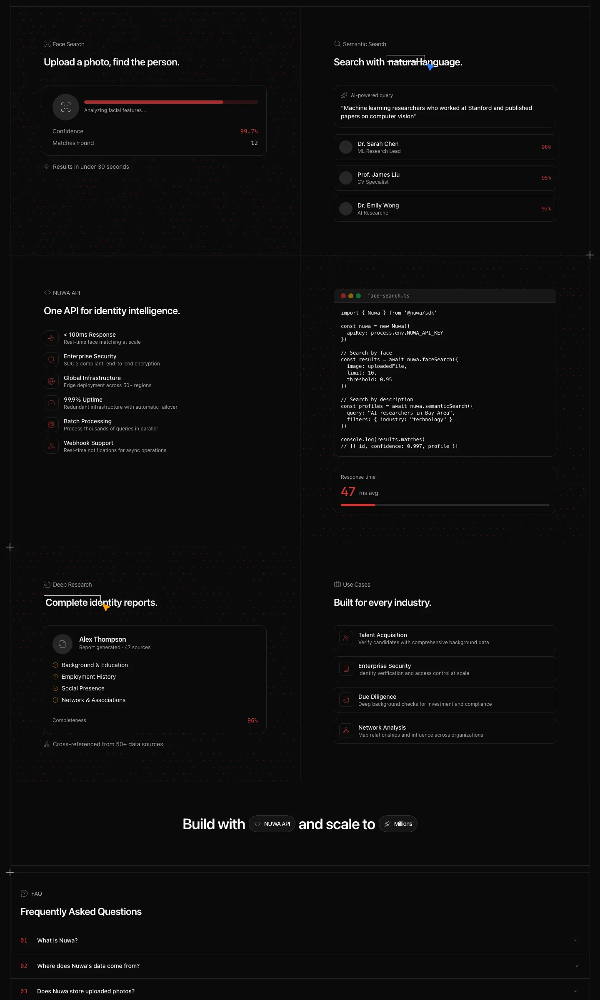

# Nuwa Deep Dive: Identity Intelligence Is Turning “Finding People” into Search, Research, and API Infrastructure

> **TL;DR:** Nuwa positions itself as **The Identity Intelligence Platform**. The product is not just a face-search tool; it combines Face Search, Semantic Search, Deep Research, and API access into an identity-intelligence workflow. Starting from a face, a natural-language description, or a research question, Nuwa tries to surface public-web identity signals and package them into an interface that can be searched, billed, automated, and integrated into enterprise processes. The direction is powerful, but it sits in a high-risk zone of privacy, misidentification, compliance, and abuse. Nuwa’s real competitiveness will depend not only on match accuracy, but also on evidence chains, permission boundaries, auditability, and anti-abuse design.

- **Source:** [Nuwa](https://nuwa.world/)
- **API Docs:** [Nuwa World API](https://gateway.nuwa.world/docs)
- **Product positioning:** Identity Intelligence Platform
- **Tags:** Nuwa / Identity Intelligence / Face Search / Semantic Search / Deep Research / OSINT / API / KYC / Due Diligence / Privacy / Safety

## 1. Nuwa is not just a face-search tool; it is an identity-intelligence workflow

Nuwa’s homepage says “Identity, Decoded.” Under that, it lists four capabilities: **Face Search · Deep Research · Semantic Search · API**. Taken together, these suggest that Nuwa is not merely building an upload-a-photo similarity search tool. It is building a product stack for discovering, verifying, and researching identity signals.

From the public site, Nuwa can be decomposed into four layers:

1. **Face Search:** upload a photo and find public-web identity leads; the homepage shows examples such as 99.7% confidence, 12 matches, and results in under 30 seconds.
2. **Semantic Search:** discover people through natural-language conditions, such as “machine learning researchers who worked at Stanford and published papers on computer vision.”
3. **Deep Research:** generate full identity investigation reports with modules such as background, employment history, social presence, and network associations.
4. **NUWA API:** package these capabilities into developer-facing endpoints for batch processing, webhooks, enterprise security, and high-availability workflows.

This implies that Nuwa’s primary users are likely not casual consumers. The target is teams that need to productize “find a person / verify a person / research a person” workflows: recruiting, due diligence, enterprise security, investigations, compliance, OSINT, and market or competitive intelligence.

## 2. “Public web” is the key boundary — and the main source of tension

Nuwa’s FAQ says it only indexes information that is publicly accessible on the open web. It says it does not access private accounts, restricted databases, or non-public records, and that results are linked to their original public sources. This boundary matters because identity-intelligence products must answer two questions: where does the data come from, and what are users allowed to do with it?

But public web data does not mean low risk. A person’s public information may be scattered across LinkedIn, GitHub, academic papers, news articles, social media, conference pages, company websites, and public directories. Each single item may look harmless. Aggregated together, they can become a highly sensitive identity profile.

So Nuwa’s real challenge is not simply whether data exists. It is whether the product can handle these questions:

- Does aggregation exceed what the person reasonably expected from public visibility?
- Could face-similarity results cause misidentification or false attribution?
- Could legitimate research slide into stalking, harassment, or discrimination?
- Does the user get enough evidence to verify results rather than trusting a confidence score?
- Can indexed individuals request correction, removal, or review?

Nuwa’s FAQ emphasizes that results are probabilistic, for reference and research purposes, and not guaranteed to confirm identity, factual completeness, or 100% accuracy. Users are told to independently verify findings before making decisions. That disclaimer is necessary, but if Nuwa enters enterprise and compliance workflows, it will need product mechanisms that enforce these principles.

## 3. Face Search: the evidence chain matters more than the match score

Face Search is Nuwa’s most direct and most sensitive capability. The homepage says “Upload a photo, find the person.” The API docs add more implementation detail: `POST /api/v1/face-search` uploads a face image and returns a `search_id`; users then poll `GET /api/v1/face-search/{search_id}` to retrieve results. The docs describe typical processing time as 15–60 seconds and say results return the top 10 matches, each with a confidence score, source URL, and face thumbnail.

This API design shows that Nuwa treats face search as an asynchronous task: upload consumes credits, polling is free, and results have a lifecycle. Technically, that makes sense because face search involves index retrieval and post-processing, which may not fit a synchronous request.

But as a product, Face Search should not be evaluated only by a 99.7% confidence label. The useful output should include:

- source URL and visual thumbnail;
- context around the matched face, such as page title, date, and site trustworthiness;
- whether multiple independent sources support the same identity;
- a clear separation between face similarity and confirmed identity;
- uncertainty around low-quality images, age changes, occlusions, makeup, similar faces, and namesakes.

If Nuwa turns face similarity into evidence-chain management, it becomes a research tool. If it only emphasizes high confidence, it risks being misused as an identity-confirmation tool.

## 4. Semantic Search turns identity search from “input a name” into “input a condition”

Nuwa’s Semantic Search example is:

> “Machine learning researchers who worked at Stanford and published papers on computer vision”

That indicates Nuwa is not just doing name search. It is mapping natural-language criteria into people/entity search. This is valuable because many real-world tasks do not begin with “I know the person; look them up.” They begin with questions like:

- find people with a specific background;
- find key nodes in a technical, industry, or institutional network;
- find people who may know a company, fund, lab, or founder;
- filter candidate experts, collaborators, investors, or due-diligence targets from public information.

The hard part is entity resolution: merging names, aliases, cross-platform accounts, paper authors, company pages, and social profiles into the same person. Semantic Search may look like a search box, but behind it sits a people graph, text embeddings, knowledge extraction, deduplication, confidence ranking, and evidence citation.

## 5. Deep Research: from search results to structured reports

Deep Research is the part of Nuwa’s product stack that looks most like an agent. The homepage example shows an “Alex Thompson” report with 47 sources, modules for background & education, employment history, social presence, and network & associations, plus 96% completeness and “cross-referenced from 50+ data sources.”

The value of this module is that it transforms fragmented search results into a structured identity report. For recruiting, due diligence, compliance, investment research, or journalism, raw information is not enough. Teams need to know:

- which facts are confirmed;
- which sources support those facts;
- which sources conflict;
- which conclusions are inferred rather than proven;
- what should be manually verified next.

Nuwa’s API docs describe Deep Research as “structured, citation-backed intelligence” and list applications such as market intelligence, competitive analysis, entity profiling, due diligence reports, and trend forecasting. The phrase citation-backed is the key. Identity-intelligence reports cannot behave like ordinary AI summaries; every conclusion needs to be traceable to sources.

## 6. API access shows Nuwa wants enterprise workflows, not only a web app

Nuwa’s homepage says “One API for identity intelligence” and lists features such as `< 100ms Response`, enterprise security, SOC 2 compliance, end-to-end encryption, 50+ regions, 99.9% uptime, batch processing, and webhook support. The API docs show three core endpoints:

| Endpoint | Credits | Capability |
|---|---:|---|
| `POST /api/v1/face-search` | 10 | Upload face image and return an async `search_id` |
| `GET /api/v1/face-search/{search_id}` | — | Poll search results at no additional credit cost |
| `POST /api/v1/deep-research` | 20 | Generate structured open-web intelligence summaries |

The docs also list rate limits: Free has 30 credits/month and 5 req/min; Starter is $49 with 500 credits/month and 30 req/min; Pro is $199 with 3,000 credits/month and 60 req/min; Business is $799 with 15,000 credits/month and 120 req/min.

This suggests Nuwa’s commercialization focus may be API and enterprise usage rather than one-off web searches. Once identity intelligence becomes API infrastructure, it can enter CRMs, ATS systems, KYC and risk systems, compliance workflows, OSINT tools, internal security platforms, and sales-intelligence stacks. That is also why permissions, audit trails, logs, compliance, and abuse prevention matter more than they would for an ordinary SaaS product.

## 7. One detail to watch: product credits and API credits use different numbers

Nuwa’s homepage FAQ says Semantic Search is free, Deep Research costs 3 credits per query, and Face Search costs 3 credits per query. The API docs, however, list `face-search` at 10 credits and `deep-research` at 20 credits.

This is not necessarily a contradiction. It may simply mean the web product and API product use different pricing units: web queries may be cheaper, while API usage is priced for batch, enterprise, and developer integration. Still, it is worth calling out because identity-intelligence commercialization is not a single price. It varies by entry point, query depth, processing cost, and enterprise workflow.

If Nuwa sells to enterprise customers, clear explanation of these credit systems will matter. Otherwise developers and business users may confuse the web-product and API-product economics.

## 8. Privacy and safety: Nuwa’s value and risk come from the same capability

Nuwa’s FAQ says uploaded images are processed temporarily, not stored long-term, and not used for model training. It also says Nuwa does not sell user queries, uploaded images, or search activity to third parties, though limited logs may be retained for platform security, abuse prevention, and legal obligations. These are baseline commitments for this category.

But the risk of identity intelligence comes from the strength of the product itself:

- **Face Search** can be used to identify strangers or link them to social profiles;
- **Semantic Search** can be used to filter people by sensitive attributes;
- **Deep Research** can aggregate public fragments into a sensitive profile;
- **API access** can amplify misuse at scale.

For Nuwa, safety cannot be an appendix. It must become product capability:

1. clearly define allowed and prohibited use cases;
2. apply stronger audit controls to high-risk queries, bulk queries, and face searches;
3. set extra rules for high-impact domains such as law enforcement, hiring, credit, housing, and education;
4. provide correction, removal, and appeal mechanisms;
5. perform KYC and usage reviews for API customers;
6. show uncertainty and source evidence directly in result pages.

That trust layer is what determines whether identity intelligence becomes a legitimate research infrastructure or an abuse-prone surveillance tool.

## 9. My take: Nuwa’s opportunity is identity graph + research agent + API; the hard part is trust

Nuwa is worth watching because it combines three trends:

- **Face and identity retrieval:** finding identity signals from an image or description;
- **AI research agents:** turning public-web evidence into structured reports;
- **API infrastructure:** embedding these capabilities into enterprise systems.

If Nuwa only does Face Search, it risks becoming a controversial single-purpose tool. If it only does Deep Research, it risks becoming a vertical version of a general search agent. The more interesting direction is that Nuwa treats “a person” as a searchable, researchable, verifiable, API-accessible intelligence object.

But the moat in this category will not be model quality alone. It will be:

- people/entity resolution quality;
- cross-source evidence chains;
- data freshness and coverage;
- misidentification control;
- enterprise permissions, auditability, and compliance;
- rights and protections for indexed people.

In other words, Nuwa’s product direction is clear: make identity intelligence into infrastructure. But for that infrastructure to become a durable platform, it must build an equally strong trust layer. The more powerful identity search becomes, the more it must prove it will not become an abuse tool. That tension is what makes Nuwa worth tracking.

