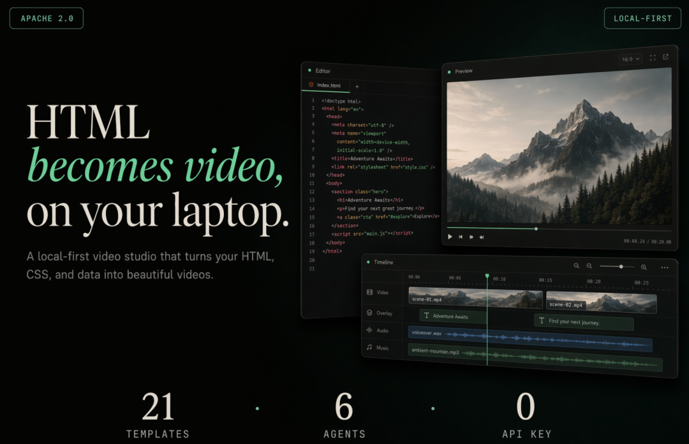
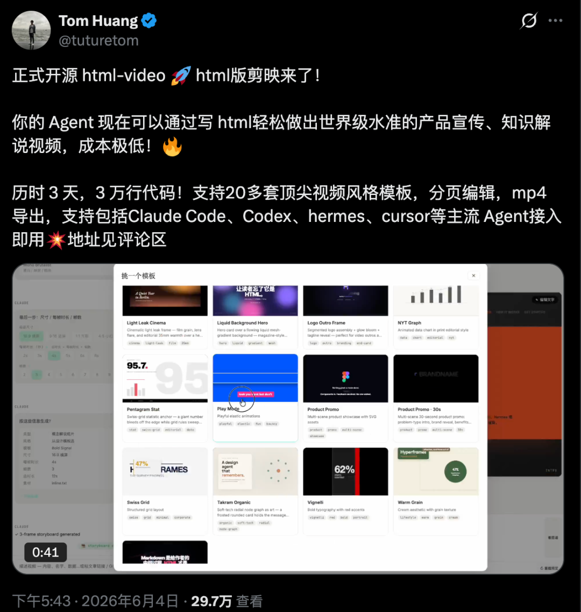
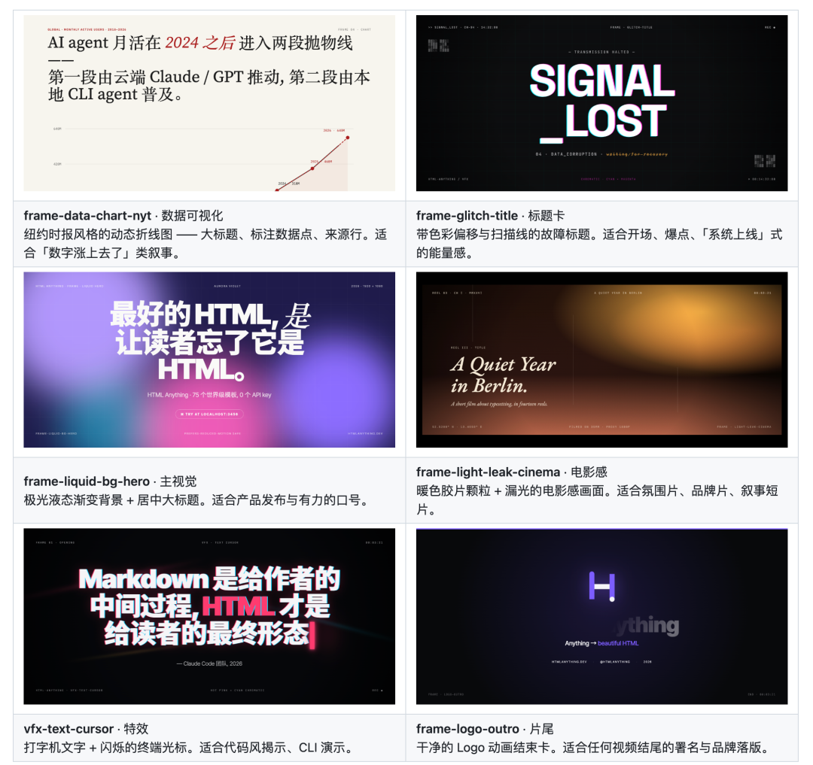

# html-video 深度拆解：Open Design 把“HTML 生成视频”做成 Agent 原生创作流水线

> **TL;DR:** html-video 的关键不只是“HTML 版剪映”，而是把 **内容输入、Agent 编排、模板系统、渲染引擎和音频生成** 接成一条本地可运行的视频生产流水线。它默认用 Hyperframes 把 HTML/CSS/GSAP 动效录制成 MP4，未来计划接 Remotion、Motion Canvas、Revideo、Manim 等引擎。真正值得关注的是：视频创作正在从手动时间线工具，转向 Agent 可以读取文章/仓库、生成故事板、选择模板、逐帧改文案、导出成片的工程化工作流。

- **Source:** [微信文章：HTML版剪映来了！Open Design 团队最新开源力作，3天时间，写了3万行代码！](https://mp.weixin.qq.com/s/Ae7Wf0K6sH3eOio1Gkh_Aw)
- **Project:** [nexu-io/html-video](https://github.com/nexu-io/html-video)
- **Publisher:** 开源星探
- **Published:** 2026-06-07
- **Tags:** html-video / Open Design / Hyperframes / HTML-to-Video / Agentic Video / Local Rendering / Templates / MiniMax / CLI / Studio

## 1. 这不是传统剪辑工具，而是“内容到视频”的 Agent Harness

微信原文把 html-video 称作“HTML 版剪映”，这个比喻很容易理解，但也容易低估它。剪映、Premiere、After Effects 这类工具的核心界面是时间线：用户手动把素材、字幕、转场、音频放进轨道，再不断预览和微调。

html-video 的入口不是时间线，而是 **任务描述**。用户可以输入一句话、粘贴一篇文章链接，或者给一个 GitHub 仓库。Agent 读取素材后，决定视频需要几个场景、每一帧讲什么、用什么模板呈现，再把结果交给渲染引擎导出 MP4。

这意味着它更像一个面向视频创作的 Agent Harness：

1. **Source ingestion**：把网页文章、公众号文章、GitHub 仓库等输入转成可用素材。
2. **Planning**：生成 content graph 或多帧故事板，把要点拆成场景。
3. **Template selection**：在模板库里挑选视觉表达方式。
4. **Frame editing**：允许用户逐帧预览、编辑文案和调整内容。
5. **Rendering**：本地用浏览器和 ffmpeg 输出真实 MP4。
6. **Soundtrack**：通过 MiniMax 等能力补上背景音乐和旁白。

这个结构的重点不是“让非专业用户少点几个按钮”，而是把视频生产拆成 Agent 可以执行、检查和复用的步骤。

## 2. HTML-to-Video 的价值在于把动效变成 Web 工程问题

html-video 选择 HTML/CSS/GSAP 作为默认表达层，本质上是在把视频动效从专业剪辑软件迁移到前端工程体系里。它默认接入的 Hyperframes，是一个面向 HTML 动画的框架；渲染时由无头 Chromium 录制动态页面，再用 ffmpeg 编码为 MP4。

这个路线有几个明显优势：

- **可编程**：HTML、CSS、JS、数据和组件都可以由 Agent 生成或修改。
- **可预览**：每一帧都可以像网页一样局部检查，不必每次等待完整视频渲染。
- **可模板化**：数据图表、标题卡、产品宣传、决策树解说、视觉特效都能沉淀成模板。
- **可本地运行**：不依赖云端渲染队列，也没有按次渲染费用。
- **可接入 CI/脚本**：CLI 可以把“文章变视频”“仓库变视频”做成自动化任务。

这也是为什么 html-video 不只是一个视频工具，而更像一个“可被 Agent 调用的视频编译器”：输入是结构化内容和风格意图，输出是可发布的视频文件。

## 3. 真正的抽象层是“渲染引擎适配器”

GitHub README 里最重要的一点，是 html-video 并不把自己绑定到单一引擎。当前可运行的默认引擎是 Hyperframes；Remotion、Motion Canvas、Revideo、Manim 等在路线图里。它的野心是把不同视频生成技术放进统一适配层。

这件事很关键。不同引擎擅长的东西不同：

- **Hyperframes** 适合 HTML/CSS/GSAP 动效和前端模板。
- **Remotion** 适合 React 组件化视频和产品化工程。
- **Motion Canvas / Revideo** 适合代码驱动的解释型动画。
- **Manim** 适合数学、几何、技术概念推导。

如果用户每次都要先选择工具，再学习对应 DSL，Agent 的工作流会被引擎边界割裂。html-video 想做的是反过来：用户只表达目标，Agent 选择引擎和模板，引擎成为后端实现细节。

这也是它和 Open Design 主线产品的一致之处：Open Design 做的是设计工具上层的 Agent 抽象；html-video 做的是动态视频和渲染工具上层的 Agent 抽象。

## 4. 21 个模板不是装饰，而是 Agent 的动作空间

原文强调 html-video 内置 21 套模板。这个数字本身不重要，重要的是模板在 Agent 工作流里的角色。

在传统模板工具里，模板是用户手动套用的皮肤。但在 Agent 原生工具里，模板更像动作空间：Agent 需要知道什么场景适合数据图表，什么场景适合标题冲击，什么场景适合产品演示，什么场景适合解释型流程。

这些模板覆盖了几类常见视频语义：

- 数据可视化：适合“指标变化”“趋势解释”“榜单对比”。
- 标题与动效：适合开场、章节转场、关键句强调。
- 主视觉与电影感：适合品牌、产品、情绪化叙事。
- 产品宣传：适合多场景功能介绍。
- 解说骨架：适合把复杂概念拆成步骤、树状结构或有机动效。

当模板带有清晰的用途标签，Agent 才能从“写一段视频脚本”走向“把脚本变成多帧视觉结构”。这一步是很多 AI 视频工具缺的：模型能生成画面，但不知道如何把一篇文章组织成可编辑、可复用、可校验的镜头系统。

## 5. 本地 Agent 集成是它最像生产工具的地方

html-video 支持多种本地 coding agent，并通过 PATH 自动探测。原文列出的支持项包括 Open Design/Vela、Windsurf CLI、Trae CLI、Claude Code、Cursor Agent、Codex CLI、Hermes、Gemini CLI、Grok Build、Qwen Code、OpenCode、GitHub Copilot CLI、Aider 和 Anthropic Messages API。

这说明它不是只想做一个“网页里的 AI 按钮”，而是想接入开发者已经在用的本地 Agent 生态。

这个选择很实用：

- 本地 Agent 已经能读文件、改代码、跑命令、调试环境。
- 视频项目本身也是一个代码项目，需要模板、依赖、渲染和导出。
- 用户可以把视频生成接进自己的工作流，而不是被困在单一 SaaS 后台。
- 当 Agent 失败时，开发者可以直接检查文件和命令，不必猜黑盒状态。

从这个角度看，html-video 更接近“Agent 可操作的视频 IDE”，而不是传统 Web 剪辑器。

## 6. MiniMax 音频补齐了视频生产闭环

视频只有画面还不够。html-video 接入 MiniMax，用来生成背景音乐和旁白，并在导出时通过 ffmpeg 混入 MP4。原文提到背景音乐可以按情绪描述生成，旁白则走 TTS，还能做音乐压低和淡入淡出。

这一步的意义在于把视频生产从“视觉样片”推进到“可发布成片”。很多自动视频工具能做画面，但音频、旁白、混音和时长匹配会让流程重新回到人工剪辑。html-video 如果能把声音也纳入工程化流程，就能让 Agent 生成的视频更接近真实交付物。

不过，音频也是质量风险最高的部分之一。旁白节奏、断句、情绪、音量、版权和平台规范都需要额外控制。真正成熟的 Agent 视频工具，必须把音频 QA 也纳入检查，而不是只在最后把声音贴上去。

## 7. 它解决的是“短内容视频化”，不是所有视频创作

html-video 最适合的场景，是把已有结构化信息转成短视频：

- 公众号文章转成动态解说；
- GitHub 仓库转成项目介绍；
- 产品更新转成发布短片；
- 数据变化转成动态图表；
- 团队进展转成自动汇报视频；
- 博客文章转成社交平台版本。

它不一定适合所有视频需求。比如长纪录片、真人素材剪辑、高复杂度视觉合成、强导演调度、角色一致性叙事，仍然需要更重的影视工具链。html-video 的优势是把“内容、模板、Agent、渲染”组合成高频、低成本、可自动化的短视频流水线。

换句话说，它不是要取代专业剪辑师，而是把原本不值得开一个剪辑项目的小型视频需求，变成可以由 Agent 自动生产的工程任务。

## 8. 真正的挑战：模板质量、版权边界和可控性

html-video 方向很强，但它要成为可靠工具，还需要解决几类问题：

1. **模板审美会不会趋同**：21 个模板只是起点。用户很快会需要品牌化模板、行业模板和可组合的视觉系统。
2. **长文本如何压缩**：文章转视频不能只是摘句子。它需要判断主线、删掉枝节、控制信息密度。
3. **版权和来源边界**：如果用户粘贴第三方文章或素材，工具需要提醒授权、引用和平台规范。
4. **渲染稳定性**：浏览器录制、动画 timing、字体、图片加载、ffmpeg 编码都可能引入不可见问题。
5. **可控性与自动化的平衡**：Agent 一键生成很爽，但视频最后仍要支持人工逐帧修正。
6. **多引擎适配复杂度**：Hyperframes、Remotion、Manim 的表达模型差异很大，统一接口不能只停留在概念层。

这些挑战并不削弱 html-video 的价值。恰恰相反，它们说明这个项目踩到了一个真实的新产品面：AI 时代的视频工具不再只是模型能力，而是围绕模型建立可编辑、可验证、可交付的生产系统。

## 9. 结论：视频生成正在从“模型输出”走向“Agent 生产系统”

过去一年，AI 视频的讨论大多围绕模型：更长、更真实、更稳定、更高分辨率。但 html-video 指向另一条路线：不和大模型比“凭空生成镜头”，而是把已有内容变成可编辑、可自动化的视频产物。

它的核心竞争点不是单个模型，而是五个系统能力：

- 能读取真实来源；
- 能把内容规划成故事板；
- 能把视觉表达沉淀成模板；
- 能把渲染留在本地可控环境；
- 能让 Agent 和用户在同一个工程里协作。

这条路线很适合内容团队、开源项目、开发者工具、产品营销和知识创作者。它把视频制作从“打开剪辑软件做一条片”变成“让 Agent 把一份内容编译成视频”。这可能不是影视制作的终点，但很可能是 Agent 原生视频工作流的一个重要起点。
