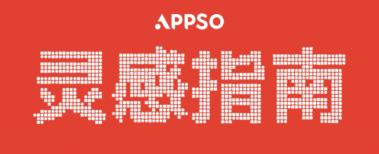
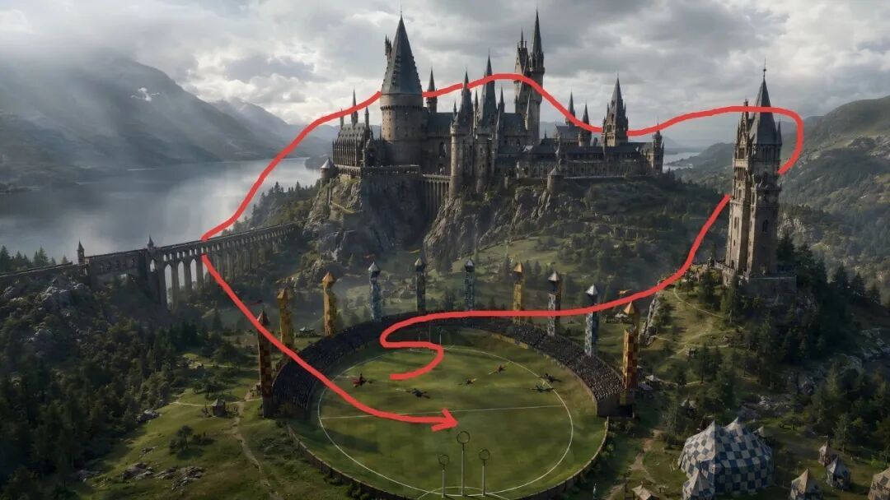
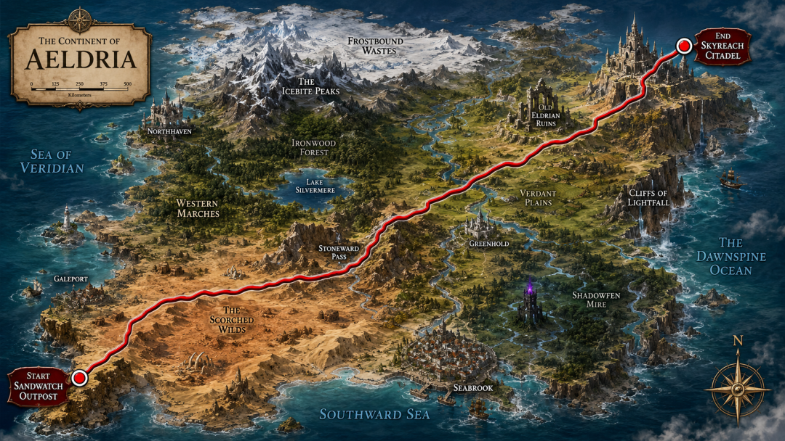
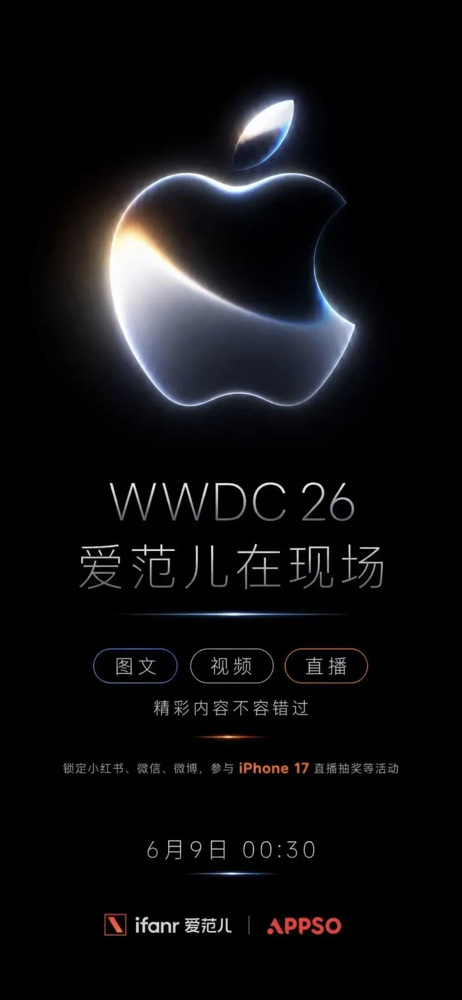
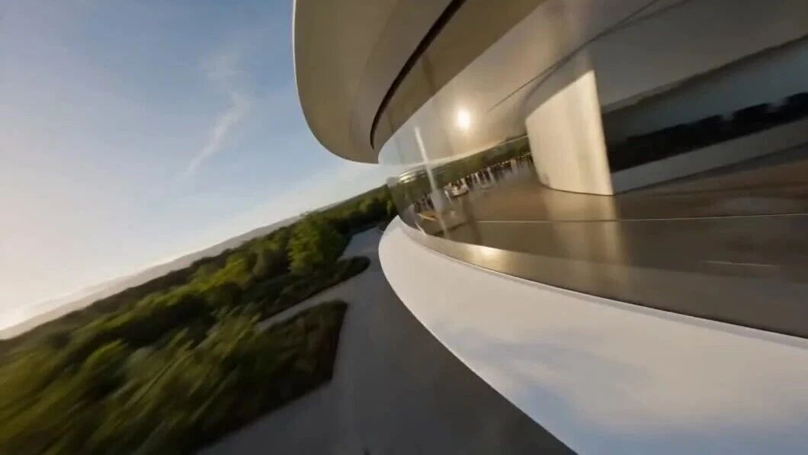
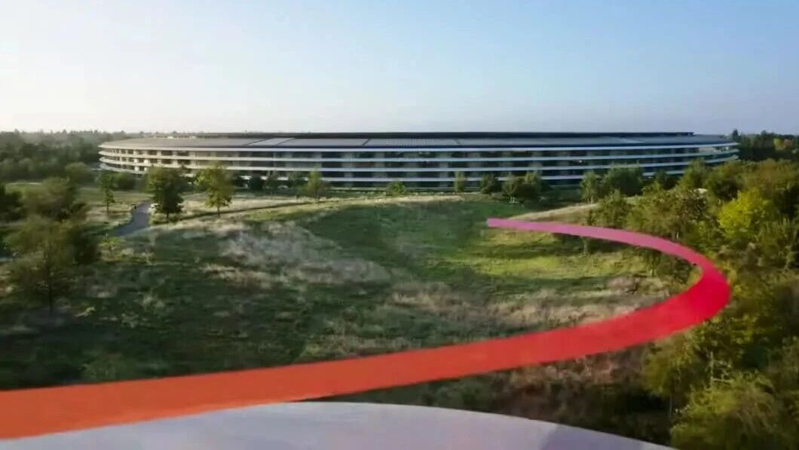

# Red-Line Camera Control Deep Dive: AI Video May Need Visible Paths More Than Longer Prompts

> **TL;DR:** The APPSO article uses Apple Park before WWDC as a creative hook, but the deeper point is about AI-video control. Instead of describing a camera move only in text, creators are drawing a red path directly on a reference image. The red line turns camera motion into a visible constraint. Seedance 2.0 then tries to generate a first-person FPV shot along that path, while GPT Image 2 can help generate the base image, route map, and prompt. The important part is not the gimmick; it is a lightweight interface for directing AI video.

- **Source:** [APPSO WeChat article: iOS 27发布前夕，我用全网独家视角带你逛苹果总部](https://mp.weixin.qq.com/s/zkX0X9TzZO2Zvp4EDQBjHA)
- **Publisher:** APPSO
- **Published:** 2026-06-07
- **Tags:** AI Video / Seedance 2.0 / GPT Image 2 / FPV / Camera Control / Red Line Prompting / Apple Park / WWDC / Visual Prompting / AI Filmmaking

## 1. Why drawing a line suddenly matters

The hardest part of AI video control has not been “what appears in the frame.” It has been “how the camera moves.” Text can say “push forward,” “fly around the building,” or “travel through the corridor,” but the model still has to translate those words into continuous spatial motion. In complex scenes, the camera may skip, drift, repeat architecture, deform objects, or turn a supposed one-shot into something that feels stitched together.

Red-line camera control is simple: if the model can read images, draw the path directly on the image. The red line is not meant to remain in the final video. It is a control mark for the model. It tells the model where to start, which waypoints to pass, and how to end. Seedance 2.0 then generates an FPV-style video from that route-marked reference image.

The interaction pattern is changing:

- Before: describe space with a long prompt.
- Now: use the image for space, the red line for path, and the prompt for rules.
- Next: this may become editable 3D paths, camera curves, and storyboard layers.

## 2. The red line is a visual prompt, not source material

The core trick is not to keep the red line in the video. The line is a hidden path instruction. The prompt explains that the line should be removed while the camera follows the route.

That kind of visual prompt has several advantages over text-only camera directions:

1. **Clearer space:** Start, turns, waypoints, and endpoint appear in one image.
2. **More controllable nodes:** The creator can directly connect must-pass landmarks.
3. **Less language ambiguity:** The model reads a path instead of parsing a dense camera paragraph.
4. **Faster iteration:** If the route is wrong, edit the line rather than rewriting the whole prompt.

It is not magic. A line that is too thin, messy, long, or ambiguous can still be ignored or simplified. The red line is best understood as a cheap director annotation layer. It tells the model where to fly, but the base image, duration, rhythm, and prompt still matter.

## 3. The workflow: base image, route, Seedance

APPSO frames the process as a three-step workflow. Here is the more engineering-oriented version.

First, prepare the base image. It can come from a real aerial photo, satellite image, building image, or GPT Image 2 generation. The key requirement is readability: foreground, middle ground, and background should be distinct; the image should have depth; and there should be enough space for the camera to travel.

Second, draw the route. The simplest method is to draw a red line manually in any image editor. A more automated method is to ask GPT Image 2 to generate the base image with the route already marked. Four rules matter:

- Match route length to video duration.
- Make the line thick enough to be recognized.
- Make turns and endpoints explicit.
- Split complex routes into shorter clips and stitch them later.

Third, give the route-marked image and camera prompt to Seedance 2.0. The prompt should not merely say “follow the red line.” It should specify that the line must be removed, the shot is FPV, the motion is one continuous take, and the model should avoid skipping, watermarks, repeated structures, and deformation. For tighter pacing, describe the shot by time segments, such as one camera beat every three seconds.

## 4. What the Apple Park case really shows

The article’s hook is Apple Park before WWDC. That is a good test scene because Apple Park is naturally path-friendly: a ring building, central garden, green fields, roads, and recognizable landmarks.

APPSO first tried to draw a camera route on an Apple Park panorama. The article notes that the manually drawn route was hard even for the author to understand, let alone the model. They then used GPT Image 2 to help generate the path and prompt.

That failure is instructive. Red-line control is not random scribbling. It requires the creator to translate camera language into model-readable visual notation. The path must behave like a storyboard or camera blocking diagram, not like a casual doodle.

## 5. Why this is closer to directing than text-only prompting

Camera movement in film is not a standalone instruction. It is a relationship between space, timing, and subjects. An FPV shot includes:

- where the camera starts;
- how fast it moves;
- which spatial nodes it passes;
- what it avoids or passes through;
- where it rises, dives, turns, or pulls out;
- what subject or wide view it ends on.

Text can describe all of that, but the more it says, the more constraints the model can lose. A red line compresses the most important part, the spatial path, into visual information. The prompt can then focus on style, constraints, and timing.

This resembles real directing. A director does not only tell the camera operator to “fly through the space in a cool way.” They use storyboards, blocking diagrams, shot maps, and route planning. The red line is a crude but powerful camera map for AI video.

## 6. The boundary: path control is not total control

Red-line prompting is useful, but it does not mean precise video control is solved. It mainly improves camera path control. It does not reliably solve:

- subject consistency;
- object deformation;
- leftover red-line artifacts;
- route simplification;
- real spatial relationships between landmarks;
- physically plausible speed and motion;
- long-video continuity.

The source article also notes that GPT Image 2 plus Seedance 2.0 can still leave the red line visible or fail to follow the route exactly. So this is a hit-rate improvement technique, not a strict path-planning system.

The next step is probably not asking users to draw ever more complicated lines. It is upgrading red lines into editable paths with nodes, speed curves, height, orientation, lens settings, and occlusion relationships. At that point, AI video tools start to look more like a 3D director stage than a text-to-video box.

## 7. Where this workflow fits

This is especially useful for short videos with strong spatial traversal:

- city-axis flythroughs;
- campus, venue, park, or museum tours;
- game maps and imaginary-world flights;
- product-space reveals;
- event preview videos;
- travel-destination flythroughs;
- real-estate or architecture route explanations;
- FPV social-video experiments.

It fits the Apple Park setup well: before WWDC, a single Apple Park image plus a route line can simulate a drone-style tour. The goal is not photographic truth. The goal is a fast, spatially imaginative preview video.

## 8. The larger trend: video prompting is becoming graphical

The most important thing to record is not one specific prompt. It is the changing shape of prompting itself. Early AI video relied mostly on text. Then reference images became common. Now we are seeing paths, masks, pose controls, depth, layers, and 3D director-stage workflows.

That suggests users do not simply need better prompt-writing skills. They need interfaces that feel closer to creative software:

- lines for motion;
- boxes for subjects;
- layers for foreground and background;
- timelines for rhythm;
- nodes for transitions;
- 3D scenes for camera positions.

Red-line camera control is the lightest version of that idea. It lets ordinary users hand a camera path to an AI-video model with almost no tooling.

## 9. Conclusion: AI video is entering the race for directability

The first stage of AI video competition was about generation: can the model produce a plausible clip? The next stage is about direction: can a creator control the clip?

Red-line camera control matters because it turns camera movement from an abstract sentence into something visible, editable, and reusable. APPSO’s Apple Park experiment does not prove the method is perfect. It shows a realistic middle state: models can understand part of the path intention, but they still fail; users can control the camera graphically, but they still need sampling and prompt tuning.

That is exactly where the product opportunity sits. The AI-video tools that connect paths, storyboards, timelines, 3D space, and generation into a stable workflow will move beyond toy generation and become real directing tools.
