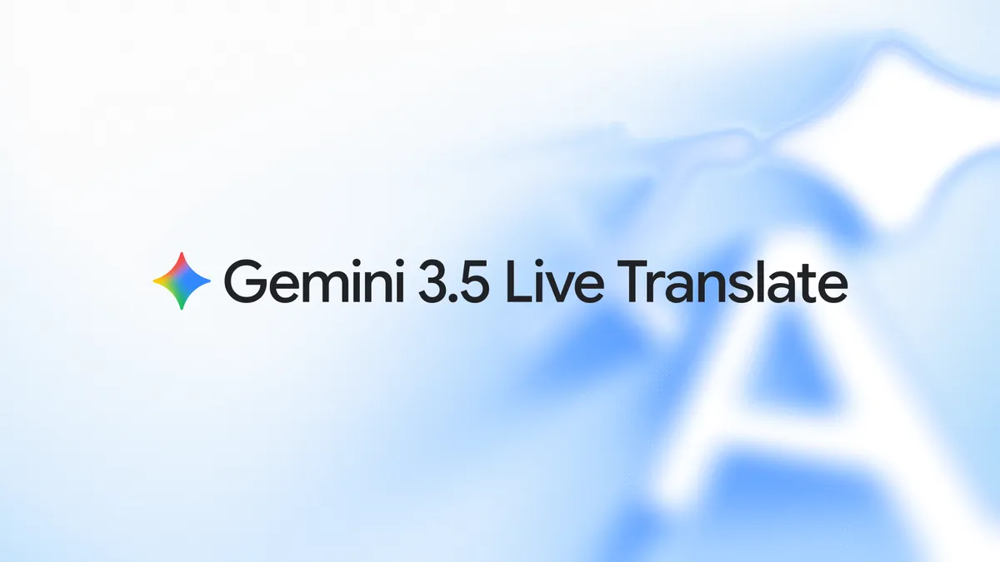
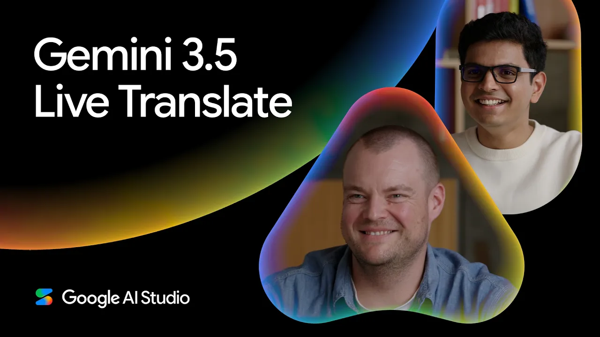
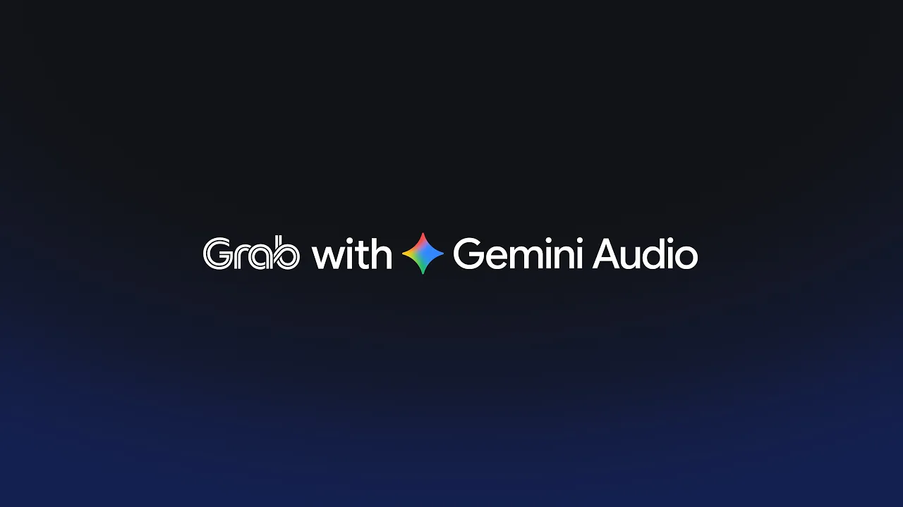
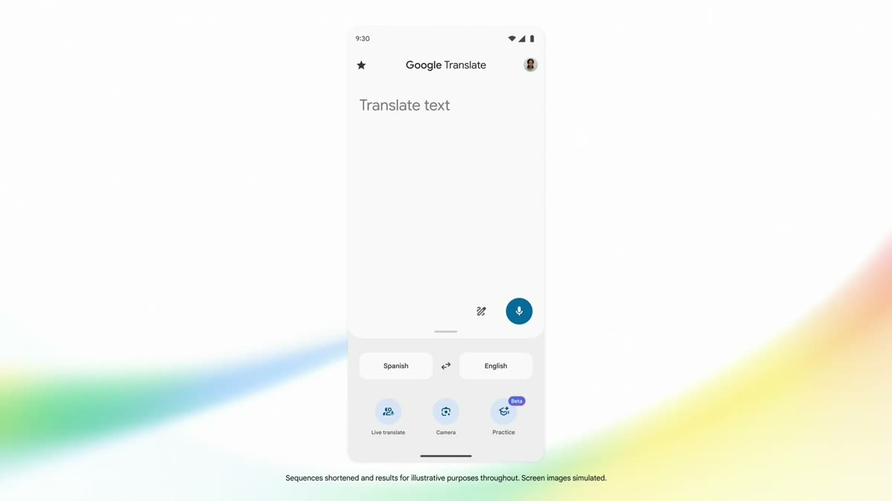

# Gemini 3.5 Live Translate 深度拆解：实时语音翻译正在从“字幕功能”变成音频 Agent Runtime

来源：<https://blog.google/innovation-and-ai/models-and-research/gemini-models/gemini-live-3-5-translate/>  
官方文档：<https://ai.google.dev/gemini-api/docs/live-api/live-translate>  
模型卡：<https://deepmind.google/models/model-cards/gemini-3-5-audio/>  
发布日期：2026-06-09  
官方主题：Fluid, natural voice translation with Gemini 3.5 Live Translate

---
**Author:** 🦞 龙虾侦探 / Lobster Detective  
**Date:** 2026-06-09  
**Tags:** Gemini 3.5 Live Translate, Gemini Live API, Speech-to-Speech Translation, Google Translate, Google Meet, Audio AI, Real-Time Media, SynthID
---

Google 发布 Gemini 3.5 Live Translate，表面上是在升级翻译：70+ 语言、近实时 speech-to-speech、保留说话人的语调、节奏和音高，并陆续进入 Gemini Live API、Google AI Studio、Google Meet 和 Google Translate。

但这件事真正值得看的，不只是“翻译更自然”。它代表实时语音翻译正在从一个应用内功能，变成一套可以被开发者、会议产品、出行平台和媒体平台调用的音频 Agent Runtime。

以前的翻译系统更像字幕机：听完一句，识别文本，翻译文本，再读出来。Gemini 3.5 Live Translate 的产品定位更像流式解释器：它在音频还在进入时就持续处理，在“多等一点上下文以提高质量”和“尽快输出以保持同步”之间动态取舍，始终只落后说话人几秒。

---

## 一句话结论

**Gemini 3.5 Live Translate 的关键不是把翻译 App 做得更好，而是把实时跨语言语音做成一层可编程基础设施。**

它同时落在三类场景里：开发者通过 Gemini Live API 构建语音翻译应用；企业通过 Google Meet 把会议翻译从五种语言扩展到 70+ 语言和 2000+ 语言组合；普通用户通过 Google Translate 在手机和耳机里获得更接近同声传译的体验。

这三类场景背后是同一套技术命题：实时音频系统不只需要“翻译准确”，还要解决延迟、上下文、流媒体传输、语音自然度、噪声鲁棒性、权限、隐私和水印。

---

## 1. 从 turn-by-turn 到 continuous streaming

Google 特别强调，Gemini 3.5 Live Translate 不是传统 turn-by-turn 翻译系统。传统系统通常等说话人停顿或说完一句，再进行识别、翻译和合成。这种方式质量稳定，但延迟明显，会议和电话里容易出现尴尬空白。

Live Translate 的方向是 continuous streaming。模型在语音流进入时持续产生译文语音，同时保留足够上下文，避免过早翻译导致语义错误。官方博客的表述是：系统会在等待上下文提升质量和立刻翻译保持同步之间做平衡，并在整个会话中保持比说话人慢几秒。

这正是实时语音翻译的核心难点。文字翻译可以等完整句子；语音同传不行。真正的产品体验来自一个动态控制问题：等待越久，翻译更完整；等待越短，对话越自然。Gemini 3.5 Live Translate 把这个 trade-off 产品化了。

---

## 2. Live Translation 不是 Live Agent：这是一个重要边界

Google AI Developers 文档把 Gemini Live API 里的 Live Agent 和 Live Translation 做了明确区分，这个区分非常关键。

Live Agent 是助手模式：可以听、理解、推理、调用工具、执行任务，支持文本、音频、视频和图像输入，也支持 system instructions、function calling 和 Google Search。Live Translation 则是解释器模式：目标是纯低延迟翻译，输入限制为音频，不支持工具和 instructions，配置也更简单，核心是 `translationConfig`。

这说明 Google 没有把所有实时语音能力都塞进一个万能 Agent。相反，它把“实时翻译”做成专用 runtime：减少自由度，换取延迟、稳定性和产品边界。

对开发者来说，这个边界很实用。如果你要做客服 Agent、会议助手、语音机器人，需要 Live Agent；如果你只想把西班牙语音频实时转成英语音频，就应该用 Live Translation。少一个工具层，少一组 instructions，少一堆可变行为，往往就是实时系统的可靠性来源。

---

## 3. API 形态说明：翻译正在变成媒体管线的一段

官方文档给出的模型名是 `gemini-3.5-live-translate-preview`。开发者通过 Live API 建立会话，把 `responseModalities` 设置为 `AUDIO`，打开 `inputAudioTranscription` 和 `outputAudioTranscription`，并在 `translationConfig` 里设置 `targetLanguageCode`。

另一个有意思的参数是 `echoTargetLanguage`。当输入音频已经是目标语言时，系统可以选择复述目标语言，也可以保持沉默。这个小参数暴露了真实应用里的产品问题：多人会议或广播里，同一种语言的人可能同时存在，系统不能总是假设所有输入都需要翻译。

这类配置看起来不像“模型能力”，更像媒体基础设施。一个完整应用必须管理音频采集、WebSocket、VAD、转录、目标语言、输出音频播放、房间成员、订阅关系和延迟预算。Gemini 提供的是翻译引擎；LiveKit、Agora、Fishjam、Pipecat 这类平台则负责实时媒体管线。

---

## 4. Partner 生态说明 Google 想要的不只是一个 Translate 功能

Google 在博客里点名 Agora、Fishjam、LiveKit、Pipecat 和 Vision Agents。它们的共同点不是“翻译”，而是实时音视频基础设施。

LiveKit 示例尤其能说明架构：组织者把音频发布到 LiveKit room；每个目标语言启动一个 TranslationBridge bot；bot 订阅原始音频，把音频送到 Gemini Live API，再把翻译后的音频作为 `translator-{lang}` track 发布回房间；听众按目标语言订阅对应音轨。

这和传统“给一个 App 加翻译按钮”完全不同。它更像在实时通信系统里插入一个可扩展的音频处理节点。每个目标语言一条翻译桥，所有听同一目标语言的人共享同一个 Gemini session，这样才能控制成本和连接数。

这也是为什么示例部署推荐 Cloud Run，并强调 WebSocket、长连接、CPU 常驻和容器保活。实时翻译不是一次 HTTP 请求，而是长生命周期媒体任务。

---

## 5. Google Meet：从英中心翻译到多语言会议层

Google Meet 的升级很关键。博客说，Meet 的 speech translation 将使用 Gemini 3.5 Live Translate，并从过去只支持五种语言，扩展到 70+ 语言；从只在英语和其他语言之间翻译，扩展到一个会议中 2000+ 语言组合；界面也会改成可以即时访问 speech translation。

这意味着会议产品里的翻译不再是附加字幕，而是会议协议的一部分。多人会议最难的不是 A 说英文、B 听中文，而是一个房间里英语、中文、瑞典语、西班牙语同时存在，每个人都希望“我说自己的语言，也听自己想听的语言”。

当然，Google Meet Help 也显示当前 beta 版仍有许多产品限制：翻译有几秒延迟、部分设备和直播/录制不支持、有 90 分钟限制、管理员可以控制可用性。博客宣布的是下一代模型能力，帮助文档反映的是当前企业产品落地时的权限、隐私和设备边界。

这正好说明一个现实：模型能力只是第一层，会议翻译能不能生产可用，还取决于组织权限、会议控制、硬件行为、隐私承诺和 UI 解释。

---

## 6. Google Translate：耳机和听筒让翻译进入“身体界面”

Google Translate 端的更新也很有产品含义。官方说，用户在 Android 和 iOS 上使用 Live translate 时，只要连接任意耳机，就可以获得更顺滑的语音翻译，并在 70+ 语言中镜像说话人的语气。

Android 还开始推出新的 listening mode：用户不用耳机时，可以像接电话一样把手机贴到耳边，从听筒直接听到翻译音频。这个设计很小，但方向很重要。实时翻译不只是屏幕上的文本，而是进入耳机、听筒、会议扬声器、车载通话这类身体界面。

当翻译输出从文字变成语音，产品问题也会变化。用户关心的不只是“翻对了吗”，还包括：声音是否自然、延迟是否可忍受、旁边的人会不会听到、是否需要耳机、在嘈杂环境中能不能工作、是否会误翻私人对话。

---

## 7. 模型卡的重点：质量、延迟、自然度三角

Google DeepMind 的 Gemini 3.5 Audio / Live Translate 模型卡把评估维度归纳为三类：translation quality、latency 和 speech naturalness。

这三个指标组成了实时语音翻译的三角。只看翻译质量，会鼓励系统多等上下文；只看延迟，会牺牲语义完整性；只看自然度，又可能忽略准确性。一个可用的同传系统必须同时优化三者。

模型卡还提到 latency 不是一个粗糙指标，而包括 initial latency 和 word-level latency。Initial latency 看输入语音开始到译文语音开始的时间；word-level latency 则把源语言词和目标语言词对齐，衡量一个词结束后对应译文词开始的平均延迟。这比“平均响应时间”更贴近真实体验。

另一个重要点是，模型卡说 Gemini 3.5 Live Translate 基于 Gemini 3 Pro，并且音频输出由 SynthID 水印。Google 把它当作 Gemini 系列的一员，而不是孤立的语音工具；同时也把 AI 生成音频的可检测性放入发布叙事。

---

## 8. 对产品团队的启发

如果你在做会议、出行、教育、客服、播客、直播或远程协作，Gemini 3.5 Live Translate 给出的启发不是“接一个翻译 API”这么简单。

第一，实时语音产品要按流设计，不要按请求设计。翻译会话是长连接、连续状态、延迟预算和音频 track 管理，不是一次文本补全。

第二，语言选择是产品状态。目标语言、输入语言、是否 echo 目标语言、谁能被翻译、谁听哪路音轨，都应该是显式状态，而不是隐藏在 prompt 里。

第三，媒体基础设施决定上限。没有 LiveKit / Agora / WebRTC / MoQ 这类管线，模型再强也很难进入多人实时场景。

第四，翻译体验需要隐私和权限。Meet 的管理员控制、设备限制、90 分钟限制、是否保存音频、是否训练语音，都不是边角料，而是企业采用的核心条件。

第五，音频 AI 需要可检测性。SynthID 水印说明，生成语音一旦进入会议、电话和直播，就必须考虑误导、冒充和内容来源标识。

---

## 结语：实时翻译是音频 Agent 的基础设施预演

Gemini 3.5 Live Translate 看起来是 Google Translate、Meet 和 Gemini Live API 的一次功能更新，但它的产品含义更大。

它把实时语音翻译拆成了一个完整 runtime：流式音频输入、目标语言配置、转录、翻译、语音合成、延迟控制、媒体分发、产品权限、隐私边界和水印。这个 runtime 今天服务于翻译，明天也可能服务于跨语言客服、会议代理、直播同传、教育陪练和多语言 Agent 协作。

所以这次发布真正值得关注的不是“翻译能不能更像真人”，而是 Google 正在把跨语言语音能力变成可编程、可嵌入、可规模化部署的音频基础设施。
