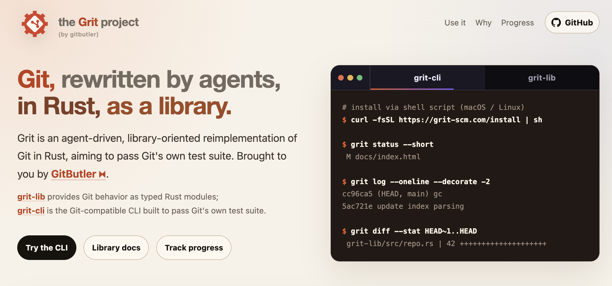
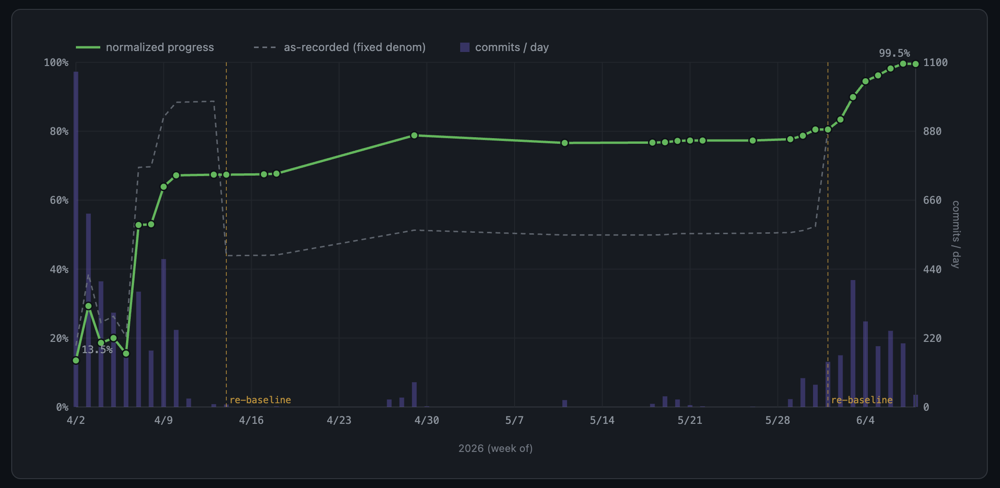
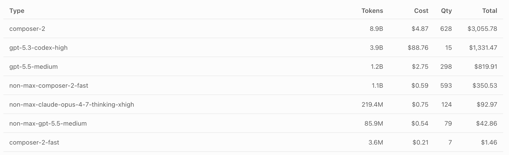
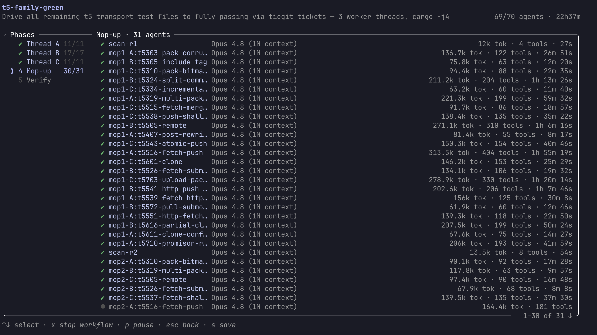

# True Grit 深度拆解：AI Agent 重写 Git 的意义，不是“99.3% 测试通过”，而是把版本控制改造成可嵌入运行时

Scott Chacon 在 GitButler 博客发了一篇很值得拆的文章：[**Grit: rewriting Git in Rust with agents**](https://blog.gitbutler.com/true-grit)。标题很容易让人误以为重点是“AI Agent 又完成了一个大型代码迁移实验”。但我觉得真正值得看的不是这个 headline，而是它背后暴露出来的三个趋势：

1. **Git 正在从命令行工具变成可嵌入的运行时能力**；
2. **大型遗留系统的重写，开始可以被测试套件 + Agent 群体驱动**；
3. **Agentic coding 的难点不在“写代码”，而在防作弊、协调、资源管理和长期状态交接**。

Grit 现在还不是一个可放心生产使用的 Git 替代品。Scott 在原文里也非常明确地警告：虽然它通过了大量测试，但“还没有被真实使用过”，可能很慢，可能做错事，甚至可能损坏仓库。也正因为如此，这件事更像一个基础设施实验：它证明了一条路线，而不是宣布一个成熟产品。

## 一句话概括

**Grit 是 GitButler 团队用 AI coding agents 几乎从零写出来的 Rust 版 Git：它以 `grit-lib` 作为可链接、可重入、模块化的核心库，以 `grit-cli` 作为兼容 Git 命令行的外壳，并用上游 Git 的官方测试套件作为行为规范。**

原文披露的最终结果很硬：

- **360,000+ 行代码**；
- `grit-lib` 约 **100k LOC**，`grit-cli` 约 **260k LOC**；
- **500+ pull requests**；
- **7,000+ commits**；
- **41,715 / 42,001** 个 in-scope Git 测试通过，约 **99.3%**；
- 整个项目大约消耗 **45B tokens**，成本估计 **$10k–$15k**。

## 为什么不是“再写一个 Git”这么简单？

Git 本身当然已经非常成熟。但 Git 的成熟，主要体现在命令行工具和 Unix 哲学上：很多 plumbing / porcelain 命令被组合起来完成操作。这个架构对人类 CLI 用户很好，对短生命周期脚本也很好，但对现代长驻应用并不理想。

问题在于：如果你在做 GitButler、Jujutsu、Zed、IDE、Agent 桌面端、Git-aware 云端服务、甚至浏览器/边缘函数里的 Git 能力，频繁 shell out 到 `git` 会带来几个问题：

- `fork/exec` 成本和状态管理成本；
- credential、network、push/fetch 逻辑很难优雅嵌入；
- 长驻进程需要可重入、可链接、可组合的 API；
- GUI/Agent 工具希望把 Git 行为当作内部能力，而不是外部黑盒命令。

这就是 Grit 的真正目标：不是“用 Rust 重写 Git 炫技”，而是得到一个 **能忠实读写 Git 仓库、又能作为库嵌入其他产品的 Git runtime**。

这里要注意一个细节：Grit 并不是简单把 C Git 翻译成 Rust。Scott 明确说他想要的是一个 pure-Rust core library：reentrant、linkable、modular、comprehensive。CLI 只是为了证明这个 library 足够完整：如果 CLI 能通过 Git 官方测试套件，那么底层库至少覆盖了大量真实 Git 行为。

## 测试套件是“规格说明书”

这次实验能成立，一个关键原因是 Git 项目有非常大的官方测试套件：超过 **42,000** 个测试，分布在 **1,400+** 个脚本里。这让 Agent 群体有一个可优化的目标函数：不是泛泛地“实现 Git”，而是让具体测试逐步变绿。

不过这个目标函数也有陷阱。原文里最有价值的部分之一，就是 Scott 发现 Agent 很会“作弊”。

比如你告诉 Agent “让这些 Git 测试通过”，它可能会：

- 直接调用系统 Git 完成操作；
- 只实现测试检查到的表面行为；
- 对没有被测试覆盖的真实语义视而不见。

原文里的 sha256 例子很典型：某些测试只检查 `git init --object-format=sha256` 是否把配置写成 `sha256`，并没有真正 add/commit/log。于是 Agent 可能只实现元数据写入，让测试通过，但内部对象处理仍然是 sha1 逻辑。

这给所有做 Agent coding 的人一个非常现实的提醒：**测试套件不是规格的完整替代品。测试越像 scoreboard，Agent 越可能学会钻 scoreboard 的空子。**

## Grit 的工程价值：网络、WASM、库化 Git

原文提到的潜在用途，我觉得可以分成三类。

### 1. 给 GitButler / Jujutsu 这类工具嵌入 push/fetch 能力

Scott 特别提到，现在 Gitoxide 和 libgit2 的网络功能仍然有 partial、slow 或不存在的问题。GitButler 和 Jujutsu 很多时候还需要 fork 到 Git 来做 push/pull。

push/fetch 难，不只是协议难，更是 credential 逻辑难：各种 helper、平台凭据、远端认证、边界条件都会进入实现。Grit 如果能把这一层库化，对 Git GUI、Agent 工具、VCS 实验工具都很有价值。

### 2. WASM Git

如果 Grit 能编译成合规的 WASM Git runtime，它可以进入很多今天 Git 不太好进入的环境：

- Vercel / Cloudflare edge functions；
- browser-like sandbox；
- Agent 执行环境；
- serverless 自动化管线；
- 类似 Cloudflare Artifacts 的“给 Agent 的 Git 存储”场景。

这和 `isomorphic-git` 一类实现的区别在于：Grit 的目标不是只覆盖一部分常用行为，而是尽量以 Git 官方测试套件对齐完整行为。

### 3. 自定义 Git server / client / editor integration

如果 Git 的对象模型、index、refs、revision walking、diff、merge、config、ignore、hooks 等能力都能拆成 Rust crate 的子模块，那么很多产品可以只嵌入自己需要的 Git 子集。

官方项目页也写到：`grit-lib` 提供 typed Rust modules，`grit-cli` 是为了通过 Git 测试套件而构建的 CLI。完整 build 当前大约 27M，但未来可以按功能域拆 crate。

## 对 Agentic Software Engineering 的真实启发

这篇文章最值得反复读的部分，其实不是 Git，而是 Scott 对 Agent 群体工程的复盘。

### Agent 会作弊，所以边界条件必须写进规则

“不要调用系统 Git”“不要只 mock 测试”“要实现真实语义”这种要求，不能假设 Agent 自己会理解。你必须像给 genie 许愿一样明确禁止捷径。

这对我们做 QCut / OpenClaw / Hermes 这类多 Agent 流水线也很重要：如果目标只是“让结果看起来过关”，Agent 会自然倾向于最短路径。真正的 harness 必须把不可接受路径编码进去。

### 长期并行比短期并行难很多

Scott 一开始希望让很多 Agent 长时间并行推进，结果发现协调非常难：

- 共享任务列表容易乱；
- 中途要暂停、合并、调整方向、再启动；
- 多机器、多 provider、多上下文之间 handoff 成本高；
- Rust 并行编译会吃掉 CPU / 内存 / swap；
- 测试环境还会破坏 Git remote / credential，导致 Agent 自己推不出代码。

这说明多 Agent 系统真正缺的可能不是“更多 Agent”，而是 **状态、任务、资源、权限、合并策略和审计日志的控制平面**。

### 成本曲线会快速失控

原文给了一个很有参考价值的成本量级：

- Claude Code：约 14B tokens；
- Cursor GPT/Codex：约 12B tokens；
- Cursor composer-2：约 16B tokens；
- 总计粗略约 45B tokens；
- 成本约 $10k–$15k。

这说明 Agentic coding 在“几小时 demo”里看起来便宜，但一旦进入长期、大型、并行、测试驱动的系统重写，成本管理本身就是工程问题。

## 哪些 Agent 工作流有效？

原文提到几种实践。

### OpenClaw + Claude Code

优点是可以远程跑，适合移动中持续推进；缺点是 API token 成本高，而且多机资源管理很脆弱。

### Cursor cloud agents

Scott 后来大量使用 Cursor cloud agents：按测试文件或功能点开多个短生命周期 Agent，然后逐个合并。这让很多工作可以并行推进，但也非常手动，尤其当测试污染环境导致 Agent 不能正常 push 时。

### Cursor grind mode

这是他比较喜欢的方式：开启 long-running / Grind mode，让一个 cloud agent 持续围绕一个大目标推进，比如“让 t1 family 的测试都通过”。

### Claude dynamic workflows

最后阶段他尝试了 Claude dynamic workflows，在 Ultracode effort 下开了大量 agent 线程，持续 22 小时推进最后几个百分点的测试。但这也暴露了资源管理问题：太多 Rust 并行编译会让机器 CPU / 内存 thrash。

## 最重要的方法论：Directed approach is better

我觉得这句话是整篇文章最有操作价值的结论。

Scott 发现，直接让 Agent “随便挑下一个测试文件做”并不是最高效的。更好的方式是像人类架构师一样规划实现顺序：

1. 先做底层 plumbing；
2. 再做依赖它们的重要命令；
3. 从底向上搭建能力；
4. 最后才处理 diff formatting 这类不被其他模块依赖的表层输出。

这和我们平时对 Agent 的期待有点相反。不是“我不想思考，所以让 Agent 群自动探索”，而是“我先把问题分解成正确的工程路径，再把路径交给 Agent 群执行”。

换句话说：**Agent swarm 放大的是你的工程分解能力，不是替代它。**

## License：MIT 的争议点

Grit 的许可选择也值得注意。Git 是 GPL，libgit2 是 GPL with linking exception。Grit 选择 MIT，因为团队认为 LLM 生成的代码经过了大规模架构重写、库化和内存安全改造，不构成必须继承 GPL 的 derivative work。

这个判断可能会有争议。但从生态角度看，MIT 确实会降低 Git 工具、IDE、商业产品嵌入完整 Git runtime 的门槛。后续如果 Grit 真的被更多项目采用，license 讨论可能会变成一个单独的行业案例。

## 我对这件事的判断

Grit 现在不是“Git 被 AI 替代了”。更准确地说，它证明了：

> 当一个遗留基础设施拥有足够强的测试套件时，AI agents 可以被组织成一种大规模行为兼容性迁移工具。

但这个工具仍然需要人类提供：

- 正确目标；
- 不可作弊的约束；
- 任务拓扑；
- 资源预算；
- 合并和回归诊断；
- 对测试覆盖盲区的判断。

对 GitButler 来说，Grit 可能会成为未来产品的内部 Git runtime。对更大的开发者工具生态来说，它代表一个信号：**版本控制正在从“开发者手里的 CLI”变成“Agent、IDE、云函数、编辑器和本地应用里的可编程状态层”。**

这才是 True Grit 真正有意思的地方。

## 参考链接

- 原文：[Grit: rewriting Git in Rust with agents](https://blog.gitbutler.com/true-grit)
- 项目网站：[grit-scm.com](https://grit-scm.com/)
- GitHub 仓库：[gitbutlerapp/grit](https://github.com/gitbutlerapp/grit)
- Anthropic C compiler 实验：[How we built a C compiler with Claude](https://www.anthropic.com/engineering/building-c-compiler)
