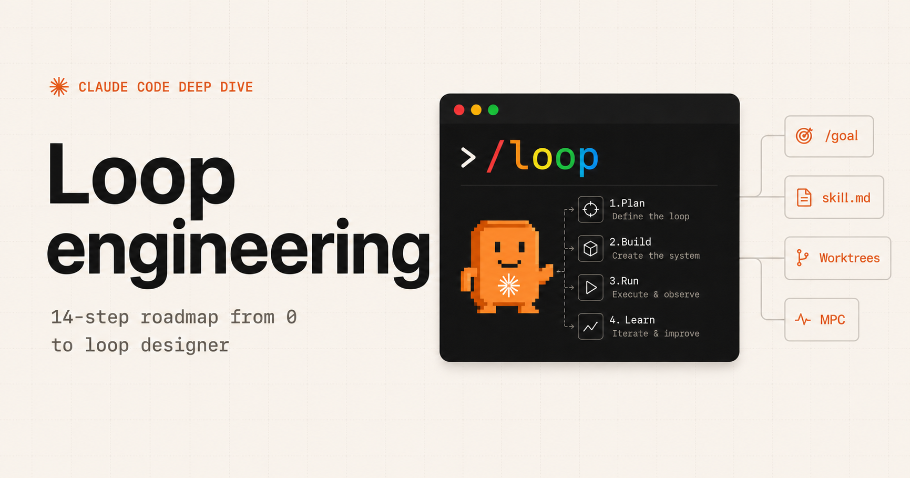
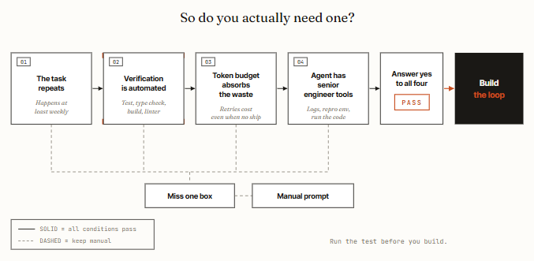
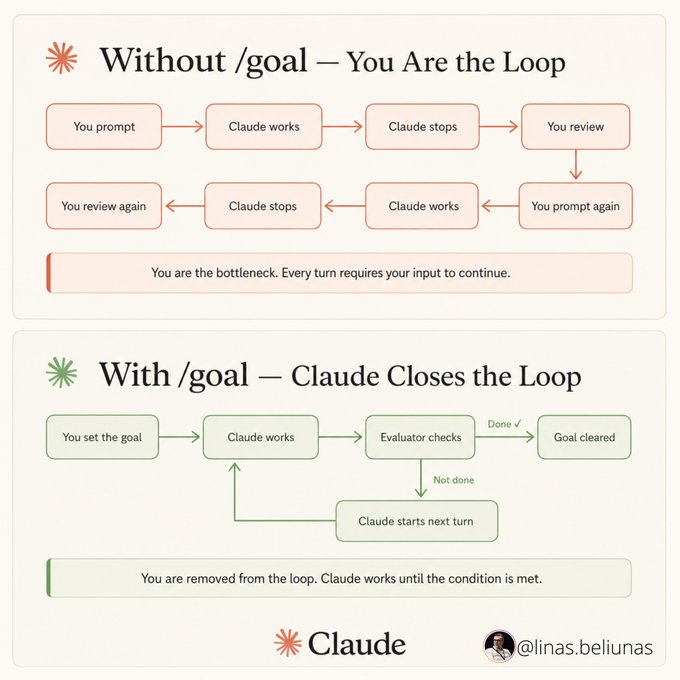
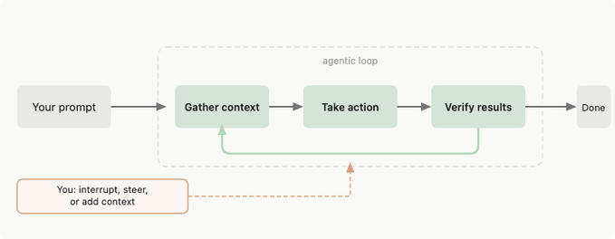
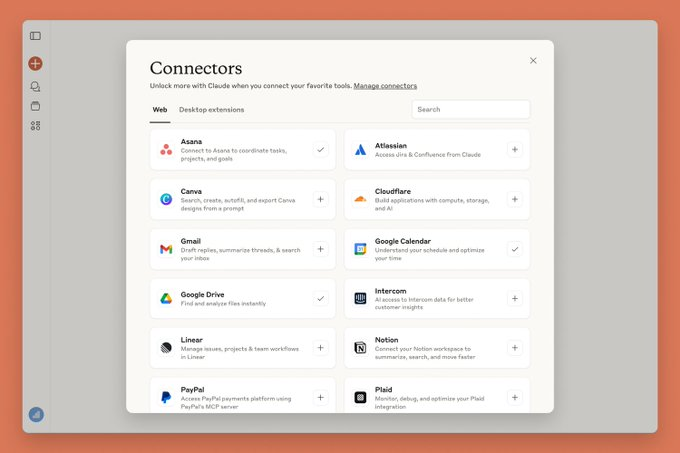
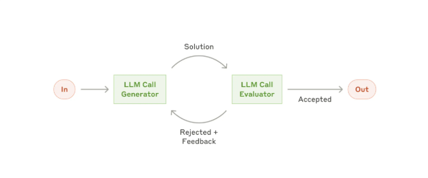
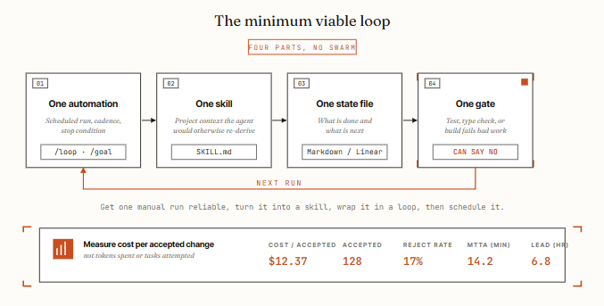
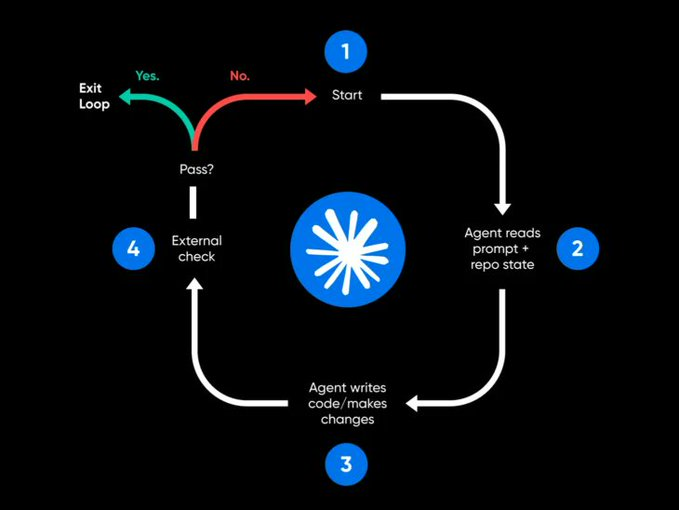

# 0xCodez Loop Engineering 14 步路线图拆解：不是人人都需要 Loop，但每个团队都需要先学会验收条件

0xCodez 在 X 上发的这篇文章《[**Loop engineering: the 14-step roadmap from prompter to loop designer**](https://movez.substack.com/p/loop-engineering-the-14-step-roadmap)》，可以看作 Addy Osmani 那篇 Loop Engineering 的“落地版”。Addy 的文章回答的是：为什么开发者的杠杆点正在从 prompt 转向 loop？0xCodez 这篇回答的则是：**什么时候你真的该建 loop，什么时候你不该建，以及最小可用 loop 应该长什么样。**

这点很重要。因为“不要再 prompt agent，要设计 prompt agent 的 loop”听起来很酷，但如果没有验收条件、预算上限、状态文件和人类审批，它很容易从工程升级变成自动化事故生成器。

这篇 14 步路线图的价值，不在于又重复了一遍 Loop Engineering 的定义，而在于它把 loop 的适用边界讲清楚了：**loop 不是给所有任务用的，它只适合重复、可验证、可运行、可停止的任务。**

## 一句话概括

**0xCodez 这篇文章把 Loop Engineering 从概念口号拉回操作纪律：先做 4 条件测试，再用 30 秒 checklist 过滤任务，最后只从“一条 automation、一个 skill、一个 state file、一个 gate”开始。**

也就是说，loop 的最小单位不是“一个更强的 agent”，而是四个东西：

1. **Automation**：什么时候自动触发；
2. **Skill**：每次运行都要读的项目知识；
3. **State file**：跨运行保存进度和经验；
4. **Gate**：能客观拒绝坏结果的测试、lint、typecheck 或 build。

少一个，loop 都可能只是昂贵的自动重试。

## 这篇和 Addy 的 Loop Engineering 有什么不同？

我们前面已经写过 Addy Osmani 的 Loop Engineering。那篇更偏“范式定义”：Automations、Worktrees、Skills、Connectors、Sub-agents、State 这六个 building blocks 如何把人从手动 prompter 变成 loop designer。

0xCodez 这篇则更像“采用路线图”：

| 问题 | Addy Osmani 文章 | 0xCodez 文章 |
|---|---|---|
| 核心问题 | Loop Engineering 是什么？ | 你该不该建 loop？怎么从最小 loop 开始？ |
| 关注点 | 五个 primitives + memory | 14 步、3 层路线图、适用条件、失败模式 |
| 主要警告 | token cost、comprehension debt、cognitive surrender | 没有 gate、没有 hard stop、没有 review 的 loop 会赔钱和出事故 |
| 最实用公式 | build the loop, stay the engineer | one automation, one skill, one state file, one gate |

所以这篇不应该当成重复内容，而应该当成 adoption playbook：如果团队已经理解 Loop Engineering 的概念，下一步就是用 0xCodez 的条件筛选法决定哪些任务真的值得 loop 化。

## 第一层：先问自己，你真的需要 loop 吗？

文章最重要的部分，是 4-condition test。作者明确说：少一条，loop 的成本就可能大于收益。

### 1. 任务是否重复？

Loop 的 setup cost 只有在重复任务上才会摊薄。如果一件事不会至少每周发生一次，那很可能不是 loop，而只是一个你跑了一次的脚本。

这点对创业团队尤其现实。很多人看到“自动化”就想把所有东西都 agent 化，但一次性探索任务、产品判断、架构讨论，本来就不适合先 loop 化。它们更适合一个高质量 prompt + 人类判断。

### 2. 验证是否自动化？

这是最关键的一条。Loop 需要一个能在你不在场时拒绝坏结果的东西：测试、类型检查、lint、build、可复现实验、benchmark。

如果没有自动验证，人还是要坐在椅子上读每个 diff。那 loop 没有减少工作，只是把“写 prompt”变成了“审核更多未知 diff”。

### 3. Token 预算能否承受浪费？

Loop 会重复读上下文、探索、失败、重试。它消耗 token 的速度往往比单次聊天高得多。对有大 token budget 的团队，这可能很划算；对 $20 consumer plan 的 solo builder，可能先碰到的是账单或 rate limit。

这句话很清醒：loop engineering 是真实的，但不是每个开发者现在都需要。

### 4. Agent 有没有高级工程师的工具？

如果 agent 不能读日志、跑代码、复现 bug、看失败输出，它其实是在盲目迭代。Loop 不是“让模型多想几轮”，而是让模型在真实反馈上迭代。

一个没有运行环境的 loop，就像一个不能编译代码的 junior engineer：它可能很努力，但很难可靠。

## 第二层：30 秒 loop check，把任务拦在门口

0xCodez 进一步给了一个战术 checklist：

1. 任务至少每周发生；
2. 测试、typecheck、build 或 linter 能拒绝坏输出；
3. agent 能运行它改的代码；
4. loop 有 hard stop：token budget、iteration count 或 time limit；
5. merge、deploy、依赖变更前必须有人 review。

这五条里，我觉得第 4 条经常被低估。没有 hard stop 的 loop，不是智能，而是无限 while。它会一直运行，直到有人注意到账单、rate limit、CI 队列或仓库状态已经出问题。

文章推荐的 good first loops 很务实：

- CI failure triage；
- dependency bump PR；
- lint-and-fix；
- flaky test reproduction；
- strong tests 支撑下的 issue-to-PR draft。

bad first loops 也很明确：架构重写、auth、payments、production deploy、模糊产品工作、任何“done”需要主观判断的任务。

这其实是最好的工程分界线：**机器可验收的，才适合先 loop 化；需要品味、责任和上下文判断的，先别交给无人值守 loop。**

## Automations 是心跳，`/goal` 是完成契约

文章把 Automations 称为 loop 的 heartbeat。它们可以按 schedule、event 或 trigger condition 触发。Codex 里是 Automations tab 和 Triage inbox；Claude Code 里则可以由 `/loop`、scheduled tasks、Routines、hooks、GitHub Actions 组合出来。

但更关键的区分是：

- **`/loop`**：按节奏重复运行；
- **`/goal`**：持续运行直到某个条件真的成立。

`/loop 30m` 可以每半小时扫描一次；`/goal All tests in test/auth pass and lint is clean` 才是在定义完成契约。

0xCodez 强调 `/goal` 的一个结构价值：它把 maker 和 checker 分开。写代码的 agent 不应该独自判断自己完成了；一个独立 checker 应该根据测试、lint 或 objective gate 判断 stop condition 是否成立。

## Worktrees 解决并行冲突，但解决不了 review 瓶颈

一旦多个 agent 同时工作，文件冲突会先于“智能不足”爆炸。`git worktree` 的价值就在这里：每个 agent 有独立 checkout 和 branch，互相不会踩文件。

但文章也提醒：worktree 只解决机械冲突，不能解决组织瓶颈。真正的上限是人类 review bandwidth。你可以让 10 个 agent 同时开 10 个 PR，但如果团队一天只能认真 review 2 个，那剩下 8 个只是排队负债。

这也是我觉得 Loop Engineering 不能脱离 SDLC 讨论的原因。loop 不是只加速写代码，它也会放大 review、CI、release、rollback、ownership 的压力。

## Skills：不要让 agent 每次像金鱼一样重新认识项目

文章对 skill 的定义很朴素：把项目知识写一次，每次运行都读。比如 CI triage skill 可以写清楚：如何分类 env / flake / bug / dependency / infra，哪些目录不能碰，哪些测试失败应该先看什么文件，什么时候必须 escalte。

这和 Hermes 的 skill 系统一样：skill 不是提示词收藏夹，而是外部化的团队经验。

一个没有 skill 的 loop 每次都会重新猜测项目；一个有 skill 的 loop 才能复利。对于长期运行的 automation，这个差别非常大。

## Connectors：没有外部工具的 loop 只是本地玩具

文章把 connectors 放在非常现实的位置：一个只能看 filesystem 的 loop 很小；一个能读 GitHub、Linear/Jira、Slack、Sentry、数据库和 staging API 的 loop，才进入真实工作环境。

最先有回报的 connectors 排序也很准确：

1. **GitHub**：读 repo、开 branch、开 PR、评论 issue、响应 webhook；
2. **Linear / Jira**：更新 ticket、链接 PR、关闭已验证任务；
3. **Slack**：发送 triage 结果、升级通知、晨报；
4. **Sentry / error tracker**：调查线上高频错误并草拟修复。

这给 Hermes / QCut / OpenClaw 一个很直接的启发：loop runtime 不只是模型调度器，它必须成为工具连接层。否则 agent 只能“告诉你会怎么做”，不能把工作推进到真实系统。

## Sub-agents：让写的人和判卷的人分开

第 9 步强调 sub-agents。核心原则很简单：**maker 不应该 grading its own homework。**

一个 agent 负责探索和实现，另一个 agent 负责根据 spec、diff、test、logs 来挑错。必要时 security reviewer 用更强模型、更高 reasoning effort，而 explorer 可以用便宜模型。

但这里也有成本边界。Sub-agents 会增加 token，因为每个 agent 都有自己的模型调用和工具操作。所以它不该无脑用于所有任务，而应该用在“第二意见值得付费”的地方：安全、复杂 bug、边界条件、长链路修改。

## State file：最土，但最重要

文章第 10 步说得很准：state file 听起来太简单，以至于容易被忽略，但它是 working loop 的 spine。

原因很简单：agent 会忘，文件不会忘。

一个 `STATE.md` 可以记录：

- 上次运行时间；
- 分类了几个失败；
- 草拟了哪些 PR；
- 哪些被升级给人类；
- 哪些经验教训下次要复用；
- 哪个 commit 达成了 `/goal`。

对长时间运行的 loop，还应该配一个 `VISION.md` 或 `AGENTS.md`，防止目标在多轮 summarize 后漂移。State 告诉 agent “现在在哪里”，Spec 告诉 agent “应该去哪里”。

## 最小可用 loop：不要一上来就建 swarm

0xCodez 的 minimum viable loop 公式值得直接抄：

> One automation. One skill. One state file. One gate.

顺序也很重要：

1. 先让一次手动运行可靠；
2. 把项目知识抽成 skill；
3. 用 state file 保存进度；
4. 加 objective gate；
5. 最后再 schedule。

跳过这个顺序，直接上多 agent swarm、connector、自动 PR、自动 merge，大概率是在买一套没人理解的自动化负债。

文章还给了一个很好的指标：**cost per accepted change**。不要看跑了多少 token、尝试了多少任务、排了多少 automation；看最后有多少改动被接受。如果 accepted-change rate 低于 50%，说明你在做 loop 声称要帮你省掉的 review work。

## 失败模式：Ralph Wiggum loop、理解债和安全税

文章后半部分最有价值的，是把失败模式讲得很直白。

### Ralph Wiggum loop

这是 Geoffrey Huntley 命名的失败模式：agent 太早发出完成信号，loop 以为任务完成，于是半成品退出。根因通常是：没有真实 verifier、completion condition 太软、没有 hard stop。

解决方案不是“再加一个 agent 问它完成了吗”，而是加 objective gate：测试是否通过，build 是否成功，lint 是否为 0，类型检查是否通过。

### Comprehension debt

Loop 越强，人越可能不读 diff。代码库变得越来越大，但团队对它的理解没有同步增长。真正贵的不是 token bill，而是某天必须 debug 一个没人读过的系统。

### Cognitive surrender

更危险的是人类停止形成判断，只接受 loop 的输出。Loop design 本来应该让工程师站到更高一层；如果用它来逃避思考，它反而会放大坏决策。

### Security tax

无人值守 loop 也是无人值守 attack surface。文章列的风险包括：生成代码未经 review 合并、community skills 中的 prompt injection、日志泄露凭证、权限范围逐步膨胀。

这点尤其适合做成团队规范：loop 的权限每 30 天重新审计；skill 来源必须人工 review；生产 loop 禁用 verbose secret logging；auth/payments 默认禁止自动修改。

## 对 Hermes / OpenClaw 的启发

这篇路线图对我们自己的工具链很直接：

- **Hermes cronjob** 已经是 automation，但每个 job 都应该问：有没有 state？有没有 objective gate？有没有 hard stop？失败是否会升级给人？
- **Hermes skills** 不只是知识库，它们应该成为 loop 的项目约束层，避免每次重新解释环境；
- **OpenClaw / Codex 并行** 必须默认用 worktree 或临时 clone，否则并行只会制造冲突；
- **QCut agent 任务** 不应该只写“生成视频”，而要有素材检查、输出文件验证、预览截图、失败重试和人工确认点；
- **文章自动化** 其实已经是一个很好的 loop 示例：解析来源、保存媒体、写双语、更新索引、commit/push、验证 GitHub 链接。

如果用 0xCodez 的公式来评估，我们现在最成熟的 loop 反而是文章生产：它重复、可验证、有 state（repo + README/MOC）、有 gate（文件存在、链接 200、git clean）、有人类最终读链接。

## 我的判断：Loop Engineering 的门槛不是会不会写脚本，而是会不会定义“验收”

这篇文章最值得带走的，不是 14 这个数字，而是一个工程原则：**不要在没有验收条件的地方自动化 agent。**

Loop 的本质不是“让 AI 自己多干活”，而是“把可重复、可验收的工作交给一个有记忆、有工具、有停止条件的系统”。

所以从 prompter 变成 loop designer，真正要补的能力不是更会写 prompt，而是：

- 会判断任务是否适合自动化；
- 会写清楚 stop condition；
- 会设计 state file；
- 会选择 objective gate；
- 会限制权限和预算；
- 会保留 human approval；
- 会读 diff，避免理解债。

这也是为什么 0xCodez 的结尾和 Addy 一样重要：leverage moved，但工程师没有消失。**Build the loop. Stay the engineer.**
