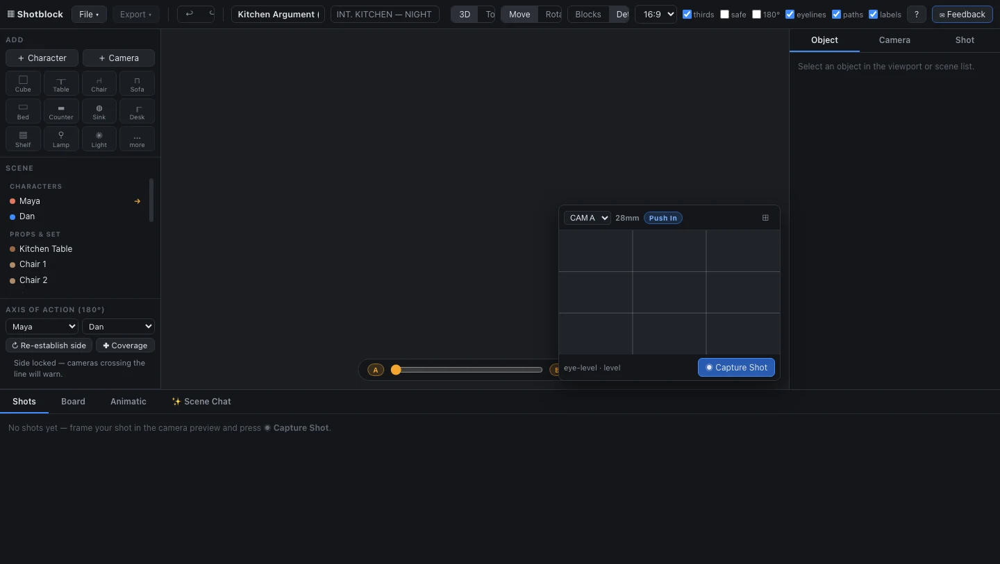

# Shotblock Deep Dive: AI Video Does Not Just Need Better Prompt Templates — It Needs a Verifiable Previs Layer

> **TL;DR:** Shotblock is a free, no-signup, browser-based 3D storyboard and shot-planning tool. Its real value is not making video prompts more decorative. It turns blocking, props, cameras, lens choices, camera movement, the 180-degree line, shot size, duration, storyboard panels, model-specific prompts, and shot-list JSON into a visible and checkable plan before generation. For AI video, this kind of tool matters because it moves the director’s spatial intent out of prose and into reusable production state.

- **Source:** [Shotblock live app](https://shotblock.vercel.app/) / [GitHub repo](https://github.com/shanghaicellcenter/shotblock)
- **Release:** `v0.1.0` (GitHub release published 2026-06-11)
- **Topic:** AI video / 3D previs / storyboard / shot planning / lens math / prompt export
- **Tags:** AI video / 3D storyboard / previs / shot planning / 180-degree rule / Veo / Runway / Kling / Luma / Sora

## 1. Shotblock is not solving “generate a video”; it is solving the director-control problem before generation

Modern AI video tools can already turn a text prompt into a short clip. The fragile part of the workflow is earlier: the shot decisions are rarely represented as structured state.

A director does not only mean “two people argue in a kitchen.” They also mean:

- Where are Maya and Dan standing?
- Which side of the axis is the camera on?
- Is this a master, OTS, medium shot, or close-up?
- Is the camera pushing in? By how much?
- Does the next shot cross the 180-degree line or create a jump cut?
- Will the prompts sent to Veo, Runway, Kling, Luma, and Sora preserve the same spatial facts?

Shotblock’s positioning is clear: it is not another video-generation model. It is a **browser-based previs tool for AI filmmakers**. Users stage a scene in 3D, place actors and cameras, capture shots, and export storyboards, PDFs, prompts, shot-list JSON, or a consistency reference pack.

That makes it closer to a lightweight director console for AI video: the decisions that used to live in a director’s head, sketchbook, or verbal notes become visible objects and machine-readable context.

## 2. Browser-based 3D blocking: move spatial facts out of prose

The live app and README show a 3D workspace: object library and scene outliner on the left, 3D viewport and camera preview in the center, Object / Camera / Shot properties on the right, and Shots / Board / Animatic / Scene Chat at the bottom.

The object library is not about final render quality. It is about building a quick spatial scaffold:

- characters;
- cameras;
- cube, table, chair, sofa, bed, counter, sink, desk, shelf;
- practical lamps and real point lights;
- walls, doors, windows, trees, cars, ground markers, and other set elements.

The README describes deeper blocking features too: each character is a 15-DOF articulated mannequin with pose presets such as stand, sit, walk, run, point, fight, crouch, fallen, and talk, plus joint-level sliders. In other words, a character is not just a reference image. It is an editable starting pose inside a 3D space.

That is crucial for AI video. Many failures happen not because the model cannot render an “argument,” but because it does not reliably preserve distance, orientation, foreground/background relationships, and body posture. Shotblock extracts those facts from natural language and turns them into geometry first.

## 3. Camera planning: Shotblock turns cinematography language into UI and data

Shotblock is not only about placing mannequins. Its strongest layer is camera, lens, and coverage planning.

The README lists camera features including:

- sensor formats: Full Frame, Super 35, Alexa 65, IMAX;
- focal length to true field-of-view conversion;
- hyperfocal and depth-of-field readouts;
- delivery aspects such as 16:9, 2.39:1, and 9:16;
- sensor-true, letterboxed camera preview;
- framing presets such as EWS, ECU, OTS, 2-shot, POV, and insert;
- classic five-camera dialogue coverage: master, two OTS shots, and two close-ups;
- A/B marks and movement scrubbing;
- automatic movement notes on captured shots, for example “Push in 1.5m.”

This shows that Shotblock’s goal is not merely “a 3D-looking interface.” It maps real shot decisions into software objects: focal length, frame, camera position, movement, shot size, duration, and shot code all belong to the same plan.

For AI video models, that matters because a model can generate frames without understanding the coverage plan. Shotblock’s job is to define the plan first, then translate it into storyboards, prompts, and reference material.

## 4. 180-degree and 30-degree rules: AI video needs continuity checking too

One of Shotblock’s most interesting directions is film-grammar checking.

It supports:

- live 180-degree rule warnings in the HUD;
- storyboard-level flags for cuts that cross the line;
- exceptions such as cutaways, neutral shots, and subject movement;
- side lock and re-establish workflows;
- 30-degree rule checks for jump-cut risk;
- automatic shot-size classification from EWS to ECU.

This is not “AI” in the trendy sense, but it is extremely relevant to AI video. Common generation failures are not only visual artifacts. They are also editing failures: a character’s screen direction flips, eyelines do not match, the shot change is too small, or dialogue coverage has no stable axis.

If a creator only writes “cinematic dialogue scene” in a prompt, these rules are hard to enforce. Shotblock’s approach is to catch continuity bugs in the shot plan before generation.

## 5. The export layer: the useful artifact is storyboard + prompts + JSON

Shotblock’s export menu and README make it clear that the output is not just a screenshot.

The current app exposes export options such as:

- Storyboard PNG contact sheet;
- Storyboard PDF;
- Storyboard PDF with prompts;
- ZIP containing panels, clean frames, and prompts.

The README goes further and describes:

- six-up printable storyboard sheets;
- per-shot lens data, movement, action, and timing;
- per-shot AI-ready prompts;
- prompt variants for Veo 3, Runway Gen-4, Kling 2.x, Luma Ray2, and Sora 2;
- agent-friendly shot-list JSON;
- consistency reference packs with character turnarounds, shot frames, per-shot prompts, and shot-list JSON.

The key phrase is **machine-readable**. If AI video production is going to involve multiple models, agents, render passes, and editing steps, a single natural-language prompt is not enough. The pipeline needs a shot list: camera geometry, lens, characters, action, duration, movement, and prompt fields per shot.

That is where Shotblock feels more AI-native than a conventional storyboard sketch tool. It designs outputs for both humans and generation pipelines.

## 6. Scene Chat: useful as a local scaffold, not as a black-box endpoint

Shotblock includes a “✨ Scene Chat” tab. The README says it can generate a local scene from a line such as “two friends argue in a kitchen at night,” producing characters, a furniture kit, blocking, and lighting. It also says this is fully local and requires no API calls.

That is worth separating from the broader chat-interface trend. Shotblock does not appear to make chat the final interface. Chat is more like **scaffolding**: create an editable first draft of the scene, then return to the director console to adjust objects, cameras, framing, and continuity.

That is a healthier workflow than “chat directly to final video.” The chat result is not the finished artifact. It is a starting state that can be inspected, corrected, captured, and exported.

## 7. How it differs from traditional previs tools

Traditional film production already has previs, storyboard, animatic, Unreal-based virtual production, and camera-planning tools. Shotblock’s novelty is not “3D previs exists.” Its novelty is compressing that concept into a lightweight form aimed at AI filmmakers.

| Dimension | Traditional previs / DCC | Shotblock’s direction |
|---|---|---|
| Learning curve | Professional software, complex assets, render pipelines | Fast browser-based staging and camera placement |
| Output consumer | Director, cinematographer, art, post-production | Both humans and video models / agent pipelines |
| Shot information | Often lives in project files or manual notes | Exported into storyboard, prompts, and JSON |
| Continuity | Maintained by director, storyboard artist, and editor | Pre-checked through 180-degree / 30-degree rules and reference packs |
| AI adaptation | Requires extra prompt/reference preparation | Built-in model-specific prompt variants and consistency packs |

The product bet is that AI filmmakers do not always need a full virtual-production system. They need a fast spatial planning layer.

## 8. Implications for QCut and AI video toolchains

Seen as part of an AI video production stack, Shotblock sends a clear signal: future tools will not compete only on the “generate” button. They will compete on **controllable state before generation**.

For tools like QCut, several patterns are worth noticing:

1. **Shot plans should be first-class objects**  
   Not only subtitles, media assets, timeline clips, or prompts, but structured shot-level plans.

2. **Spatial constraints should be separated from prompts**  
   Prompts can carry emotion, action, and style. 3D blocking or reference frames should carry position, camera, and composition.

3. **The model should receive a context pack, not one sentence**  
   Storyboard frames, clean frames, character turnarounds, shot JSON, and model-specific prompt variants should travel together.

4. **Continuity checks can be productized before generation**  
   Axis, eyelines, shot size changes, camera direction, and jump-cut risk can be checked before wasting model calls.

5. **AI chat works best as a scene scaffolder**  
   Let chat generate the initial setup, then move into an editable spatial interface instead of treating chat as the only control surface.

## 9. Risks and limits: lightweight browser tooling is not a full production system

Shotblock is still an early project. The public GitHub repo was created on 2026-06-11, has a very small public footprint, and the current release is v0.1.0. In production use, several questions remain:

- WebGL and browser performance on complex scenes;
- custom GLB asset quality and asset management;
- fidelity gap between 3D blocking and generated video results;
- whether prompt variants can keep up with fast-changing video-model APIs;
- collaboration, version control, shot review, and timeline integration;
- how to avoid turning a lightweight UI into “half Blender, half storyboard app.”

Still, the direction is important: the stronger video models become, the more valuable the pre-generation planning layer becomes. Better generation raises the cost of vague intent.

## 10. Conclusion: AI video needs checkable shot state, not just longer prompts

Shotblock’s core idea can be summarized simply: **insert a director-editable, model-readable, rule-checkable shot-planning state before AI video generation.**

It combines 3D blocking, real lens math, coverage, film grammar, storyboard, animatic, prompt export, and JSON into a browser tool. For individual AI filmmakers, it lowers the cost of turning an imagined shot into an executable plan. For larger agentic video pipelines, it points toward a more durable product architecture:

Future video-generation systems should not only store prompt history. They should store a full **scene graph + camera plan + continuity checks + per-shot generation context**.

Once that layer exists, video generation stops being “make a clip from this sentence” and starts becoming a directed, reviewable, iterative production process.
