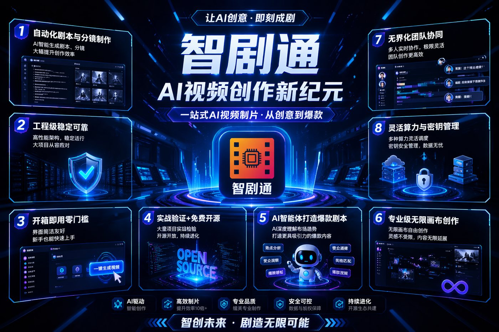
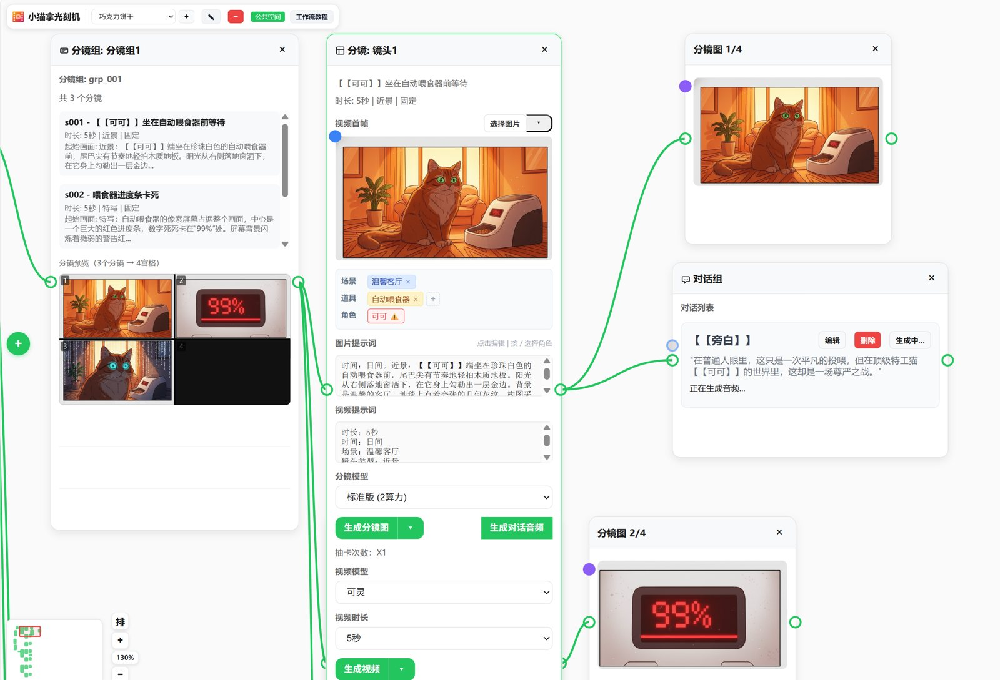
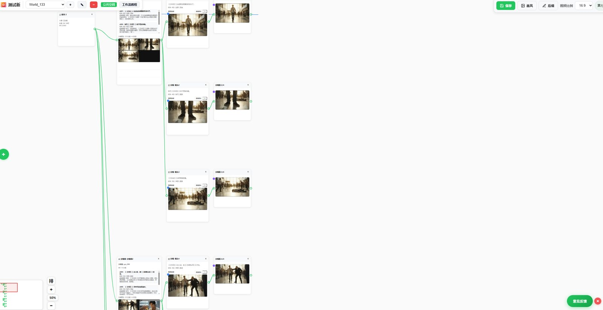

# ZJT / 智剧通深度拆解：AI 短剧工具真正难的，是把 Agent、画布、算力和生成供应商接成生产系统

> Repo: [https://github.com/jeffstric/ZJT](https://github.com/jeffstric/ZJT)  
> Inspected commit: `6376022` (`main`)  
> Date: 2026-06-14  
> Tags: AI Video, Short Drama, Multi-Agent, Production Pipeline, Storyboard, Creator Tools, FastAPI, Python



很多 AI 视频项目容易停留在“输入 Prompt，等模型吐片”的 demo 层。但短剧不是单张图，也不是一个孤立镜头：它需要剧本、角色、场景、分镜、首尾帧、参考图、配音、视频生成、素材管理、团队协作、成本核算和失败重试。ZJT（智剧通）值得看的地方，正是它没有把“AI 短剧制作”简化成一个模型调用，而是在仓库里显露出一个更接近生产工具的控制平面。

截至这次检查，`jeffstric/ZJT` 是一个公开 Python 项目，GitHub API 显示 165 stars、38 forks、162 open issues，仓库创建于 2026-03-04，最近 push 于 2026-06-13。仓库描述把它定位为“AI-powered, open-source platform specifically designed for creating professional short dramas”，目标是自动化从剧本、分镜到视频合成的完整流水线。它的许可字段是 GitHub `Other / NOASSERTION`，也就是说采用者在商业复用前需要额外确认真实授权边界。

## 先看规模：这不是一个薄 README

我 shallow clone 后统计到：仓库共有 977 个文件，其中 965 个可作为文本读取，约 320,140 行文本 / 代码。主要构成是：

| 维度 | 数量 |
|---|---:|
| Python 文件 | 493 |
| Markdown 文档 | 295 |
| JavaScript 文件 | 38 |
| JSON 文件 | 37 |
| YAML / YML 文件 | 29 |
| 文本/代码总行数 | 约 320k |
| `server.py` 路由 | 89 个 FastAPI 路由 |
| `api/script_writer.py` 路由 | 60 个路由 |
| `api/admin.py` 路由 | 32 个路由 |

按目录看，`web/` 约 80k 行、`.qoder/` 约 49k 行、`tests/` 约 30k 行、`auto_test/` 约 24k 行、`script_writer_core/` 约 22k 行、`task/` 约 20k 行、`docs/` 约 17k 行、`model/` 约 16k 行。这说明 ZJT 的重心不是“一个推理脚本”，而是 Web 产品、后端 API、数据模型、任务调度、测试、文档和 Agent 工作流的组合。

依赖也很有信号：`requirements.txt` 包含 FastAPI、uvicorn、gunicorn、PyYAML、OpenAI、httpx、pyJianYingDraft、APScheduler、cryptography、bcrypt、pymysql、Alembic、SQLAlchemy、qiniu、anthropic、litellm、mcp、pytest、Pillow、OpenCV 等。也就是说，它既接 LLM，又接数据库、对象存储、支付/认证、MCP、剪映草稿和图像/视频处理。

## 产品层：短剧创作不是一个按钮，而是一条协作链

README 里的核心卖点包括：8 个专家智能体协同、无限画布 + 多宫格分镜、剧本到分镜到视频生成、多模型支持、团队协作、用户级独立算力账户、Docker/Windows/macOS/Linux 启动、接口测试和运营后台。



从产品角度看，ZJT 把 AI 短剧拆成四类资产：

1. **叙事资产**：故事大纲、分集剧本、对白、情绪弧线；
2. **视觉资产**：角色设定、场景、道具、画风、参考图；
3. **生产资产**：分镜、首尾帧、视频任务、音频/TTS、剪映草稿；
4. **运营资产**：用户、算力、支付、供应商、模型配置、后台统计。

这比“Prompt → Video”更贴近实际团队，因为短剧生产里最贵的不是模型调用本身，而是反复对齐：角色不能崩、镜头不能乱、成本不能失控、失败任务要能补救，团队成员也要能同时进入同一个项目上下文。

## 架构层：FastAPI 大单体 + 可配置驱动 + Agent 工作台

ZJT 的后端入口是 `server.py`，单文件很大，包含上传、代理图片、缩略图、图像编辑、文生图、AI app run、RunningHub 状态查询、用户角色、算力、签到、任务状态等大量 API。它再挂载 `api/admin.py`、`api/script_writer.py`、`api/media.py`、`api/user.py`、`api/system.py` 等模块。

可以把当前架构理解成六层：

```text
Browser UI / 无限画布 / 管理后台
        ↓
FastAPI routes: server.py + api/*
        ↓
Domain models: world / script / character / location / props / ai_tools / async_tasks
        ↓
Agent runtime: script_writer_core + agents/skills + SOP loader
        ↓
Task orchestration: task/*, pipeline_processor, visual/audio/async drivers
        ↓
External providers: LLMs, RunningHub, Volcengine, Vidu, Duomi, Qiniu, WeChat Pay, JianYingDraft
```

这种形态的优点是交付速度快：一个 Python 服务可以把创作、媒体、配置、任务、后台都串起来。缺点也明显：`server.py` 约 8,900 行，很多职责集中在一个入口文件里，后续如果团队扩大，路由、服务层、领域模型和任务调度最好继续拆分。

## 最值得借鉴的一层：统一任务配置和驱动抽象

`config/unified_config.py` 是 ZJT 的关键资产之一。它定义了任务分类，例如图片编辑、文生视频、图生视频、文生图、视觉增强、音频、数字人等；也定义了供应商抽象，例如 Duomi、RunningHub、Vidu、Volcengine、Local、ZJT。`ImplementationConfig` 里还能表达 display name、driver class、默认算力、是否启用、排序、站点编号、同步模式和 required config keys。

这说明 ZJT 已经意识到一个现实问题：AI 视频产品不能押注单一供应商。模型服务会排队、失败、涨价、限流，也会不断出现新模型。把“任务类型”和“实现方”解耦，才可能做：

- 同一类任务支持多个实现方；
- 管理员按供应商、价格、稳定性调整优先级；
- 用户侧选择自己的模型/供应商；
- 某个实现失败后换另一个实现继续尝试；
- 算力消耗按任务、时长、分辨率、模式动态计算。

这对短剧工具特别重要。短剧链路里，剧本、图像、视频、音频、数字人可能分别来自不同厂商；真正的产品壁垒不是“接了某个 API”，而是把供应商组合管理成稳定流水线。

## Pipeline 层：失败不是异常，而是生产系统的一部分

`task/pipeline_processor.py` 展示了 ZJT 对生产失败的建模方式。它把任务拆成 `param_prepare` 和 `before_finish` 等阶段，负责创建步骤、分发步骤、轮询处理中的步骤，并把结果写回 `ai_tool`。其中一个具体规则是：Seedance 2.0 图生视频如果带视频输入，就先创建 `face_mask` 预处理步骤。

更重要的是失败处理：

- `SLOT_FULL` 会被识别成容量问题，并按指数退避安排重试；
- 步骤可以进入 `PENDING / PROCESSING / COMPLETED / FAILED`；
- `before_finish` 阶段可以创建 implementation retry，尝试替代实现方；
- async task 和 pipeline step 通过 ID 关联，避免把长任务当同步请求处理。

这就是“AI 视频产品”和“AI 视频脚本”的区别。脚本只需要成功一次；产品必须面对队列满、供应商失败、图片预处理失败、用户刷新页面、后台重启、长任务超时等现实问题。

## Agent 层：把提示词写成可加载 SOP，而不是塞进代码注释

`script_writer_core/chat_session.py` 初始化 PM Agent，并根据 session type 选择剧本智能体或营销智能体。默认剧本智能体会从 `script_writer_core/skills/script-orchestrator/SKILL.md` 和其 SOP 目录加载工作流；营销智能体会从 `agents/skills/marketing-pm` 加载提示词和 SOP 索引。

`script-orchestrator/SKILL.md` 暴露出一个很强的产品思路：Agent 不是“随便聊”，而是围绕 SOP 执行。它要求：

- 先感知当前项目资源，例如角色、剧本、场景、道具；
- 用 `ask_user` 收集需求，且尽量提供选项，减少用户手打；
- 根据意图加载不同 SOP：新建剧本、续写、拆分小说/剧本；
- 在关键步骤展示进度；
- 通过 PM Agent 协调专家 Agent。

README 里列出的 8 个专家智能体——Story Writer、Character Creator、Location Creator、Plot Analyzer、Content Compliance、Novel Splitter、Character Designer、Location Designer——也对应这种“总控 + 专家”的结构。对于创作工具来说，这比一个万能聊天框更可控，因为它把用户决策点、生成步骤和质量检查放进了流程。

## UI 层：无限画布是 AI 短剧的操作系统界面



ZJT 的 `web/` 目录很大，README 也强调浏览器端实时协作、SSE 实时推送、无限画布、多宫格分镜、角色档案编辑和团队协同。这个方向很关键：AI 视频的核心界面很可能不是聊天框，而是“可编辑的生产板”。

原因很简单：短剧创作的状态是空间化的。角色、场景、分镜、镜头、素材、时间线之间有关系。无限画布能让团队看到这些关系，而不是在聊天记录里寻找某次生成结果。对于 Peter 做 QCut 这类工具，这一点尤其值得借鉴：Agent 可以生成内容，但最终要落到可编辑、可回滚、可协作的创作表面上。

## 商业化层：算力账户比模型选择更接近真实运营

ZJT 一个很现实的设计是“用户级独立算力账户”。README 里明确说，每个用户有独立额度，可以选择供应商，管理员可以热更新模型配置、价格、供应商优先级、用户配额和限制，并支持微信支付充值。

这说明它面向的不只是个人玩具，而是教培、团队和工作室场景。对于教育机构，老师最关心的是预算；对于内容团队，负责人最关心的是哪个成员消耗了多少算力、哪个供应商失败率高、什么时候需要切换模型。这些不是模型能力问题，而是运营控制问题。

## 测试与工程化：值得肯定，也还有硬化空间

ZJT 有 `tests/`、`auto_test/`、`.github/workflows/guard-enterprise.yml`、`.gitlab-ci.yml`、Docker 配置、Alembic 迁移、Sentry、管理员后台和大量文档。`auto_test/` 甚至包含 Claude launcher、上下文管理、报告生成、测试导航等，看起来是给 Agent 辅助测试准备的工具链。

但从生产硬化角度，我会重点关注几个风险：

1. **大入口文件风险**：`server.py` 过大，路由、业务、文件处理、任务提交、权限检查容易相互耦合；
2. **许可不清晰**：GitHub license 是 `NOASSERTION`，商业团队不能只看“open-source”字样；
3. **配置和密钥治理**：项目接入多供应商、支付、对象存储，必须严格区分示例配置、生产配置和用户级凭证；
4. **供应商抽象的可观测性**：有驱动和重试还不够，后续需要按实现方统计成功率、耗时、成本、失败原因；
5. **媒体资产生命周期**：图片、视频、缓存、缩略图、外部 URL 映射、CDN 清理都需要独立治理，否则很容易变成成本黑洞。

## 谁应该研究 ZJT？

我觉得有三类人值得认真看这个仓库：

- **AI 视频工具创业者**：学习如何从模型 demo 走向“任务、供应商、算力、画布、后台”的产品组合；
- **Agent 产品设计者**：参考它如何把 PM Agent、专家 Agent、SOP、ask_user 和进度展示结合起来；
- **内容团队/教培平台技术负责人**：关注用户级算力、团队协作和多供应商冗余，而不是只比较模型效果。

## 结论：ZJT 的价值在“控制平面”而不只是“短剧生成”

ZJT 最值得借鉴的地方，不是它声称能生成短剧，而是它把短剧生产中那些脏活累活——用户决策、角色/场景资产、分镜画布、供应商选择、算力计费、长任务状态、失败重试、后台管理、测试和部署——都放进了同一个开源仓库。

这也是 AI 创作工具接下来会反复遇到的问题：模型越来越强，但产品难点会从“能不能生成”转向“能不能稳定组织生产”。ZJT 给出的答案是：用 Agent 管叙事，用画布管创作状态，用统一配置管供应商，用 pipeline 管长任务和失败，用算力账户管运营成本。

它还不是一个完美的企业级架构；但作为 AI 短剧生产系统的开源样本，它已经比大多数单点 demo 更接近真实世界。
