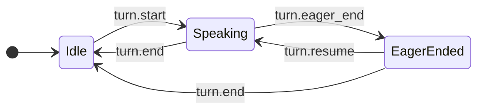

# Cartesia Sonic 3.5 / Ink 2 Deep Dive: Real-Time Voice Agents Are Moving from Single-Model Leaderboards to an End-to-End Listen-and-Speak Latency Budget

TestingCatalog’s X post says Cartesia shipped **Sonic 3.5** and **Ink 2**: one model for text-to-speech, one model for speech-to-text, positioned as a single real-time voice stack. The post’s key evidence is two leaderboard screenshots: Ink 2 sits at the top tier of Artificial Analysis’ streaming STT WER chart, while Sonic 3.5 appears at the top of a Text to Speech Arena quality Elo chart.

Karan Goel’s embedded post is even more explicit: Cartesia wants to be understood as a company with both a #1 “speaking” model and a #1 “listening” model, not merely as a TTS API provider.

The interesting part is not the literal claim that one screenshot proves permanent leadership. Voice leaderboards move. When I checked Artificial Analysis, its live TTS FAQ already showed Fun-Realtime-TTS, Gemini 3.1 Flash TTS, Realtime TTS-2, Sonic 3.5, and xAI Text to Speech in the top group. The deeper point is this: **voice-agent competition is moving from isolated TTS/STT model quality to end-to-end latency-budget management across listening, endpointing, reasoning, and speaking.**

## One-sentence summary

**Sonic 3.5 plus Ink 2 is not just Cartesia selling both TTS and STT; it is Cartesia framing “knowing when the user is done” and “starting a natural reply quickly” as one real-time agent-runtime problem.**

That matters because a customer-support, sales, coaching, or companion voice agent is not judged by how good one offline model sounds. It is judged by whether every conversation turn can coordinate the following operations:

1. interrupt outgoing TTS as soon as the user starts speaking;
2. produce useful transcripts while the user is still speaking;
3. start LLM reasoning when the user is probably done;
4. start audio output tens or hundreds of milliseconds after the user is actually done;
5. cancel speculative replies if the user resumes speaking.

A static model leaderboard cannot answer that entire question. A real-time system design can.

## Sonic 3.5: TTS is expanding from “sounds good” to controllable, low-latency, multilingual output

Cartesia’s docs position Sonic 3.5 as its fastest and most natural TTS model. The headline claims include:

- sub-90ms latency;
- native support for 42 languages;
- more natural pacing, emotion, and conversational delivery;
- reliable pronunciation of order numbers, phone numbers, IDs, emails, and other alphanumerics without preprocessing;
- context-aware English heteronyms such as `read`, `bass`, and `bow`;
- voice cloning, localization, and custom pronunciation dictionaries.

Those sound like ordinary TTS product improvements until you put them inside a live agent. A voice agent is not generating one narration file. It is repeatedly listening, calling tools, revising replies, handling interruptions, and speaking under a human patience budget. TTS therefore has to satisfy three constraints at once:

| Constraint | Why it matters for agents |
|---|---|
| Low first-audio latency | Users do not feel the bot pauses awkwardly before responding |
| Reliable structured speech | Order IDs, verification codes, dates, and amounts do not trigger repeated clarification |
| Controllable pronunciation and multilinguality | Enterprises can stabilize brand names, drug names, locations, and personal names |

So Sonic 3.5’s real promise is not simply “more human voice.” It is whether Cartesia can reduce the operational annoyances that block production deployment: pronunciation errors, slow first audio, and unstable multilingual behavior.

## Ink 2: the important feature is not transcription alone, but turn detection

Ink 2’s official docs are very explicit: it is a streaming STT model for production voice agents with built-in turn detection, so teams do not need a separate VAD layer. It emits a full set of turn events:

- `turn.start`
- `turn.update`
- `turn.eager_end`
- `turn.resume`
- `turn.end`

That is more than a stream of transcript deltas. It is a control surface for the agent runtime. Cartesia’s recommended pattern is: interrupt TTS on `turn.start`; send the final transcript to the LLM on `turn.end`; optionally start speculative generation on `turn.eager_end` and cancel it on `turn.resume`.

The state machine from the docs is revealing:

In other words, Ink 2’s product value is not just “turn audio into text.” It is “tell the agent when to listen, when to think, and when to speak.”

## The Artificial Analysis STT benchmark: why 3.59% WER plus 0.21s latency matters

On June 2, 2026, Artificial Analysis announced AA-WER Streaming, a benchmark for streaming speech-to-text models on both accuracy and latency, especially for voice-agent use cases. It measures two post-end-of-speech moments:

1. **First Final Transcription**: WER and latency for the first final-denoted transcript after end of speech;
2. **First Partial Transcription**: WER and latency for the first transcript-bearing event after end of speech.

The benchmark uses roughly eight hours of audio from the AA-WER v2 suite: AA-AgentTalk, VoxPopuli-Cleaned-AA, and Earnings22-Cleaned-AA. It uses Silero VAD for end-of-speech detection.

The key results reported by Artificial Analysis are:

| Scenario | Model | WER | Latency |
|---|---|---:|---:|
| Final transcription | Cartesia Ink-2 semantic endpoints | 3.59% | 0.21s |
| Final transcription | ElevenLabs Scribe v2 Realtime | 3.64% | 0.14s |
| Final transcription | Cartesia Ink-2 external endpoints | 3.66% | 0.09s |
| First partial | ElevenLabs Scribe v2 Realtime | 3.65% | 0.13s |
| First partial | Cartesia Ink-2 external endpoints | 4.33% | 0.07s |
| First partial | AssemblyAI U3 Realtime Pro | 4.46% | 0.47s |

TestingCatalog’s screenshot shows the Final Transcription WER Index: Cartesia Ink-2 semantic endpoints and ElevenLabs Scribe v2 Realtime are both around 3.6%, ahead of Google Chirp 3 Streaming, Azure STT Real-time Transcription, Deepgram Flux, Nemotron 3 ASR 80ms, and others.

This should not be overread. Artificial Analysis itself notes that no single model leads across every dataset. Dataset mix, partial-vs-final timing, latency targets, and pricing targets can all change the best choice. But for a voice agent, **Ink 2’s importance is that it sits near the accuracy/latency frontier while also turning endpointing into model-level events.**

## How to read the TTS leaderboard: Sonic 3.5 is a top option, not the only answer

TestingCatalog’s second image shows the Text to Speech Arena Quality Elo chart: Sonic 3.5 and Gemini 3.1 Flash TTS at 1210, Realtime TTS-2 Research Preview at 1208, Realtime TTS 1.5 Max at 1195, Eleven v3 at 1182, and xAI Text to Speech at 1175.

When I checked Artificial Analysis live, the FAQ listed a changed top five: Fun-Realtime-TTS, Gemini 3.1 Flash TTS, Realtime TTS-2 Research Preview, Sonic 3.5, and xAI Text to Speech. In other words, **the TTS Arena is dynamic; the screenshot’s #1 should not be treated as a permanent fact.**

But this does not undermine Cartesia’s product argument. For voice-agent teams, the buying question is not “who is #1 today?” It is:

- is the model low-latency enough;
- is pronunciation controllable;
- does it handle structured content reliably;
- is multilingual output natural enough;
- can it integrate with STT, the agent runtime, and deployment constraints as one stable system?

On those dimensions, Sonic 3.5 is clearly positioned as a real-time interaction layer, not an offline narration model.

## The real product signal: Cartesia is selling a listen-and-speak loop

Cartesia’s homepage now frames Sonic-3.5 and Ink-2 as “the #1 real-time speech and transcription models purpose-built for voice agents.” It also emphasizes state space models, ultra-low latency, long-context reasoning, efficiency, and deployment across cloud, on-premise, and on-device environments.

That is the language of a company moving from model API to agent infrastructure:

| Old question | New question |
|---|---|
| Which TTS sounds most human? | Which TTS starts quickly and speaks critical information correctly in a live dialogue? |
| Which STT has the lowest WER? | Which STT turns transcripts, start/end events, and eager-end signals into agent control? |
| Which API is cheapest? | Which stack reduces abandonment, repeated confirmations, and failed interruptions? |
| Is one model at the top of a benchmark? | Can listening, thinking, speaking, canceling, and resuming form a closed loop? |

That is also why `turn.eager_end` is notable. It productizes speculation for voice agents: predict that the user may be done, start LLM generation early, and cancel if the user continues. It resembles speculative execution in text agents, except the speculation target is the end of a human speech turn.

## Product takeaway: evaluate voice agents beyond model metrics

If a team is building customer support, sales, interviewing, coaching, or companion voice agents, I would expand the evaluation sheet beyond “STT WER / TTS MOS”:

| Layer | What to measure | Why |
|---|---|---|
| STT accuracy | WER, structured-data accuracy, noise/accent robustness | Transcript errors contaminate the LLM input |
| Turn detection | False starts, false ends, eager-end and resume reliability | Determines whether the agent interrupts or waits too long |
| LLM latency | First token, tool calls, retries | Occupies much of the user’s silence window |
| TTS first audio | First byte / first audio latency | Determines whether the bot feels slow |
| TTS controllability | Numbers, proper nouns, multilinguality, emotion | Determines enterprise deployability |
| Interruption | Barge-in, cancel, resume | Determines whether the system feels conversational |
| Observability | Per-turn event logs and latency breakdowns | Without tracing, the experience cannot be optimized |

Cartesia’s signal is that both ends of the stack belong in this sheet. It is not merely telling developers “we have two models.” It is implying that voice agents should be designed as real-time control systems.

## The parallel with QCut and video agents

This may look like a voice-model article, but it resembles the pattern we have been seeing in video agents, QCut, and short-drama production systems. Once model quality improves, product leverage moves into the runtime.

In video, the hard part moves from “can the model generate a clip?” to shot planning, character consistency, asset constraints, timeline editing, and rollback.

In voice, the hard part moves from “can the model transcribe or synthesize?” to turn state machines, low-latency budgets, interruption recovery, structured pronunciation, and end-to-end tracing.

Both are versions of the same product problem: **turn generative models from one-shot calls into controllable, observable, cancellable, recoverable interactive systems.**

## Conclusion

The most important part of Cartesia Sonic 3.5 / Ink 2 is not a single #1 claim in a screenshot. It is the way Cartesia now frames both ends of a real-time voice agent: listening and speaking.

Ink 2’s turn events make STT less like a text-output utility and more like an agent control layer. Sonic 3.5’s low latency, multilingual support, structured pronunciation, and pronunciation dictionaries make TTS less like a nice voice and more like the production output layer of a live conversation. Together, they represent what voice-agent teams actually need to buy: not a voice sample, not a transcript, but a real-time loop that manages latency, accuracy, and interruption on every turn.

If voice agents become common interfaces for customer support, sales, recruiting, healthcare, finance, and companionship, these listen-and-speak stacks will increasingly resemble timelines in video production. Individual models will still matter, but the product experience will be decided by how every event, every state, and every hundred milliseconds is orchestrated.