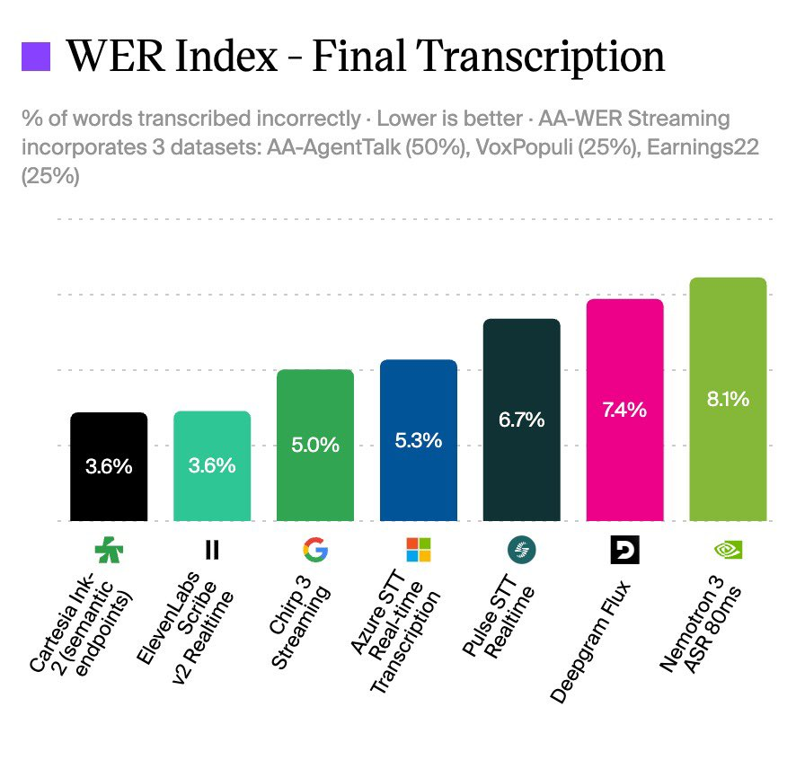
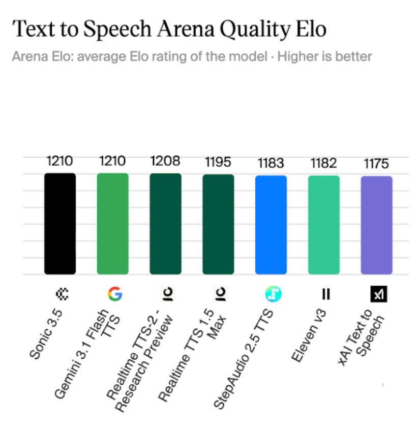
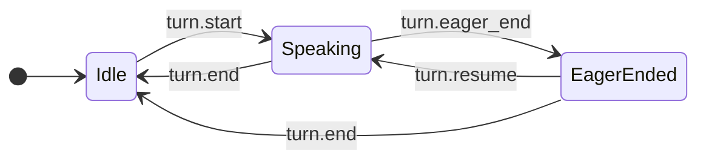

# Cartesia Sonic 3.5 / Ink 2 深度拆解：实时语音 Agent 的竞争点，正在从单模型榜单变成听说一体的延迟预算

TestingCatalog 这条 X 帖子提到，Cartesia 推出了 **Sonic 3.5** 和 **Ink 2**：一个负责 text-to-speech，一个负责 speech-to-text，被包装成同一个实时语音栈。帖子里的关键信息是两张榜单截图：Ink 2 在 Artificial Analysis 的 streaming STT WER 指标上排到第一梯队，Sonic 3.5 在 Text to Speech Arena 质量 Elo 图里位于头部。

Karan Goel 的原帖更直接：Cartesia 现在希望被理解为“同时拥有 #1 speaking 和 #1 listening 模型”的语音 Agent 基础设施公司，而不是单纯的 TTS API。

我觉得这次发布值得写的点，不是“某个榜单第一”本身。因为语音榜单会变，Artificial Analysis 的实时 TTS 排名在我检查时已经显示 Fun-Realtime-TTS、Gemini 3.1 Flash TTS、Realtime TTS-2 等也在前列，Sonic 3.5 位于前五附近。真正重要的是：**语音 Agent 的产品竞争，正在从单个 TTS/STT 模型的能力，变成一整条听、判定、思考、说话链路的端到端延迟预算管理。**

## 一句话概括

**Sonic 3.5 和 Ink 2 的组合，不只是 Cartesia 同时卖 TTS 与 STT，而是把“听清楚用户什么时候说完”和“尽快自然地开始说话”做成同一个实时 Agent runtime 问题。**

这对语音 Agent 很关键。一个客服、销售或陪伴 Agent 的体验，不取决于某个模型离线听起来多好，而取决于每一轮对话里这几个动作是否协同：

1. 用户开始说话时，系统能不能立刻打断正在播放的 TTS；
2. 用户说话过程中，STT 能不能尽早给出可用 transcript；
3. 用户可能说完时，系统能不能提前启动 LLM 推理；
4. 用户真的说完后，TTS 能不能在几十到一百毫秒级别开始出声；
5. 如果用户又继续说话，系统能不能取消错误的提前回复。

这不是“模型榜单”能单独回答的问题，而是一个实时系统设计问题。

## Sonic 3.5：TTS 的卖点从“好听”扩展到可控、低延迟和多语言

Cartesia 官方文档把 Sonic 3.5 定位为最快、最自然的 TTS 模型，核心主张包括：

- sub-90ms latency；
- 42 种语言原生支持；
- 更自然的语速、情绪和对话表达；
- 不需要预处理即可读好订单号、手机号、ID、邮箱等 alphanumeric；
- 根据上下文处理英语 heteronyms，例如 `read`、`bass`、`bow`；
- 支持 voice cloning、localization、自定义 pronunciation dictionary。

这些能力看起来像 TTS 产品的常规升级，但放到语音 Agent 里意义会变。Agent 不是一次性生成一段旁白，而是在不断接住用户输入、调用工具、修正话术、处理打断。TTS 因此要满足三类约束：

| 约束 | 对 Agent 的意义 |
|---|---|
| 低 first-audio latency | 用户不会觉得机器人“卡了一下”才开口 |
| 稳定读结构化信息 | 订单号、验证码、日期、金额不出错，减少二次确认 |
| 可控发音和多语言 | 企业可以把品牌名、药品名、地名、人名做成稳定规则 |

所以 Sonic 3.5 的关键不只是“像真人”，而是它能否把实时系统最怕的细节——发音错误、首包慢、跨语言不稳定——压到可上线范围内。

## Ink 2：STT 的核心不是转写，而是 turn detection

Ink 2 的官方文档说得很明确：它是面向生产语音 Agent 的 streaming STT，内置 turn detection，不需要单独接 VAD。它会发出一组 turn events：

- `turn.start`
- `turn.update`
- `turn.eager_end`
- `turn.resume`
- `turn.end`

这比普通“不断吐 transcript delta”的 STT 更像 Agent runtime 的控制信号。Cartesia 的推荐用法是：用户开始说话时打断 TTS；`turn.end` 到来时把完整 transcript 交给 LLM；更激进的实现可以在 `turn.eager_end` 时提前生成回复，在 `turn.resume` 时取消。

官方文档里的状态机非常有启发：

这说明 Ink 2 的产品重点并不是“我能把音频转成文字”，而是“我能告诉 Agent 什么时候该听、什么时候该想、什么时候该说”。

## Artificial Analysis 的 STT 基准：为什么 3.59% WER + 0.21s latency 有意义

Artificial Analysis 在 2026-06-02 发布了 AA-WER Streaming，用来测 streaming STT 的准确率和延迟，特别面向 voice agent。它把 streaming STT 分成两个测量点：

1. **First Final Transcription**：end-of-speech 后第一个 final transcript 的 WER 和延迟；
2. **First Partial Transcription**：end-of-speech 后第一个 transcript-bearing event 的 WER 和延迟。

测试沿用 AA-WER v2 的约 8 小时音频，覆盖 AA-AgentTalk、VoxPopuli-Cleaned-AA、Earnings22-Cleaned-AA，并用 Silero VAD 统一检测 end-of-speech。

在这套基准里，Artificial Analysis 给出的关键结果是：

| 场景 | 模型 | WER | 延迟 |
|---|---|---:|---:|
| Final transcription | Cartesia Ink-2 semantic endpoints | 3.59% | 0.21s |
| Final transcription | ElevenLabs Scribe v2 Realtime | 3.64% | 0.14s |
| Final transcription | Cartesia Ink-2 external endpoints | 3.66% | 0.09s |
| First partial | ElevenLabs Scribe v2 Realtime | 3.65% | 0.13s |
| First partial | Cartesia Ink-2 external endpoints | 4.33% | 0.07s |
| First partial | AssemblyAI U3 Realtime Pro | 4.46% | 0.47s |

这张 TestingCatalog 截图里展示的是 Final Transcription 的 WER Index：Cartesia Ink-2 semantic endpoints 与 ElevenLabs Scribe v2 Realtime 都在 3.6% 左右，明显领先 Google Chirp 3 Streaming、Azure STT Real-time Transcription、Deepgram Flux、Nemotron 3 ASR 80ms 等。

注意这里不要误读：这不是说 Ink 2 在任何场景永远第一。Artificial Analysis 自己也强调，没有单个模型在所有数据集都领先；不同数据集、partial/final、延迟目标、价格目标会改变选择。但对 voice agent 来说，**Ink 2 的价值在于它处在准确率和可用延迟的前沿区域，并且把 endpointing 做进模型事件里。**

## TTS 榜单的正确读法：Sonic 3.5 是头部选项，但不是唯一答案

TestingCatalog 的第二张图展示 Text to Speech Arena Quality Elo：Sonic 3.5 与 Gemini 3.1 Flash TTS 都是 1210，Realtime TTS-2 Research Preview 为 1208，Realtime TTS 1.5 Max 为 1195，Eleven v3 为 1182，xAI Text to Speech 为 1175。

我检查 Artificial Analysis 的实时页面时，FAQ 显示的前五已经变成：Fun-Realtime-TTS、Gemini 3.1 Flash TTS、Realtime TTS-2 Research Preview、Sonic 3.5、xAI Text to Speech。也就是说，**TTS Arena 是动态榜单，不应该把截图中的 #1 当成永久事实。**

但这不削弱 Cartesia 的产品论点。因为 voice agent 采购 TTS 时，真正的问题不是“榜单第一是谁”，而是：

- 模型是否足够低延迟；
- 发音是否可控；
- 结构化内容是否可靠；
- 多语言是否足够自然；
- 是否能和 STT、Agent runtime、部署环境组成稳定链路。

在这些维度上，Sonic 3.5 的定位非常清楚：它不是一个“离线旁白模型”，而是面向实时交互的 TTS 层。

## 真正的产品信号：Cartesia 在卖“听说闭环”

Cartesia 首页现在直接写：Sonic-3.5 和 Ink-2 是 “the #1 real-time speech and transcription models purpose-built for voice agents”。它还强调模型基于 State Space Models，目标是 ultra-low latency、long-context reasoning、更高效率，并支持 cloud、on-premise、on-device 等部署形态。

这套叙事很像语音 Agent 领域从“模型 API”到“Agent 基础设施”的转变：

| 旧问题 | 新问题 |
|---|---|
| 哪个 TTS 更像真人？ | 哪个 TTS 能在实时对话里稳定开口、读对关键信息？ |
| 哪个 STT WER 更低？ | 哪个 STT 能把 transcript、turn start/end、eager end 变成 Agent 控制信号？ |
| 哪个 API 最便宜？ | 哪个栈能降低端到端 abandon、重复确认和打断失败？ |
| 模型是否单点领先？ | 听、想、说、取消、恢复是否形成闭环？ |

这也是为什么 Ink 2 的 `turn.eager_end` 特别值得注意。它实际上把语音 Agent 的“抢跑”机制产品化了：先赌用户可能说完，提前让 LLM 生成；如果用户继续说，就取消。这和文本 Agent 的 speculative execution 很像，只不过这里赌的是人类语音 turn 的结束点。

## 对产品团队的启发：评估语音 Agent 不要只看模型指标

如果一个团队正在做客服、销售、面试、陪练或陪伴类语音 Agent，我会把评估表从“STT WER / TTS MOS”扩展成下面这样：

| 层 | 要测什么 | 为什么 |
|---|---|---|
| STT accuracy | WER、结构化信息准确率、噪声/口音表现 | 错 transcript 会污染 LLM 输入 |
| Turn detection | start、end、eager_end、resume 的误判率 | 决定是否打断用户或空等太久 |
| LLM latency | 首 token、工具调用、失败重试 | 占据用户沉默窗口的大头 |
| TTS first audio | first byte / first audio latency | 决定“机器人是否反应慢” |
| TTS controllability | 数字、专有名词、多语言、情绪 | 决定企业可上线程度 |
| Interruption | barge-in、cancel、resume | 决定是否像真实对话 |
| Observability | 每一轮的事件日志和耗时分解 | 没有 tracing 就无法优化体验 |

Cartesia 这次的信号，正是把 STT 与 TTS 两端都纳入这个表。它不只是告诉开发者“我有两个模型”，而是在暗示：你应该把语音 Agent 当成一个实时控制系统来设计。

## 和 QCut / 视频 Agent 的相似性

这篇看似是语音模型文章，但它和我们最近看的视频 Agent、QCut、短剧生产系统很像：模型能力增强之后，真正的产品壁垒会转向 runtime。

在视频里，难点从“能不能生成一段视频”转向：镜头规划、角色一致性、素材约束、时间线编辑、可回滚流程。

在语音里，难点从“能不能转写 / 合成声音”转向：turn state machine、低延迟预算、打断恢复、结构化发音、端到端 tracing。

两者本质上都是同一个问题：**把生成模型从一次性调用，变成可控、可观测、可取消、可恢复的交互系统。**

## 结论

Cartesia Sonic 3.5 / Ink 2 最值得关注的地方，不是截图里某一刻的 #1，而是它把实时语音 Agent 的两端——听和说——放进了同一套产品叙事里。

Ink 2 的 turn events 把 STT 从“文字输出器”变成 Agent 控制层；Sonic 3.5 的低延迟、多语言、结构化发音和发音字典，把 TTS 从“好听声音”变成生产对话输出层。两者合在一起，才是 voice agent 真正要买的东西：不是一段声音，也不是一段 transcript，而是一套能在每一轮对话里管理延迟、准确率和打断的实时闭环。

如果未来语音 Agent 会成为客服、销售、招聘、医疗、金融等行业的常用入口，那么这类“听说一体”的模型栈会越来越像视频生产里的时间线：单个模型仍然重要，但真正决定产品体验的，是每个事件、每个状态和每一百毫秒如何被编排。