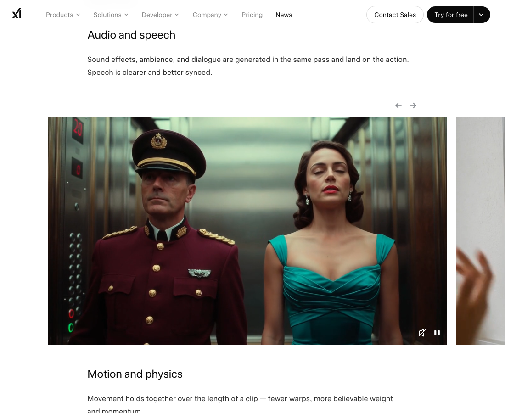
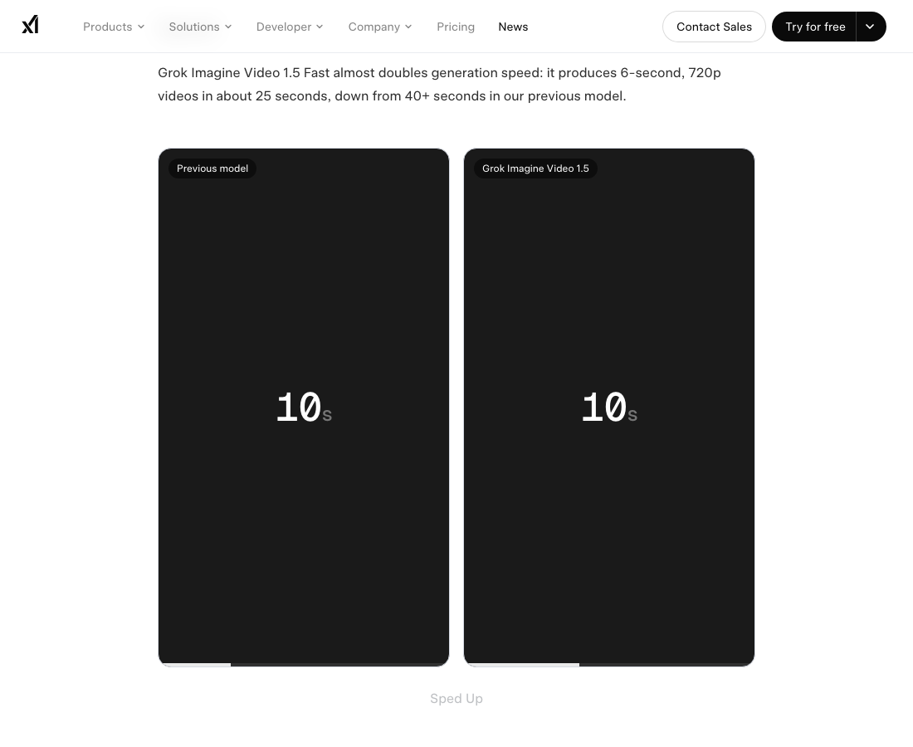
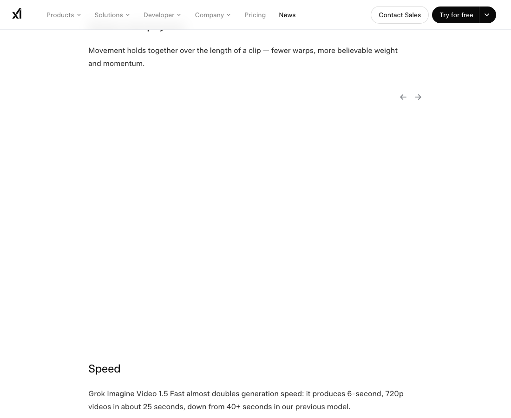
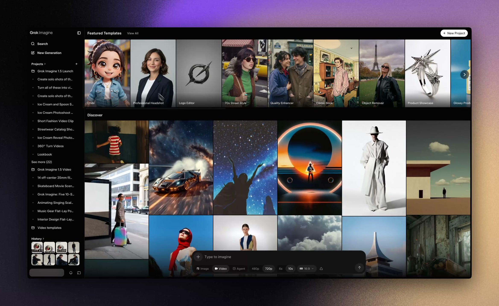
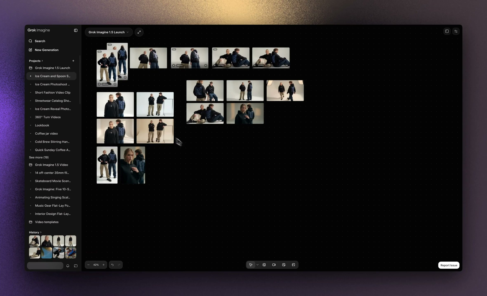
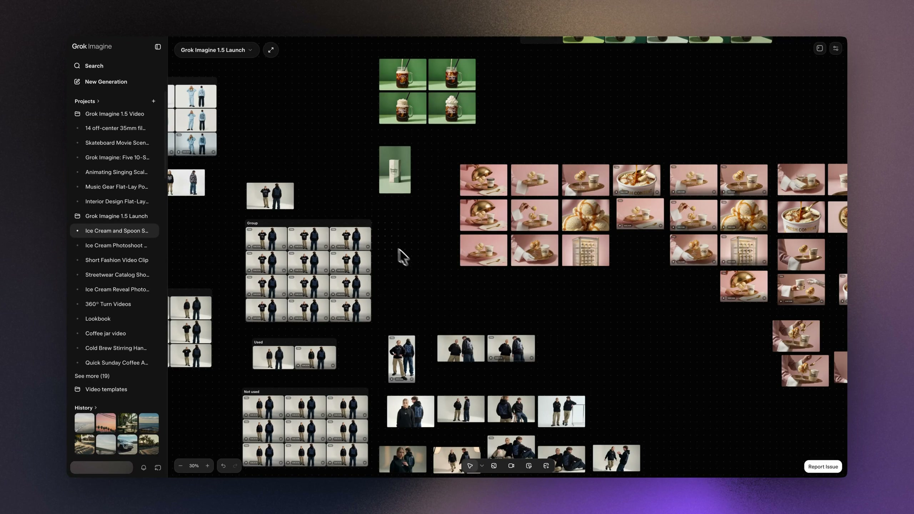
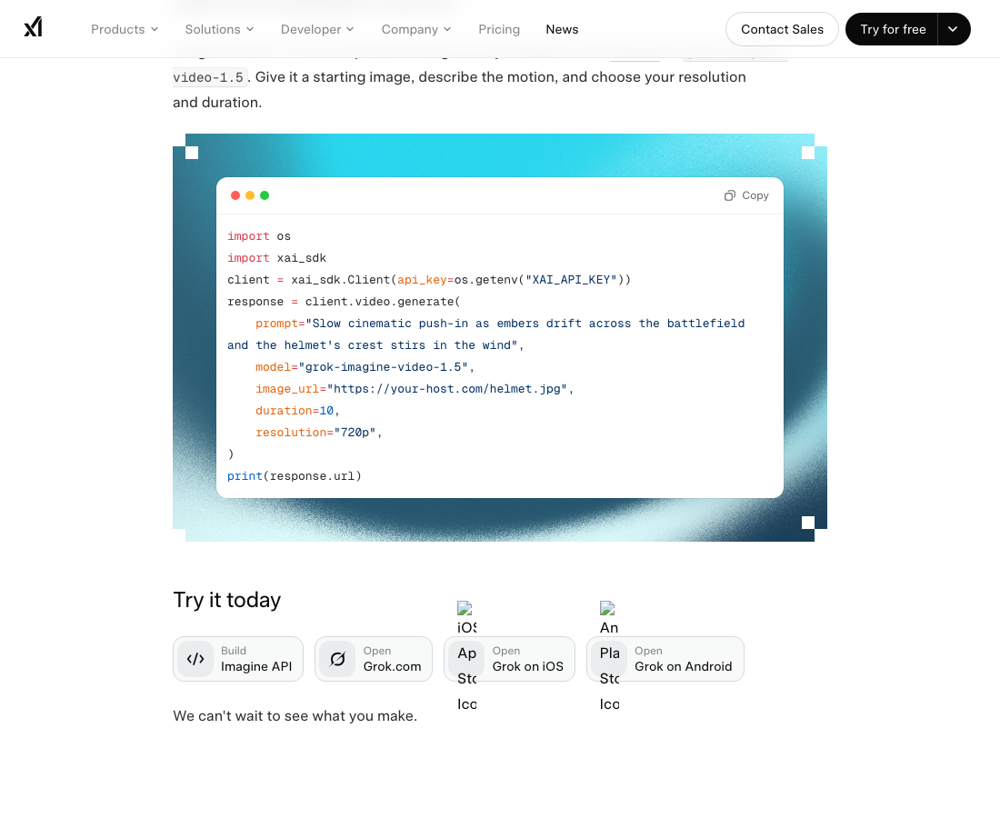

# Grok Imagine Video 1.5 深度拆解：xAI 正在把视频生成从“出片按钮”推进到创作队列 Runtime

xAI 在 2026-06-16 发布了 **Grok Imagine Video 1.5**。官方新闻稿的表层信息很直接：Video 1.5 已经在 Imagine API 里 general availability，模型名是 `grok-imagine-video-1.5`；Video 1.5 Fast 也上线到 grok.com/imagine、iOS 和 Android；相比上一代，音频、口型、运动、物理和生成速度都有提升。

这个仓库里 2026-03-31 已经有一篇关于 Grok Imagine 的入门指南，所以这篇不重复写“怎么从零做视频”。这次更值得看的是另一个变化：**xAI 正在把 AI 视频从单次生成按钮，推向一个有项目、并发 worker、素材搜索、异步 API 和成本约束的创作 runtime。**

## 一句话概括

**Grok Imagine Video 1.5 的关键，不只是“视频质量更好”，而是 xAI 开始把视频生成包装成可并发、可组织、可检索、可 API 化的创作队列。**

官方最醒目的指标是速度：Grok Imagine Video 1.5 Fast 可以在大约 25 秒内生成 6 秒、720p 视频，而上一代需要 40 秒以上。这个数字的意义不是单纯省 15 秒，而是改变创作循环的节奏。

如果一次生成要 2 到 5 分钟，创作者会把 prompt 写得更保守，尽量一次命中。如果一次生成接近 25 秒，工作流就会变成：快速出 4 到 8 个方向，挑一个可用结果，再局部迭代动作、镜头、音效和时长。也就是说，模型速度会反过来改变 prompt 策略。

## 1. 质量升级的真正信号：视频模型开始同时管画面、动作和声音

官方把 1.5 的升级分成三块：audio and speech、motion and physics、speed。

Audio/speech 部分，xAI 强调音效、环境声和对白会在同一次生成中落到动作上，语音更清楚，口型同步更好。这个表述很重要，因为视频生成过去最常见的问题不是某一帧不好看，而是**时间轴不可信**：脚步声和脚步错开，人物说话嘴型漂移，动作开始了但镜头还在找主体。

Motion/physics 部分，官方说运动在 clip 长度内更能保持一致，warp 更少，重量感和动量更可信。这里的关键词是 “over the length of a clip”。AI 视频的难点不是第一秒惊艳，而是第 4 秒、第 6 秒、第 10 秒还能不能保持同一个世界的物理规则。

这也是为什么我更愿意把 Video 1.5 看成一个“短时序控制”升级，而不是单纯画质升级。对创作者来说，画面质量决定能不能吸引用户点开，时间轴稳定性决定这个片段能不能被剪进更长的视频。

## 2. Odyssey poster 说明 xAI 想证明“电影感”，但真正要看的还是可重复生产

官方页面放了 David Thompson（@heavypulp）用 Grok Imagine 1.5 做的 Odyssey trailer，并给出一张电影感很强的 poster。

这类 demo 的价值在于说明上限：模型可以生成更接近 trailer 的镜头质感、构图和氛围。但对实际团队来说，demo 只回答“能不能做出一条漂亮片段”，不回答三个更难的问题：

1. 能不能连续做出风格一致的 20 条片段；
2. 能不能让角色、道具、景别和声音在多轮迭代里不跑偏；
3. 能不能把生成结果放进一个可追踪、可复用、可搜索的制作流程。

所以我更关注这次发布的后半段：Projects、Multiple agents 和 Search。它们不像模型参数那么性感，但更接近生产系统。

## 3. Projects：视频生成开始需要资产管理，而不是聊天记录

Projects 的作用是把作品组织到左侧 sidebar。听起来像普通 UI 功能，但对 AI 视频很关键。

AI 视频一旦进入真实创作，就会产生大量中间资产：

- 起始图；
- 参考图；
- 多个 motion prompt；
- 失败版本；
- 可用但需要裁剪的版本；
- 需要保留风格的 seed/参数；
- 最终导出的片段。

如果这些资产只散落在聊天流里，创作者很快会失去上下文。Projects 的价值不是“文件夹”，而是把生成视频从一次性聊天结果，变成一个持续工作的 production workspace。

## 4. Multiple agents：这里的 agent 更像并发生成 worker

官方说 Multiple agents 可以在项目里并行启动多个任务，不必等一个生成完成再跑下一个 prompt。

这里的 “agents” 不一定是我们在代码 Agent 里说的长程规划 Agent，更像是创作队列里的并发 worker：每个 worker 拿一个 prompt 或一个变体去生成，然后把结果回写到同一个项目里。

这个功能和 25 秒生成速度组合起来，才真正改变工作方式。一个创作者可以同时测试：

- 同一张起始图的不同镜头运动；
- 同一段动作的不同光照；
- 同一角色的不同情绪；
- 同一场景的不同节奏；
- 同一个 prompt 的更电影化/更短视频化版本。

这不是“更快点一下按钮”，而是把视频生成变成并行探索。模型越快，并发越重要；并发越强，搜索和项目管理越不能缺。

## 5. Search：生成资产越多，检索就是创作能力的一部分

Search 允许用户在自己的 image/video library 里找历史作品。官方说法很朴素：不用再滚动找某个 clip。

但这其实是 AI 视频产品从“玩具”到“工作台”的分界线。只要创作者开始并行生成，素材数量会指数级膨胀。如果没有检索，历史生成结果会变成一次性垃圾堆；如果有检索，历史结果就能变成可复用资产库。

未来更合理的形态可能不是只搜文件名，而是搜：

- 镜头类型：push-in、orbit、handheld、FPV；
- 主体：helmet、car、character、product；
- 风格：documentary、anime、cinematic、UGC；
- 运动：falling、turning、exploding、walking；
- 失败原因：face drift、bad hands、camera jump、audio mismatch。

这也是我为什么说 Video 1.5 的发布重点不只在模型本身。Projects、Multiple agents、Search 这三个功能拼起来，已经是一套轻量创作资产系统。

## 6. API 出 preview：生产化的边界更清楚了

官方新闻稿说 Imagine Video 1.5 已经在 xAI API 里 out of preview，模型名是 `grok-imagine-video-1.5`。示例代码的调用方式很清楚：给一个 starting image，写 motion prompt，选择 duration 和 resolution。

xAI docs 里还给了几个重要边界：

- Imagine API 支持图像生成、图像编辑、image-to-video、video generation、video editing、reference-to-video、video extension 等能力；
- image-to-video 会把 source image 作为第一帧；
- video 请求是异步的，需要发起请求、轮询 request ID，并在完成后读取视频 URL；
- `grok-imagine-video-1.5` 的 model page 显示它目前不支持 text-to-video；
- pricing 页面显示该模型按视频秒数计费，并且 480p 和 720p 价格不同。

这些边界对开发者比新闻稿里的 demo 更重要。它们意味着你不能把 Video 1.5 当成一个“随便丢一句话生成完整短片”的万能端点。更现实的工程模式是：

1. 用 image model 或人工设计生成 starting image；
2. 把 starting image 存成可访问 URL 或文件资源；
3. 用 motion prompt 发起异步视频生成；
4. 轮询状态；
5. 下载/归档结果；
6. 把结果写回自己的项目、素材库或审核队列；
7. 根据失败类型继续生成变体。

如果做成产品，还要补上重试、超时、成本上限、分辨率选择、内容审核和资产过期策略。Video 1.5 出 preview，只是说明 API 进入更稳定的可用阶段，不代表下游工作流可以省掉这些工程层。

## 7. 对 OpenClaw / QCut 这类视频工具的启发

如果把这次发布映射到视频工具链，它给出的方向很明确：AI 视频工具不应该只封装 provider API，而应该有自己的创作 runtime。

一个更合理的封装层应该包含：

| 层级 | 需要处理的问题 |
|---|---|
| Provider adapter | `grok-imagine-video-1.5`、分辨率、时长、输入图、异步轮询、错误状态 |
| Asset layer | 起始图、参考图、生成视频、poster、失败版本、metadata |
| Queue layer | 并行生成、重试、取消、优先级、成本预算 |
| Review layer | 预览、对比、标记失败原因、挑选可用版本 |
| Search layer | 按主体、镜头、风格、项目、prompt、失败原因检索 |
| Editorial layer | 把多个 clip 组织成 trailer、短视频或广告序列 |

换句话说，Video 1.5 对工具作者的提醒是：不要只写一个 `generateVideo()` 按钮。真正有价值的是把“生成”放进一套可回放、可并发、可搜索、可验收的系统。

## 8. 这次 skill 测试暴露出的一个好习惯

这次用 `articles-repo-maintenance` skill 跑下来，最有价值的步骤不是写作，而是前面的三个动作：

1. 查重：发现 3 月已经有 Grok Imagine 入门文，于是换成 Video 1.5 runtime 角度；
2. 抽媒体：直接 HTML 被 Cloudflare challenge 拦住，但浏览器 DOM 能抓到 8 个 video 资产和 poster；
3. 补官方 docs：新闻稿负责叙事，docs 负责模型名、异步调用、image-to-video 边界和 pricing 约束。

这正是维护文章仓库时最容易偷懒的地方：只看源文、只写摘要、只放一个链接。但一个可复用的文章条目，应该把来源、媒体、官方约束和自己的分析角度都保存下来。

## 结论

Grok Imagine Video 1.5 的直接卖点是更好的音频、更稳的运动、更快的生成速度。更深一层看，xAI 正在补齐 AI 视频创作的 runtime 层：Projects 管资产，Multiple agents 管并行探索，Search 管历史素材，API 管外部集成。

这会把 AI 视频竞争从“谁的 demo 更炸”推向另一个问题：谁能让创作者更快地从 100 个变体里找到 5 个可用镜头，并把它们组织成一个可交付作品。

对视频生成产品来说，下一阶段的核心不是 prompt 模板，而是创作队列、素材记忆、失败标注、成本预算和验收流程。
