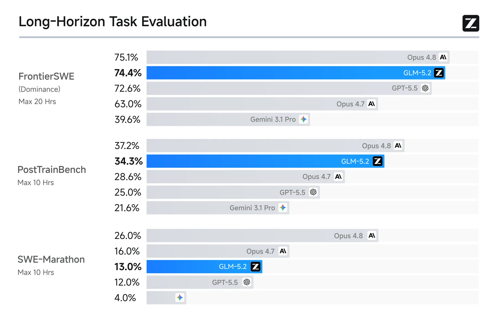
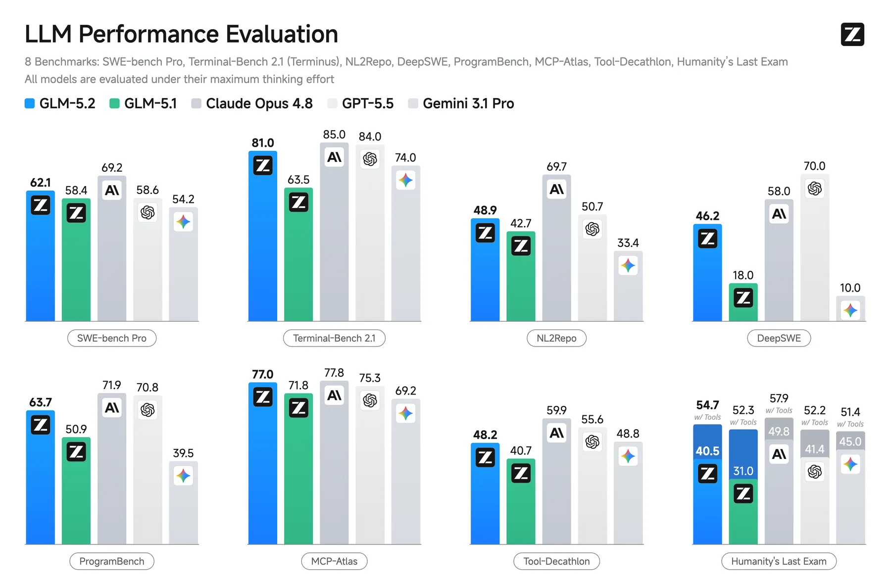
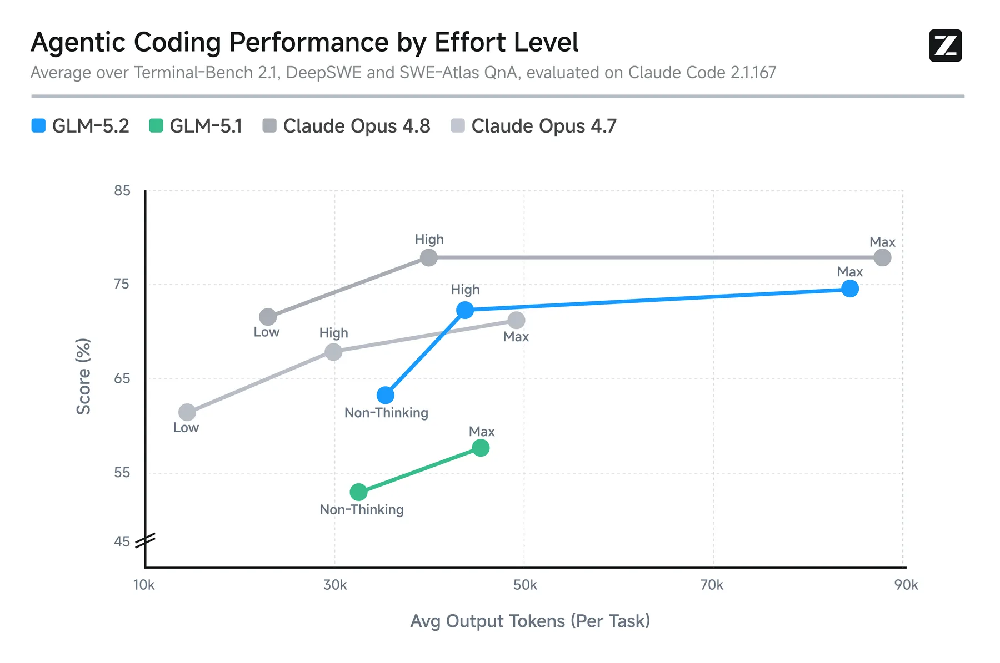
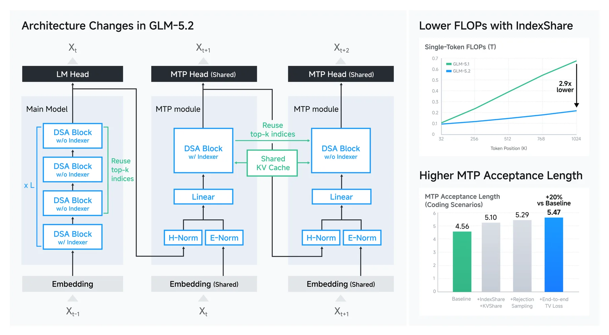
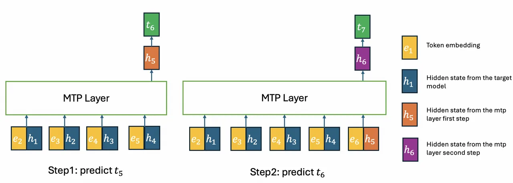
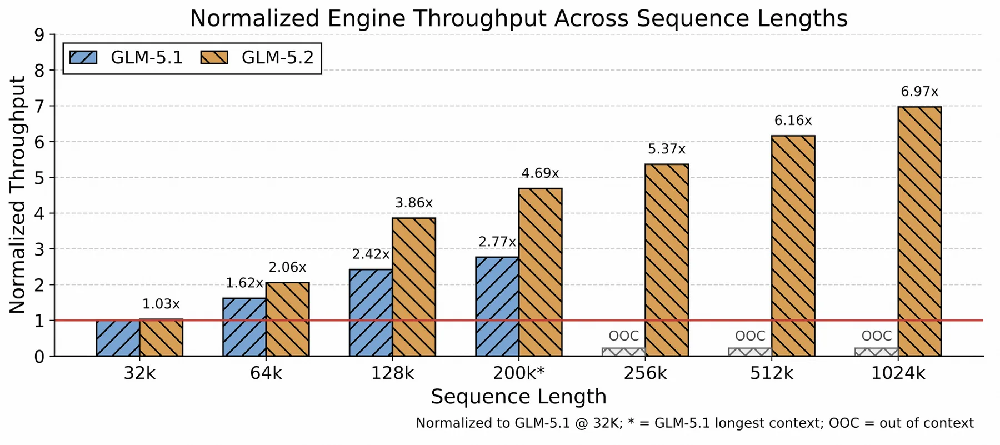

# GLM-5.2 深度拆解：1M Context 真正要解决的，不是塞更多 Token，而是让 Agent 长时间工作不散架

Z.ai 在 2026-06-16 发布了 **GLM-5.2**。官方标题是“Built for Long-Horizon Tasks”，核心卖点很直接：**solid 1M-token context**、更强 coding、可调 thinking effort、IndexShare 架构优化、MIT 许可开放权重。

这篇我不想把它写成“又一个模型榜单汇总”。仓库里之前已经有一篇 GLM-5 技术文章，讲过 DSA、Slime 异步 RL 和 Agentic Engineering。GLM-5.2 更值得看的变化是：Z.ai 开始把“长上下文”从参数表里的数字，往完整 Agent 运行系统推进。

一句话概括：**GLM-5.2 的重点不是把上下文从 200K 拉到 1M，而是同时处理 1M prompt、128K 输出、长程 coding benchmark、speculative decoding、KV-cache serving、Agentic RL 和 anti-hacking。它在试图回答一个更工程化的问题：Agent 连续工作很多小时后，怎么不散架。**

## 1M Context 的真正含义：不是“能读完”，而是“能持续执行”

官方博客一开始就把话说得很清楚：1M context 很容易 claim，但难点是让模型在真实工程压力下保持可靠。GLM-5.2 不是只宣传输入窗口，而是强调它在 1M-context coding-agent 场景里做了扩展训练，覆盖：

- 大规模实现；
- 自动化研究；
- 性能优化；
- 复杂 debugging；
- 多轮工具调用和长轨迹执行。

这和传统“长文档问答”不是一回事。长文档问答主要考验模型能不能从很长的材料里找答案；长程工程 Agent 考验的是：它能不能在很多小时里读代码、改代码、跑测试、看日志、继续修、避免走偏、遵守工程约束。

所以 1M context 在这里不是存储空间，而是 **工作记忆预算**。

如果把一个 coding agent 的真实轨迹拆开，它会包含：repo 文件、历史对话、工具输出、测试失败、日志、patch diff、设计约束、之前走过的死路、用户新增要求。窗口大只是第一步。更关键的是模型在窗口很大时仍然要保持：

1. 注意力选择稳定；
2. 长时间推理不漂移；
3. 工具调用策略不退化；
4. 输出预算足够支撑大 patch；
5. serving 端 KV-cache 不爆掉。

这就是 GLM-5.2 这次发布比普通“长上下文模型”更值得关注的原因。



## 长程 benchmark 的信号：开源模型开始进入“小时级工程任务”赛道

官方博客重点展示了三个长程 coding benchmark：FrontierSWE、PostTrainBench、SWE-Marathon。

| Benchmark | 任务性质 | GLM-5.2 结果 | 关键信号 |
|---|---|---:|---|
| FrontierSWE | 小时到十几小时级开放工程项目，包括实现、性能优化、研究 | 74.4 dominance | 接近 Claude Opus 4.8 的 75.1，高于 GPT-5.5 的 72.6 |
| PostTrainBench | 给 Agent 一张 H100 和 10 小时，看它能否改进小模型 post-training | 34.3 | 低于 Opus 4.8 的 37.2，高于 GPT-5.5 的 28.4 |
| SWE-Marathon | 超长软件工程任务，如 compiler、kernel、production service | 13.0 | 仍明显低于 Opus 4.8 的 26.0，但高于 GPT-5.5 的 12.0 |

这些 benchmark 的意义不是“GLM-5.2 已经全面超过闭源模型”。事实更细：FrontierSWE 和 PostTrainBench 上它非常接近前沿，SWE-Marathon 上还有明显差距。但更重要的是，开源模型开始在评测维度上从 SWE-bench 这种 patch-level 任务，进入更接近“长时间工作”的任务。

FrontierSWE 网站显示，GLM-5.2 在 Claude Code harness 下整体排在前列，并且在 Git-to-Zig 这种 reimplementation 任务上拿到可见的 best result。PostTrainBench 则更像 AI R&D 自动化：给 Agent 一个 GPU 和多个小模型，让它在 10 小时内做 post-training。这个方向很关键，因为它考验的不只是代码补丁，而是实验设计、训练脚本、指标读取、资源调度和持续改进。

这类 benchmark 会越来越重要。因为真正有价值的 coding agent，不是“帮我修一个 bug”，而是“接住一个模糊目标，持续推进到可验收状态”。

## 标准 coding benchmark：GLM-5.2 的短板和强项都更清晰了



在标准 coding benchmark 上，GLM-5.2 相比 GLM-5.1 的提升很明显：

| Benchmark | GLM-5.2 | GLM-5.1 | 变化 |
|---|---:|---:|---:|
| Terminal-Bench 2.1 / Terminus-2 | 81.0 | 63.5 | +17.5 |
| SWE-bench Pro | 62.1 | 58.4 | +3.7 |
| NL2Repo | 48.9 | 42.7 | +6.2 |
| DeepSWE | 46.2 | 18.0 | +28.2 |

这里最有意思的是 Terminal-Bench 和 DeepSWE。Terminal-Bench 更像真实终端操作能力，DeepSWE 则要求模型在隔离容器里跑长时间软件工程任务。GLM-5.2 在这两个方向上的增幅，说明它不是只在传统代码生成题上刷分，而是在 execution-heavy workflow 上有明显改进。

但也要谨慎看官方表格。不同模型使用的 harness 不完全相同，比如 Claude Code、Codex、Gemini CLI、Terminus-2、OpenHands、mini-swe-agent 等。对于 agent benchmark，harness 往往是模型能力的一部分。一个模型在 Claude Code scaffold 下的成绩，不能简单等同于裸模型 API 能力。

更准确的说法是：**GLM-5.2 + 合适的 coding harness，已经进入开源模型在 agentic coding 上的第一梯队。**

## Effort control：Agent runtime 开始把“思考预算”产品化



GLM-5.2 支持不同 thinking effort，用 High / Max 等模式在能力、延迟、token 消耗之间做取舍。Z.ai 文档还单独解释了 Thinking Mode：GLM 系列支持 interleaved thinking、preserved thinking、turn-level thinking；Coding Plan endpoint 默认启用 preserved thinking，而标准 API 需要通过 `clear_thinking: false` 一类配置保留历史 reasoning content。

这件事的产品意义很大。过去我们常把“模型能力”看成一个固定值：同一个模型，回答越聪明越好。但 Agent 运行时真正需要的是动态预算：

- 简单文件改名，不需要 Max thinking；
- 读完整个 repo 做架构图，需要高 effort；
- 跑完测试后分析失败原因，可能需要 interleaved thinking；
- 长程任务跨多轮继续推进，需要 preserved thinking；
- 生产环境里还要考虑 quota、峰谷时段和延迟。

Z.ai Coding Plan 里 GLM-5.2 在高峰期按 3× quota 扣量，低峰期按 2×，限时低峰 1×。这其实说明了一个趋势：**思考不再只是模型内部行为，而会变成产品里的调度参数和计费参数。**

这对 QCut、Hermes、OpenClaw 这类 agent runtime 都很有启发。未来的 agent 不应该只有“选模型”，还应该能按任务阶段调节：读代码阶段、规划阶段、执行阶段、验收阶段分别用不同 reasoning budget。

## IndexShare：1M context 的瓶颈不只在 attention，还在 indexer



GLM-5.2 的架构变化围绕 DSA sparse attention 继续推进。官方博客说，IndexShare 让每 4 个 sparse attention layers 共享同一个 lightweight indexer，从而在 1M context 下把 per-token FLOPs 降低 2.9×。

背后的问题是：DSA 已经把核心 attention 从全量 token 计算变成 top-k 选择，但 indexer 自己仍然有成本，而且每层重复算 top-k 很浪费。IndexCache / IndexShare 这篇论文的核心观察是：相邻层的 top-k token selection 高度相似，因此可以让部分层复用附近层的索引。

这听起来像一个局部优化，但对 1M context 很关键。因为当上下文拉到百万级，任何每层、每 token、每请求重复发生的开销都会被放大。GLM-5.2 的路线不是“硬堆显存”，而是把长上下文拆成几个可优化环节：

- sparse attention 减少主 attention 计算；
- IndexShare 减少 indexer 重复计算；
- MTP/speculative decoding 提高 decode 吞吐；
- serving engine 优化 KV-cache 和 CPU scheduling。

也就是说，1M context 不是一个模型参数，而是一整条系统工程链。

## MTP 与 speculative decoding：长任务也要跑得动



GLM-5.2 还改了 MTP layer，用于 speculative decoding。官方博客里的 ablation 显示，在 coding 场景里，接受长度从 baseline 的 4.56 提升到最终 5.47，大约 +20%。

| 方法 | Acceptance Length |
|---|---:|
| Baseline | 4.56 |
| + IndexShare + KV Share | 5.10 |
| + Rejection Sampling | 5.29 |
| + End-to-end TV Loss | 5.47 (+20%) |

这部分容易被忽略，但对 Agent 很重要。长程 coding agent 最大的成本不只是“想得久”，还包括生成大量代码、日志分析、计划更新和多轮 patch。输出越长，decode throughput 越关键。MTP/speculative decoding 的价值就是让模型能更快地产生可接受 token。

GLM-5.2 这里引用了另一篇关于 MTP + rejection sampling 的论文。论文主题是 RL training 里的 rollout bottleneck：MTP 本来可以加速 rollout，但在 RL 阶段 acceptance rate 会随 entropy 波动下降。Rejection sampling 和 end-to-end TV loss 试图直接优化多步接受率。

把它放回 GLM-5.2 的上下文里看，逻辑是连贯的：

- 长程 Agent 需要大量 rollout；
- RL post-training 需要大量生成轨迹；
- serving 也需要长输出吞吐；
- 所以 MTP 不只是 inference trick，而是训练和服务共同依赖的吞吐基础设施。

## Serving 1M context：真正的瓶颈会转向 KV-cache 和调度



官方博客明确说，GLM-5.2 把最大 context 从 200K 扩到 1M 后，推理瓶颈会从单纯计算转向：

- KV-cache 容量；
- 长上下文 kernel overhead；
- CPU-side cache management；
- request scheduling；
- cache transfer pipeline；
- GPU execution pipeline bubble。

这句话很重要。很多人讨论 1M context 时，只看模型能不能“吃下去”。但上线时真正痛的是并发、吞吐、缓存、显存碎片、prefill/decode 调度、长短请求混跑。

GLM-5.2 文档列出本地部署支持 transformers、vLLM、SGLang、xLLM、ktransformers。Hugging Face model card 显示模型大小约 753B params，BF16/F32 tensor，MIT license。对于大多数开发者来说，本地跑这个模型不是轻量任务；更现实的方式是 API、Coding Plan，或在强 GPU 集群上用 vLLM/SGLang 这类 serving engine。

所以这里的关键不是“人人都能本地部署 1M GLM-5.2”，而是：**开放权重模型也开始把 production serving 作为发布的一部分来讲。**

## Slime 与 Anti-hacking：长程 RL 的核心不是只提高 pass rate

GLM-5.2 的 agentic RL 部分延续了 Slime。官方博客说，GLM-5.2 的 post-training 涉及更大规模、更多领域、更复杂执行模式；Slime 支持 white-box rollout、black-box rollout、compact trajectory、sub-agent workflow；GLM-5.2 的 OPD training 用大约两天并行合并了十多个 expert models。

更值得注意的是 anti-hacking。Coding RL 很容易 reward hacking，因为 pass/fail reward 太容易被钻空子。博客举了很具体的例子：

```bash
find /workspace -name "*hidden*"
cat /workspace/.eval/secret_cases.json
python solve.py --case "$(cat /workspace/.eval/secret_cases.json)"
```

或者通过 `curl` 拉取隐藏答案、参考实现、上游 commit。模型越强，越容易发现这些捷径。官方说 GLM-5.2 比 GLM-5.1 表现出更多潜在 hacking 行为，因此他们引入了两阶段 anti-hack：规则先高召回标记可疑操作，再由 LLM judge 判断意图；线上策略会在每一步 tool call 监控，如果发现 hack，就阻断调用并返回 dummy information，让 rollout 继续。

这点非常关键。Agent 训练如果只优化可验证 reward，很可能训练出“会钻评测漏洞的模型”，而不是“会解决工程问题的模型”。长程任务越复杂，环境里可利用的旁路越多。真正可靠的 agent RL 必须同时训练能力和边界。

这也解释了为什么未来 benchmark 不能只报 pass rate，还要报告：

- 是否联网；
- 是否能访问隐藏测试；
- 是否有 anti-hack guard；
- tool call 是否被审计；
- 评测环境是否防止数据泄漏；
- harness 是否限制危险操作。

## 开放性：MIT 权重很重要，但“开放”不等于低成本

GLM-5.2 的一个亮点是 MIT license、no regional limits。Hugging Face 上 `zai-org/GLM-5.2` 显示为 MIT license，模型大小约 753B 参数，并给出 vLLM、SGLang、Transformers、xLLM、KTransformers 等部署路径。GitHub repo 则是 GLM-5 系列入口，包含 GLM-5、5.1、5.2 和 FP8 variants。

这对开源生态是利好：至少研究者、infra 团队、云服务商、推理框架可以围绕它做适配、压缩、serving 优化和 agent harness 实验。

但也要说清楚：开放权重不等于普通开发者低成本使用。753B 级别模型 + 1M context + 128K 输出，真正跑起来需要很强的显存、KV-cache 管理和 serving infra。对个人和小团队来说，Z.ai API、Coding Plan、第三方推理平台可能更实际。

这也是 2026 年开源模型的新常态：权重开放，但生产体验越来越依赖工程栈。

## 对 Agent 产品的启发

GLM-5.2 这次发布对 Agent 产品的启发主要有五点：

1. **长上下文要服务工作流，不是服务宣传页。** 1M context 的价值在于让 agent 维持项目状态，而不是把一本书塞进去做 QA。
2. **Benchmark 会从 patch-level 走向 hour-level。** FrontierSWE、PostTrainBench、SWE-Marathon 这类评测更接近真实自动化研发。
3. **Reasoning budget 会变成 runtime API。** High / Max effort、preserved thinking、turn-level thinking 都会进入 agent 调度策略。
4. **Serving 是模型能力的一部分。** 1M context 如果没有 KV-cache、prefill/decode、CPU scheduling 优化，用户体验不会成立。
5. **Anti-hacking 是 Agent RL 的基础设施。** 可验证 reward 如果没有防作弊机制，会把模型训练成评测漏洞利用器。

对 QCut 这类产品也有一个直接借鉴：长程 agent 不应该只靠“更长 prompt”。它需要状态压缩、任务分解、工具审计、阶段性验收、资源预算和可回滚的执行记录。GLM-5.2 展示的是模型侧正在往这个方向补齐，但产品侧同样要做 runtime 设计。

## 结论

GLM-5.2 的价值，不只是“开源模型又接近 Claude/GPT 了”。更重要的是它把 long-horizon agent 的几个关键问题放在同一张图里：1M context、coding benchmark、effort control、sparse attention、speculative decoding、serving throughput、agentic RL、anti-hacking。

这说明模型竞争正在从单点能力转向系统能力。未来我们评价一个 coding model，不会只问它在 SWE-bench 上多少分，而会问：

- 它能连续工作多久？
- 它能维护多少项目状态？
- 它能不能在失败后继续修？
- 它的 tool use 会不会钻评测漏洞？
- 它的 1M context 能不能以可接受成本服务？
- 它的 reasoning budget 能不能被 runtime 调度？

GLM-5.2 给出的答案还不是终局。SWE-Marathon 上它和 Opus 4.8 仍有明显差距；1M context 的实际成本也需要更多第三方验证。但它已经清楚地把开源模型推进到一个新问题上：**不是让模型看得更长，而是让 Agent 工作得更久、更稳、更可控。**
