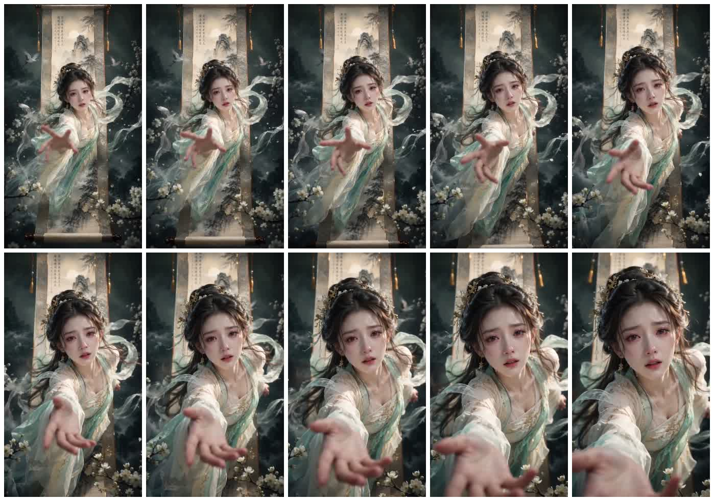

# GrayNoteLab 破卷视频提示词拆解：AI 视频 Prompt 的关键不是唯美，而是把“画里画外”写成可执行镜头状态

灰度笔记在 X 上发了一条很典型、也很值得拆的 AI 视频提示词：一个东方古风女子从巨幅山水挂轴里破卷而出，身体向镜头前倾，手伸向观众，衣袖、长发和飘带仍有一部分留在画卷内部。

表面上看，这是一个“唯美仙子”视频 prompt。但真正有价值的地方不是“东方奇幻”“电影级美学”“4K 超清”这些形容词，而是它把一个容易翻车的视觉概念，拆成了视频模型更容易执行的几组状态：边界、动作、透视、材质、焦点和负面约束。



## 一句话概括

**这条 prompt 的可复用价值在于：它不是让模型“画一个美人”，而是明确指定了人物如何从画卷内部跨到现实空间，哪些身体部位已经出画，哪些衣料仍留在画里，镜头焦点在哪里，失败时最应该避免什么。**

这已经接近一个小型 shot state，而不是普通审美描述。

## 为什么“破卷而出”比普通人像 prompt 难

普通人像 prompt 只需要稳定生成一个主体：脸、服装、背景、光线、风格。破卷场景多了一层空间关系：

1. 画卷本身是一个二维世界；
2. 人物要从二维世界进入三维现实；
3. 身体有一部分在画外，一部分仍在画内；
4. 画内材质要像水墨，画外材质要像真实摄影；
5. 手部要朝镜头前伸，形成强透视；
6. 整个动作还要在 10 秒视频里连续成立。

这就是 AI 视频里最容易混乱的部分。模型可能把人物画成“站在画卷前”，也可能让画卷遮挡人物，或者让衣服、身体和背景粘在一起。源 prompt 的负面约束专门排除了这些失败：不要人物站在画卷前、不要缺少破卷效果、不要手部畸形、不要身体穿模、不要画卷遮挡人物。

换句话说，它不是只在描述想要什么，也在描述这个镜头最容易失败在哪里。

## 这条 prompt 的五层结构

把源 prompt 抽象出来，可以看到一个很清楚的五层结构。

| 层级 | prompt 做了什么 | 为什么重要 |
|---|---|---|
| 概念层 | 东方奇幻叙事人像海报，人物从山水挂轴中破卷而出 | 先锁定世界观和核心动作 |
| 空间层 | 大半身体离开画卷，部分裙摆、衣袖、长发、飘带仍在画卷内部 | 明确画里/画外边界，避免只生成平面海报 |
| 镜头层 | 身体向镜头前倾，一只手伸向镜头，面部与手为焦点 | 给视频模型一个明确的运动和透视目标 |
| 材质层 | 画中部分像古画，画外脸部、手部、上半身是真实摄影质感 | 让“跨界”不只是位置变化，也是材质变化 |
| 约束层 | 不恐怖、不女鬼化、无 AI 建模感、手指结构准确、无水印文字 | 把最常见的失败模式提前封住 |

这种结构比单纯堆叠形容词更稳。因为视频模型真正需要的不只是“好看”，而是每一帧之间的关系。

## 最关键的是“边界对象”

这条 prompt 里最重要的对象不是女子，也不是汉服，而是“巨幅完整挂轴”。

挂轴承担了三个功能：

1. **空间边界**：它定义了画内世界和现实世界的交界；
2. **视觉锚点**：它让观众知道人物从哪里出来；
3. **连续性参考**：它给视频模型一个稳定背景，帮助 10 秒运动不散。

很多 AI 视频 prompt 会直接写“从画中走出来”，但没有定义画是什么、画在哪里、身体哪些部分穿过边界。这样模型容易把动作理解成普通出场，或者生成一张有画卷背景的人像。

这条 prompt 更进一步：它要求“部分裙摆、衣袖、长发与飘带仍留在画卷内部”。这句话非常关键。它把“破界”变成可见证据，而不是抽象概念。


## 手部透视是风险点，也是记忆点

源视频最抓人的地方是手向镜头伸来。这个动作有两个作用：

- 叙事上，它让人物像是在向观众求救或靠近观众；
- 技术上，它制造了强透视和景深，让画面从海报变成镜头。

但这也是 AI 生成最容易崩的区域。手指结构、手掌比例、前臂长度、袖口遮挡、运动模糊都可能出问题。所以源 prompt 反复强调“向镜头前倾”“一只手伸向镜头”“面部与向前伸出的手为焦点”“手指结构准确”。

这说明一个有用的经验：如果一个动作是画面的记忆点，就不能只写一次。它应该同时出现在动作描述、构图描述、焦点描述和负面约束里。

## 材质混合比风格词更重要

这条 prompt 没有只写“国风”“水墨”“真实摄影”。它把材质差异拆开：

- 画卷内部：朦胧淡雅的东方水墨山水、远山、云雾、古松、月色；
- 画外主体：真实摄影质感、自然皮肤、可见微小肌理；
- 连接区域：裙摆、衣袖、长发、飘带在画里画外之间过渡；
- 前景：白梅花枝、飘落花瓣、轻纱；
- 光线：从画卷内部透出，在发丝、肩膀、轻纱边缘形成淡金色轮廓光。

这比“cinematic Chinese fantasy”更可执行。因为模型知道哪些区域应该像画，哪些区域应该像现实，哪些区域负责融合。

对 AI 视频来说，风格词只能提供方向；材质和区域分工才是控制。

## 负面提示词不是补丁，而是验收标准

这条源 prompt 的负面提示词很长，但并不只是常见的“低清晰度、模糊、畸形手”。它还包含场景特有的失败项：

- 画卷遮挡人物；
- 人物站在画卷前；
- 缺少破卷效果；
- 背景杂乱；
- 仙鹤抢镜。

这些比通用负面词更重要。因为它们对应的是这个镜头的核心验收条件：观众必须相信人物正在从画里来到画外，而不是站在一张古画前摆拍。

如果把这条 prompt 放进一个可复用的 AI 视频工作流，负面提示词应该被视为 checklist：

1. 边界是否清楚？
2. 身体是否真的穿过边界？
3. 手部透视是否成立？
4. 画内和画外材质是否区分？
5. 背景是否服务主体，而不是抢主体？

这就是 prompt 从“咒语”变成生产约束的地方。

## 对 QCut / AI 视频工具的启发

这条 prompt 如果只是被收藏为一段文字，很快就会变成另一个素材库条目。但它真正适合被工具化。

一个 AI 视频工具可以把它拆成可编辑字段：

| 字段 | 示例 |
|---|---|
| Boundary object | 巨幅山水挂轴 |
| Crossing action | 人物大半身体离开画卷，向镜头前倾 |
| Residual anchors | 裙摆、衣袖、长发、飘带仍留在画内 |
| Camera focus | 面部 + 向前伸出的手 |
| Texture split | 画内水墨，画外真实摄影 |
| Foreground depth | 白梅花枝、花瓣、轻纱 |
| Failure checks | 不站在画卷前、不被画卷遮挡、手部不崩 |

这样一来，用户不用反复复制一整段长 prompt，而是可以替换边界对象：从挂轴换成镜子、屏幕、门、窗、照片、手机相册、游戏 UI、漫画分镜。模型收到的仍然是一条完整 prompt，但工具内部保存的是结构化状态。

这也是未来 AI 视频 prompt 产品化的方向：不是把 prompt 越写越长，而是把好 prompt 拆成可调参数。

## 可复用公式

从这条案例可以抽出一个通用公式：

```text
主体从[边界对象]中进入现实空间；
明确[已经离开边界的身体部分]和[仍留在边界内部的残留部分]；
指定[朝镜头的动作]和[视觉焦点]；
区分[边界内部材质]与[现实空间材质]；
加入[前景深度元素]和[边缘光]；
用负面约束排除[伪出界、遮挡、穿模、手部错误、背景抢戏]。
```

这个公式不只适用于古风仙子。它可以变成很多短视频题材：

- 角色从旧照片里走出来；
- 游戏人物从 UI 卡牌里冲出；
- 商品从海报中飞向镜头；
- 漫画角色撕开分镜格；
- 历史人物从博物馆画框中走出。

关键是不要只写“冲出屏幕”。要写清楚边界、残留、动作、材质和验收条件。

## 结论

GrayNoteLab 这条视频 prompt 的价值，不在于又多了一段可以复制的“神级提示词”。它更像一个小型样本，说明 AI 视频提示词正在从审美词堆叠，转向镜头状态设计。

真正可复用的不是“绝美东方古风女子”这类词，而是它背后的控制逻辑：

- 用一个强边界对象组织空间；
- 用残留元素证明跨界；
- 用手部透视制造镜头关系；
- 用材质分区表达虚实转换；
- 用场景特定负面词定义验收标准。

AI 视频越往后走，prompt 写作越不像写作文，越像导演、分镜和技术美术的混合工作。能稳定出片的人，不一定是形容词最多的人，而是最会把画面状态写清楚的人。
